July 16, 2026 02:25 AM GMT

Technology - Software & Services | Europe

# 2Q26 CIO Survey - An Improved Revision Risk Picture for 2026 IT Budgets

Our latest proprietary survey shows an uptick in IT budget expectations, while near-term revision risk inflected positively. Software remains the fastest growth category and is sequentially unchanged, but IT Services expectations edged lower.

AlphaWise α

## Key Takeaways

2026 IT budget growth now expected to accelerate +10bps y/y to 3.8%, a sequential growth expectations tick-up for our third survey in a row

■ Software is the fastest growth category at 4.1% y/y growth (+30bps y/y); Services at 1.8% y/y growth (-30bps y/y)

For the first time since our 1Q24 survey, the near-term IT budget revision ratio (a.k.a. up-to-down ratio) exceeds 1.0x implying upside risks

AI remains the top 2026 spending priority for CIOs, but macro-defensibility of these projects has moderated

Slight acceleration in expected 2026 IT budget growth... 2026 y/y IT budget growth is now expected to be 3.8% (+10bps y/y acceleration), versus of 3.7% (+c. 10bps y/y) in our prior survey. Software is the highest-growth category at 4.1% y/y growth (+c. 30bps y/y), followed by Communications at 2.6% (-c. 10bps y/y), Services at 1.8% (-c. 30bps y/y), and Hardware at 1.6% (flat y/y). EU CIOs expect lower growth at 3.5% (flat y/y), versus US CIOs at 3.9% (+c. 20bps y/y). Compared to our 1Q26 survey, 2026 Software growth expectations are largely unchanged, while Services deteriorated 20bps.

...and near-term budget revision risk turns positive for the first time since 1Q24: The 1-year up-to-down (UTD) ratio (which measures the percentage of CIOs expecting a further IT budget increase in 2026 vs those expecting a decrease) increased to 1.2x, from 0.8x in the prior survey. This indicates that 2026 IT budgets are now slightly more likely to be revised upwards than downwards. The 3-year UTD ratio remains constructive at 2.8x.

AI continues to be top priority, but with moderated macro-defensibility: While AI remains the top 2026 CIO spending priority, the likelihood of AI projects seeing budget cuts should an economic downturn ensue, increased, with the macro-defensibility of these projects dropping to rank 5 (from rank 2 in our previous survey). Elsewhere, we note that CIOs cited hyperscalers and LLM providers as the

MS & CO. INTERNATIONAL PLC+

George W Webb
Equity Analyst
George.Webb@morganstanley.com +44 20 7425-2686

## TECHNOLOGY - SOFTWARE & SERVICES

MS does and seeks to do business with companies covered in MS. As a result, investors should be aware that the firm may have a conflict of interest that could affect the objectivity of MS. Investors should consider MS as only a single factor in making their investment decision.

For analyst certification and other important disclosures, refer to the Disclosure Section, located at the end of this report.

+= Analysts employed by non-U.S. affiliates are not registered with FINRA, may not be associated persons of the member and may not be subject to FINRA restrictions on communications with a subject company, public appearances and trading securities held by a research analyst account.

most likely vendors to be used for building custom AI applications, both today and in the next three years.

Incrementally constructive for overall budgets, though IT Services remains more challenged. Despite elevated geopolitical uncertainty during the survey period (May-June), CIO spending intentions improved modestly and near-term revisions now skew slightly upwards. We view this as a moderately supportive signal for the broader IT spending environment. Software remains the fastest-growing major category, with expected 2026 growth of 4.1%, 30bps above reported 2025 growth but broadly unchanged from our prior survey. This points to a relatively resilient Software spending backdrop, although vendor-level intentions remain mixed and the results do not yet indicate a broad-based acceleration in application software demand. By contrast, IT Services continues to lag, with 2026 budget growth expectations also c. 20bps sequentially weaker than our last survey. Together with the increased perceived willingness to discount among tracked IT Services vendors, including Capgemini, this reinforces our cautious outlook for the sector.

## Key takeaways from our Software-specific survey:

\- (1) Vendor spend: Surveyed CIOs expect software spending to trend up for Microsoft (7.6% y/y growth vs 6.3% in 2Q25), ServiceNow (4.3% vs 3.9%), and Snowflake (5.3% vs 4.1%), and to be flat to down for other vendors.

\- (2) Spend on SaaS projects: CIOs expect spending on SaaS projects to increase by $+4.9\%$ in 2026 vs 2025, up from $3.6\%$ in 2025 vs 2024.

\- (3) ERP refresh cycle: 8% of CIOs anticipate upgrading their ERP/GL platform in 2026, 17% in 2027, and 35% in 2028 or later. At 22% of respondents, SAP S/4HANA is the most cited cloud-based SaaS ERP/GL platform to be used in the next upgrade cycle (up from 2Q25 at c. 19%). This is supportive of SAP's positioning, albeit timing remains weighted toward later years and the ERP net-spend outlook declined to 15% from 38% in 2Q25.

## Key takeaways from our IT Services-specific survey:

\- (1) 2026 budgets: While corporate sentiment with respect to IT Services improved vs our 4Q25 survey, we view the change as marginal and expect spending to remain broadly aligned with the subdued levels seen in 2025, as 62% of CIOs indicated. We also note that the vast majority of respondents are not seeing any delays on IT Services projects related to macro or geopolitical factors, with our survey reading here improved from 4Q25.

\- (2) Vendor discounts: The willingness of vendors to discount prices increased meaningfully on average vs our 4Q25 survey, with all the vendors we track in our survey reportedly more willing to offer pricing discounts (though with large variation between vendors). Net c. 41% of applicable CIOs (n=27 out of 60) perceive Capgemini as being more willing to offer discount pricing, an increase from our 4Q25 and 2Q25 surveys, at 18% and 17% respectively.

\- (3) Key service provider priorities: AI/ML/PA upgrade projects are top priority among surveyed CIOs, with 77% indicating that they will engage with an outside professional IT Services provider to help with the planning or execution. This result speaks to the AI bull case for IT Services – that they will be key to enabling integration/adoption of AI at the enterprise level.

## Note on Vendor Changes

• Historical October 2015 (3Q15) Macro survey data reflects a different survey vendor, representing a higher mix of small businesses, and a change in business verticals represented. This may affect historical comparisons.

• In the first half of 2024, Domain and VARs surveys underwent a transition to a new vendor. Hence, comparisons with prior surveys conducted by legacy vendor could face possible comparability issues.

Source: AlphaWise

# Macro – Key Takeaways

## 2026 IT spending growth expectations tick up slightly

What is your estimated percentage (%) growth for the External IT Spending portion of your IT Budget for the full year 2026 vs. 2025?

Exhibit 1: External IT spending growth expectations over time  
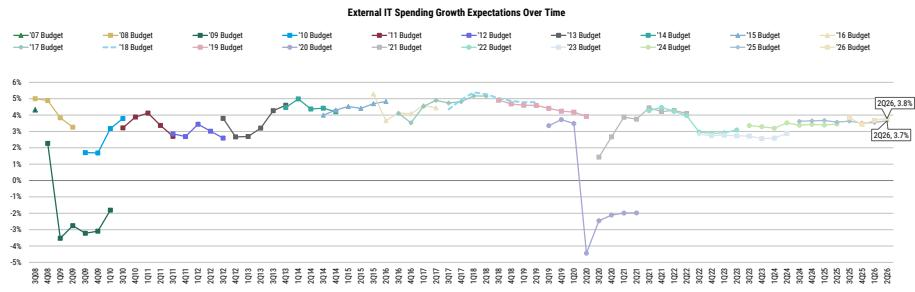  
Source: AlphaWise, MS. n=100 (US and EU data). Note: 3Q15 CIO survey reflects data from a different survey vendor.

\- 2026 CIO IT budget growth expectations increased slightly to +3.8% (up from 3.7% in 1Q26).

\- The 1-year IT budget revision up-to-down (UTD) ratio (which measures the % of CIOs expecting an increase vs. those expecting a decrease in spending) increased to 1.2x (vs. 0.8x at 1Q26). This implies that more CIOs expect budget revisions to tilt to the upside (albeit slightly) in the near term than to the downside. We note that this is the first time since the 1Q24 survey that this ratio has been >1.0x. See Exhibit 10.

\- Looking ahead into the next 3 years, c. 42% of CIOs expected IT spending to increase as a % of revenue, up from 40% in 1Q26. In contrast, 15% of surveyed CIOs expected it to decrease (flat vs 1Q26), implying a LT spending up-to-down ratio (% increase / % decrease) of 2.8x (slightly up from 2.7x in 1Q26). See Exhibit 13.

2026 IT budget growth expectations flat in the US, but continue to outpace EU growth

Exhibit 2: 2026 External IT spending growth expectations by region  
2026 External IT Spending Growth Expectations by Region  
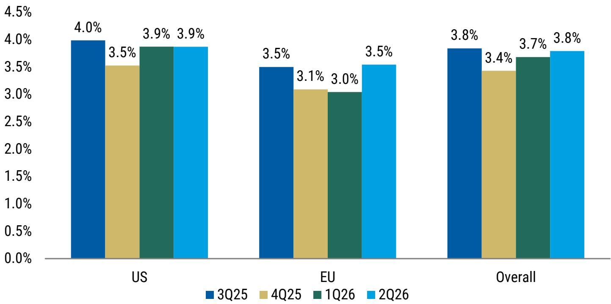  
Source: AlphaWise, MS. n=100 (US and EU data)  
Exhibit 3: 2026 vs 2025 external IT spending growth expectations by region  
2026 vs. 2025
External IT Spending Growth Expectations by Region

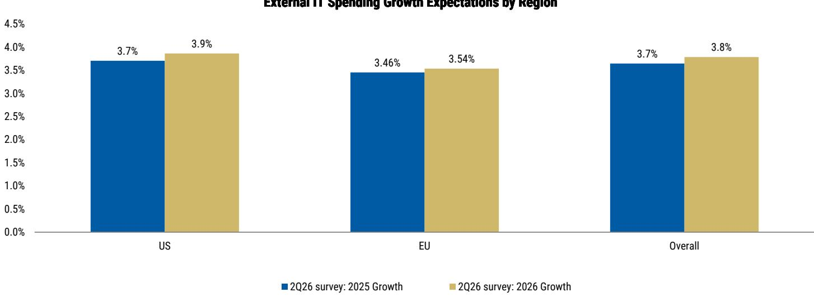  
Source: AlphaWise, MS. n=100 (US and EU data).

\- 2026 IT spending growth in the US is expected to continue to outpace the EU, as US CIOs expected to grow their budgets by 3.9% y/y vs. 3.5% in the EU. This represents flat budget growth expectations in the US, but a c. 50bps increase in

the EU compared to our 1Q26 survey.

\- Relative to reported 2025 growth, 2026 US IT budget growth expectations are c. 20bps higher (3.9% vs. 3.7% in 2025), while EU IT budget growth is expected to be broadly flat 2026 (3.5%) vs. 2025 (3.5%).

Growth expectations increased sequentially in Hardware and Communications vs. last quarter, but decreased in Services; Software is expected to remain the fastest growing sector in 2026

Exhibit 4: 2026 IT spending growth expectations by sector

2026 External IT Spending Growth Expectations by Sector

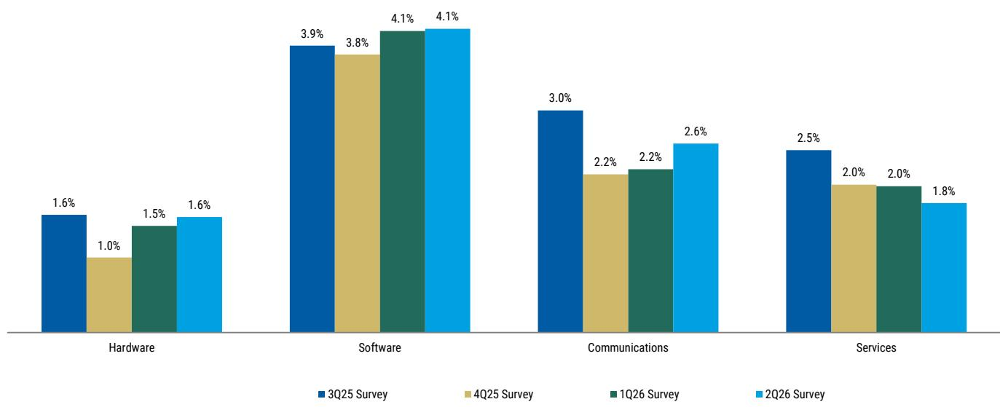  
Source: AlphaWise, MS. n=100 (US and EU data)

Exhibit 5: 2026 vs. 2025 IT spending growth expectations by sector

2026 vs. 2025
External IT Spending Growth Expectations by Sector

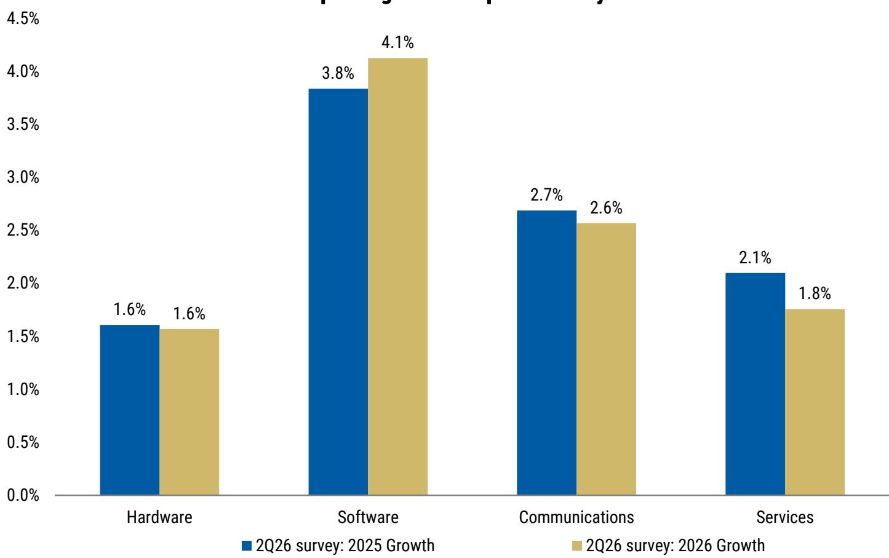  
Source: AlphaWise, MS. n=100 (US and EU data)

\- In line with previous survey results, Software is the fastest growing sector at +4.1% for 2026, flat vs. 1Q26. Hardware and Communications 2026 growth expectations are both up by c. +10bps and +40bps respectively (to 1.6% and 2.6%). Services growth expectations decreased vs 1Q26 by c. -20bps.

\- 2026 IT budget growth expectations were higher vs. 2025 growth for Software by c. +30bps, lower for Communications (by c. -10bps) and Services (by c. -30bps), but flat for Hardware.

## Business Services expected to see the highest growth in IT spending in 2026

Exhibit 6: 2026 external IT spending growth by vertical  
2026 External IT Spending Growth Expectations by Vertical  
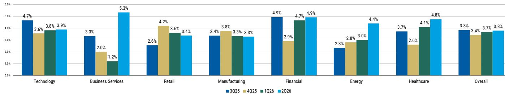  
Source: AlphaWise, MS. n=100 (US and EU data).

Exhibit 7: 2026 vs 2025 external IT spending growth by vertical  
2026 vs 2025: External IT Spending by Vertical  
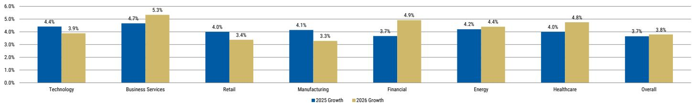  
Source: AlphaWise, MS. n=100 (US and EU data)

\- IT spending is expected to grow across all verticals shown in 2026. The highest growth is expected in Business Services (+5.3%) – though we note this is a very small sample size (n=3). This is followed by Financial (+4.9%, n=12), Healthcare (+4.8%, n=8), Energy (+4.4%, n=5), and Technology (+3.9%, n=17).

\- Key movers for 2026 growth expectations include Financial (to 4.9% in 2026 vs 3.7% in 2025), Healthcare (to 4.8% in 2026 vs 4.0% in 2025), and Manufacturing (to 3.3% in 2026 vs 4.1% in 2025).

# 2026 IT spending growth expected to be higher in larger companies

Exhibit 8: 2026 Expected External IT Spending Growth by Company Size  
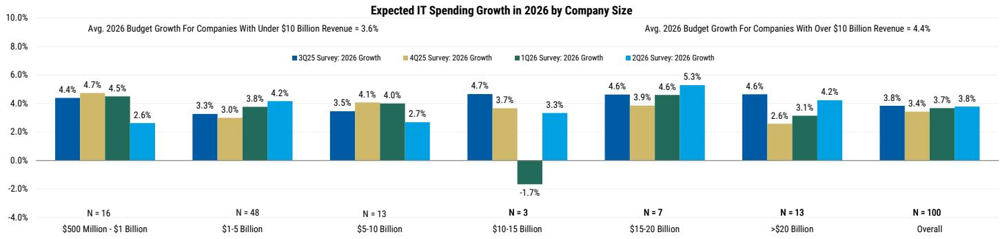  
Source: AlphaWise, MS. n=100 (US and EU data)

\- Our 2Q26 CIO survey results suggest that 2026 budgets are expected to grow more slowly among companies with less than \$10bn in annual revenue (+3.6%) vs. those with over \$10bn in annual revenue (+4.4%). Some variance exists among the larger companies, with the \$15-20bn revenue companies expecting materially higher IT spending growth than the other >\$10bn categories. We also observe variance among the smaller companies, with the \$1-5bn category expecting the fastest growth (+4.2%) and the \$0.5-1bn category the slowest (+2.6%). However, we note the relatively low sample size for some of these categories.

## 2026 IT budget revision up-to-down ratio came in >1x at 1.2x, suggesting that slight upwards revisions are likely in 2H

What are your expectations regarding potential future revisions to your current 2026 IT budget plans?

Exhibit 9: Expectations of potential IT budget revisions  
Expectations of Potential IT Budget Revisions  
Up-to-Down Ratio  
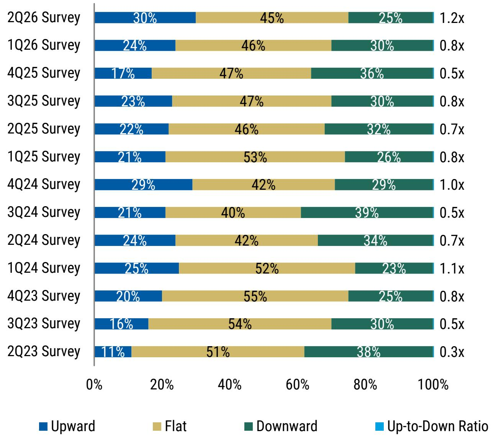  
Source: AlphaWise, MS. n=100 (US and EU data)

Exhibit 10: IT budget revisions: up-to-down ratios  
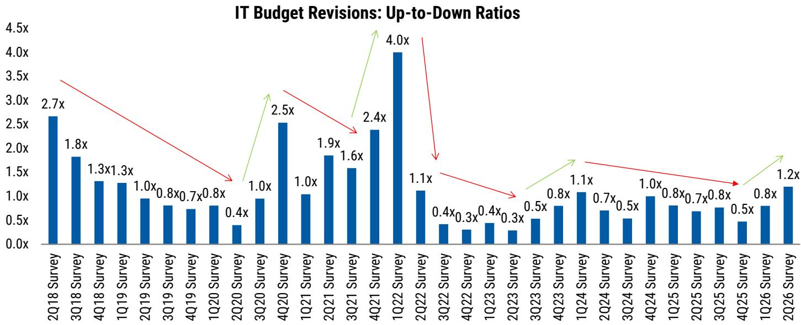  
Source: AlphaWise, MS. n=100 (US and EU data)  
Exhibit 11: Up-to-down budget revision ratio vs average seasonality

2026: Up-to-Down Budget Revision Ratio vs. Average Seasonality  
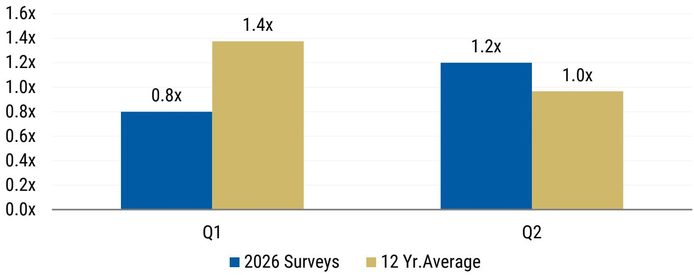  
Source: AlphaWise, MS. n=100 (US and EU data)  
- CIO revision expectations increased vs. 1Q26, with the one-year up-to-down IT budget revision ratio turning >1x, to 1.2x (from 0.8x in 1Q26). This means that more CIOs (30% of those surveyed) expect to revise their 2026 IT budgets higher than the number of CIOs expecting to revise their budgets lower (i.e. 25%). This level (1.2x) is also above the 12-year 2Q average of 1.0x.

## LT spending growth expectations slightly up vs 1Q26

Over the next three years, how do you expect IT spending as a \% of total revenues to change within your organisation?

Exhibit 12: CIO expectations on IT spending in next 3 years  
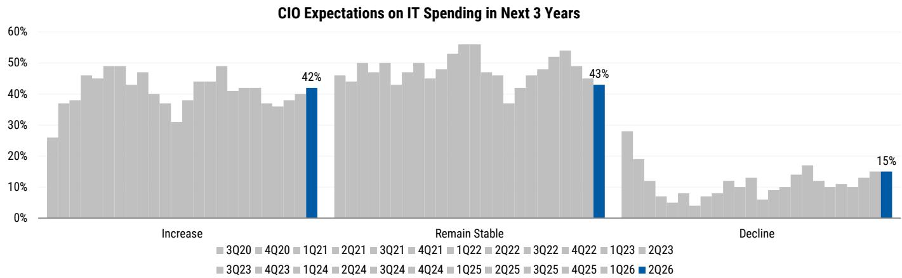  
Source: AlphaWise, MS. n=100 (US and EU data)

Exhibit 13: CIO expectations on IT spending in next 3 years up-to-down ratio  
CIO Expectations on IT Spending as % of Revenue in Next 3 Years (Increase / Decrease Ratio)  
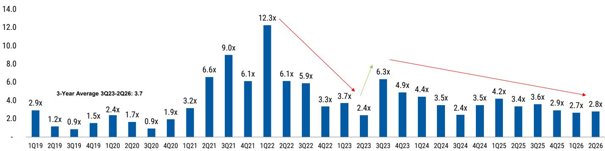  
Source: AlphaWise, MS. n=100 (US and EU data).

\- The proportion of CIOs expecting budgets to increase (as a % of total revenue) over the next 3 years increased to c. 42% (vs 40% in 1Q26). The percent of CIOs expecting budgets to decline over the next 3 years was unchanged vs 1Q26 at c. 15%.

\- This implies that the long-term up-to-down ratio has increased (albeit slightly) this quarter to c. 2.8x (up from c. 2.7x in 1Q26). The ratio remains comfortably >1x, illustrating potential upward revisions to long-term IT spending as a percentage of revenue over the next 3 years.

# Artificial Intelligence remains at the top of CIOs' list of spending priorities

Which three external IT Spending projects will see the largest percentage increase in spending in 2026?

Exhibit 14: Projects with largest spend increase in 2026 (% total responses)  
Projects with Largest Spend Increase in 2026 (% Total Responses)  
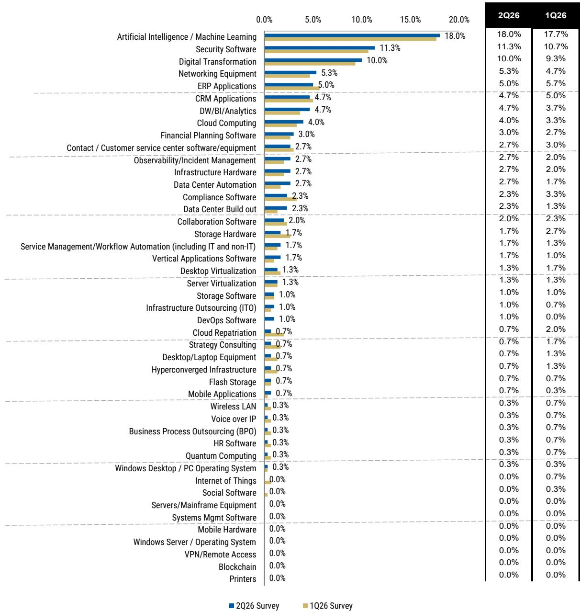  
Source: AlphaWise, MS. n=100 (US and EU data)

\- Artificial Intelligence / Machine Learning remained the top priority for CIOs, even increasing by c. 30bps since 1Q26.

\- The other top 2026 CIO priorities in 2Q26 are 2) Security Software (11.3%), 3) Digital Transformation (10.0%), 4) Networking Equipment (5.3%), and 5) ERP

Applications (5.0%). Despite falling back a bit since 1Q26, ERP Applications remains in the top 5 priorities for spend increase in 2026, which we view as a positive for SAP.

# Security Software, Digital Transformation, and ERP Applications are the Top 3 Most Defensive Projects

If the economy worsens significantly in 2026, what spending project is most likely to get cut? What spending project is least likely to get cut?

Exhibit 15: IT projects least and most likely to be cut in case of an economic downturn

% IT Projects Most & Least Likely to Get Cut

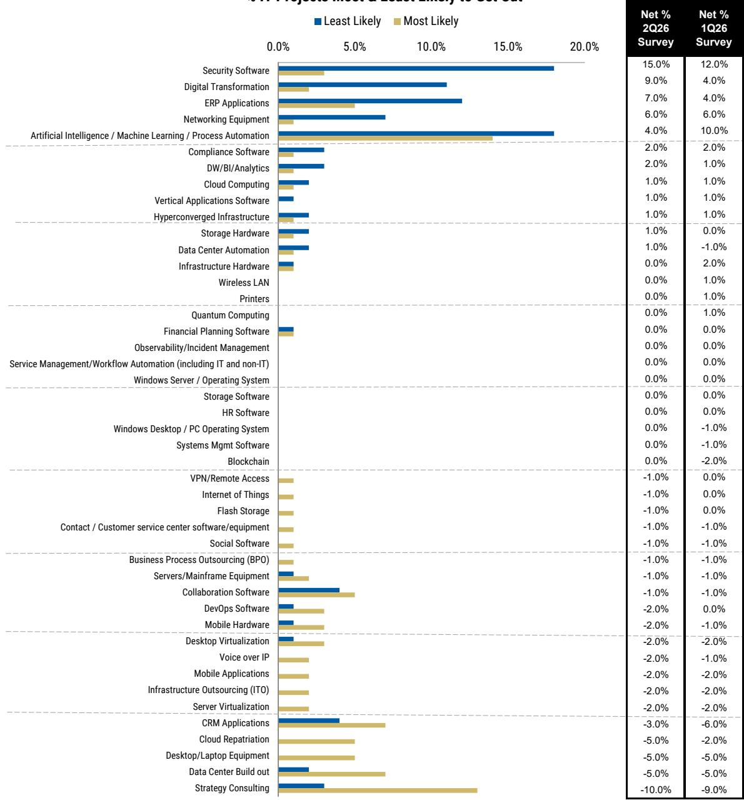  
Source: AlphaWise, MS. n=100 (US and EU data). Note: Projects are ranked based on the percentage of CIOs indicating the project is most likely to be cut, adjusted for the percentage of CIOs indicating the project is least likely to get cut.

Willingness to Discount: Past 3 months Vs Prior 3 months - According to our surveyed CIOs, the top 5 most defensive areas of IT spending were 1) Security Software (15%), 2) Digital Transformation (9%), 3) ERP Applications (7%), 4) Networking Equipment (6%), and 5) Artificial Intelligence/Machine Learning/Process Automation (AI/ML/PA; 4%).

\- The least defensive areas are in Strategy Consulting (-10.0%), Data Center Build Out (-5.0%), and Desktop/Laptop Equipment (-5.0%), indicating that they are most likely to be cut in a downturn.

\- We note that AI/ML/PA's defensiveness dropped c. 6ppt since 1Q26 – down to the 5th position in this survey. Combined with the relatively low defensibility ranking for data-center build-out, this suggests that spending on AI-related projects and infrastructure may face greater scrutiny and could be reprioritised if macroeconomic conditions weaken.

\- We note that ERP project defensiveness increased by 3pps to 7% this quarter, a reassuring read for SAP, highlighting the defensiveness of the ERP upgrade cycle.

## Vendors' perceived willingness to discount slightly decreases

How do you perceive technology vendors' willingness to discount in the past three months versus prior three months (i.e. in 2Q26 versus 1Q26)?

Exhibit 16: Technology vendors' willingness to provide discount in the past 3 months vs prior 3 months  
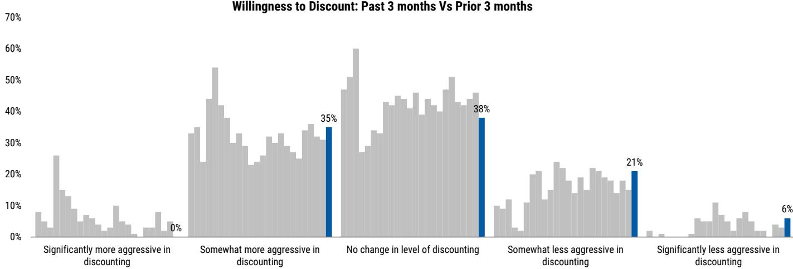  
3Q19 4Q19 1Q20 2Q20 3Q20 4Q20 1Q21 2Q21 3Q21 4Q21 1Q22 2Q22 3Q22 4Q22 1Q23 2Q23 3Q23 4Q23 1Q24 2Q24 3Q24 2Q25 3Q25 2Q26  
Source: AlphaWise, MS. n=100 (US and EU data).

\- Overall, CIOs say vendors are less inclined to discount relative to our 3Q25 survey results. Approximately 35% said that vendors are more aggressive in discounting (vs. 36% in 3Q25), with c. 27% of CIOs mentioning that vendors are less aggressive in discounting (vs. 18% in 3Q25).

# 66% of total workloads expected to be in the public cloud by the end of 2028

What percentage of your application workloads reside in each of the following areas today? What percentage do you expect to reside in each of these four areas by the end of 2026 and 2028?

Exhibit 17: Location of application workloads (% of total workloads)  
Location of Application Workloads (% of Total Workloads)  
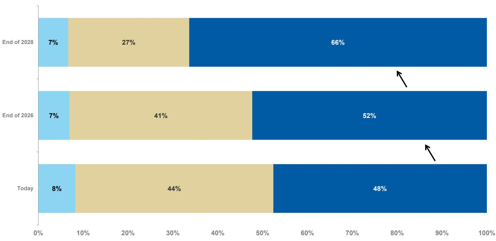  
Co-Location/Managed Hosting On premise (Non Cloud & Private Cloud) Public Cloud Total  
Source: AlphaWise, MS. n=100 (US and EU data).

Exhibit 18: EU Location of application workloads (% of total workloads)

EU Location of Application Workloads (% of Total Workloads)

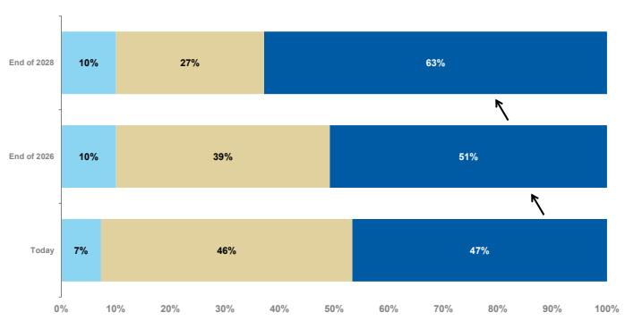  
Co-Location/Managed Hosting On premise (Non Cloud & Private Cloud) Public Cloud Total  
Source: AlphaWise, MS. n=100 (US and EU data)

Exhibit 19: US Location of application workloads (% of total workloads)  
US Location of Application Workloads (% of Total Workloads)  
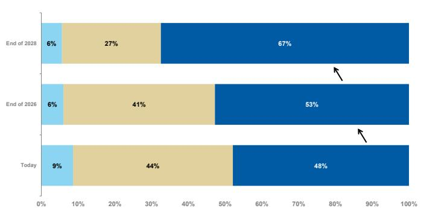  
Co-Location/Managed Hosting On premise (Non Cloud & Private Cloud) Public Cloud Total  
Source: AlphaWise, MS. n=100 (US and EU data)

## Exhibit 20:

Location of application workloads split by non-public and public cloud (SaaS, PaaS, IaaS)

Location of Application Workloads (% of Total Workloads)

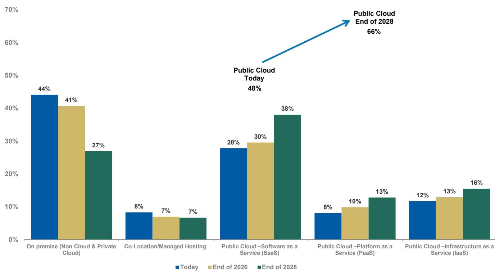  
Source: AlphaWise, MS. n=100 (US and EU data). N.B. Totals may not sum due to rounding.

\- Current workload in the public cloud is at c. 48%. CIOs estimated that public cloud will rise to c. 52% of the workloads by the end of 2026, and c. 66% by the end of 2028. Co-Location/Managed Hosting is expected to be slightly down by end of 2028 (c. 7%) versus today at c. 8%.

\- Regionally, public cloud adoption is currently similar in the US and EU, at c. 48% and c. 47% respectively. By the end of 2028, the % of total workloads in the public cloud is expected to increase to 67% in the US and 63% in the EU. Co-Location/Managed Hosting is expected to increase in the EU by the end of 2028, to c. 10% (from c. 7% today), while it is expected to decrease in the US to c. 6% (from c. 9% today).

\- Breaking down cloud workloads in Exhibit 20, on-premise and co-location/managed hosting account for approximately 52% of total application workloads today, but is expected to drop to c. 34% by 2028. Of the increase in public cloud through to 2028, public cloud SaaS is expected to make up the biggest proportion (c. 38% of total workloads), followed by IaaS (c. 16%), and finally PaaS (c. 13%).

## Microsoft and Amazon Remain Greatest Beneficiaries from Increased Spend on Shift to Cloud

As you shift workloads from on-premise to the cloud, which of these vendors do you expect to gain/(lose) the largest incremental percentage of your IT budget in 2026? Which do you expect gain/(lose) the largest percentage of your budget in the next three years?

Exhibit 21: % of responses expecting vendor with largest gain or loss of incremental share of IT budget as a result of shift to cloud in 2026  
% of Responses Expecting Vendor with Largest Gain or Loss of Incremental Share of IT Budget as a Result of Shift to Cloud in 2026  
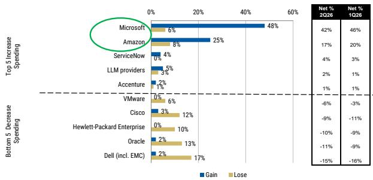  
Source: AlphaWise, MS. n=100 (US and EU data)

Exhibit 22: % of responses expecting vendor with largest gain or loss of incremental share of IT budget as a result of shift to cloud in next 3 years  
% of Responses Expecting Vendor with Largest Gain or Loss of Incremental Share of IT Budget as a Result of Shift to Cloud in Next Three Years  
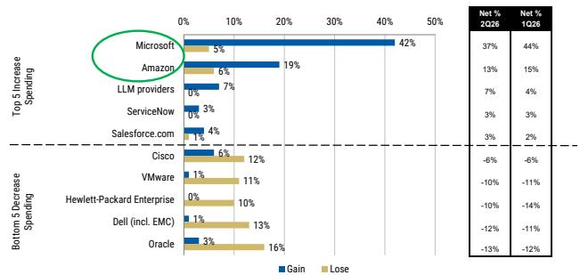  
Source: AlphaWise, MS. n=100 (US and EU data)

\- Similar to previous surveys, Microsoft (#1) and Amazon (#2) stand to benefit the most from the shift to cloud workloads. Microsoft is covered by Josh Baer, and Amazon by Brian Nowak.

\- On the other hand, Dell (covered by Erik Woodring), Oracle (covered by Sanjit Singh), and Hewlett-Packard Enterprise (covered by Erik Woodring) are expected to see the largest share loss from the shift to cloud both in 2026 and over the next 3 years.

Funding Sources/Mechanism for Initiatives around AI

# 54% of CIOs indicated that the recent innovations are funded using net new budget dollars

If evaluating or using recent innovations in Artificial Intelligence around Large Language Models (e.g. GPT-4) or Generative Design (e.g. Dall-e), which of the following best describes how these initiatives are funded?

Exhibit 23: How LLM / generative design initiatives are funded

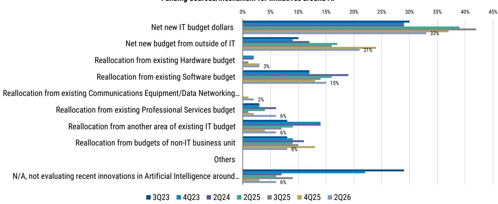  
Source: AlphaWise, MS. n=100 (US and EU data)

\- In terms of funding, 54% of CIOs surveyed reported that these recent innovations in AI around Large Language Models (e.g. ChatGPT) or Generative Design (e.g. Dalle), are funded using net new budget dollars, which is down from 4Q25 at 61%. Meanwhile, 40% indicated that they reallocated budgets from different business areas to fund initiatives (vs. 36% in 4Q25).

What change in the respective cost base have you seen from Generative AI/LLM usage over the last 12 months within the two business units where Generative AI/LLMs is deployed most materially across your organization?

Exhibit 24: IT Operations and Software Development are the most popular departments for GenAI roll-out

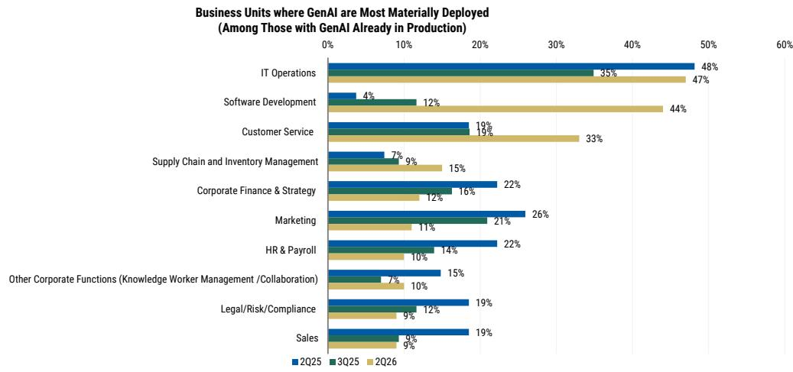  
Source: AlphaWise, MS. n=100 (US and EU data)

Exhibit 25: Among departments where GenAI is deployed, Customer Service and HR & Payroll departments have seen the most material cost base savings

Average % Change in Cost Base for Business Units where GenAI are Most Materially Deployed (Among Those with GenAI Already in Production)

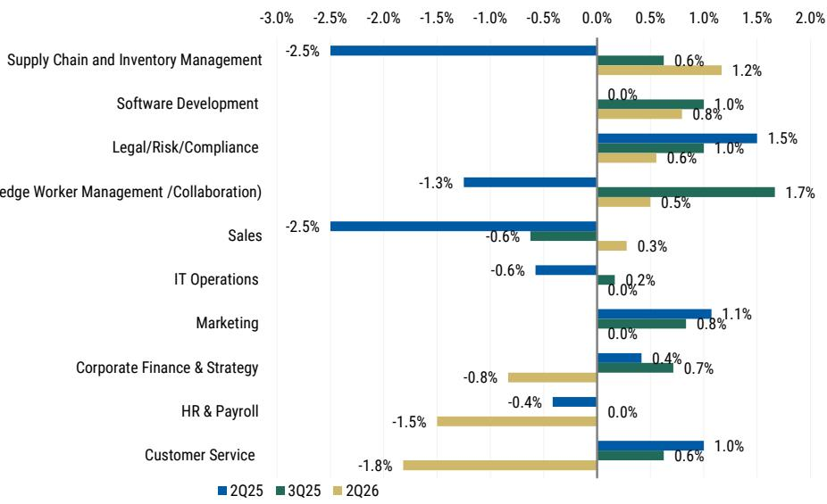  
Source: AlphaWise, MS. n=100 (US and EU data)

\- For companies that have already deployed GenAI throughout their organisation, IT Operations is the most prevalent business unit for roll-out (c. 47% of respondents), followed closely by Software Development (at 44%). In terms of change in cost base, Customer Service and HR & Payroll have seen the most material change, at an average of -1.8% and -1.5% respectively.

What are the top 2 objectives of your initiatives around recent innovations in Artificial Intelligence and Large Language models?

Exhibit 26: CIO objectives around recent innovations in Artificial Intelligence and Large Language models

Objectives of Initiatives around AI and LLM

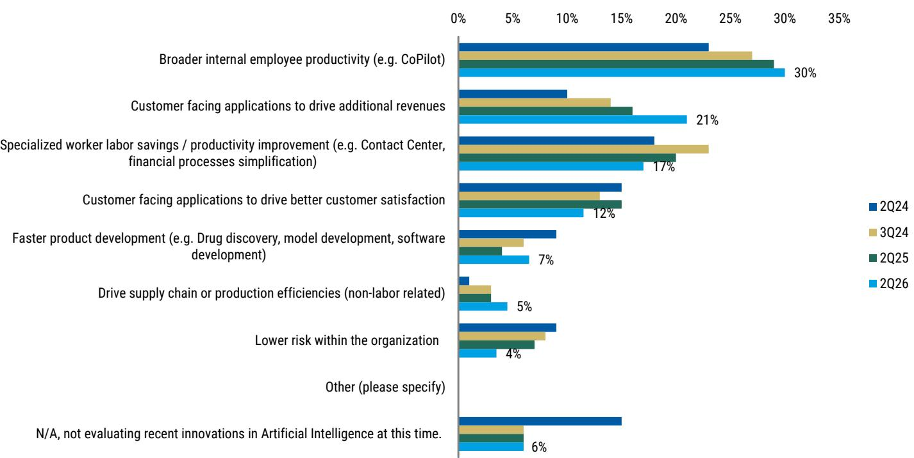  
Source: AlphaWise, MS. n=100 (US and EU data). Note: Percentages are of total responses.

\- 30% of CIOs reported that their objective was to improve broader internal employee productivity through the utilisation of GenAI and LLMs (vs. 29% in 2Q25). 21% cited customer-facing applications to drive additional revenue, while a further 12% cited applications intended to improve customer satisfaction, and 17% were around worker labour savings / productivity improvement. The survey results reflected less focus around lowering risk within the organization (4% in 2Q26) or driving non-labour related supply chain or production efficiencies (5% in 2Q26).

# Microsoft Among Top Vendors to Gain AI Spend Share in 2026 and Beyond

Which three vendors do you expect to gain the largest incremental share of Gen AI Spend at your company in 2026? And over the next three years?

Exhibit 27: Vendors to gain largest incremental share of GenAI spend in your company in 2026

Vendors Gaining Largest Incremental Share of Gen AI Spend in 2026  
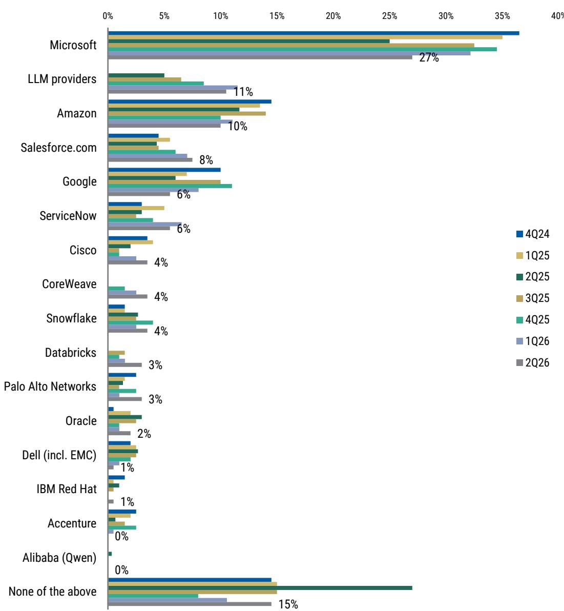  
Source: AlphaWise, MS. n=100 (US and EU data)

Exhibit 28: Vendors to gain largest incremental share of GenAI spend in your company in the next three years

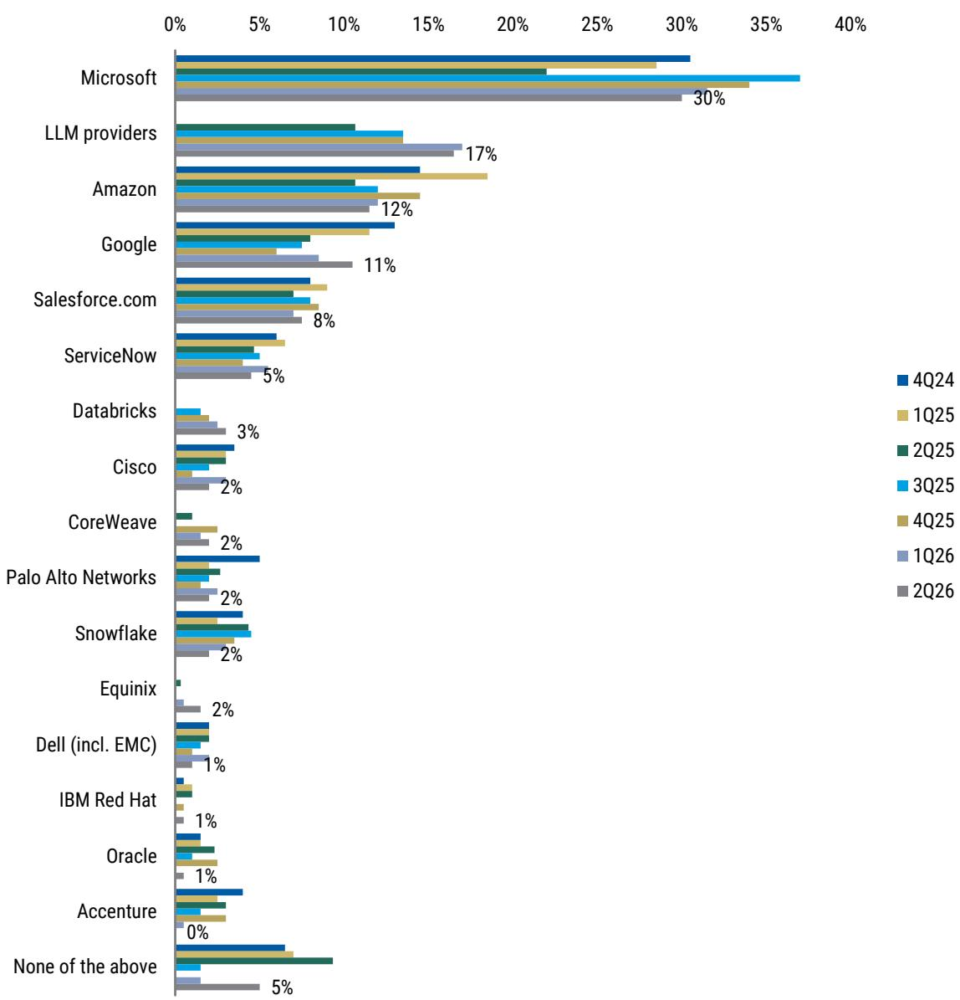  
Source: AlphaWise, MS. n=100 (US and EU data)

\- 27% of respondents believe that Microsoft remains the vendor to gain the largest incremental share in 2026, down from 32% in 1Q26. Other top vendors are LLM providers and Amazon at 11% and 10% of respondents respectively.

\- We see a broadly similar story over the LT (next three years): Microsoft remains on top with 30% of respondents believing that the company will be the vendor to gain the largest incremental share over this period. This is down from 1Q26 when Microsoft was at 32%. In the next three years, LLM providers are mentioned by a meaningfully higher share of respondents (at 17% vs c. 11% in 2026).

What is your preferred vendor for building custom AI applications today? And 3 years from now?

Exhibit 29: Preferred vendors for building custom AI applications today  
Preferred Vendors for Building Custom AI Applications - Today  
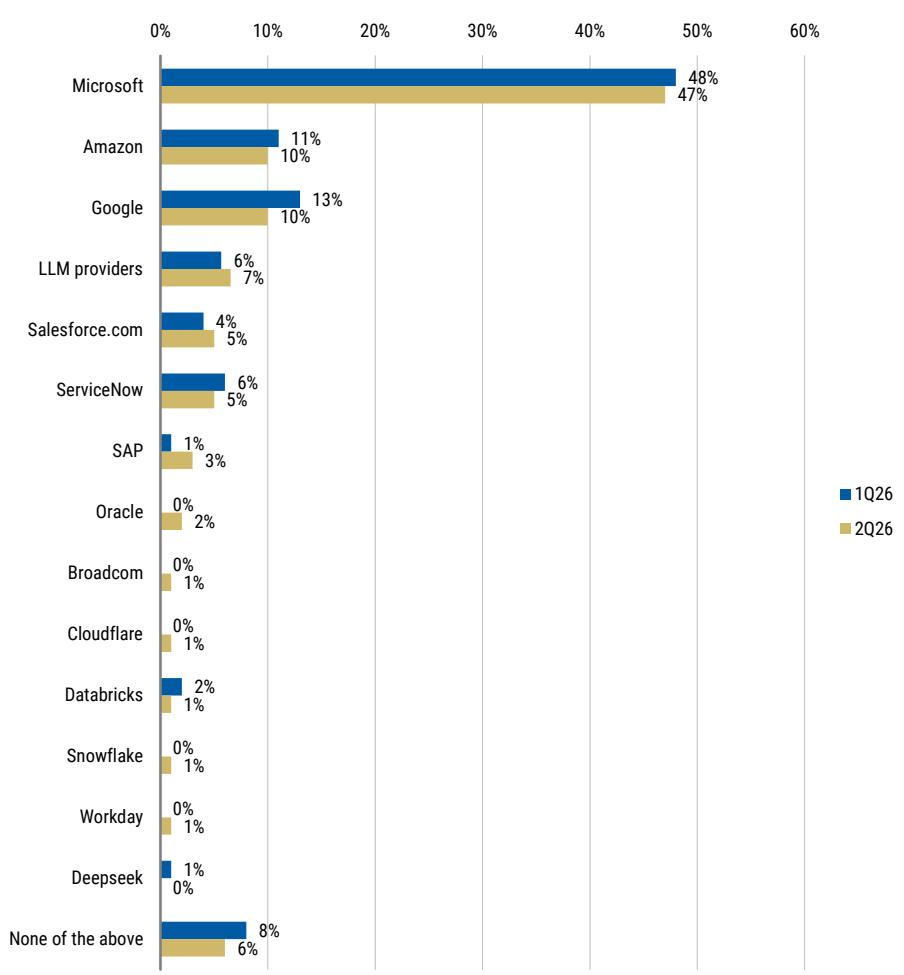  
Source: AlphaWise, MS. n=100 (US and EU data)

Exhibit 30: Preferred vendors for building custom AI applications 3 years out
Preferred Vendors for Building Custom AI Applications: 3 Years Out  
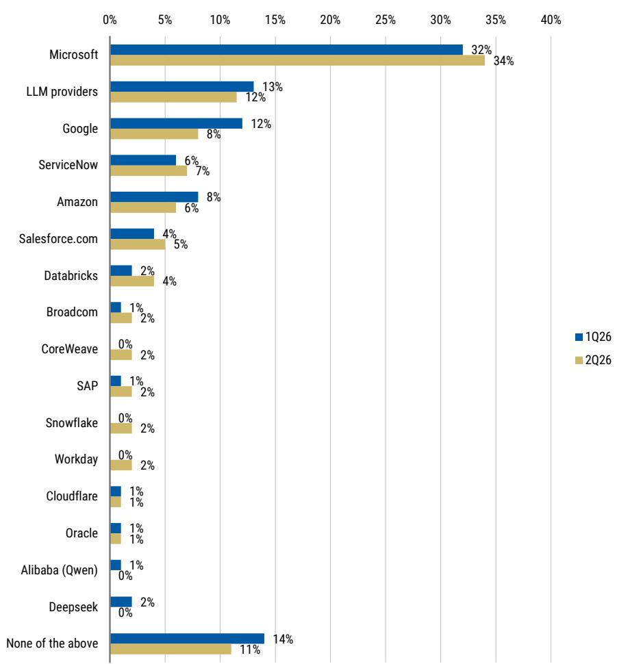  
Source: AlphaWise, MS. n=100 (US and EU data)

\- CIOs indicate that their preferred vendor for building custom AI application today is Microsoft, at 47% of respondents (down from 48% in 1Q26). This is materially higher than the second and third placed vendors, Amazon and Google, both with 10% of respondents mentioning them as a preferred vendor for building custom AI applications.

\- While Microsoft remains on top (with 34% of responses) when we look for preferred vendors for building custom AI applications three years out, with LLM providers in the runner-up spot (at 12%). Taken together with Exhibit 28 above, it indicates to us that CIOs are expecting the vendor share of LLM providers to increase meaningfully in the next three years.

\- We note that the % of respondents who preferred SAP increased 1pp to 2% this quarter vs. 1Q26. While modest, we think this could be an early signal that SAP's refreshed AI strategy laid out at Sapphire is starting to resonate with customers.

# Software Key Takeaways

# CIOs expect SAP spending on new functionality and additional users/seats to increase by 1.6% in 2026

How do you expect your spending for new software functionality or additional users/seats to change in 2026 versus 2025 for the following vendors?

Exhibit 31: Growth expectations in vendor spend on new functionality/seats in 2026

Average Growth Expectations of New Functionality/ Seats
■ 2Q23 ■ 4Q23 ■ 2Q24 ■ 4Q24 ■ 2Q25 ■ 4Q25 ■ 2Q26

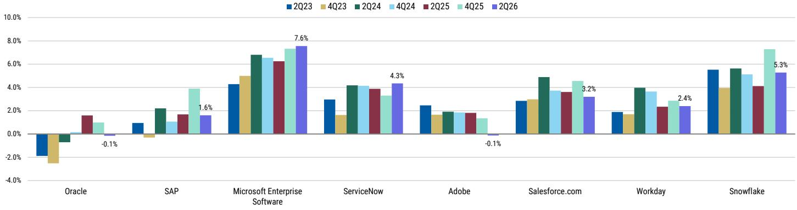  
Source: AlphaWise, MS, n=60 (US and EU data). Please note that we changed our Software Domain panel vendor in 2Q24, which means comparisons with prior Software Domain surveys could face possible comparability issues.

\- Software spending growth expectations in 2026 were more mixed vs 4Q25: Microsoft and ServiceNow saw increases; while growth across the rest of the vendors
