July 16, 2026 02:18 AM GMT

US Tech | North America

# 2Q26 CIO Survey – Budget Support Improves, But Winners Remain Selective

2026 IT budget growth expectations ticked higher Q/Q to +3.8%, coupled with strong inflection in 1-year up-to-down ratio, pointing to a healthier budget environment. However, winners remain selective as CIOs are more discerning about where dollars flow: MSFT and Security screen clearest.

AlphaWise α

## Is IT Budget Air Cover Finally Arriving?

Our latest CIO Survey, fielded between May 8th and June 8th, points to a more constructive budget backdrop for 2026, with CIOs expecting IT budget growth to accelerate modestly to +3.8% in 2026 from +3.7% in 2025, a +14 bps YoY improvement and modest uptick versus the +3.7% growth expectation in our 1Q26 survey, though still below the +4.1% 2010-2019 average (Exhibit 3).

- Software remains the fastest-growing industry in the Technology sector and the only major one expected to accelerate YoY, with CIOs expecting +4.1% growth in 2026, up +29 bps from 2025, while Communications (+2.6%, -12 bps YoY), Hardware (+1.6%, -4 bps), and Services (+1.8%, -34 bps) are expected to decelerate (Exhibit 12). Sequentially, 2026 budget growth expectations were revised higher across all IT industries except Services, led by Communications (+35 bps QoQ) and Hardware (+12 bps QoQ), while Software was effectively flat (+3 bps QoQ) and Services deteriorated (-23 bps QoQ) (Exhibit 13).

- Turning to expectations for near-term IT Budget revisions, the 1-year up-to-down ratio for potential IT budget revisions improved to 1.2x from 0.8x in 1Q26, with 30% of CIOs expecting upward revisions versus 25% expecting downward revisions, marking the first reading above 1.0x since 1Q24 (Exhibit 5).

- Long-term secular trends also improved modestly, with the 3-year up-to-down ratio ticking up to 2.8x from 2.7x in 1Q26, as 42% of CIOs expect IT spending to increase as a percentage of revenue over the next three years relative to 15% expecting declines, though the ratio remains below the trailing survey average of 3.7x (Exhibit 19).

- Looking under the hood at CIO priorities, AI/ML remains the #1 priority at 18.0%, followed by Security Software at 11.3% and Digital Transformation at 10.0% (Exhibit 20). While encouraging to see another increase in AI/ML prioritization, its net defensibility fell to +4% from +10% QoQ, suggesting CIOs are becoming more discerning around which AI initiatives are truly protected (Exhibit 23).

MS & CO. LLC

Sanjit K Singh
Equity Analyst
Sanjit.Singh@morganstanley.com +1 415 576-2060

James E Faucette
Equity Analyst
James.Faucette@morganstanley.com +1 212 296-5771

Meta A Marshall
Equity Analyst
Meta.Marshall@morganstanley.com +1 212 761-0430

Erik W Woodring
Equity Analyst
Erik.Woodring@morganstanley.com +1 212 296-8083

Brian Nowak, CFA
Equity Analyst
Brian.Nowak@morganstanley.com +1 212 761-3365

Adam Wood
Equity Analyst
Adam.Wood@morganstanley.com +1 212 761-3656

Josh Baer, CFA
Equity Analyst
Josh.Baer@morganstanley.com +1 212 761-4223

Elizabeth Porter, CFA
Equity Analyst
Elizabeth.E.Porter@morganstanley.com +1 212 761-3632

Chris Quintero
Equity Analyst
Chris.Quintero@morganstanley.com +1 212 761-1686

Equity Analyst
Cameron.McVeigh@morganstanley.com +1 212 761-4209

For analyst certification and other important disclosures, refer to the Disclosure Section, located at the end of this report.

- Taken together, the improving headline data provides more support for optimism in certain areas of IT budgets, though we still lack sufficient ammunition to become structurally more positive on application software broadly, as Software's 2026 growth expectations were effectively unchanged sequentially and vendor-level software spending intentions remain dispersed.

- As such, the range of winners likely remains relatively narrow, with Microsoft again screening as the clearest public beneficiary across incremental GenAI spend, agentic automation, custom AI application preferences, and enterprise distribution, while LLM Providers are gaining direct CIO relevance as a secondary source of share gain across AI-related spend and custom AI application development.

- Lastly, Security screens as the cleanest category-level winner given its priority, defensibility, and accelerating spend outlook.

Exhibit 1: CIOs Indicate Expectations for Microsoft, LLM Providers, Amazon, and Salesforce to Gain the Largest Incremental Share of GenAI Spend in 2026...  
Vendors Gaining Largest Incremental Share of Gen AI Spend in 2026  
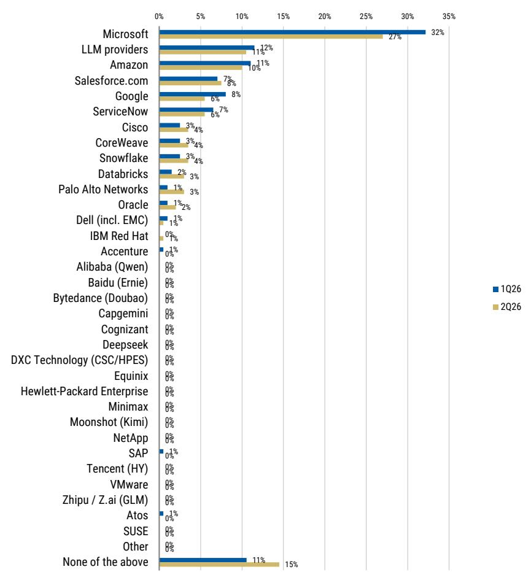  
Source: AlphaWise, MS. n=100 (US and EU data)

Exhibit 2: ...With Google and Salesforce Taking More Share Over The Next Three Years

Vendors Gaining Largest Incremental Share of Gen AI Spend in Next Three Years  
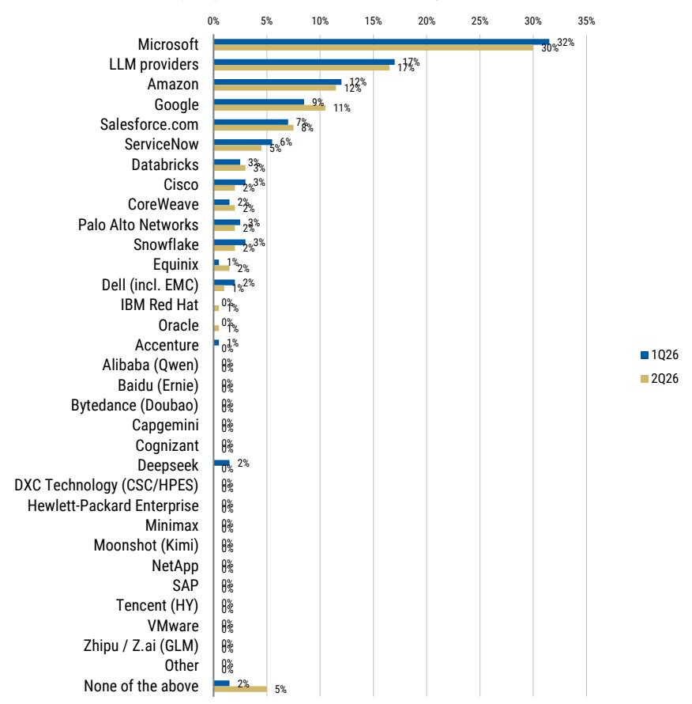  
Source: AlphaWise, MS. n=100 (US and EU data)

Exhibit 3: At 3.8%, CIOs Continue to Expect Modest Budget Growth Acceleration YoY (+14 bps from 3.7% in 2025)  
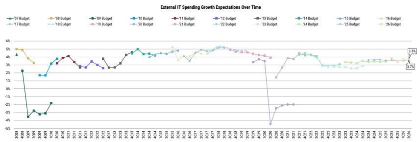  
Source: AlphaWise, MS. N=100 (US and EU data)

Exhibit 4: Sequentially, Budget Growth Expectations Were Revised Up Across All Industries (Except Services)

2026 External IT Spending Growth Expectations by Sector

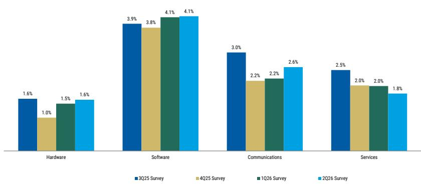  
Source: AlphaWise, MS. N=100 (US and EU data)

Exhibit 5: Up-to-Down Ratio Increased Significantly to 1.2x from 0.8x, Indicating that Upward Revisions to IT Budgets Are More Likely Near Term  
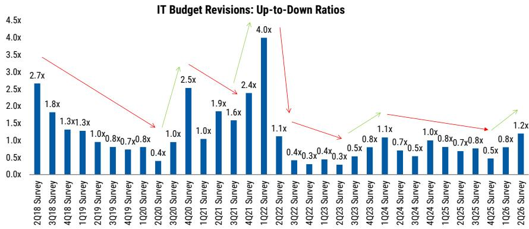  
Source: AlphaWise, MS. N=100 (US and EU data)

## How the Industries are Positioned

- Software: Better Budget Air Cover, Though Application Software Still Need More Evidence. With the broader IT budget backdrop improving and the 1-year up-to-down ratio moving above 1.0x for the first time since 1Q24, Software investor focus has shifted back toward whether improving AI momentum can drive a more durable inflection in Software budgets. At the industry level, Software remains the fastest-growing, with CIOs expecting +4.1% growth in 2026, up +29 bps from 2025 (Exhibit 12). With that said, we still do not find sufficient ammunition this quarter to become structurally more positive on application software broadly. Sequentially, Software spending expectations were effectively unchanged, up just +3 bps QoQ (Exhibit 45), and vendor-level spending intentions remain highly dispersed, with Microsoft and ServiceNow the only tracked vendors expected to accelerate versus our 4Q25 survey (Exhibit 46). Funding data also argues for selectivity: while AI spend still appears more additive than cannibalistic, combined net-new funding sources declined to 54% in 2Q26 from 61% in 4Q25, while reallocations within existing IT budgets increased to 32% from 23%, including 15% from existing Software budgets (up from 13% in 4Q25), Exhibit 32. Net, the survey supports a more constructive Software backdrop than prior reads, but not a broad application software inflection. Below we highlight three key Software-specific takeaways from our 2Q26 CIO Survey:

- Application Software Results Remain Mixed. Looking across our Application Software coverage, 2Q26 survey data still does not provide enough evidence to become structurally more positive on the group. Vendor-level spending intentions remain dispersed, with Microsoft and ServiceNow the only tracked software vendors where forward-year growth expectations accelerated versus our 4Q25 survey, while Salesforce, Adobe, Workday, and SAP all decelerated (Exhibit 46). Looking under the hood at CIO expectations for vendors gaining the largest incremental share of GenAI spend on one- and three-year views, the results remain mixed (Exhibit 1, Exhibit 2). Salesforce improved modestly QoQ, as 8% of CIOs expect Salesforce to gain incremental GenAI spend share in 2026 (up from 7% in 1Q26), and 8% expect Salesforce to gain share over the next three years (up from 7% in 1Q26). Conversely, ServiceNow downticked on both time horizons, down to 6% of CIOs on a one-year view (down from 7% in 1Q26), and down to 5% of CIOs over the next three years (down from 6% in 1Q26). Further, LLM Providers continue to screen as the second-largest expected GenAI share gainer behind Microsoft, with 11% of CIOs expecting LLM Providers to gain incremental share in 2026, modestly down from 12% in 1Q26, and 17% of CIOs expecting incremental share gains over the next three years (unchanged QoQ). While LLM Provider share gains did not inflect materially higher sequentially, their positioning does suggest continued wallet-share risk for incumbent application vendors not well positioned to participate in GenAI spend. Net, while the survey points to pockets of application vendor participation in the AI investment cycle, the broader results still point to mixed vendor-level spend intentions and uneven capture of GenAI wallet share.

## • Microsoft Remains the Clearest Winner, Albeit with a Modest

Downtick from 1Q26. CIO Survey data continues to underpin Microsoft's leadership position in AI, though several AI-specific datapoints moderated from elevated 1Q26 levels: Microsoft remains the clear #1 vendor expected to gain incremental share of GenAI spending in both 2026 (27% of CIOs, down from 32% in 1Q26) and over the next three years (30%, down from 32% in 1Q26) (Exhibit 1, Exhibit 2). Related, amidst a broad suite of agentic vendors, 36% of CIOs expect Microsoft to be leveraged for agentic automation initiatives (down from 42% in 1Q26), but still well ahead of the next closest vendor at 8% (Exhibit 10). New survey work around custom AI application development similarly reinforces Microsoft's positioning, with Microsoft screening as the preferred vendor today (47%, roughly stable versus 48% in 1Q26) and over the next three years (34%, up from 32% in 1Q26), Exhibit 11. Importantly, this modest downtick across select AI share indicators pairs against still-accelerating Microsoft spending intentions (Exhibit 46). Looking across a broad suite of software vendors, CIOs expect the highest forward-year growth for Microsoft from an absolute growth expectations perspective at +7.6%, up from +7.3% in our 4Q25 survey. Further, CIOs note the top AI / LLM initiative remains broader internal employee productivity (30% of responses) (Exhibit 34), highlighting the opportunity for products like Microsoft 365 Copilot as well as potential upsell opportunities for E5 / E7 SKUs. Specifically, 88% of CIOs note expectations to utilize Microsoft 365 Copilot over the next 12 months, up from 80% in 4Q25 (Exhibit 61). Lastly, the 2Q26 Survey also highlights continued premium M365 monetization potential, with E7 newly broken out and CIOs expecting combined E5 / E7 mix to reach 71% next year (Exhibit 58, Exhibit 58, Exhibit 60). Even as LLM Providers gain direct CIO relevance, Microsoft remains well-positioned to consolidate software spend while effectively monetizing GenAI across M365, Copilot, Azure, GitHub, Fabric, and broader enterprise distribution over a multi-year timeframe. See Microsoft: 2Q26 CIO Survey Takeaways — GenAI Leadership Position Remains Clear for Microsoft-specific takeaways from our 2Q26 Survey.

- Security Software Spending Expectations Accelerate Meaningfully. CIOs note expectations for spending on Security to accelerate meaningfully in 2026, with expected growth of +12.4% vs +8.9% in 2025 (Exhibit 49), and up +306 bps from +9.4% in our 4Q25 survey (Exhibit 49). The magnitude of the step-up is notable and likely driven by three key factors: 1) replacement of technical debt, as legacy / off-maintenance infrastructure represents an immediate vulnerability and supports firewall refresh activity, with higher memory costs also increasing the price of newer firewall appliances; 2) automated SOC / SIEM investment, as security analysts face increasing alert volumes and a rising mix of AI-enabled attacks, driving demand for automation and more data flowing through SIEM platforms; and 3) AI security, particularly enhanced identity and data security as enterprises begin to deploy GenAI-enabled applications more broadly. The survey also continues to point to Security as one of the cleanest areas of durability in the survey (ranking as the #2 CIO priority at 11.3% of responses, up from 10.7% in 1Q26) (Exhibit 20) and the most defensible IT project with a +15% net defensibility score (up from +12% in 1Q26) (Exhibit 23). Net, the combination of accelerating spend expectations, high CIO prioritization, and leading defensibility continues to support a positive outlook for Security Software within the broader software cohort, particularly as CIOs appear willing to protect security budgets even as other areas of software remain more mixed.

- 2026 IT Hardware budget growth is broadly stable relative to 2025 growth, and modestly better vs. 1Q26 (+1.6% vs. +1.5% in 1Q), but with some mixed details. Our 2Q26 CIO Survey shows that CIOs expect 2026 Hardware spend to grow 1.6% Y/Y, slightly better than 1Q26 CIO Survey by 10bps, and is in-line with Y/Y hardware budget growth in 2025. Hardware remains the slowest growing sector amongst all tech sectors in our survey. We think the slight revision higher to 2026 Hardware budget growth makes sense, as CIOs likely have had to factor in pull-forward and higher priced hardware, driven by industry-wide component cost inflation. However, we are surprised spending intentions from this survey are not stronger given clear real-world examples of strong infrastructure demand (i.e. IBM negative pre-announcement). For context, Hardware budget growth of 1.6% is in-line to the trailing 10-year average. Digging a level deeper, macro takeaways from this survey were mixed – (1) 2026 SMB hardware spending expectations downticked this quarter (from +0.4% to -0.8%), in addition to a slight downtick from large enterprises (from +1.7% to +1.6%), while (2) CIOs still broadly are not prioritizing hardware-related projects, with only AI/ML, infrastructure hardware, and data center build out projects upticking Q/Q. Additionally, defensibility of hardware projects remains mixed, with desktop/laptop equipment and data center build out among the least defensible IT projects if the macro deteriorates. Net, this leaves our views on the group largely neutral. Hardware stocks have appreciated 45% on average, and now trade at 26.8x P/E (18.2x median) and a 32% premium to the S&P, 5 standard deviations above the historical average.

- Networking spend accelerating despite elevated memory cost. 2Q26 Networking budget expectations improved to +2.6% y/y, a +35bp sequential acceleration and the second-highest industry growth rate behind Software at +4.1%, though Communications remains modestly below 2025 expectations of +2.7%. Upward budget revisions are directionally higher, with the up-to-down ratio improving to 1.2x from 0.8x, driven by 30% of CIOs expecting upward revisions and 25% expecting downward revisions. Networking Equipment screened as the fourth-most defensible CIO priority, while Security Software remains the most defensive. Security budgets are shifting toward SOC automation and AI for security, with signs of vendor consolidation. Memory pricing is a watch item, with VARs expecting an average 15% memory-related customer price increase, while spend intention increases indicate ability to absorb for now. 2Q VAR results show dramatic acceleration in spend intentions for CSCO/ANET/HPE, pointing to spend on AI/DC modernization. Results most positive for CSCO; most cautious for FFIV.

- 2026 IT Services spending intentions show modest deceleration despite improvement in broader IT budget growth. Our 2Q26 CIO Survey points to +1.8% y/y Services growth for 2026, down from +2.0% in our 1Q26 survey and below the +2.1% growth seen in 2025, with Services the only major IT category to weaken sequentially. We believe AI investment continues to crowd out discretionary Services programs, as the rapid pace of model advancement is prompting leadership teams and boards to prioritize ongoing AI development over broader transformation work. Notably, 59% of respondents expect Gen AI to increase traditional IT outsourcing spend versus 19% that expect a reduction, suggesting demand could eventually improve as AI initiatives move from experimentation into scaled production. Within our coverage, ACN (EW) appears best positioned to benefit from an eventual recovery given its scale, enterprise relationships, exposure to large transformation programs, and leading position in vendor consolidation; however, we believe the stock requires clearer evidence of accelerating discretionary Services demand. We also favor the investment-forward AI strategies at ACN and CTSH (EW), including their significant use of M&A to expand AI capabilities, technical expertise, and proprietary offerings, though monetization remains early and we await stronger evidence of broad-based production adoption.

Exhibit 6: Long-Term Up-to-Down Ratio Also Ticked Up QoQ, With 42% of CIOs Expecting IT Spending to Increase as a % of Total Revenue over the Next 3 Years, Relative to Just 15% Expecting Declines

CIO Expectations on IT Spending as % of Revenue in Next 3 Years (Increase / Decrease Ratio)

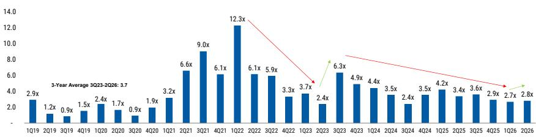  
Source: AlphaWise, MS. N=100 (US and EU data)

2Q26 Survey 1Q26 Survey

Exhibit 7: AI/ML Sustains Positioning at the Top of the CIO Priority List, Followed by Security Software and Digital Transformation  
Projects with Largest Spend Increase in 2026 (% Total Responses)  
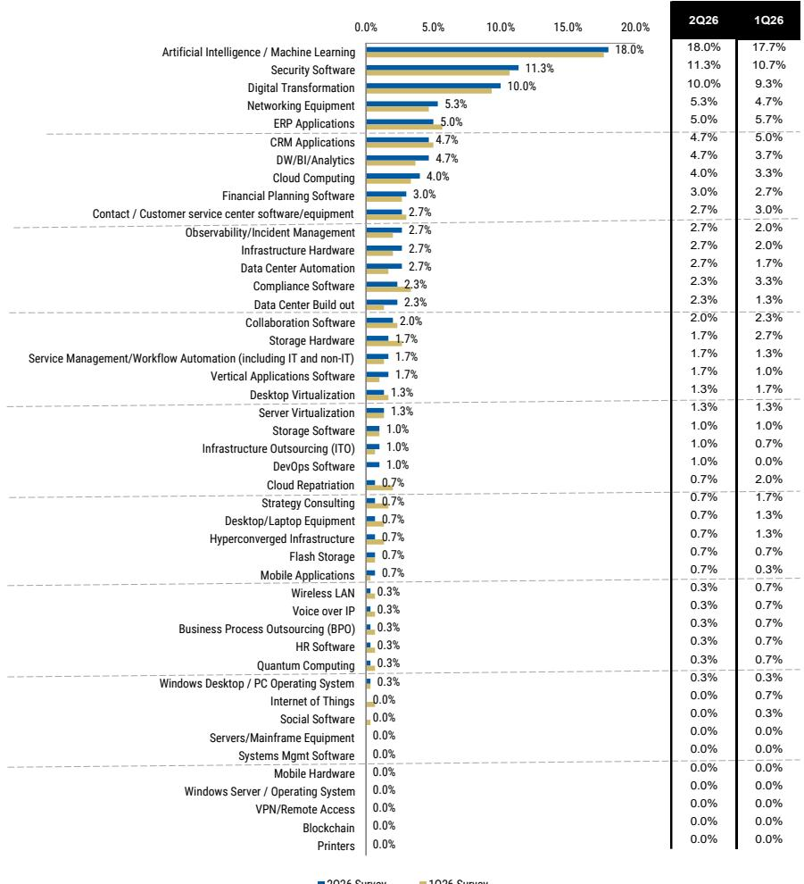  
Source: AlphaWise, MS. N=100 (US and EU data)

Exhibit 8: AI/ML Prioritization Reaches Survey High at 18% in 2Q26, Up From 17.7% in 1Q26  
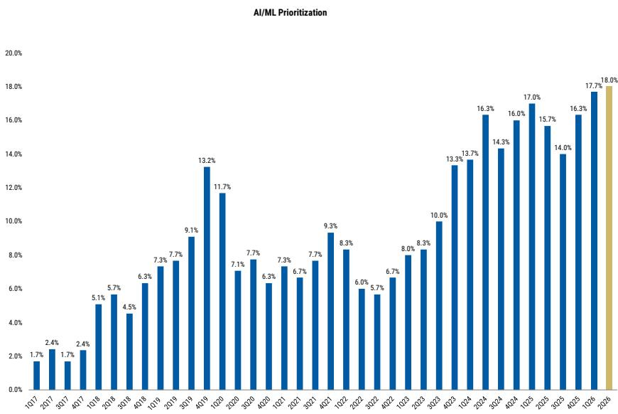  
Source: AlphaWise, MS. n= 100 (US and EU data)  
Exhibit 9: AI/ML's Position as CIO's Top Priority Remains Strong in 2Q26 Despite Modest Downtick

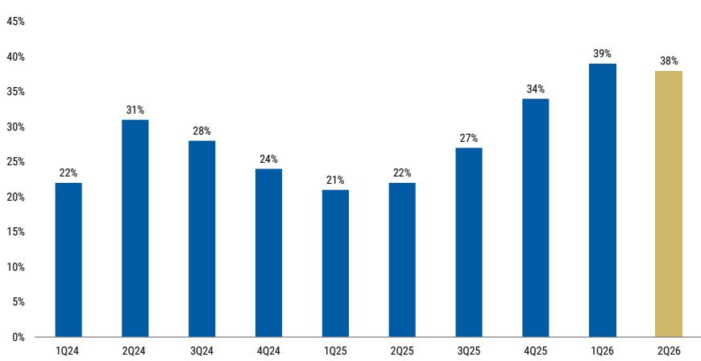  
Source: AlphaWise, MS. n= 100 (US and EU data)

Vendors Likely to Be Used for Agentic Automation Initiatives  
Exhibit 10: Microsoft, Google, Amazon, and the LLM Providers Screen as Vendors Most Likely Used for Agentic Automation Initiatives  
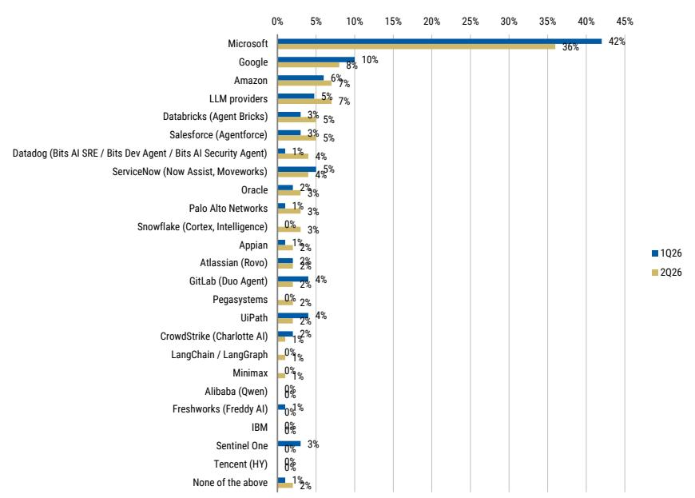  
Source: AlphaWise, MS. n=100 (US and EU data)

Exhibit 11: CIOs Point to Microsoft, LLM Providers, Google, and ServiceNow as Preferred Vendors for Building Custom AI Applications Today and 3 Years Out
2Q26: Preferred Vendors for Building Custom AI Applications: Today vs. 3 Years Out  
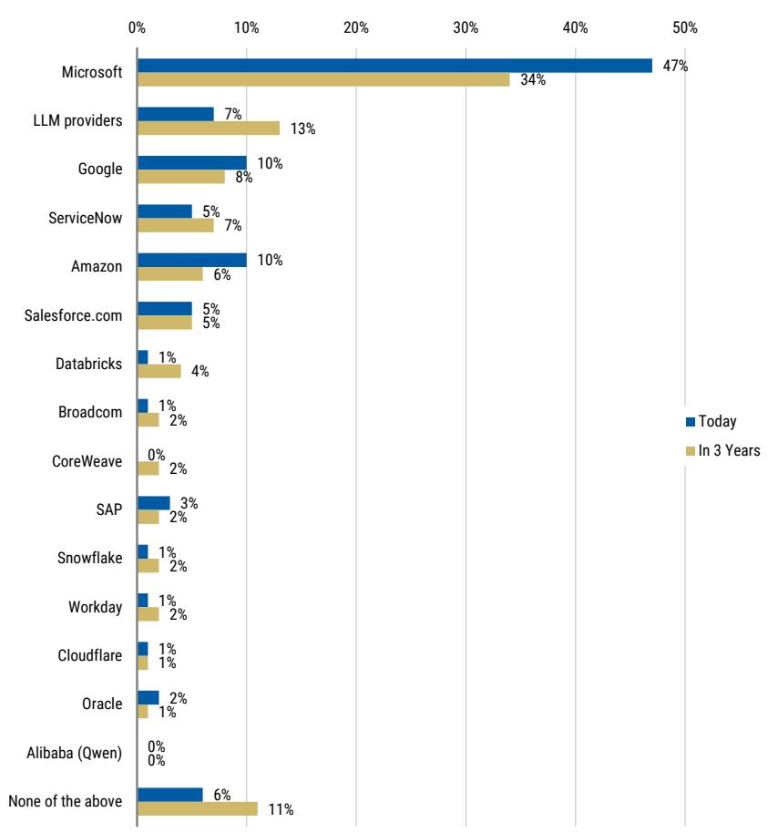  
Source: AlphaWise, MS. n=100 (US and EU data)

## Macro – Key Takeaways

We surveyed 76 US and 24 European CIOs regarding their external IT budgets and the current spending environment. Key macro takeaways from our 2Q26 survey include:

- CIO expectations for 2026 IT budgets accelerated for a second consecutive quarter to +3.8% growth in 2Q26, vs +3.7% as indicated in our 1Q26 reading and up from +3.7% growth expectations for 2025, Exhibit 3. While growth expectations remain below the 4.1% 2010-2019 average, the data points to a stable-to-improving spending backdrop, with budget optimism constructively inflecting toward trailing survey averages.

- CIOs continue to expect Software to remain the fastest growing IT industry in 2026, though sequential improvement was muted. CIOs expect Software spending to grow +4.1% in 2026, up +29 bps YoY from 2025, followed by Communications (+2.6%), IT Services (+1.8%), and Hardware (+1.6%), Exhibit 4; Sequentially, expectations for 2026 budget growth were revised higher across all industries except Services, most notably Communications (+35 bps QoQ) and Hardware (+12 bps QoQ), while Software was effectively flat (+3 bps QoQ) and IT Services deteriorated (-23 bps QoQ). Net, Software remains the best industry-level read, though we still lack evidence of a material sequential inflection in Software budgets.

- The 1-year up-to-down ratio for CIOs' expectations of potential IT budget revisions inflected positively, representing the clearest constructive macro datapoint in the survey. Our 2Q26 read for potential IT budget revisions came in at 1.2x, up from 0.8x in 1Q26, with 30% of CIOs expecting upward revisions versus 25% expecting downward revisions, Exhibit 5. This marks the first reading above 1.0x since 1Q24, suggesting upward revisions to IT budgets are now more likely near term.

- Long-term secular trends improved modestly, though remain below recent averages. The 3-year up-to-down ratio ticked up to 2.8x from 2.7x in 1Q26, as 42% of CIOs expect IT spending to increase as a percentage of revenue over the next three years versus 15% expecting declines, Exhibit 6. While still constructive, the ratio remains below the trailing survey average of 3.7x, suggesting CIOs remain optimistic on medium-term IT spending growth, but not euphoric.

- AI/ML sustains positioning on the top of the CIO priority list, reaching another survey high in net prioritization, Exhibit 20. AI / ML ranks as the top CIO priority at 18.0% of responses, up modestly from 17.7% in 1Q26, followed by Security Software (11.3%, +60 bps QoQ), Digital Transformation (10.0%, +70 bps QoQ), Networking Equipment (5.3%, +60 bps QoQ), and ERP Applications (5.0%, -70 bps QoQ). While AI / ML remains the clear top priority, the percentage of CIOs naming AI / ML as their #1 priority ticked down slightly to 38% from 39% in 1Q26, Exhibit 9.

- Security Software (net score of 15%) remains the most defensible area of spending, while AI/ML screens less defensible QoQ despite remaining the top priority, Exhibit 23. Security Software posted the highest net defensibility score at +15%, up from +12% in 1Q26, followed by Digital Transformation (net score of 9%), ERP Applications (net score of 7%), Networking Equipment (net score of 6%), and AI/ML (net score of 4%). Importantly, AI/ML defensibility declined by 600 bps QoQ, suggesting CIOs remain highly focused on AI, but are becoming more discerning around which AI initiatives are truly protected. Digital Transformation saw the largest increase in defensibility, improving +500 bps QoQ. The least defensible areas include Strategy Consulting, Data Center Buildout, Desktop / Laptop Equipment, Cloud Repatriation, and CRM Applications.

- As workloads shift to the cloud, Microsoft and Amazon remain the clear beneficiaries, though LLM Providers are emerging as a secondary share gainer (Exhibit 24, Exhibit 25). Microsoft remains the top expected share gainer from cloud migration in both 2026 and over the next three years (42% and 37% net scores, respectively), followed by Amazon (17% and 13% net scores, respectively). That said, results also point to some budget share shifting toward LLM Providers, which screen as an emerging beneficiary in both one-year and three-year views with 2% and 7% net scores, respectively. Conversely, Dell, Oracle, HPE, Cisco, and VMware continue to screen as likely share donors as workloads move from on-premise to cloud (Exhibit 26, Exhibit 27).

- CIOs continue to expect momentum in the shift to public cloud, with current workload mix still tracking ahead of historical migration trends; co-location / managed hosting now screens as a small but stable workload location, Exhibit 28. 2Q26 survey data suggests 48% of application workloads are running in the public cloud today, up from 47% in 4Q25 and 44% in 2Q25. CIOs now expect 52% of application workloads to run in the public cloud by the end of 2026 and 66% by the end of 2028, modestly below the 67% / 68% three-year expectations in 4Q25 / 2Q25, respectively, but still implying continued migration from on-premise environments. New to the survey, CIOs estimate 8% of workloads reside in colocation / managed hosting today, with that share expected to remain largely stable at 7% by the end of 2026 and 2028. We see this as incrementally positive for scaled operators Equinix and Digital Realty, as colocation remains a durable component of enterprise IT architecture, Exhibit 29.

- AI initiative funding remains meaningful, but less cleanly additive as reallocation rises, Exhibit 32. In 2Q26, 33% of CIOs indicate funding AI / LLM initiatives through net new IT budget dollars, down from 37% in 4Q25 and 39% in 2Q25, while 21% cite net new budget from outside IT, down from 24% in 4Q25 but up from 17% in 2Q25. Combined, net-new funding sources account for 54% of responses, down from 61% in 4Q25 and modestly below 56% in 2Q25. At the same time, CIOs are increasingly funding AI through budget trade-offs: IT-budget reallocations total 32% in 2Q26, up from 23% in 4Q25, including 15% from existing Software budgets, 6% from Professional Services, 6% from another area of IT budget, 3% from Hardware, and 2% from Communications / Data Networking. Reallocation from non-IT business unit budgets declined to 8% from 13% in 4Q25. Net, AI spend still appears more additive than cannibalistic, but the funding story is less clean than 4Q25 and increasingly includes trade-offs within existing IT budgets.

- Initial indications of business units where Generative AI is most widely deployed across organizations suggests IT Operations (47%), Software Development (44%), Customer Service (33%), and Supply Chain and Inventory Management (15%) are most widely adopting GenAI today, Exhibit 35. Drilling into the impact to the cost profiles of these different businesses units, CIOs usage of Generative AI is driving cost reductions in Customer Service (-1.8%), HR & Payroll (-1.5%), and Corporate Finance & Strategy (-0.8%), while ROI in areas like Supply Chain and Inventory Management (+1.2%) and Software Development (+0.8%) is driving budget increases, Exhibit 36.

- CIOs continue to note expectations for Microsoft, LLM Providers, and Amazon to gain the largest incremental share of GenAI spend (Exhibit 37, Exhibit 38). In 2026, Microsoft remains the clear leader at 27% (down from 32% in 1Q26), followed by LLM Providers at 11% (down from 12% in 1Q26), Amazon at 10% (down from 11% in 1Q26), Salesforce at 8% (up from 7% in 1Q26), and Google / ServiceNow at 6% each (down from 8% / 7% in 1Q26, respectively). On a three-year view, Microsoft remains the largest gainer at 30% (down from 32% in 1Q26), followed by LLM Providers at 17% (unchanged QoQ), Amazon at 12% (unchanged QoQ), Google at 11% (up from 9% in 1Q26), Salesforce at 8% (up from 7% 1Q26), and ServiceNow at 5% (down from 6% in 1Q26). Net, Microsoft remains the clearest public AI beneficiary, while LLM Providers continue to screen as the #2 expected GenAI share gainer on a three-year view, Exhibit 39.

- As it relates to Agentic Automation initiatives, CIOs point to Microsoft (36%), Google (8%), Amazon (7%), and LLM Providers (7%) as the top four vendor preferences, Exhibit 40.

- For those building custom AI Applications, CIOs point to Microsoft (47%), Amazon (10%), Google (10%), LLM Providers (7%), ServiceNow (5%), and Salesforce (5%) as their preferred vendors today. On a three year view, they indicate Microsoft (34%), LLM Providers (13%), Google (8%), and ServiceNow (7%) as their top choices for building out custom AI Applications, Exhibit 41.

- Vendor discounting appears broadly stable, with mixed signals on pricing behavior, Exhibit 31. In 2Q26, 35% of CIOs perceive vendors as more aggressive in discounting, modestly above 31% / 32% in 3Q25 / 2Q25, while 27% report vendors have become less aggressive and 38% report no change. Net, the pricing environment does not appear to be deteriorating meaningfully, though vendors remain willing to discount in select areas.

## Note on Vendor Changes

- Historical

October 2015

(3Q15) Macro

survey data

reflects a

different survey

vendor,

representing a

higher mix of

small businesses, and a change in business verticals represented. This may affect historical comparisons.

- In the first half of 2024, Domain and VARs surveys underwent a transition to a new vendor. Hence, comparisons with prior surveys conducted by legacy vendor could face possible comparability issues.

## 2Q Results Indicate CIOs Expect 2026 Budget Growth of 3.8%, A Modest Uptick Relative to Prior Readings

What is your estimated percentage (%) growth for the External IT Spending portion of your IT Budget for the full year 2025 vs. 2024? What is your estimated percentage (%) growth for the External IT Spending portion of your IT Budget for the full year 2026 vs. 2025?

Exhibit 12: CIOs Continue to Expect Software to Be the Fastest Growing IT Industry into 2026  
2026 vs. 2025
External IT Spending Growth Expectations by Sector  
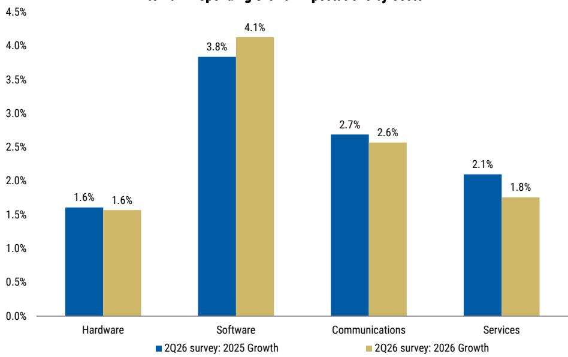  
Source: AlphaWise, MS. n=100 (US and EU data)  
2026 External IT Spending Growth Expectations by Sector

Exhibit 13: Sequentially, All IT Industries Saw Positive Revisions to 2026 IT Budget Growth Expectations QoQ (Except Services)

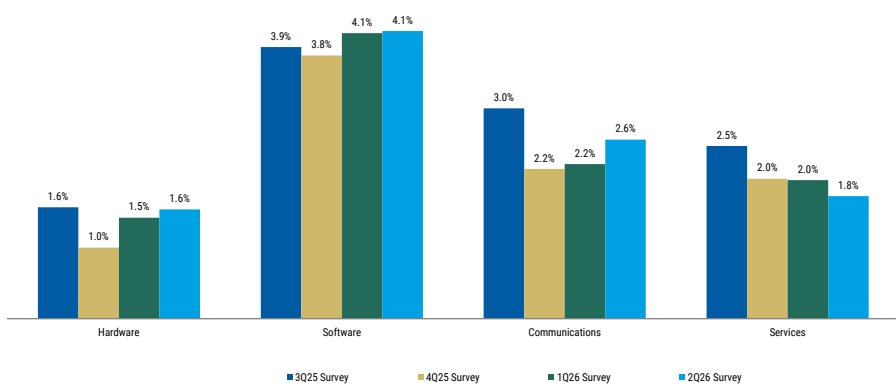  
Source: AlphaWise, MS. n=100 (US and EU data)

Exhibit 14: US IT Budget Growth Continues to Track Higher vs. EU Budget Growth,  
2026 vs. 2025
External IT Spending Growth Expectations by Region  
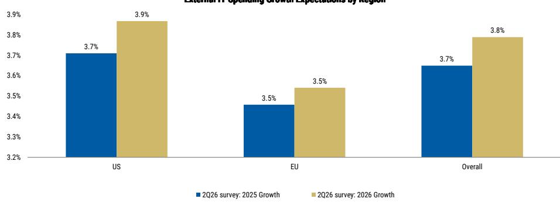  
Source: AlphaWise, MS. n=100 (US and EU data)

Exhibit 15: CIOs in the Business Services, Financials, and Healthcare Industries Expect the Highest IT Budget Growth in '26  
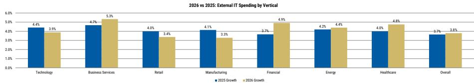  
Source: AlphaWise, MS. n=100 (US and EU data)

- CIOs continue to expect Software to remain the fastest growing IT industry in 2026, though sequential improvement was muted. CIOs expect Software spending to grow +4.1% in 2026, up +29 bps YoY from 2025, followed by Communications (+2.6%), IT Services (+1.8%), and Hardware (+1.6%), Exhibit 4; Sequentially, expectations for 2026 budget growth were revised higher across all industries except Services, most notably Communications (+35 bps QoQ) and Hardware (+12 bps QoQ), while Software was effectively flat (+3 bps QoQ) and IT Services deteriorated (-23 bps QoQ). Net, Software remains the best industry-level read, though we still lack evidence of a material sequential inflection in Software budgets.

- Regionally, US-based CIOs continue to have more robust IT budget growth expectations relative to their European counterparts, Exhibit 14. US CIOs expect +3.9% IT budget growth in 2026, compared to +3.5% growth expectations from EU-based CIOs. This compares to 2025 growth expectations of +3.7% in the US and +3.5% in Europe, implying modest YoY acceleration in the US and a relatively stable EU spending backdrop.

- CIOs in the Business Services, Financials, and Healthcare industries lead all other verticals in terms of absolute IT spending growth expectations for 2026, Exhibit 15. Business Services screens highest at +5.3%, followed by Financials (+4.9%) and Healthcare (+4.8%). Notably, 2Q26 survey results point to the largest magnitude of YoY acceleration in Financials (+120 bps vs. 2025), Healthcare (+80 bps), and Business Services (+60 bps). In contrast, CIOs in Manufacturing, Retail, and Technology indicate expectations for IT spending growth to decelerate from 2025 to 2026, with Manufacturing seeing the largest decline (-80 bps YoY).

# 2026 Budget Revision Ratio Rising Above 1.0x Points To Constructive Near Term Outlook; Long-Term Trend Remains Durable

What are your expectations regarding potential future revisions to your current 2026 IT budget plans?

Exhibit 16: Up-to-Down Ratio Increased to 1.2x from 0.8x in 1Q26, Indicating that Upward Revisions to IT Budgets Are More Likely Near-Term; 30% of CIOs Expect Upward Revisions
