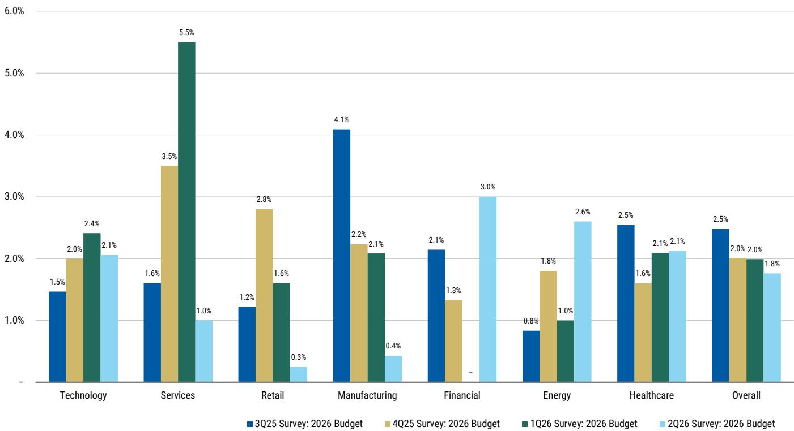
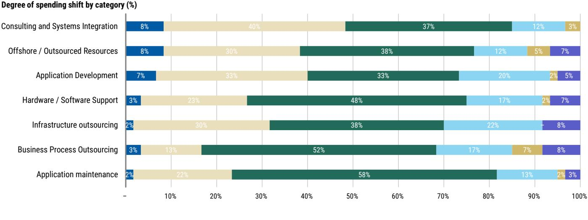
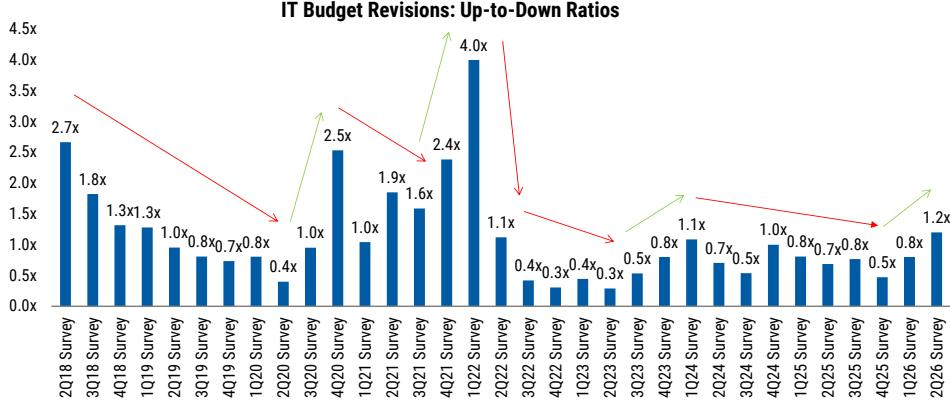

# IT预算正在改善，但支出增长集中在安全与少数AI领导者

2026年第二季度，企业技术支出出现了一个微妙但重要的转折点。自2024年初以来，首次有更多CIO预计未来十二个月其IT预算将上调而非下调。短期预算修订的上调与下调比率从第一季度的0.8倍升至1.2倍，30%的CIO预计预算增加，而25%预计削减。这一变化本身改变了关于IT需求的讨论。然而，整体改善掩盖了一个更复杂的现实：总体预算增长率3.8%仍低于4.1%的历史平均水平，且支出分布正变得更加集中，而非分散。

一项于2026年5月至6月间进行的大型CIO调查数据显示，广泛IT乐观情绪的时代尚未回归。回归的是一种更具辨别力、更具选择性的分配模式。软件仍是增长最快的类别，增长率为4.1%，但其环比动能基本持平。通信、硬件和服务预计均将同比减速。关于AI驱动技术支出繁荣的宏观叙事并不完整。现实情况是，预算蛋糕在适度扩大，但正以精准的方式被切割，青睐那些能够展示防御性、可衡量生产力影响或安全必要性的供应商和类别。

对于观察者而言，最重要的启示是，预算背景的改善并不意味着所有参与者都能受益。赢家将是少数，而该调查为识别这些赢家提供了一个清晰的框架。

## 安全软件是类别层面最清晰的赢家，因为它结合了加速支出、高优先级和较强的防御性

在所有IT类别中，安全软件独树一帜。CIO预计2026年安全支出将增长12.4%，较2025年的8.9%大幅加速，且环比上一季度跃升306个基点。没有其他主要类别显示出如此幅度的向上修正。调查确定了这一跃升背后的三个结构性驱动因素。首先，企业正在替换技术债务：遗留和脱离维护的基础设施会造成直接漏洞，而不断上升的内存成本正在提高新型防火墙设备的价格，迫使升级。其次，随着安全分析师面临不断升级的警报数量和日益增多的AI驱动攻击，自动化安全运营中心和SIEM投资正在增加。第三，大规模部署生成式AI应用正在创造企业无法忽视的新身份和数据安全需求。

防御性数据强化了这一前景。安全软件在调查中获得了最高的净防御性评分，为+15%，高于第一季度的+12%。当CIO被问及如果宏观环境恶化，他们会保护哪些项目时，安全位居首位。这不是一个周期性偏好；它反映了企业如何看待技术风险的结构性转变。安全不再是一个可以推迟的成本中心。它是运营韧性中不可协商的一层。对于观察者而言，这意味着即使更广泛的IT预算环境趋软，安全供应商也可能维持高于平均水平的增长。加速的支出意向、11.3%的高CIO优先级以及领先的防御性，这三者共同构成了需求可见性的罕见组合。

## 微软仍是单一供应商中最清晰的受益者，但其AI份额指标正从高位回落

微软继续在调查中占据主导地位，成为最有可能获得生成式AI支出增量份额的供应商。27%的CIO预计微软将在2026年获得最大的增量份额，30%预计在未来三年内如此。这两个数字较第一季度的32%均略有下降，但微软仍以较大优势领先。在一年展望中，紧随其后的供应商是LLM提供商，占11%，其次是Salesforce和亚马逊，各占8%。

调查为微软在多个AI用例中的定位提供了具体证据。对于代理自动化计划，36%的CIO预计将利用微软，低于第一季度的42%，但仍远高于第二名的8%。对于定制AI应用开发，微软目前是首选供应商，占47%，并预计在三年内以34%的比例保持领先。最具说服力的数据点可能是Microsoft 365 Copilot的采用轨迹：88%的CIO预计在未来十二个月内使用它，高于2025年第四季度的80%。

这种广泛的采用创造了一条超越Copilot本身的变现路径。CIO预计E5和E7 SKU的组合占比明年将达到71%，这表明微软正成功利用AI功能推动其安装基础中的高级别升级。AI特定份额指标的适度回落应被解读为在非凡增长后的正常化，而非疲软。微软的相对支出意向仍在加速，未来一年的增长预期从上次调查的7.3%升至7.6%。该公司正在整合软件支出，同时通过M365、Azure、GitHub、Fabric及其更广泛的企业分销网络实现生成式AI的变现。

## 应用软件前景依然复杂，尽管预算环境改善，选择性是相对少见可行的方法

整体预算数据的改善自然重新引发了人们对应用软件能否维持持久转折的关注。调查显示应保持谨慎。2026年软件支出预期环比仅上升3个基点，供应商层面的支出意向仍然高度分散。与2025年第四季度相比，只有两家受追踪的供应商——微软和ServiceNow——显示出未来一年增长预期的加速。Salesforce、Adobe、Workday和SAP均出现减速。

资金数据解释了原因。虽然AI支出看起来仍是增量而非替代性的，但净新增资金来源的份额从2025年第四季度的61%下降至54%。与此同时，现有IT预算内的重新分配从23%增加到32%，其中15%来自现有软件预算。这意味着，越来越多新的AI支出是通过削减其他软件类别来资助的。CIO们正在进行权衡，那些未能很好定位以参与生成式AI支出的现有应用供应商面临钱包份额风险。

LLM提供商被筛选为仅次于微软的第二大预期份额增长者，11%的CIO预计其在2026年获得增量份额，三年内为17%。这一定位环比保持稳定，但它强化了传统应用供应商面临的竞争压力。该调查不支持广泛的应用软件转折。它支持对在AI变现方面领先或在具有高防御性类别（如安全）中运营的供应商进行选择性关注。

## IT服务是相对少见环比减弱的类别，但AI驱动的外包可能创造复苏路径

服务类别因错误的原因而突出。它是相对少见一个2026年支出预期环比恶化的主要IT类别，增长率从第一季度的2.0%降至1.8%，低于2025年2.1%的增长率。调查表明，AI投资正在挤出可自由支配的服务项目。领导团队和董事会正优先考虑持续的AI开发而非更广泛的转型工作，这一转变正在压缩对传统咨询和外包的需求。

然而，调查也包含一个反向信号。59%的受访者预计生成式AI将增加传统IT外包支出，而19%预计会减少。这表明当前的疲软可能是暂时的。随着AI计划从实验阶段进入规模化生产，对系统集成、托管服务和大规模项目执行的需求可能会重新加速。问题在于时机。调查并未提供这种转折即将到来的证据。它确实表明，拥有规模、企业关系并参与大型转型项目的供应商，在复苏到来时处于最佳受益位置。目前，数据支持保持耐心。在对服务类别形成结构性积极看法之前，需要更明确的证据表明可自由支配需求正在加速。

## 识别2026年IT支出环境中赢家的决策框架

调查数据可以综合成一个实用框架，用于评估哪些公司可能从当前的预算环境中受益。该框架基于三个标准：支出加速、优先级排名和防御性。

第一个标准是该类别或供应商是否经历支出预期的加速。安全软件以306个基点的环比改善通过了这一测试。微软通过了，因为其相对增长预期正在上升。网络设备以35个基点的环比加速通过。应用软件总体上未通过，因为其环比动能持平。

第二个标准是优先级。调查直接询问CIO哪些项目将获得最大的支出增长。AI和机器学习以18.0%排名第一，安全软件以11.3%排名第二，数字化转型以10.0%排名第三。在此列表中排名靠前的类别更有可能获得增量预算分配。

第三个标准是防御性。调查通过询问CIO如果宏观环境恶化他们会保护哪些项目来衡量净防御性。安全软件以+15%领先。AI和机器学习，尽管是最高优先级，但净防御性仅为+4%，低于第一季度的+10%。优先级和防御性之间的这一差距至关重要。这意味着，虽然CIO打算投资AI，但他们对于哪些AI计划真正受到保护正变得更加挑剔。高优先级但低防御性的项目容易受到预算重新分配的影响。

应用此框架，最清晰的赢家是安全软件供应商，他们在所有三个标准上得分都很高。微软在支出加速和优先级上得分很高，但其与AI相关的防御性正在回落，这解释了某些份额指标的适度下降。LLM提供商在优先级和份额增长预期上得分良好，但尚未展示出使其成为共识赢家的支出加速或防御性。该框架也解释了为什么应用软件总体上仍然前景复杂：它在优先级上得分良好，但在支出加速和防御性上得分不佳。

对于观察者而言，这意味着科技领域的组合构建应倾向于安全敞口和精选的AI领导者，而非广泛的应用软件押注。预算环境正在改善，但这种改善并不均匀。赢家将是那些能够展示支出加速、高CIO优先级以及在做出权衡时保护其预算的防御性的供应商。

*仅供参考。部分内容可能基于源材料通过AI辅助生成、翻译、总结或编辑，可能存在遗漏或错误。请独立核实。这不构成专业建议。*

仅供参考。部分内容可能基于源材料通过AI辅助生成、翻译、总结或编辑，可能存在遗漏或错误。请独立核实。这不构成专业建议。

