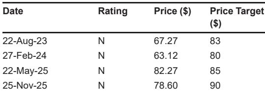

# Zoom Is No Longer Just a Meeting Company: Its Enterprise AI and Communications Stack Now Drives a $200 Million-Plus Acceleration Engine

The most telling number in Zoom’s recent CFO meeting is not the $500 million in Zoom Phone ARR or even the 10 million paid seats crossed in the third quarter of fiscal 2026. It is this: Zoom Customer Experience (ZCX) crossed $100 million in ARR roughly five quarters ago and has since accelerated into the higher end of double-digit growth, implying a business now north of $200 million in annual recurring revenue. For a company that the market still reflexively labels a pandemic-era video-conferencing play, that acceleration is a strategic signal. Zoom is building a second act that is structurally different from its first—and the financial architecture is shifting to match.

The reason this matters now is that the market has been slow to re-rate Zoom’s growth profile. The post-pandemic digestion period, which shrank the online base and compressed the company’s multiple, is largely complete. Management now describes the online customer base as fundamentally de-risked, with roughly 75% of online customers tenured 16 months or longer and the base tracking closer to flat. The company has simultaneously sharpened its enterprise strategy around two high-growth axes—Zoom Phone and ZCX—and is beginning to layer in a third, purely horizontal AI revenue stream that has not yet contributed to margins. The combination creates a multi-engine growth narrative that is analytically distinct from the old “meetings-only” Zoom, and the CFO’s recent commentary provides the clearest framework yet for understanding how those engines interact.

## Zoom Phone Has Crossed $750 Million in ARR through Sustained Share Gains Against Both On-Premise and Cloud Incumbents

The most mature of the new engines is Zoom Phone, and its trajectory is now substantial enough to demand its own analytical category. Management reiterated previously disclosed milestones—$500 million in ARR as of the second quarter of fiscal 2024, mid-teens year-over-year ARR growth for five consecutive quarters, and more than 10 million paid seats as of the third quarter of fiscal 2026. Simple arithmetic suggests that at mid-teens growth for more than a year off a $500 million base, Zoom Phone is today generating roughly $750 million to $800 million in ARR. That is not a side product. It is a core business line that alone would rank as a sizable enterprise communications company.

The growth is coming from share gains, not market tailwinds, and the competitive dynamic is instructive. Management specifically cited displacement wins against RingCentral and 8x8, with top deals split roughly evenly between on-premise system replacements and cloud-to-cloud migrations. The total addressable market is approximately 280 million seats, roughly half on-premise and half cloud. That means Zoom Phone is still early in the penetration cycle even for the cloud segment, and the on-premise installed base represents a multi-year replacement opportunity that is largely independent of macroeconomic cycles. Pricing tiers range from roughly $6 to $7 per seat at the low end to $16 to $17 at the high end, giving the company room to move up-market without abandoning the SMB base that remains the foundation of its online business. The key insight is that Zoom Phone is not just a feature extension of the core meeting product. It is a standalone platform sale that often serves as the entry point for broader enterprise relationships.

## ZCX Has Accelerated for Two Consecutive Quarters Because the One-Platform Handoff between Virtual and Human Agents Creates a Differentiation That Competitors Cannot Replicate

If Zoom Phone is the volume engine, ZCX is the value engine—and its acceleration is the most underappreciated development in the company’s recent performance. Management sharpened the long-standing “high double-digit growth” characterization, specifying that growth is now at the higher end of that range and has accelerated in each of the last two quarters. The catalyst is portfolio expansion, most notably the addition of Zoom Virtual Agent (ZVA) voice capabilities in the third quarter of fiscal 2026. That may sound like a product update, but the strategic logic runs deeper.

The differentiation rests on what management describes as the one-platform handoff between virtual agents, human agents, and the broader Zoom estate. In practice, this means a customer interaction can start with an AI-powered virtual agent, escalate seamlessly to a human agent who has full context from the AI interaction, and then—if necessary—pull in collaboration tools, document sharing, or even a video meeting, all within the same platform and without data loss. Competitors in the contact center space typically offer point solutions for AI agents or human agent desktops, but they lack the native integration with a unified communications platform. The handoff is the moat. The data also supports the thesis: nine of the top ten ZCX deals in recent quarters were competitive displacements, and nine of those ten attached paid AI capabilities. Pricing is migrating toward consumption-based models and, prospectively, outcome-based constructs, which aligns the vendor’s revenue growth directly with customer value realization.

## The Online Base Is Fundamentally De-Risked, and Two New AI Products Give Zoom Its First-Ever Path to Monetizing the Free Tier

For all the focus on enterprise expansion, the online business remains the foundation of Zoom’s scale—and it is now more stable than at any point since the pandemic unwind. Approximately 75% of online customers have been on the platform for 16 months or longer, and the base is tracking close to flat after years of contraction. That stability matters because it allows management to shift focus from retention to expansion, and two new product launches provide the mechanism.

My Notes, priced at roughly $10 per month, is a personal AI note-taker that works across Zoom meetings, third-party platforms, and in-person meetings. It is notable for a reason that goes beyond the feature set: it is the first product Zoom has ever been able to offer into the free user base. The free tier remains time-limited for meetings, but My Notes creates a monetization path for users who may never pay for a meeting license. Zoom Mate, priced at roughly $20 per month with a consumptive burn-down of included units, is the horizontal paid AI SKU built on enterprise search, workflow orchestration, and content creation. Both products launched within the last one to two quarters, so attach rates are not yet measurable, but the strategic direction is clear. Zoom is building an AI overlay that can be sold independently of the core meeting product, to both paid and free users, and that creates a new revenue layer that does not depend on seat count growth.

## The Long-Term Gross Margin Target of 80% Remains Intact, and the Monetization Ramp for Horizontal AI Will Be Margin-Accretive

The margin story is where the CFO’s commentary provides the most important clarification for observers. Management acknowledged that the legacy 33% to 36% operating margin target range is “a bit stale” and was constructed to preserve acquisition capacity. The explicit message was that margins would not be taken toward that zone absent a serious inflection in revenue beyond what the company has seen. Instead, the fiscal 2027 operating margin guide is the more relevant reference point for where the company expects to operate.

Gross margins remain the structural strength. Management reiterated confidence in the 79% to 80% target, supported by a federated AI model that leverages internal small language models for dominant use cases such as automatic speech recognition, balanced against external models from Anthropic and OpenAI for cost and quality optimization. The core meeting stack continues to yield incremental efficiency gains. The critical point is that margins have been held while AI has been monetized only indirectly—through attach rates in ZCX and the core product—and the third piece, the horizontal paid AI products, has not yet contributed. As those products ramp, they will be margin-accretive by design, because the incremental revenue carries minimal cost of goods sold beyond inference compute. The margin trajectory therefore has built-in upside that is not yet reflected in current financials.

## A Decision Framework for Observers: Three Questions to Determine Whether Zoom’s Multi-Engine Thesis Is Delivering

The CFO meeting provides enough granularity to construct a structured decision framework for evaluating Zoom’s progress over the next four to six quarters. Observers should track three sequential tests.

First, does Zoom Phone sustain mid-teens ARR growth as it approaches $1 billion in scale? The market is roughly 280 million seats, half of which remain on-premise, so the raw opportunity is large enough to support the trajectory. The risk is that the low-hanging fruit of early adopters is exhausted and the remaining on-premise conversions prove slower and more expensive. The signal to watch is whether competitive displacement wins continue to split evenly between on-premise and cloud takeouts, or whether the mix shifts meaningfully toward one category.

Second, does ZCX acceleration persist as the base grows? The business crossed $200 million in ARR with accelerating growth, but the law of large numbers will eventually apply. The key variable is whether the one-platform handoff differentiation holds as competitors add AI agent capabilities of their own. If ZCX can maintain high double-digit growth for another three to four quarters, it will validate the thesis that the platform integration—not just the AI feature set—is the durable advantage.

Third, do My Notes and Zoom Mate show measurable attach rates within the next two quarters? Management was appropriately cautious, stating that the products are too new to quantify. But the strategic logic of selling AI into the free base is powerful, and early adoption data will be the first real test of whether Zoom can expand its total addressable revenue without expanding its meeting license base. If attach rates are material, the online segment could shift from a flat base to a growth contributor, which would fundamentally change the revenue mix and margin profile.

These three questions are not speculative. They are directly derivable from the data and strategy outlined in the CFO meeting, and they provide a clear set of milestones for evaluating whether Zoom’s second act is on track. The company has moved beyond the narrative of post-pandemic recovery. It is now a multi-product enterprise communications and AI platform with a de-risked base, accelerating high-value segments, and a margin structure that has room to improve. The market’s next job is to watch the signals.

*For informational purposes only. Portions may be generated, translated, summarized, or edited with AI assistance based on source materials and may contain omissions or errors. Please verify independently. This is not professional advice.*

For informational purposes only. Portions may be generated, translated, summarized, or edited with AI assistance based on source materials and may contain omissions or errors. Please verify independently. This is not professional advice.

