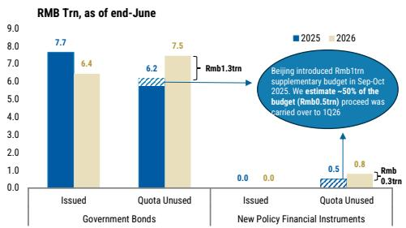
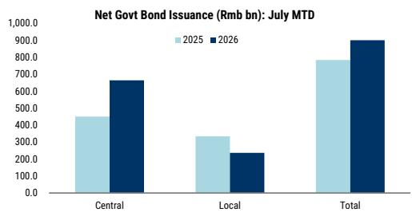

# 宏观环境观察：信用扩张的结构性分化

中国6月社会融资规模同比增长7.5%，低于5月的7.8%和市场预期的7.6%。这一变化并非短期波动，而是结构性趋势的延续，反映出经济运行中的一种深层特征：私人部门正在主动调整杠杆，而公共融资尚未以足够快的速度填补缺口以稳定总需求。6月的数据组合——基础设施投资偏弱、零售销售平淡、房地产交易再度走软——表明信用增速放缓是结果而非原因。原因在于家庭和企业部门的终端需求不足。

市场参与者关注的核心问题并非政策是否会回应。政策已经在行动。本月至今，政府债券净发行额已达9020亿元人民币，超过了6月全月约7700亿元的水平，也高于去年同期。中央政府债券发行是这一加速的主要推动力，而地方政府债券发行仍显缓慢。政策方向是明确的。7月政治局会议预计将优先加快预算执行，高层也已呼吁加强逆周期调节。但真正的问题是，公共信用能否持续弥补私人部门的疲软，以及这对资产配置、行业选择和久期策略意味着什么。

本文认为，即将到来的财政加速将在2025年下半年推动整体信用增速提升40-50个基点，但这种机械性的改善掩盖了更深层次的结构性分化。市场参与者不应将温和的信用反弹视为广泛经济再通胀的信号。相反，应当为一个双轨信用体系做好准备：一方面是政府主导的基础设施和人工智能-能源投资，另一方面是私人部门的持续收缩。策略上的启示是，对中国国内经济的整体性敞口仍将面临挑战，而对财政受益领域和出口导向板块的针对性敞口则值得关注。

## 6月信用数据确认：私人部门去杠杆已成为结构性约束，而非周期性暂停

6月7.5%的信用增速是一系列放缓数据中最弱的一次。要理解其重要性，必须超越总量看结构。放缓是广泛的，但主要驱动因素是私人部门信用需求的持续疲软。家庭没有在借贷购房或消费。企业，尤其是房地产和下游制造业领域的企业，正在减少杠杆而非扩张。这不是流动性约束。银行体系存款充裕，银行间利率保持低位。约束在借款方：家庭对收入前景缺乏信心，企业对需求可见性缺乏信心。

这一模式与6月经济活动数据一致。尽管政策表态积极，基础设施投资仍显疲弱。零售销售因消费者情绪进一步走弱而放缓。房地产销售在年初出现初步稳定迹象后再度下滑。信用数据在这里并非领先指标——它是对实体经济已发出的信号的同步确认。私人部门主体不借款并非因为银行不愿放贷，而是因为他们看不到资金的有效用途。

对市场参与者而言，这意味着信用总量的任何回升将几乎完全由公共部门驱动。私人信用不会自我修正，除非家庭收入预期或企业利润率出现显著改善。当前数据中这两者均不可见。这意味着，即使信用增长的数量可能在年内晚些时候改善，其质量正在恶化。

## 财政加速已经开始，但其构成揭示了向中央政府主导的战略转变

本月至今，政府债券净发行额已达9020亿元人民币，超过了6月约7700亿元的总量以及去年同期水平。这是市场正在关注的积极信号。然而，这一加速的构成比总量速度更为重要。关键驱动因素是中央政府债券融资的加快。地方政府债券发行仍然缓慢。

这并非偶然。它反映了深思熟虑的政策选择。中央政府正在承担更直接的财政责任，绕开受债务可持续性、土地出让收入下降以及避免新增隐性债务压力约束的地方政府。结果是，财政加速更加可控、更具针对性，更可能流向特定的优先领域：人工智能基础设施、能源转型和战略供应链投资。

下半年展望强化了这一解读。预计北京将加快预算内政府债券发行，以缓冲二季度GDP同比增长4.3%低于目标后的增长压力。7月政治局会议可能聚焦于加快这些特定基础设施类别的预算执行。这不是广泛的刺激。这是将财政资源精准部署到与政府长期产业政策目标一致的领域。

对市场参与者而言，这意味着财政乘数将是不均衡的。与中央政府基础设施支出相关的行业——电力设备、电网基础设施、人工智能数据中心、半导体制造——将获得直接的需求支持。依赖地方政府支出或一般建筑活动的行业将不会同等受益。中央与地方财政动态之间的分化将成为下半年企业盈利的关键区分因素。

## 更快的公共融资可在下半年推动整体信用增速提升40-50个基点，但这种机械性改善将掩盖私人部门的持续疲软

报告估计，更快的公共融资可在2025年下半年推动整体信用同比增速提升40-50个基点。这是一个有意义的机械效应。如果信用增速从7.5%回升至年底约8.0%，许多市场参与者会将其解读为企稳信号。这种解读将是不完整的。

计算逻辑很简单。政府债券发行是社会融资总量的直接组成部分。如果发行加速，基数效应会推高同比比较。但私人信用的潜在流动——银行对家庭和企业的贷款、企业债券发行、影子银行活动——仍将疲弱。40-50个基点的提升完全归因于公共部门借款。私人部门对信用增长的贡献将继续下降。

这造成了一个危险的叙事陷阱。第四季度整体信用的回升可能被误认为是经济活动的广泛改善。事实并非如此。这是财政前置的统计产物。那些从总量数据外推至实体经济的市场参与者，将在消费、房地产和私人投资未能同步复苏时感到失望。

策略上的启示是，信用数据必须进行分解。市场参与者应追踪政府债券发行占社会融资总额的比例、家庭贷款增长率以及国有企业之外的企业债券发行轨迹。只有通过观察这些子成分，才能评估经济是否真正在再通胀，还是仅仅被公共部门资产负债表扩张所支撑。

## 市场参与者的决策框架：区分真正再通胀与财政支撑的三个指标

鉴于公共与私人信用之间的结构性分化，市场参与者需要一个决策框架来解读新数据并相应调整布局。以下三个指标提供了一种系统化的方法。

首先，监测家庭贷款增长的轨迹。如果家庭借款——尤其是与抵押贷款相关的中长期贷款——停止下降并开始企稳，那将是真正需求复苏的最早信号。消费者信心是瓶颈。没有家庭的参与，任何信用扩张都是头重脚轻且不可持续的。6月数据显示没有这种拐点的迹象。市场参与者应将家庭贷款的任何企稳视为更广泛再通胀叙事的必要条件。

其次，追踪中央政府债券回报表现与地方政府融资平台债券回报表现之间的利差。如果利差收窄，表明市场正在定价更高的财政可信度和更低的地方政府实体违约风险。如果利差扩大，表明中央与地方财政分化正在加剧，地方政府信用压力上升。当前数据支持后一种解读。地方政府债券发行缓慢正是由于这些约束。

第三，观察信用增长与非财政领域工业生产之间的相关性。如果信用加速但消费品、房地产和私人制造业的工业生产持平或下降，则财政乘数并未传导至更广泛的经济。这是与当前数据最一致的情景。市场参与者应为这种体制的延续做好准备，直到相关性被打破。

这一框架得出了一个清晰的策略结论：关注中央政府基础设施支出的直接受益领域，以及依赖家庭资产负债表扩张或地方政府采购的领域。财政加速将创造赢家，但它们将是集中且狭窄的。

## 二阶影响：中国货币政策传导机制正在变化——市场参与者必须相应调整久期和行业布局

从私人主导转向公共主导的信用增长，对货币政策如何传导至实体经济具有深远影响。在传统的信用周期中，较低的利率刺激私人借款，进而推动投资和消费。在当前的中国背景下，较低的利率并未刺激私人借款，因为约束不是信用成本，而是承担信用的意愿。传导机制在家庭和企业层面已经断裂。

这意味着进一步的货币宽松——降息、降准——的边际回报将递减。边际借款人是政府，而非私人部门。而政府的借款对利率的敏感度不同。财政政策，而非货币政策，现在是主要的传导渠道。预期降息将重振信用需求的市场参与者将会失望。政策组合正在从价格型工具转向数量型工具，以财政发行为主要杠杆。

久期影响是显著的。如果政府是边际借款人，那么政府债券的供给将增加，在其他条件不变的情况下，对长端回报表现构成上行压力。同时，风险规避的私人部门对安全资产的需求将使短端回报表现保持低位。回报表现曲线将陡峭化。市场参与者应为更陡峭的曲线布局，而非平行下移。

行业布局遵循同样的逻辑。对家庭抵押贷款和私人企业贷款敞口较大的金融机构将面临利差压缩和资产质量恶化。定位于为政府债券发行和基础设施融资提供中介服务的金融机构将受益。在工业领域，中央政府相关资本支出与私人部门资本支出之间的分化将是主导主题。市场参与者应青睐那些直接参与由中央政府债券融资的人工智能基础设施、电网现代化和能源转型项目的公司。

这不是一个周期性的判断。这是一个关于中国信用体系演变的结构性论点。6月数据是多个季度趋势中的最新数据点。下半年的财政加速将为总量数据提供暂时提振，但不会逆转根本动力。理解这一区别的市场参与者将能更好地应对数据所说与经济所做之间的分化。

仅供参考。部分内容可能基于源材料通过人工智能辅助生成、翻译、总结或编辑，可能存在遗漏或错误。请独立核实。本文不构成任何专业建议。

