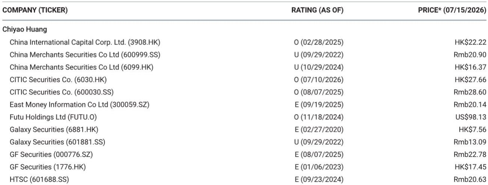
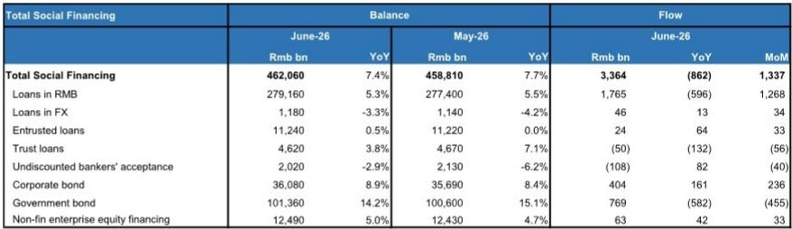
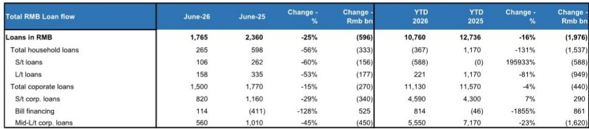

# MS：中国资金业，六月去杠杆持续，住户储蓄继续转移

六月社融增速降至7.4%，人民币贷款增速进一步仍在调整至5.3%。这份MS研报的核心判断并非信用调整，而是政策主动“去量求质”的延续。当新增企业中长期贷款同比下降23%、上半年住户贷款净减少3670亿元时，真正值得关注的不是总量，而是资金价格的变化——新发放企业贷款利率已降至约3%，新发放按揭利率约3.1%。报告认为，更慢的贷款增长反而可能有利于贷款和资金资产回报表现。

## 1. 住户部门仍在去杠杆，但节奏已从“骤降”转为“缓慢调整”

六月住户贷款环比回升，但同比仍下降56%。上半年整体住户贷款净减少3670亿元，而去年同期为净增加11700亿元。这个对比说明，居民端的信用调整不是短期波动，而是持续的结构性行为。住户存款增速也节奏变化至7.1%，非资金企业存款增速仍高达28.6%。报告没有给出居民何时重新加杠杆的预测，但数据暗示，居民更倾向于将新增收入转化为存款而非借贷，这一行为模式短期内不会逆转。

> **KC评论：** 住户贷款上半年净减少，意味着银行零售端面临的是“量价双压”——贷款规模下降，同时新发放利率也在节奏变化。但报告提醒，这种不确定性对银行并非完全谨慎，因为存款成本也在下降，净息差的走向取决于两端调整速度的差异。

## 2. 企业端“去内卷”落地：中小微贷款增长目标取消后的真实影响

五月政策取消普惠小微贷款增长目标，六月数据开始体现效果。企业中长期贷款上半年累计新增5.55万亿元，同比下降23%。短期贷款虽然总量增加，但六月单月同比也下降29%。报告认为，这反映了银行在减少窗口指导后的理性放贷行为——不再为了完成规模指标而压低利率、放松风控。新发放企业贷款利率约3%，较三月下降5个基点，降幅已明显收窄。如果贷款增速继续节奏变化，银行在定价上的议价权可能逐步恢复。

## 3. 政府债券仍是社融最大支撑，但节奏偏慢

六月政府债券净融资7690亿元，同比少增5820亿元。上半年政府债券发行进度仅完成全年额度的46%，而去年同期为55%。报告没有直接判断下半年是否会加速，但指出政府债券仍是社融最主要的增量来源。这意味着，如果下半年发行提速，社融增速可能阶段性企稳，但不会改变整体信用增长中枢下移的趋势。

## 4. M1增速回落背后的企业行为信号

六月M1同比增速从5.5%降至4.0%。报告拆解了两个原因：一是去年高基数，二是企业活期存款增速节奏变化至8.8%，而定期存款增速反而加快至2.9%。企业将活期转为定期，通常意味着研究意愿和支付意愿下降。这个细节比M1总量本身更能反映微观主体的预期——企业不是在“缺钱”，而是在“不想花”。

## 5. 一个可复用的观察框架：社融与GDP增速的缺口

报告明确提出，约6%的社融增速是更可持续的中期水平。当前7.4%的增速仍高于名义GDP增速，但缺口在收窄。这个框架的价值在于：不把社融增速下降视为谨慎信号，而是看作资金体系从“规模扩张”转向“效率提升”的必要过程。当社融增速与GDP增速趋于一致时，意味着每一单位信用创造都能产生对应的实际产出，而非沉淀在空转或低效研究中。

> **KC评论：** 这个框架对银行股和资金债的读者尤其重要。过去几年，市场习惯用“社融增速高=宏观环境好=银行股好”的线性逻辑。但报告暗示，未来更值得跟踪的是“社融增速与GDP增速的差距”——缺口越小，银行资产质量越扎实，定价权越强。

For informational purposes only. Portions may be generated,translated,summarized,or edited with AI assistance based on source materials and may contain omissions or errors. Please verify independently. This is not investment,legal,tax,accounting,or other professional advice.

For informational purposes only. Portions may be generated,translated,summarized,or edited with AI assistance based on source materials and may contain omissions or errors. Please verify independently. This is not investment,legal,tax,accounting,or other professional advice.

