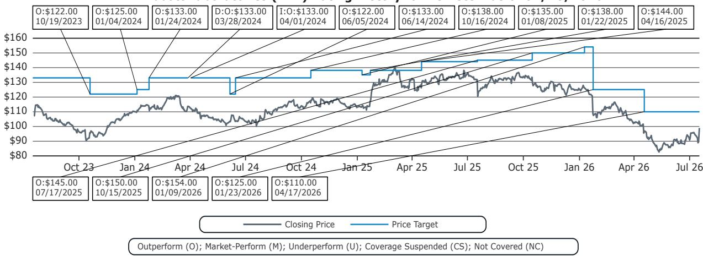
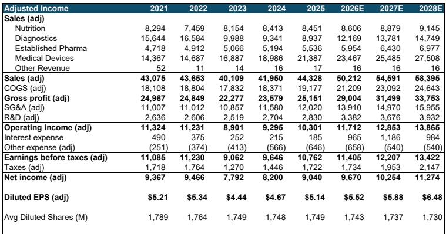
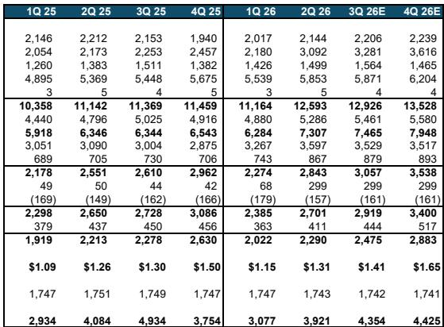

# Abbott季度表现打破行业放缓叙事——但真正的战略问题是哪些增长动力将支撑下半年加速

当HCA提前发布第二季度业绩，显示同院住院手术量下降2.3%、门诊手术量下降3.4%时，医疗科技公司报价在单日内下跌3%至7%。市场将这一数据解读为，因ACA参保人数下降和Medicaid削减导致的利用率放缓的前兆。48小时内，Abbott Laboratories公布第二季度调整后每股收益1.31美元，比共识高出3美分，并将全年每股收益指引上调4.5美分。更重要的是，首席执行官Robert Ford将手术量担忧描述为基于对医疗科技需求驱动因素的“错误假设”。公司报价随之回升。这一事件揭示的深度远超季度表现：Abbott的商业模式在结构上不受主导医院收益的保险周期风险影响，且公司现在拥有一个具体的四支柱路线图，旨在将有机增长从第二季度的4.8%加速至下半年的约8.7%。

医院与医疗科技基本面之间的分化并非暂时现象。这是一种结构性特征，市场参与者此前系统性地对其定价有误。Abbott的第二季度结果提供了证据，而公司明确的下半年加速计划则提供了可检验的预测。

## Medicare而非Medicaid驱动医疗科技手术量，使保险参保担忧对器械公司而言成为方向错误的关注点

市场在HCA提前发布后的恐慌假设了一个直接传导机制：ACA参保人数下降和Medicaid退出减少医院手术量，进而减少对医疗设备的需求。Abbott管理层基于支付方组合和需求缺乏弹性这两个具体论点，挑战了该链条中的第二个环节。

首先，Abbott披露其美国心血管业务的三分之二来自Medicare，而非Medicaid或ACA交易所计划。Medicare的参保不受相同的退出动态影响。Medicare增长的人口驱动因素——婴儿潮一代的老龄化——是固定且可预测的。Medicaid和ACA参保波动影响医院的收入组合和未补偿护理成本，但不会实质性地改变构成Abbott器械收入核心的高急性度心血管手术量。

其次，管理层认为，对挽救生命的急性护理产品的需求高度缺乏弹性。患有严重慢性病（糖尿病、心血管疾病、癌症）的患者不会因保险状态变化而放弃治疗。美国医疗系统无论保险覆盖情况如何都会治疗这些患者，这就是为什么Abbott在ACA和Medicaid扩张时未看到需求激增，现在也未看到需求下降。这并非理论立场。Abbott的诊断业务（公司将其定位为手术需求的前瞻性晴雨表）第二季度医院实验室试剂和仪器增长了13%，包括在ACA退出率最高的州。

对观察者的启示很明确：医院利用率数据是医疗科技需求的一个误导性代理指标。这两个行业服务于不同的支付方基础，面临不同的需求弹性。对Medicare和慢性病手术有高敞口的医疗科技公司，应基于自身的手术量趋势进行评估，而非基于汇总了保险周期噪音的医院层面指标。

## 四个具体业务贡献下半年增长加速的80%，且每个都有可验证的催化剂

Abbott第二季度可比增长从第一季度的3.7%加速至4.8%。管理层预计下半年将进一步加速至约8.7%，首席执行官Robert Ford明确指出，这一轨迹变化的80%来自四个业务：营养、电生理、核心实验室和癌症诊断。每个业务板块在下半年都拥有可衡量的催化剂。

营养业务略超内部预期，受定价、新产品发布和商业执行的推动。这是最直接的复苏故事：该板块第二季度下降3.6%，但比共识高出0.9%，管理层看到因2022年工厂关闭而受扰的婴儿配方和成人营养业务的势头正在加速。

电生理是增长最快的器械业务，第二季度可比增长13.4%，较第一季度的12.5%有所加速。催化剂是5月在美国推出的Volt 2.0脉冲场消融导管，该产品正从有限市场发布过渡到第三季度的全面市场发布。Abbott还预计在未来12个月内获得TactiFlex Duo导管和Amulet 360左心耳封堵装置的FDA批准。关键在于，管理层的策略不依赖于任何单一导管。Abbott正在销售整个电生理手术流程——标测系统、诊断导管、心腔内超声、导引器——以将自己定位为端到端解决方案提供商。这种捆绑策略为医院创造了转换成本，并降低了单一竞争产品侵蚀Abbott份额的风险。

核心实验室诊断业务受益于中国集中采购逆风的逐步正常化。由于集采定价削减，Abbott的中国诊断业务此前连续五个季度每季度下降约30%。这一降幅现在正在收窄至中个位数，这使得全球核心实验室业务的其他部分（持续表现良好甚至加速）能够压倒中国的拖累。美国核心实验室业务第二季度增长7.5%，其中医院实验室子板块增长13%。

癌症诊断业务由超出预期的Cologuard新用户推动，这得益于识别逾期未进行结直肠癌筛查患者的护理缺口项目。这是一个由量驱动的增长故事，不依赖于定价或从竞争对手处获取市场份额；它依赖于筛查渗透率，而美国符合条件的人群中该比例仍低于70%。

将这四种催化剂整合为一个下半年加速主张是可检验的。每个都有可衡量的领先指标：营养定价和市场份额、电生理导管采用率、核心实验室中国收入轨迹以及Cologuard筛查量。如果这四个中的任何一个表现不佳，8.7%的增长预测将面临风险。但这一主张的具体性本身就有价值：它允许观察者实时追踪加速情况，而非依赖模糊的“信心”叙事。

## 业绩超预期由毛利率扩张驱动，而非收入惊喜，表明超越营收增长的运营纪律

相对于共识的3美分每股收益超预期，主要由50个基点的毛利率超预期表现驱动，调整后毛利率达到58.0%。收入仅比共识高出0.4%。这一构成很重要，因为它表明Abbott的盈利能力正通过组合和运营执行得到改善，而非通过不可持续的定价或一次性项目。

毛利率改善是广泛的。它反映了传统Abbott产品组合内有利的业务组合——高利润率器械和诊断增长超过低利润率营养和呼吸诊断——以及Exact Sciences收购的贡献，后者增加了高利润率的癌症筛查收入。调整后营业利润率22.6%，比共识高出约30个基点，公司FY26每股收益指引中点为5.52美元，意味着全年营业利润率从FY25的23.2%上升至24.0%。

利润率轨迹很重要，因为它提供了独立于收入加速的第二个盈利增长向量。即使下半年收入加速略低于8.7%的目标，来自组合和成本纪律的利润率扩张仍可带来每股收益的上行空间。FY26指引中点上调4.5美分，加上第二季度3美分的超预期，表明管理层认为有足够的运营杠杆来吸收任何小幅收入缺口。

## 结构性心脏仍是相对少见明显弱点，但复苏时间表明确且可控

结构性心脏业务第二季度可比销售额下降5.7%，比共识低2.7%。管理层将表现不佳归因于美国二尖瓣领域的竞争强度，而非定价或产品质量。首席执行官Robert Ford表示，问题在于商业执行：“这不是价格问题，也不是产品问题。这实际上是我们如何思考在二尖瓣领域竞争的问题，特别是在美国。”

复苏时间表是明确的。管理层预计结构性心脏业务将在2026年底前恢复到中个位数至高个位数增长，这意味着未来两个季度将逐步改善。这是一个比观察者可能希望的更慢的复苏，但它是有边界且透明的。风险在于二尖瓣领域的竞争压力进一步加剧，将复苏推迟到2027年。但结构性心脏仅占医疗设备总收入的约10%，因此即使该板块长期疲软，也不会影响公司整体轨迹。

更重要的观察是，Abbott的管理层愿意坦诚面对已知的弱点。这与行业惯例——提供模糊的“我们预计会改善”指引——形成对比。结构性心脏复苏时间表的具体性，使观察者能够精确地模拟下行情景。

## 评估Abbott下半年论点的决策框架

对于评估Abbott下半年加速是真实还是愿景的观察者，以下框架将四支柱增长故事转化为可观察的指标。

首先，追踪营养收入月度环比增长。该板块第二季度下降3.6%，但管理层表示其表现略超预期。如果营养业务在第三季度转正，则加速的第一个支柱得到确认。如果仍为负值，则8.7%的增长预测面临风险。

其次，监测电生理市场份额数据。Abbott的电生理策略依赖于销售完整手术流程，而不仅仅是导管。相关指标不仅是Volt 2.0的采用率，而是Abbott电生理总收入相对于市场的增长率。如果Abbott的电生理增长超过市场（市场增长率在低两位数），则份额收复叙事正在奏效。

第三，关注中国核心实验室收入。中国集采逆风正从下降30%收窄至下降中个位数。每个季度的收窄为诊断总增长贡献约1至2个百分点。如果中国降幅比预期更快稳定，核心实验室的加速将大于预测。

第四，追踪Cologuard筛查量。Abbott不披露月度Cologuard量，但公司与支付方和雇主的护理缺口项目合作是主要驱动力。任何来自支付方合作伙伴关于筛查项目扩张或收缩的公开评论，都将是一个领先指标。

该框架并非对结果的保证。它是一个识别四个支柱中哪些在交付、哪些在落后的结构，早于公司公布第三季度收益。

*仅供参考。部分内容可能基于源材料通过AI辅助生成、翻译、总结或编辑，可能存在遗漏或错误。请独立核实。这不构成研究、法律、税务、会计或其他专业建议。*

仅供参考。部分内容可能基于源材料通过AI辅助生成、翻译、总结或编辑，可能存在遗漏或错误。请独立核实。这不构成研究、法律、税务、会计或其他专业建议。

