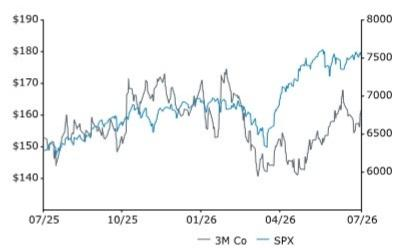
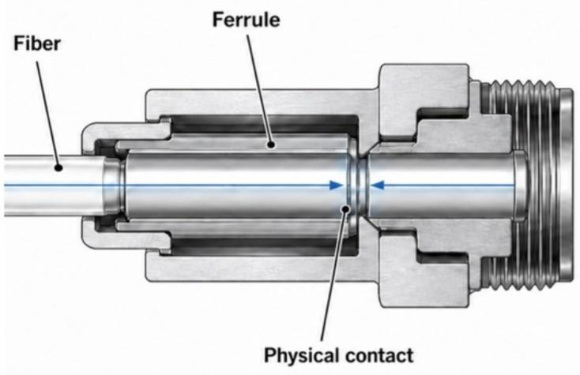

# 3M: Is the R&D engine re-igniting? Thoughts on the EBO partnership with Microsoft for data center connectivity.

3M recently announced a strategic partnership with Microsoft centered around Expanded Beam Optical (EBO) technology - 3M's non-contact optical fiber connectivity technology for next-generation AI data centers. At its core, EBO addresses a key operational challenge in optical fiber connectivity: contamination from dust particles. Unlike traditional Multi-fiber Push On (MPO) connectors (which rely on physical fiber-to-fiber contact and require regular inspection and cleaning procedures), EBO uses a lens array to expand and refocus light across an air gap. The result is a connector that is inherently more tolerant to dust and contamination, while materially reducing installation complexity and deployment timelines. According to 3M, installation times can be reduced from roughly three minutes (for a traditional MPO) to thirty seconds per connection (for EBO). There is some strategic significance beyond the Microsoft partnership. Generally, successful technology adoption begets more adoption, and validation by one large hyperscaler often accelerates broader industry uptake. We think Microsoft's endorsement serves as an important signal to other hyperscalers evaluating EBO optical fiber connectivity architectures for increasingly dense AI clusters, where reliability, deployment speed, and operational efficiency are critical design considerations. From a competitive standpoint, 3M appears reasonably well-positioned. With patent protection extending until at least 2041, participation in the broader EBO ecosystem through the Multi-Source Agreement, an early manufacturing lead, and the absence of credible hyperscaler-scale competitive offerings collectively strengthen the company's position. While important questions remain around monetization, pricing durability, and the potential emergence of alternative standards, we believe the announcement (link) represents a meaningful milestone in the commercialization journey of EBO.

For our own thesis on 3M, where we have highlighted the company's R&D trajectory as a factor in our growth outlook, we see the partnership as an encouraging move in the right direction.

We maintain our view on MMM with a reference price of \$131. We continue to monitor longer-term developments around R&D and PFAS. However, we do acknowledge that this partnership indicates 3M is making progress in the right direction on R&D.

## Key Observations

<table><tr><td>Close Date</td><td></td><td></td><td colspan="2">16 Jul 2026</td></tr><tr><td>MMM Close Price (USD)</td><td></td><td></td><td colspan="2">161.77</td></tr><tr><td>Reference Price (USD)</td><td></td><td></td><td colspan="2">131.00</td></tr><tr><td>Upside/(Downside)</td><td></td><td></td><td colspan="2">(19)%</td></tr><tr><td>52-Week Range</td><td></td><td></td><td colspan="2">177.41/139.34</td></tr><tr><td>SPX</td><td></td><td></td><td colspan="2">7,533.77</td></tr><tr><td>FYE</td><td></td><td></td><td colspan="2">Dec</td></tr><tr><td>Div Yield</td><td></td><td></td><td colspan="2">1.9%</td></tr><tr><td>Market Cap (USD) (M)</td><td></td><td></td><td colspan="2">84,374</td></tr><tr><td>EV (USD) (M)</td><td></td><td></td><td colspan="2">93,401</td></tr><tr><td>Performance</td><td>YTD</td><td>1M</td><td>6M</td><td>12M</td></tr><tr><td>Absolute (%)</td><td>1.0</td><td>1.6</td><td>(3.6)</td><td>1.7</td></tr><tr><td>SPX (%)</td><td>10.1</td><td>0.3</td><td>8.6</td><td>20.3</td></tr><tr><td>Relative (%)</td><td>(9.0)</td><td>1.3</td><td>(12.1)</td><td>(18.6)</td></tr><tr><td colspan="5">Source: Bloomberg, Bernstein estimates and analysis.</td></tr></table>

Price Performance, 1YR

<table><tr><td>Adjusted EPS</td><td>F25A</td><td>F26E</td><td>F27E</td><td>Financials</td><td>F25A</td><td>F26E</td><td>F27E</td><td>CAGR</td><td>Valuation Metrics</td><td>F25A</td><td>F26E</td><td>F27E</td></tr><tr><td>MMM (USD)</td><td>8.06</td><td>8.53</td><td>9.32</td><td>Revenues (M)</td><td>24,948</td><td>24,951</td><td>25,641</td><td>--</td><td>Adjusted P/E (x)</td><td>20.1</td><td>19.0</td><td>17.4</td></tr></table>

Source: Bloomberg, Bernstein estimates and analysis.

## DETAILS

Optical fiber cables are the circulatory system of modern data centers. Rather than transmitting electrical signals through copper wires, they carry information as pulses of light, enabling high bandwidth, low latency, and efficient transmission across the entire data center ecosystem. As AI rack densities continue to increase, the volume of data moving between GPUs, switches, and servers has increased exponentially, making optical fiber the preferred medium for high-performance networking and data transfer. In simple terms, the primary function of optical fiber is to move data quickly, reliably, and with minimal signal loss between servers, racks, rows and buildings, allowing thousands of servers to operate as a single coordinated system. In hyperscaler and AI-focused data centers, network performance is increasingly becoming as important as compute performance itself.

However, optical fibers are only useful if they can be efficiently connected together throughout the network. This is where optical fiber connectors come into play. Connectors are the physical interfaces that join one optical fiber to another, creating the data pathways that link servers, switches, storage systems, and networking equipment across a data center. Because light must pass from one fiber into the next with very high precision, connector quality directly impacts network reliability and performance. Traditional connector designs (called Multi-fiber Push On or MPO) rely on physical fiber-to-fiber contact, which makes them highly sensitive to contamination and handling.

## What is the Expanded Beam Optical (EBO) technology?

The fundamental innovation behind EBO is the elimination of physical contact between optical fibers. Traditional MPO connectors require fiber ends to be pressed together, making performance highly sensitive to contamination and creating a mandatory inspection-and-cleaning workflow prior to deployment. Even a micro-thickness dust particle can cause contamination that causes link failure. EBO replaces this architecture with a proprietary lens array that expands the optical beam significantly (to the order of ~150x) through a lens array before transmitting it across an air gap and refocusing it into the receiving fiber. By removing physical contact from the connection process altogether, EBO materially improves dust tolerance while simplifying installation procedures. 3M received a patent for EBO technology in Jan 2025, with an expiration through at least August 2041.

## Advantages of EBO over Traditional MPO

The practical benefits of EBO become apparent when compared directly against traditional MPO connectors. The non-contact design materially reduces contamination sensitivity, removes inspection requirements, minimizes cleaning procedures, and shortens installation times by ~85% (according to a 3M whitepaper explaining deployment at a hyperscaler facility in the United States). Beyond the obvious labor savings, these improvements have meaningful implications for large-scale data center construction where thousands of optical fiber connections must be deployed and maintained.

## Overview of 3M and Microsoft strategic partnership

In our view, the partnership creates clear value for both parties. For Microsoft, EBO offers lower installation costs, improved reliability in increasingly dense AI architectures, and faster deployment timelines that can accelerate the monetization of data center investments. Given the scale of hyperscaler capital expenditures, even modest improvements in deployment efficiency can translate into sizable economic benefits. For 3M, the value proposition is validation. Microsoft's adoption provides the first hyperscaler-scale validation of EBO, supports the rationale behind recent manufacturing expansion investments, and establishes an important customer reference point that could influence future adoption decisions across the broader hyperscaler data center ecosystem. Separately, Microsoft's Frontier Company initiative will support 3M's own enterprise transformation efforts, reinforcing management's ongoing focus on operational efficiency and process improvement.

## Traditional Multi-fiber Push On (MPO)

Polished fiber ends are pressed together and have physical contact; even a micro-dust particle at the contact site can scatter or block the light path, causing link failure

3M Expanded Beam Optical (EBO)  

A proprietary 3M lens array expands the beam ~150x before it crosses a contactless air gap, then refocuses into the receiving fiber; 3M has patent for this technology (until 2041)*

EBO eliminates fiber-to-fiber physical contact, removing mandatory pre-installation inspection & cleaning at each connection node (required in traditional MPO); delivering inherently dust-tolerant performance

* United States patent publication number US2023/0056995A1

Source: Bernstein Analysis

EXHIBIT 2: EBO is better than MPO across a range of technical attributes

<table><tr><td></td><td>Theme</td><td>Traditional MPO</td><td>3M EBO</td></tr><tr><td>1</td><td>Connection mechanism</td><td>Direct fiber-to-fiber physical contact</td><td>No contact (beam crosses air gap via lens array)</td></tr><tr><td>2</td><td>Contamination sensitivity</td><td>High (one dust particle disrupts signal, causing overall link failure)</td><td>Low (beam is ~150x larger and much less sensitive as a result, air gap resistance is negligible)</td></tr><tr><td>3</td><td>Inspection requirement</td><td>Yes (at every connection node)</td><td>No (requirement eliminated entirely)</td></tr><tr><td>4</td><td>Cleaning requirement</td><td>Yes (at every connection node, at routine intervals)</td><td>Minimal</td></tr><tr><td>5</td><td>Installation time (per connector)*</td><td>~3 minutes</td><td>~30 seconds (~85% reduction in installation time)</td></tr><tr><td>6</td><td>Deployment time*</td><td>~6 months</td><td>~3 days</td></tr></table>

* Based on actual 3M deployment with a hyperscaler data center in the United States

Source: 3M Whitepaper (2025), Company Website, Bernstein Analysis

## EXHIBIT 3: Why the strategic partnership?

## What does 3M get?

## 1 First hyperscaler validation

- Microsoft becoming the first Tier-1 cloud provider to deploy EBO transforms it from a promising pilot to production-validated technology at hyperscaler-level
- Sets a historical precedent: once one hyperscaler endorses, others follow within 12-24 months

## 2 Demand-led capacity expansion confirmed

• 3M announced >2x capacity expansion for US EBO manufacturing in March 2026 (4 months before this deal)
- Microsoft deployment confirms that the supply-side bet was correct, de-risking the capex

## 3 Microsoft AI for internal enterprise transformation

- Microsoft Frontier Company (new enterprise AI vertical launched in July 2026) engineers deployed to automate 3M order management workflows (credit checks, delinquency, system updates etc.)
• Augments ongoing 3M operational efficiency improvement narrative

## What does Microsoft get?

## 1 Operational cost reduction

- ~85% reduction in installation time per connector (vs MPO) to ~30 seconds (EBO)
- Elimination of inspection & cleaning at every connection node removes significant technician labor and tooling requirements

## 2 Improved reliability in high-density AI rack architectures

- Any micro-dust particle can degrade cluster performance by causing link failure
- EBO dust-tolerant non-contact design directly tackles the core problem of dense cabling environments

## 3 Reduced time to deployment (accelerated time to revenue)

- At ~$75B+ annual capex on data centers, this can have a direct material P&L impact

## 3M competitive advantage

3M's competitive advantage appears to stem from a combination of intellectual property, ecosystem positioning, and manufacturing execution. The company's patented ferrule and lens-array design effectively positions 3M at the center of the EBO ecosystem, with partner companies building solutions around the core technology through the Multi-Source Agreement framework (MSA partners can be thought of as integrated cable manufacturers / assemblers, all of whom use the proprietary 3M ferrule design as a base). This creates opportunities spanning both direct product sales and potential licensing economics. Importantly, 3M remains the only participant to demonstrate EBO at meaningful hyperscaler data center scale, and recent investments in manufacturing capacity further reinforce their first-mover advantage. Potential competitors to 3M EBO include established fiber manufacturers (such as Corning, CommScope) and legacy EBO players (TE Connectivity, Amphenol which have EBO for military and industrial applications). None of these players currently offer comparable hyperscaler-focused EBO solutions, suggesting that 3M retains a meaningful lead in commercialization, at least as of today.

## Key factors to watch out for

Despite the positive implications of today's announcement, several important questions remain. First, observers may struggle to quantify near-term financial impacts given that 3M does not separately disclose data center-related revenues and has not provided explicit content metrics (in $/MW terms) tied to data center deployments. Second, while the MSA framework supports ecosystem adoption, it could eventually contribute to price dynamics on certain components over time. Third, broader hyperscaler adoption is not guaranteed, as alternative connector standards could emerge from competitors or be adopted by other cloud operators. Finally, incumbent connectivity suppliers maintain deep customer relationships and possess substantial technical resources, creating the possibility of competing solutions (that do not overlap with 3M's patents) in future years. While none of these risks alter our positive interpretation of today's announcement, they remain important factors to monitor as the EBO ecosystem develops further.

## EXHIBIT 4: Why 3M leads, and why that appears likely to be the case going forward as well?

<table><tr><td colspan="2">3M edge</td></tr><tr><td>1</td><td>Patented ferrule designLens array and ferrule design is patent-protected (granted in Jan 2025, valid until at least Aug 2041)*Every EBO optical fiber assembly (regardless of the actual assembler), runs on a 3M ferrule</td></tr><tr><td>2</td><td>Hub-and-spoke licensing model via EBO MSA3M co-founded the EBO Multi-Source Agreement with TE Connectivity, Amphenol, AMD, Cisco, Meta, Oracle, Arista, Molex among others as partnersPartners "build" cables around the 3M ferrule as baseLicensing royalties and component supply agreements compound revenue opportunity beyond direct sales</td></tr><tr><td>3</td><td>First to demonstrate & commercialize scale3M is the only company (till date) to demonstrate EBO at multi-fiber hyperscaler data center volumesThis has accelerated commercial availability</td></tr><tr><td>4</td><td>Manufacturing head start3M announced >2x capacity expansion for U.S. EBO production with new advanced equipment in March 2026</td></tr></table>

* United States patent publication number US2023/0056995A1

<table><tr><td colspan="2">Competitive landscape assessment</td></tr><tr><td>Factor</td><td>Assessment</td></tr><tr><td>Patent protection</td><td>Strong near-term moat</td></tr><tr><td>Materials science complexity</td><td>Vapor coating + lens array design are non-trivial to reverse-engineer</td></tr><tr><td>Precision manufacturing</td><td>High barrier (3M is scaling manufacturing capacity precisely because of this)</td></tr><tr><td>Legacy EBO players (TE Connectivity, Amphenol)</td><td>Active in legacy EBO applications (military/industrial); not in hyperscaler data center use-cases yet</td></tr><tr><td>Established fiber manufacturers (Corning, CommScope)</td><td>Could theoretically enter; but do NOT have any competing EBO product in lineup yet</td></tr><tr><td>Timeline to credible rival</td><td>3-5 years minimum; 3M will deepen customer lock-in by then</td></tr></table>

## EXHIBIT 5: While a positive development, there are some considerations to watch out for

## ① EBO revenue contribution yet to be quantified

- 3M does not report data center connectivity as a separate revenue segment; impact on reported financials can be difficult to track near-term
- Current guidance does not explicitly state a $/MW content saving for customers

While a positive development, there are some considerations to watch out for

## 2 Open MSA standards could eventually affect EBO ferrule pricing dynamics

- By contributing to open-source interoperable specifications, 3M enables participation by the broader manufacturer ecosystem
- Primary structural consideration is regarding ferrule pricing – but over a 3–5-year horizon (assuming new product developments do not interfere with 3M's patent)

## 3 Competing hyperscaler standards selection

- AWS / Google Cloud / Meta could endorse a competing connector standard, which could lead to a bifurcation in large-scale adoption among multiple players
• We need to watch out for fiber connector procurement disclosures from hyperscalers

## 4 Innovation from existing traditional MPO vendors (Corning, CommScope)

• Both have deep long-tenured relationships with hyperscalers
- A credible non-contact competing fiber connection solution (even 2-3 years out), could fundamentally alter the narrative

Source: Bernstein Analysis

The authors would like to thank Sakansh Mittal for his help in preparing this report.

## APPENDIX - FINANCIAL FORECASTS

<table><tr><td>3M Financial SummaryFiscal year ends: Dec 31</td><td>FY2021A12/31/2021</td><td>FY2022A12/31/2022</td><td>FY2023A12/31/2023</td><td>FY2024A12/31/2024</td><td>FY2025A12/31/2025</td><td>FY2026E12/31/2026</td><td>FY2027E12/31/2027</td><td>FY2028E12/31/2028</td><td>FY2029E12/31/2029</td><td>FY2030E12/31/2030</td></tr><tr><td>Income Statement (M)</td><td>FY2021A</td><td>FY2022A</td><td>FY2023A</td><td>FY2024A</td><td>FY2025A</td><td>FY2026E</td><td>FY2027E</td><td>FY2028E</td><td>FY2029E</td><td>FY2030E</td></tr><tr><td>Safety and Industrial</td><td>-</td><td>-</td><td>-</td><td>10,961</td><td>11,384</td><td>11,926</td><td>12,320</td><td>12,651</td><td>12,994</td><td>13,352</td></tr><tr><td>Transportation and Electronics</td><td>-</td><td>-</td><td>-</td><td>8,380</td><td>8,272</td><td>7,657</td><td>7,888</td><td>8,125</td><td>8,369</td><td>8,620</td></tr><tr><td>Consumer</td><td>-</td><td>-</td><td>-</td><td>4,931</td><td>4,920</td><td>5,003</td><td>5,103</td><td>5,205</td><td>5,309</td><td>5,416</td></tr><tr><td>Others</td><td></td><td></td><td></td><td>303</td><td>372</td><td>364</td><td>330</td><td>338</td><td>347</td><td>356</td></tr><tr><td>Total revenue</td><td>35,355</td><td>34,229</td><td>32,681</td><td>24,575</td><td>24,948</td><td>24,951</td><td>25,641</td><td>26,319</td><td>27,020</td><td>27,743</td></tr><tr><td>Total Gross Profit</td><td>16,560</td><td>14,997</td><td>14,204</td><td>10,128</td><td>9,957</td><td>10,403</td><td>11,026</td><td>11,580</td><td>11,889</td><td>12,207</td></tr><tr><td>Safety and Industrial</td><td>-</td><td>-</td><td>-</td><td>2,527</td><td>2,894</td><td>3,177</td><td>3,408</td><td>3,576</td><td>3,673</td><td>3,774</td></tr><tr><td>Transportation and Electronics</td><td>-</td><td>-</td><td>-</td><td>1,722</td><td>1,728</td><td>1,764</td><td>1,950</td><td>2,066</td><td>2,128</td><td>2,192</td></tr><tr><td>Consumer</td><td>-</td><td>-</td><td>-</td><td>932</td><td>996</td><td>1,037</td><td>1,099</td><td>1,158</td><td>1,181</td><td>1,205</td></tr><tr><td>Others</td><td></td><td></td><td></td><td>818</td><td>1,071</td><td>1,052</td><td>1,074</td><td>1,131</td><td>1,154</td><td>1,177</td></tr><tr><td>Underlying EBIT</td><td>7,832</td><td>6,947</td><td>6,388</td><td>5,067</td><td>5,693</td><td>5,993</td><td>6,433</td><td>6,773</td><td>6,954</td><td>7,142</td></tr><tr><td>EBIT margin safety and industrial</td><td></td><td></td><td></td><td>23.1%</td><td>25.4%</td><td>26.6%</td><td>27.7%</td><td>28.3%</td><td>28.3%</td><td>28.3%</td></tr><tr><td>EBIT margin transportation and electronics</td><td></td><td></td><td></td><td>20.5%</td><td>20.9%</td><td>23.0%</td><td>24.7%</td><td>25.4%</td><td>25.4%</td><td>25.4%</td></tr><tr><td>EBIT margin consumer</td><td></td><td></td><td></td><td>18.9%</td><td>20.2%</td><td>20.7%</td><td>21.5%</td><td>22.2%</td><td>22.2%</td><td>22.2%</td></tr><tr><td>Group EBIT margin</td><td>22.2%</td><td>20.3%</td><td>19.5%</td><td>20.6%</td><td>22.8%</td><td>24.0%</td><td>25.1%</td><td>25.7%</td><td>25.7%</td><td>25.7%</td></tr><tr><td>Net Income to shareholders</td><td>5,921</td><td>5,777</td><td>(6,995)</td><td>4,009</td><td>3,250</td><td>3,997</td><td>4,812</td><td>5,002</td><td>5,145</td><td>5,293</td></tr><tr><td>Diluted underlying EPS ($)</td><td>10.73</td><td>9.87</td><td>9.24</td><td>7.30</td><td>8.06</td><td>8.53</td><td>9.32</td><td>9.91</td><td>10.28</td><td>10.58</td></tr><tr><td>Diluted shares outstanding (m)</td><td>585</td><td>568</td><td>554</td><td>552</td><td>541</td><td>533</td><td>525</td><td>513</td><td>509</td><td>509</td></tr><tr><td>Balance Sheet (M)</td><td>FY2021A</td><td>FY2022A</td><td>FY2023A</td><td>FY2024A</td><td>FY2025A</td><td>FY2026E</td><td>FY2027E</td><td>FY2028E</td><td>FY2029E</td><td>FY2030E</td></tr><tr><td>PP&E</td><td>9,429</td><td>9,178</td><td>7,690</td><td>7,388</td><td>7,101</td><td>6,965</td><td>6,830</td><td>6,741</td><td>6,693</td><td>6,680</td></tr><tr><td>Other non-current assets</td><td>22,240</td><td>31,767</td><td>34,201</td><td>23,984</td><td>21,346</td><td>20,909</td><td>20,616</td><td>20,396</td><td>20,238</td><td>20,134</td></tr><tr><td>Other current assets</td><td>10,839</td><td>14,688</td><td>16,379</td><td>15,884</td><td>16,387</td><td>16,771</td><td>18,811</td><td>20,982</td><td>25,083</td><td>29,269</td></tr><tr><td>Cash and cash equivalents</td><td>4,564</td><td>3,655</td><td>5,735</td><td>5,600</td><td>5,235</td><td>6,863</td><td>8,759</td><td>10,803</td><td>14,719</td><td>18,712</td></tr><tr><td>Total assets</td><td>47,072</td><td>46,455</td><td>50,580</td><td>39,868</td><td>37,733</td><td>37,679</td><td>39,426</td><td>41,377</td><td>45,322</td><td>49,403</td></tr><tr><td>Current liabilities ex-debt</td><td>7,728</td><td>7,585</td><td>12,350</td><td>9,337</td><td>7,925</td><td>7,258</td><td>7,289</td><td>7,312</td><td>7,385</td><td>7,460</td></tr><tr><td>Total debt</td><td>17,363</td><td>15,939</td><td>16,035</td><td>13,044</td><td>12,602</td><td>12,556</td><td>12,556</td><td>12,556</td><td>12,556</td><td>12,556</td></tr><tr><td>Pension</td><td>2,870</td><td>1,966</td><td>2,156</td><td>1,813</td><td>1,631</td><td>1,586</td><td>1,586</td><td>1,586</td><td>1,586</td><td>1,586</td></tr><tr><td>Other non-current liabilities</td><td>3,994</td><td>6,195</td><td>15,171</td><td>11,780</td><td>10,828</td><td>10,601</td><td>10,601</td><td>10,601</td><td>10,601</td><td>10,601</td></tr><tr><td>Minorities</td><td>71</td><td>48</td><td>61</td><td>52</td><td>45</td><td>57</td><td>69</td><td>81</td><td>93</td><td>105</td></tr><tr><td>Total equity ex-minorities</td><td>15,046</td><td>14,722</td><td>4,807</td><td>3,842</td><td>4,702</td><td>5,622</td><td>7,325</td><td>9,241</td><td>13,101</td><td>17,095</td></tr><tr><td>Total equity and liabilities</td><td>47,072</td><td>46,455</td><td>50,580</td><td>39,868</td><td>37,733</td><td>37,679</td><td>39,426</td><td>41,377</td><td>45,322</td><td>49,403</td></tr><tr><td>Net debt</td><td>12,799</td><td>12,284</td><td>10,300</td><td>7,444</td><td>7,367</td><td>5,693</td><td>3,797</td><td>1,753</td><td>(2,163)</td><td>(6,156)</td></tr><tr><td>Net debt/ EBITDA</td><td>1.3x</td><td>1.4x</td><td>1.2x</td><td>1.2x</td><td>1.1x</td><td>0.8x</td><td>0.5x</td><td>0.2x</td><td>-0.3x</td><td>-0.7x</td></tr><tr><td>Underlying ROIC</td><td></td><td>19%</td><td>23%</td><td>-35%</td><td>23%</td><td>20%</td><td>24%</td><td>25%</td><td>26%</td><td>27%</td></tr><tr><td>Cash Flow Statement (M)</td><td>FY2021A</td><td>FY2022A</td><td>FY2023A</td><td>FY2024A</td><td>FY2025A</td><td>FY2026E</td><td>FY2027E</td><td>FY2028E</td><td>FY2029E</td><td>FY2030E</td></tr><tr><td>Underlying EBITDA</td><td>9,747</td><td>8,778</td><td>8,375</td><td>6,431</td><td>7,001</td><td>7,182</td><td>7,751</td><td>8,045</td><td>8,193</td><td>8,356</td></tr><tr><td>Working capital</td><td>(507)</td><td>(623)</td><td>535</td><td>201</td><td>(51)</td><td>453</td><td>(113)</td><td>(103)</td><td>(113)</td><td>(117)</td></tr><tr><td>Net capex</td><td>(1,552)</td><td>(1,549)</td><td>(1,496)</td><td>(1,120)</td><td>(815)</td><td>(980)</td><td>(1,026)</td><td>(1,053)</td><td>(1,081)</td><td>(1,110)</td></tr><tr><td>Other cash movements</td><td>(7,758)</td><td>(7,515)</td><td>(5,136)</td><td>(5,845)</td><td>(6,454)</td><td>(5,028)</td><td>(5,944)</td><td>(6,181)</td><td>(5,818)</td><td>(5,923)</td></tr><tr><td>Change in cash and cash equivalents</td><td>(70)</td><td>(909)</td><td>2,278</td><td>(333)</td><td>(319)</td><td>1,628</td><td>668</td><td>708</td><td>1,180</td><td>1,206</td></tr></table>

Source: Company reports, Bernstein estimates and analysis.

## BERNSTEIN TICKER TABLE

<table><tr><td colspan="3"></td><td rowspan="2">16 Jul 2026 Closing Reference Price</td><td rowspan="2">Price</td><td rowspan="2">TTM Rel. Perf.</td><td colspan="4">Adjusted EPS</td><td colspan="3">Adjusted P/E (x)</td></tr><tr><td>Ticker</td><td>Rating</td><td>Cur</td><td>Cur</td><td>2025A</td><td>2026E</td><td>2027E</td><td>2025A</td><td>2026E</td><td>2027E</td
