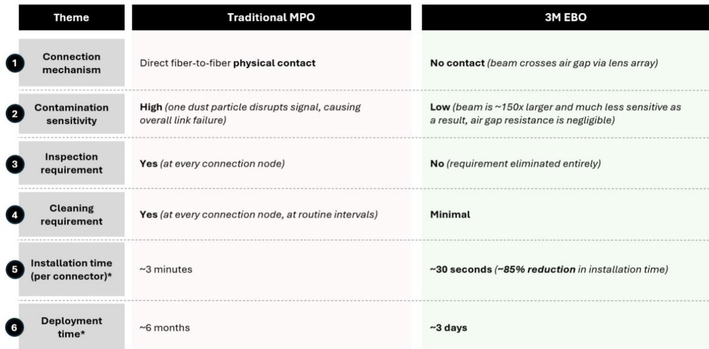
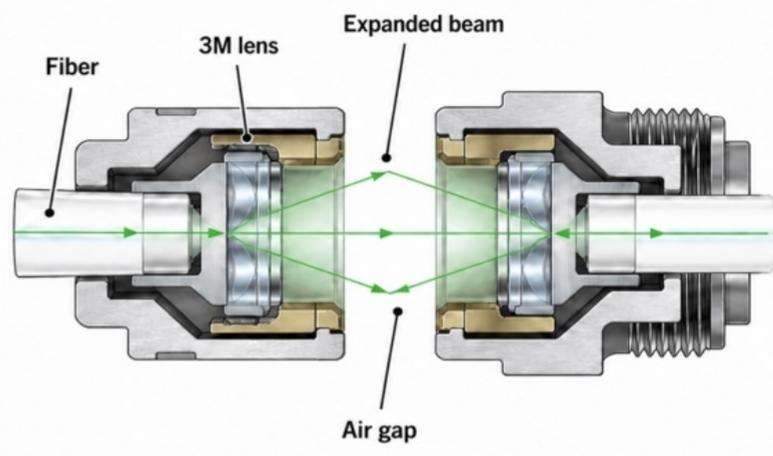
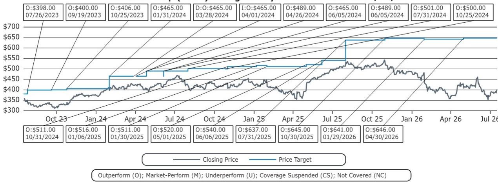

# 3M与微软的EBO合作：研发复兴的信号，但整体前景仍需观察

3M曾是一家创新叙事逐渐沉寂的公司。多年来，对其持保留态度的观点主要集中在：研发引擎的弱化、过于分散的业务组合，以及PFAS相关法律问题的长期阴影。如今，这一观点面临一个具体且可验证的挑战。2026年7月，3M宣布与微软建立战略合作伙伴关系，核心是扩展光束光学（EBO）技术——一种专为下一代AI数据中心设计的非接触式光纤连接方案。这并非一次小规模的产品更新。EBO解决的是超大规模数据中心建设中的一个基本运营瓶颈：传统光纤连接器对污染的敏感性，这迫使每个连接节点都必须进行强制检查和清洁。通过专有的透镜阵列消除光纤间的物理接触，EBO将每个连接器的安装时间从大约三分钟缩短到三十秒，效率提升85%。对于一个每年在数据中心资本支出上投入超过750亿美元的超大规模运营商来说，这种效率提升直接转化为更快的收入实现周期。

这次合作最重要的意义在于它揭示了3M的内部发展轨迹。EBO合作本身并不能扭转对公司的整体评价。但它代表了第一个具体且经过外部验证的证据，表明3M仍然能够产出具有战略商业价值的、真正差异化的技术。对于观察者而言，问题在于这个信号是否足够强大到改变长期增长的计算方式，或者它是否只是这家仍受结构性因素影响的公司中的一个孤立亮点。答案取决于如何权衡3M在EBO领域的竞争地位的持久性，与围绕收入可见性、定价压力以及更广泛采用时间表等未解决问题之间的平衡。

## EBO解决了AI数据中心连接中一个真实且日益增长的问题，而非假设性问题

任何新技术的价值都取决于它是否解决了一个随时间推移而加剧的真实痛点。就EBO而言，这个痛点已经明确且正变得更加突出。光纤连接器是光脉冲必须从一个光纤传递到下一个光纤且信号损失最小的物理节点。传统的多光纤推入式（MPO）连接器依赖抛光后的光纤端面进行直接物理接触。这种设计使其对污染高度敏感。接触点上一个微米级的灰尘颗粒就能散射或阻挡光路，导致链路故障。随着AI机架密度的增加，GPU、交换机和服务器之间移动的数据量呈指数级增长，连接节点的数量也随之倍增。检查和清洁每个连接点的运营负担，已成为部署速度和可靠性的一个显著制约因素。

EBO用专有的透镜阵列取代了物理接触，该阵列将光束扩展约150倍，然后通过气隙传输，并重新聚焦到接收光纤中。通过消除光纤间接触的要求，EBO省去了MPO连接器标准配置中强制性的安装前检查和清洁程序。基于3M在美国一个超大规模运营商设施的实际部署，实际结果是：每个连接器的安装时间从大约三分钟降至三十秒，大规模安装的部署时间从大约六个月降至大约三天。这些并非理论上的改进，而是来自生产环境的实测结果。该技术直接解决了密集布线环境的核心问题，即即使是微小的污染也可能降低集群性能。对于竞相将AI能力上线的大型运营商来说，权衡是明确的：一个能减少人工、消除检查流程并加快部署时间的连接器，并非锦上添花，而是一种结构性优势。

## 微软的认可将EBO从一个有前景的试点转变为经过生产验证的标准

这次合作最重要的特征并非技术本身，而是它提供的验证。在此公告之前，EBO是一个设计精良、理论优势明显，但在超大规模环境中缺乏实际验证的解决方案。微软的采用改变了这一状况。作为首个在生产环境中部署EBO的一线云服务提供商，微软有效地认证了该技术已为要求最严苛的数据中心环境做好准备。这一点之所以重要，是因为超大规模基础设施的采用模式往往遵循一个可预测的序列。一旦一个主要运营商验证了新标准并展示了运营效益，其他运营商通常会在12到24个月内进行评估和采用。在部署效率和可靠性方面落后的风险，超过了采用一个已在规模上得到验证的新连接器架构的风险。

对3M而言，这次合作带来了三种不同形式的价值。首先，它提供了更广泛生态系统采用所必需的客户参考点。其他正在评估EBO的超大规模运营商现在可以指向微软的实时部署，而不仅仅依赖3M的内部测试数据。其次，它验证了3M在2026年3月将其美国EBO制造产能提升一倍以上的决策背后的逻辑，这一供给侧押注现在看来颇具先见之明，而非投机。第三，该合作还包括微软的“前沿公司”计划，该计划将部署AI工具来自动化3M的内部订单管理工作流程。虽然这一运营效率组件次于核心技术故事，但它强化了管理层关于流程改进和利润率纪律的更广泛叙事。对于那些一直对3M执行其转型议程能力持怀疑态度的观察者来说，这次合作提供了一个具体的数据点，表明公司正朝着正确的方向取得进展。

## 3M在EBO领域的竞争护城河依赖于专利保护、制造领先和生态系统控制

任何新连接标准的一个常见风险是，原创者未能捕获其自身创新的经济价值。竞争对手可能逆向工程该技术，开放标准可能使组件定价商品化，或者客户可能开发专有替代方案。就EBO而言，3M构建了一个至少在中期内看起来结构稳健的防御体系。该公司用于插芯和透镜阵列设计的专利于2025年1月获批，有效期至少到2041年8月。这项专利并非仅仅涵盖一种实现方式。它涵盖了光束被扩展和重新聚焦的核心机制，这意味着任何依赖类似透镜阵列架构的竞争性非接触式连接器都可能面临侵权风险。该专利提供了一个短期内难以绕过的护城河。

除了知识产权，3M还通过多源协议（MSA）框架将自身置于EBO生态系统的中心。MSA的合作伙伴包括TE Connectivity、安费诺、AMD、思科、Meta、甲骨文、Arista和莫仕。这些合作伙伴以3M插芯为基础构建线缆和组件。这种中心辐射模式创造了两种收入来源：插芯和组件的直接销售，以及来自MSA合作伙伴的许可费。它还创造了转换成本。一旦线缆制造商围绕3M插芯设计其生产线，迁移到替代标准就需要重新调整工具、重新认证和重新鉴定。制造领先地位同样重要。3M是目前相对少见一家在超大规模数据中心的多光纤环境中展示过EBO的公司。其近期的产能扩张强化了这一先发优势。潜在的竞争对手，包括康宁和康普等老牌光纤制造商，目前的产品线中并没有与之竞争的EBO产品。像TE Connectivity和安费诺这样的传统EBO厂商拥有面向军事和工业应用的解决方案，但尚未将其适配到超大规模数据中心的使用场景。任何可信的竞争对手出现的时间线估计至少需要三到五年，届时3M将已加深客户锁定并扩大制造规模。

## 研究前景需要明确收入可见性和标准碎片化的风险

尽管3M的竞争地位具有战略优势，但这次合作并未解决几个对整体评估至关重要的不确定性。首先是收入量化。3M并未将数据中心连接作为一个独立的收入板块进行披露，当前的指引也未提供与数据中心部署相关的、以每兆瓦美元计的具体内容指标。观察者目前无法精确地模拟EBO的财务贡献。该技术在边际上可能利润丰厚，但如果它在可预见的未来只占总收入的一小部分，它将无法改变整体的增长率。第二个不确定性是定价的持久性。MSA框架虽然有利于生态系统采用，但也创造了一个开放标准，最终可能导致插芯定价商品化。鉴于专利保护，这种风险并非迫在眉睫，但在三到五年的视野内，来自MSA合作伙伴或替代设计的竞争压力可能会压缩利润率。

第三个也是最重大的风险是标准碎片化。微软的认可并不能保证AWS、谷歌云或Meta会采用EBO。每个超大规模运营商都有自己的工程团队、现有供应商关系和架构偏好。完全有可能一个或多个主要运营商支持一个竞争性的连接器标准，导致市场分化，EBO仅能捕获总可寻址机会的一部分。像康宁和康普这样的现有连接器供应商与超大规模运营商保持着深厚、长期的关系，并拥有雄厚的技术资源。来自这些参与者之一的、可信的非接触式竞争解决方案，即使是在两三年后出现，也可能从根本上改变叙事。这次合作是一个积极的发展，但它并非市场主导地位的保证。观察者应关注来自超大规模运营商的光纤连接器采购披露，将其作为更广泛采用的最直接领先指标。

*仅供参考。部分内容可能基于源材料通过AI辅助生成、翻译、总结或编辑，可能存在遗漏或错误。请独立核实。本文不构成专业建议。*

仅供参考。部分内容可能基于源材料通过AI辅助生成、翻译、总结或编辑，可能存在遗漏或错误。请独立核实。本文不构成专业建议。

