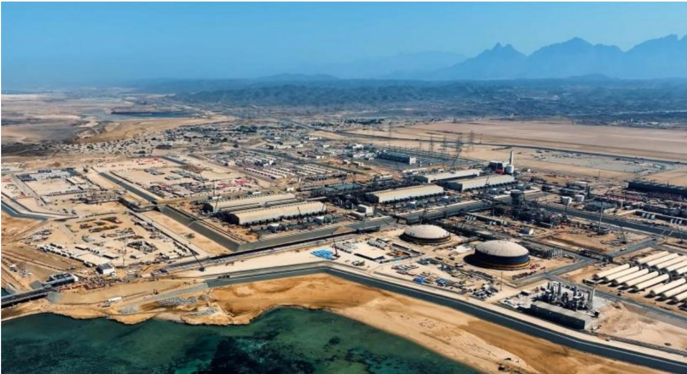
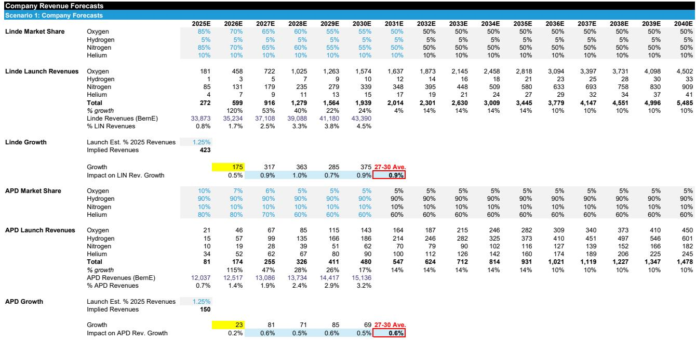
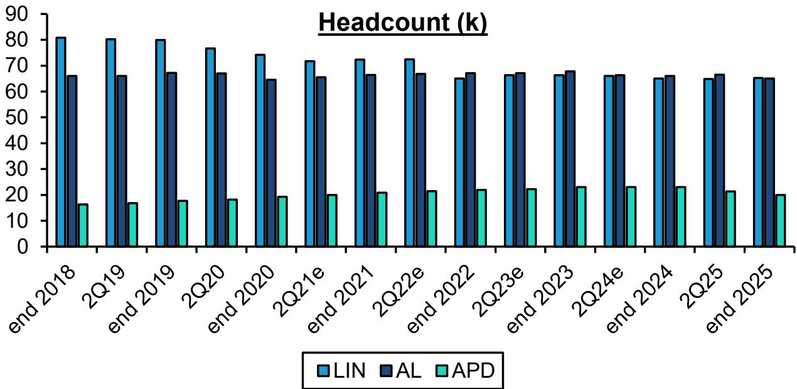

# Bernstein：NEOM在2027到2029年间每年对每股盈利的影响约为0.

Air Products是工业气体巨头中估值最低、近期每股盈利增长最快的公司。但市场始终有一个疑问：NEOM这个巨型绿色氢能项目，到底会不会拖累它的利润表？Bernstein在最新研报中给出了一个反直觉的判断——即便计入NEOM带来的每股盈利影响，Air Products到2030年的复合增速仍能跑赢市场一致预期。真正的问题不在于NEOM，而在于市场是否相信这家公司已经完成了文化转身。

这份报告的核心逻辑并不复杂。Air Products新任CEO Eduardo Menezes提出了一个“3+3+3+1”的每股盈利增长框架：定价与生产率贡献3%，新项目贡献3%，基础销量贡献3%，再叠加1%的公司回购。Bernstein认为，这个框架的构成比例可以微调——定价与生产率可能贡献更高，基础销量则需更保守——但总量上，公司有能力实现每年9%到10%的每股盈利增长，持续到2030年。

> **KC评论：** Bernstein的测算与公司管理层给出的指引基本一致，但它的价值在于把“NEOM影响”这个市场最大的担忧做了量化。报告认为，NEOM在2027到2029年间每年对每股盈利的影响约为0.20美元，相当于1%的增速损耗。这个数字并不致命。

## 1. 定价与生产率才是真正的增长引擎，而不是新项目

市场往往把注意力放在Air Products的新项目储备上，尤其是电子和航天领域的扩张。但Bernstein的分析显示，未来五年每股盈利增长的最大贡献者，其实是定价与生产率——平均每年贡献约5.4个百分点。

这个判断有历史依据。工业气体行业的一个核心特征是，头部企业通常有能力将定价维持在通胀之上。Air Products目前正在推进的成本削减计划，叠加文化转型带来的运营效率提升，使得这一部分的贡献可能比管理层自己表述的“3%到4%”更为可观。报告特别指出，CEO Menezes在公开场合的表述可能偏保守，实际执行空间更大。

这意味着，即便宏观环境导致基础销量增长低于预期，Air Products仍有一个相对可控的内部杠杆可以拉动利润。

## 2. 基础销量增长面临天花板，但电子和航天提供了结构性支撑

Bernstein对基础销量的假设比公司管理层更为谨慎。报告预计，基础销量对每股盈利增长的贡献约为1.5个百分点，低于管理层框架中的3%。理由是，全球工业产出增速目前仅在2%左右，且中东局势的不确定性可能进一步压制短期需求。

但有两个结构性因素值得关注。一是电子行业已成为工业气体的最大终端客户，超越了传统的钢铁和化工。Air Products在电子领域的项目储备，使其在亚洲和美洲的销量增长有望达到1.75%。二是航天业务虽然目前体量很小，但长期来看，火箭燃料需求可能成为一个不可忽视的增长点。报告将其描述为“长期机会”，而非短期催化剂。

## 3. NEOM的影响是暂时的，2029年后将转为正贡献

NEOM项目是市场对Air Products最大的疑虑。Bernstein为此建立了一个独立的财务模型。核心假设是：Air Products与Yara的合资公司能够以75%的比例实现绿色溢价销售，剩余25%按灰色价格出售。在这一假设下，NEOM在2027到2029年间每年对每股盈利的影响约为0.20美元。

但报告同时指出，一旦TotalEnergies的氢气承购协议在2030年开始执行，NEOM的盈利贡献将转为正值。因为TotalEnergies的承购协议更接近传统工业气体的宏观环境模型，利润确定性更高。如果Air Products能够实现全部绿色溢价销售，NEOM反而能带来每年约0.35美元的每股盈利增量。

> **KC评论：** Bernstein的NEOM模型提供了一个可复用的观察框架。读者可以自行调整两个关键变量：绿色溢价销售比例和TotalEnergies承购的启动时间。这两个变量决定了NEOM从“影响”变为“贡献”的拐点何时到来。

## 4. 估值折价能否收窄，取决于文化转型能否持续

Air Products目前相对于林德和液化空气的估值折价，是历史平均水平的两倍左右。Bernstein认为，这个折价是不合理的——前提是公司能够持续执行工业气体行业的“密度与纪律”战略。

这里的核心变量是文化转型。Air Products过去几年在项目成本控制和资本配置上出现过失误，市场对其执行力的信任度不高。但报告指出，自Menezes上任以来，公司已经展现出明显的文化变化，包括取消Darrow项目等决策，都指向更严格的资本纪律。如果这一趋势得以延续，估值折价收窄只是时间问题。

报告给出了一个具体的测算路径：如果Air Products的市盈率能从当前的约24倍回升至25倍，叠加每股盈利的复合增长，报价有望实现13.5%的年化回报。在乐观情景下，回报率可能接近20%。

Bernstein的这份报告，本质上是在回答一个问题：当市场对一个公司的怀疑已经充分反映在估值里时，什么样的证据才能让折价消失？它给出的答案是：持续的业绩交付，而不是一次性的项目公告。

For informational purposes only. Portions may be generated,translated,summarized,or edited with AI assistance based on source materials and may contain omissions or errors. Please verify independently. This is not investment,legal,tax,accounting,or other professional advice.

For informational purposes only. Portions may be generated,translated,summarized,or edited with AI assistance based on source materials and may contain omissions or errors. Please verify independently. This is not investment,legal,tax,accounting,or other professional advice.

