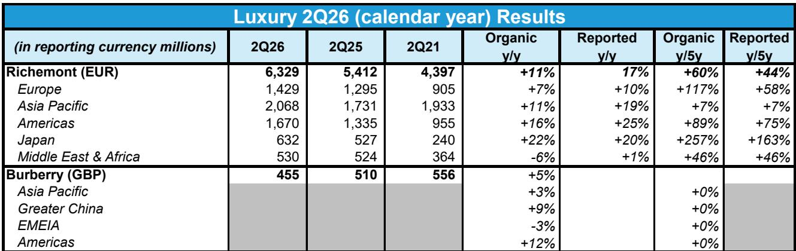
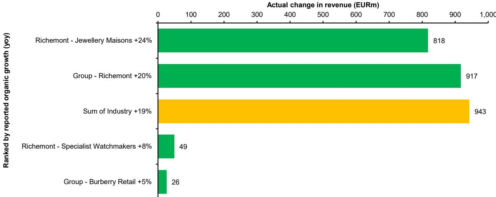
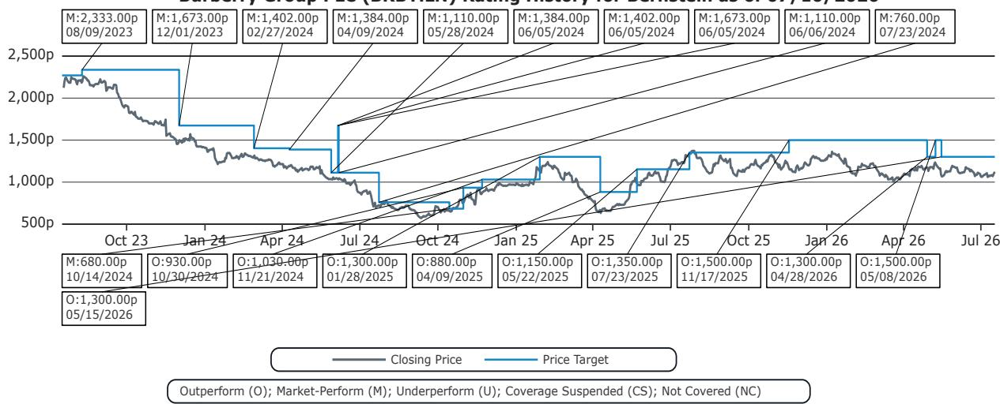

# Bernstein：Burberry 2Q26收入4.55亿英镑符合预期

Burberry刚刚交出了一份几乎贴着市场预期走的季度成绩单。这家英国奢侈品牌在截至6月底的2027财年第一财季（对应自然年2026年第二季度）实现零售收入4.55亿英镑，与市场预期的4.54亿英镑基本持平。可比零售销售额同比增长5%，比共识预期高出24个基点。在经历了过去两年的品牌调整后，这份“不超预期但也不掉链子”的答卷，恰恰是Bernstein分析师眼中最值得关注的信号。

报告的核心判断是：Burberry的品牌复兴第一阶段已经走通，但真正的考验在于管理层能否为复苏注入持续动力。Bernstein维持对该公司的跑赢行业评级。

## 1. 美洲和大中华区是增长引擎，但区域分化开始显现

从区域表现看，Burberry的增长动力并不均衡。美洲市场可比销售额同比增长12%，高于市场预期的10.6%，成为本季最大亮点。大中华区增长9%，与预期基本吻合。亚太其他地区增长3%，低于预期的6.3%，其中韩国增长11%但日本下滑2%。EMEIA地区（欧洲、中东、印度和非洲）同比下滑3%，略逊于预期的下滑2.3%。

这份区域数据揭示了一个容易被忽略的结构性特征：Burberry在核心的中国和美洲市场已经站稳脚跟，但欧洲市场的表现和亚太其他地区的分化，说明品牌复苏的广度仍有待验证。Bernstein在报告中特别指出，如果剔除中东地区，EMEIA的同比降幅收窄至1%，这意味着欧洲本土市场的不确定性更多来自区域性的游客消费结构变化，而非品牌力的系统性下滑。

> **KC评论：** 区域分化本身不是问题，但读者需要关注的是，美洲12%的增长是来自本地客群还是旅游消费。如果主要靠游客拉动，那么汇率波动和签证政策变化就会成为不可控变量。报告没有展开这一层，但这是理解增长可持续性的关键。

## 2. 批发渠道的积极信号比零售数据更值得关注

本季报告中一个容易被零售数据掩盖的亮点，是批发渠道的指引上调。Burberry将2027财年上半年批发收入增长预期从此前的个位数中段上调至个位数高段。Bernstein认为，这反映出批发合作伙伴对品牌新方向的正面反馈。

批发渠道的改善，往往比直营零售数据更能说明品牌在渠道端的真实吸引力。批发商没有品牌直营店那样的营销投入和陈列控制，他们的订货意愿直接反映了终端动销的真实情况。当批发商愿意加大订单量，意味着他们看到了消费者在门店里的实际购买行为变化。

报告还提到，外套品类在本季度实现了双位数增长，手袋品类也重回增长轨道。这两个品类是Burberry品牌基因中最核心的资产，它们的恢复比整体收入数字更有说服力。

## 3. 汇率从逆风转为顺风，但管理层的执行才是真正变量

Burberry更新了全年外汇指引，目前预计汇率将带来约2000万英镑的收入顺风，对调整后营业利润的影响基本中性。而此前的预期是两项均面临约1000万英镑的逆风。这一变化主要反映了英镑汇率的近期波动。

但Bernstein的立场很明确：汇率只是短期变量，品牌复兴的成败最终取决于管理层的执行。报告用了一个很克制的表述——“球现在在管理层的半场”，意思是复苏的框架已经搭好，接下来需要的是持续的产品创新、营销节奏和渠道管理。

Bernstein分析师Luca Solca团队在报告中强调，Burberry Forward战略已经证明有效，但品牌复兴从来不是一蹴而就的。第一阶段的成功只是获得了“入场资格”，真正的挑战在于如何让复苏从“数据改善”变成“趋势确立”。

> **KC评论：** Bernstein的估值方法值得注意——他们用1.7倍的相对市盈率倍数对MSCI欧洲指数进行估值，而不是用奢侈品同行做可比。这意味着他们更看重Burberry作为欧洲消费品牌的beta属性，而非奢侈品行业的alpha。这种估值框架本身就隐含了一个判断：Burberry的复苏故事，目前更多是行业beta修复的受益者，而非品牌alpha的创造者。

## 4. 一个可复用的观察框架：品牌复苏的三个验证节点

从Bernstein对Burberry的分析逻辑中，可以提炼出一个适用于大多数品牌复苏案例的观察框架。第一层是“数据验证”：同店销售是否回到正增长、核心品类是否恢复增长、批发渠道是否愿意加单。Burberry目前已经通过了这一层。

第二层是“质量验证”：增长是否来自可持续的客群扩张，而非一次性促销或渠道压货。这需要观察毛利率变化、客单价趋势和复购率数据。报告没有给出这些细节，但这是下一阶段需要跟踪的核心指标。

第三层是“估值验证”：当市场开始把复苏预期计入价格后，公司能否通过持续超预期的业绩来支撑估值溢价。这一空间能否兑现，取决于管理层能否在接下来的几个季度中持续交出符合或略超预期的成绩单。

对于关注消费品牌复苏逻辑的读者来说，这个三层框架同样适用于其他正在经历品牌调整的公司。关键不在于第一阶段的“有没有改善”，而在于第二阶段的“改善质量如何”。

---

For informational purposes only. Portions may be generated,translated,summarized,or edited with AI assistance based on source materials and may contain omissions or errors. Please verify independently. This is not investment,legal,tax,accounting,or other professional advice.

For informational purposes only. Portions may be generated,translated,summarized,or edited with AI assistance based on source materials and may contain omissions or errors. Please verify independently. This is not investment,legal,tax,accounting,or other professional advice.

