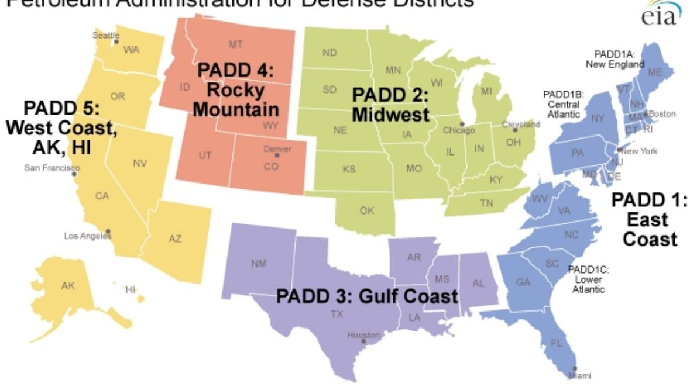
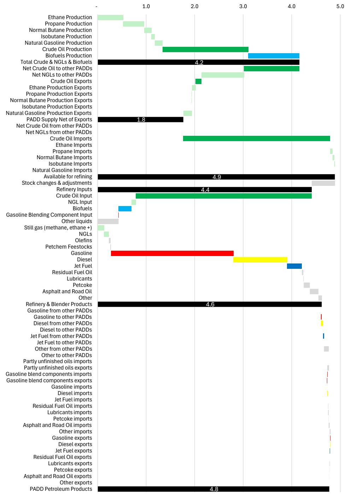
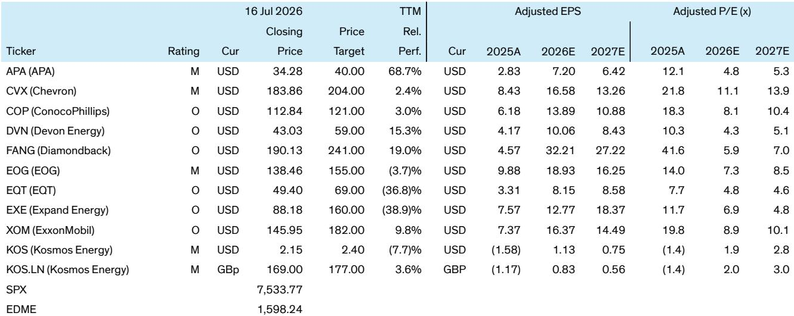

# Bernstein：美国成品油流动揭示报价与成品油价格脱节-隐含报价超90美元

原油价格与汽油、柴油等成品油价格之间的裂口，正在以历史罕见的速度扩大。Bernstein在最新研报中展示了一个关键矛盾：美国消费者对成品油的需求支撑的隐含报价已超过每桶90美元，而同期原油期货价格却一度低于70美元。即便近期霍尔木兹海峡局势将报价推升至80美元区间，裂解价差仍维持在历史最高位。原油与成品油价格并未收敛，反而进一步撕裂。

报告指出，当前原油加裂解价差的总和已接近每桶155美元。Bernstein在第一季度曾关注，当这一总和接近180美元时，需求变化将值得关注。现在，这一临界点正在逼近。

裂解价差高企的背后，是三重结构性力量的叠加：一是全球成品油需求依然强劲，只要宏观环境不显著出现变化，这一支撑就不会消失；二是战略石油储备释放人为压低了原油价格，但释放终将结束；三是全球两大主要产油区的成品油流动——霍尔木兹海峡和俄罗斯——持续受到地缘因素的严重干扰。Bernstein认为，这些因素可能持续数个季度，而非数周。

## 1. 美国成品油市场已深度嵌入全球体系，国内政策工具几乎无效

报告通过详尽的区域流动数据揭示了一个核心事实：美国成品油价格无法通过国内政策独立调控。在最近一个月，超过每日200万桶的汽油产品进出美国，柴油产品接近每日200万桶，航煤约每日40万桶。按美国炼厂产量计算，汽油、柴油和航煤的跨境流动比例分别达到24%、35%和20%。这些比例与一年前的正常月份几乎一致。

Bernstein进一步拆解了美国五大石油行政区的流动数据。东海岸（PADD-1）是纽约商品交易所汽油和柴油实物交割的定价地，其柴油的跨境流动比例高达100%，汽油为10%。墨西哥湾沿岸（PADD-3）作为美国最大的炼油集群，汽油跨境流动比例达80%，柴油为40%。西海岸（PADD-5）的汽油和柴油流动比例分别为25%和35%。

这些数字意味着，美国任何试图通过国内政策压低成品油价格的努力，都将面临全球市场的强力对冲。报告明确指出，释放战略原油储备可以压低原油价格，但对成品油价格几乎没有直接工具可用。

> **KC评论：** 这张区域流动图是理解当前裂解价差持续性的关键。东海岸柴油100%依赖全球流动，意味着即使美国本土炼厂满负荷运转，东海岸的柴油价格仍由全球边际供应决定。政策制定者能影响的只是原油端，而成品油端的价格决定权已不在美国手中。

## 2. 加油站是价格接受者，补贴和出口禁令都难以奏效

Bernstein用全球便利店巨头Couche-Tard的财务数据说明了一个反直觉的事实：加油站本质上是在按市场价格采购燃料，然后几乎以成本价出售，以此换取便利店销售利润。报告估算，Couche-Tard在截至2026年4月的财年内，道路运输燃料收入达562亿美元，但扣除采购成本后的毛利仅73亿美元，甚至低于其75亿美元的运营费用。便利店和服务的毛利则为69亿美元。

这意味着，如果燃料经销商可以将成品油自由运往竞争性市场，美国成品油价格就必须与全球价格竞争，无法独立压低。报告认为，补贴消费者的做法——如此前宣布的“自由燃料”加油站网络——要么规模太小，要么成本过高，且补贴本身会刺激更多需求，适得其反。

至于成品油出口禁令或价格管制，Bernstein将其定性为“美国从未尝试过的方案”，且历史记录糟糕，会鼓励炼厂削减不合理的宏观环境运行，与美国的治理风格不符。

## 3. 2022年的先例表明，裂解价差高企可能持续多个季度

报告提醒读者，上一次裂解价差峰值出现在2022年俄乌冲突之后，当时高裂解价差持续了多个季度，原因是冲突没有停止，供应链延长。当前的情况具有可比性：霍尔木兹海峡和俄罗斯的成品油流动中断，短期内看不到明确的结束信号。

Bernstein认为，真正的解决方案只有两个：一是更高的价格最终引发需求变化，二是受影响的炼油流动得到缓解——而后者需要时间。报告认为，经合组织无法无限期释放战略原油储备来改善成品油价格，且原油释放本身并不直接作用于成品油价格。

在研究层面，报告指出，大型独立炼油商（如VLO、MPC、PSX）将从高裂解价差中受益。在Bernstein覆盖范围内，埃克森美孚对炼油业务的敞口最大，雪佛龙次之。

---

For informational purposes only. Portions may be generated,translated,summarized,or edited with AI assistance based on source materials and may contain omissions or errors. Please verify independently. This is not investment,legal,tax,accounting,or other professional advice.

For informational purposes only. Portions may be generated,translated,summarized,or edited with AI assistance based on source materials and may contain omissions or errors. Please verify independently. This is not investment,legal,tax,accounting,or other professional advice.

