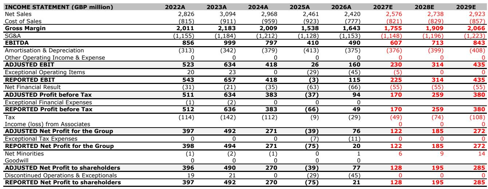
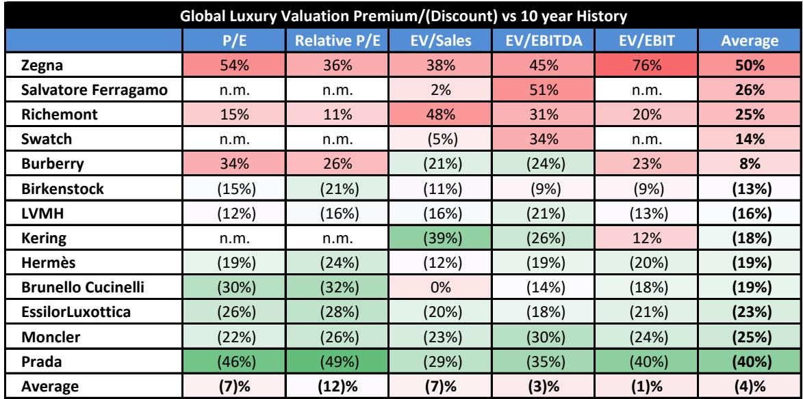
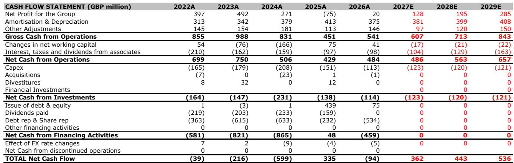

# Bernstein：Burberry 1Q27复苏——被低估的品牌修复

Burberry 在 2026 年 7 月发布的 1Q27（对应日历 2026 年第二季度）财报，传递了一个与报价走势并不完全一致的信息。这家英国奢侈品牌正在经历一场被低估的修复：本地消费者支出在所有区域持续增长，全价销售渗透率改善，批发合作伙伴给出更积极的订单指引。市场对运营杠杆的担忧并非没有道理，但Bernstein认为，Burberry 已经重建了增长的基础——它回到了合适的市场定位，重新连接了核心营销与价值主张。

这份报告的核心判断是：Burberry 的复苏不是靠打折或渠道扩张，而是靠品牌力与产品力的真实回升。证据集中在三个层面。

## 1. 本地客群增长正在取代“游客依赖”，这是更可持续的需求结构

Burberry 本季度的增长由本地消费者驱动，而非依赖国际游客回流。美国消费者贡献了较强劲的表现：美洲区同店销售增长 12%，美国游客在伦敦和巴黎旗舰店实现双位数增长。欧洲本地消费者在连续四个季度下滑后，本季度重回正增长。中国消费者实现中个位数增长，主要由区域内旅游（香港、澳门）和本地化营销推动。

> **KC评论：** 本地客群增长意味着品牌对目的地旅游的依赖度下降，这是更稳定的需求基础。报告特别提到美国消费者在伦敦和巴黎的消费，说明 Burberry 的跨大西洋品牌营销正在产生“光环效应”——美国本土的营销活动同时拉动了欧洲门店的销售。

批发渠道的改善同样值得关注。管理层将 1H27 批发增长指引从中个位数上调至高个位数，所有区域的合作伙伴需求都在增强。这与“Burberry 仍在调整分销”的普遍印象形成对比——订单增长是在更严格的分销控制下实现的，说明品牌议价能力正在恢复。

## 2. 全价销售改善是利润率修复的前提，但短期毛利率仍有不确定性

Burberry 本季度的全价销售渗透率持续提升，折扣活动减少，平均售价（AUR）小幅正增长。管理层将 FY27 毛利率预期设定为同比扩张，但 1H27 可能因库存拨备正常化和基数效应而略低于去年同期。Bernstein对此持谨慎态度：相信管理层回归约 70% 毛利率的长期目标，需要更多中期数据验证。

运营支出方面，管理层承诺 FY27 保持基本持平，营销投入将维持以支持品牌 momentum。Bernstein认为，通过已被验证的营销和商品策略来控制成本是可行的。本地化展览等举措可以进一步强化品牌传承叙事，为全价销售创造更多触点。

> **KC评论：** 毛利率的短期不确定性来自库存拨备的时间差，而非折扣增加。报告隐含的判断是：只要全价销售增长和零售空间效率提升这两个前提成立，中期利润率回到中双位数是合理的。目前市场对 FY27 的 EBIT 利润率预期（Bernstein模型为 8.8%）可能已经包含了足够的谨慎。

## 3. 品类扩展正在解决 Burberry 的季节性短板

Burberry 长期面临的一个结构性问题是收入过度依赖秋冬外套。本季度，外衣品类实现双位数增长，但更重要的是，管理层强调了“全年化”策略的成功——热带华达呢、轻量夹克和季节性风衣系列正在填补春夏销售空白。成衣品类三个季度以来首次实现男女装同步正增长，针织衫、Polo 衫和泳装是亮点。

手袋品类持续获得 momentum，Cotswold、House Check 和 Horseshoe 三大系列表现改善，美洲区母亲节营销推动手袋双位数增长。丝巾在夏季淡季仍实现强劲增长。这些信号表明，Burberry 正在从“风衣品牌”向“全品类奢侈品牌”过渡，品类扩展是收入增速可持续性的关键变量。

---

Bernstein对 Burberry 的估值采用 1.7 倍相对市盈率（相对 MSCI Europe），对应 22 倍 NTM+1 市盈率。报告同时下调了 FY27/28 的 EPS 预测，主要因毛利率假设下调。但营收预测基本不变——这意味着Bernstein认为收入端的复苏趋势是真实的，利润率修复只是时间问题。

对于关注奢侈品牌复苏路径的读者，Burberry 提供了一个可复用的观察框架：当品牌完成市场定位修正后，复苏的顺序通常是本地客群增长领先于游客回流，全价销售改善领先于利润率修复，品类扩展领先于同店增速加速。目前 Burberry 处于前两个阶段，第三个阶段仍需后续季度验证。

For informational purposes only. Portions may be generated,translated,summarized,or edited with AI assistance based on source materials and may contain omissions or errors. Please verify independently. This is not investment,legal,tax,accounting,or other professional advice.

For informational purposes only. Portions may be generated,translated,summarized,or edited with AI assistance based on source materials and may contain omissions or errors. Please verify independently. This is not investment,legal,tax,accounting,or other professional advice.

