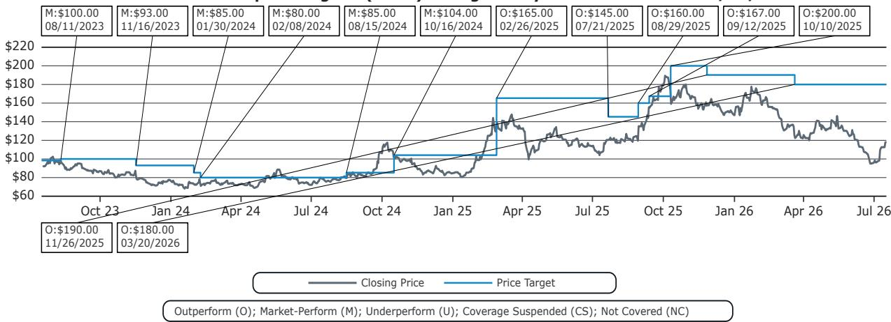

# Bernstein：中国互联网-Kimi时刻与蝴蝶效应

Kimi 在周四亚洲时段发布了 K3 模型，总参数量 2.8 万亿，每个 token 激活 16 个专家（共 896 个）。这份Bernstein研报认为，K3 的模型卡声称性能接近 Claude Fable 5 和 GPT-5.6，而早期公开基准测试结果已显示，它在特定任务（如前端代码）上超越了其中一款或两款模型。在线反馈和Bernstein团队自己的初步使用均指向了令人印象深刻的推理和资产生成能力，且 K3 在交付物的美学上有明显侧重。

这并非孤立事件。继 DeepSeek V3 和今年早些时候的 GLM-5.2 之后，K3 再次证明，中国高质量 AI 实验室追赶美国前沿的能力，超出了全球读者的预期。K3 的定价为每百万输入 token 3 美元、每百万输出 token 15 美元（缓存命中享受常规 90% 折扣），比 Opus 4.8 便宜 40%，比 Fable 便宜 70%。市场对 K3 的即时反应——中国 AI 实验室报价下跌、半导体板块下跌——在Bernstein看来，总体上是合理的。

> **KC评论：** 市场下跌看似反直觉，实则合理。K3 的成功加剧了模型层的竞争，这对所有 AI 实验室的终端利润率都是方向性不确定性，而非利好。

## 1. 中美AI前沿差距已收敛至一个季度，这对模型定价构成不确定性

Mythos 于 4 月初发布，这意味着 K3 的推出（连同在 Opus 4.6 发布四个月后推出的 GLM-5.2）强化了一个判断：中美 AI 前沿模型之间的差距约为 3-4 个月。前沿推理能力的趋同，对 AI 模型实验室的终端利润率是方向性利空。值得注意的是，OpenAI 和 Anthropic 在过去几周已开始卷入一场价格（速率限制）战。展望未来，Bernstein认为，K3 可能会促使 Anthropic 将其“监管捕获作为战略”的行动升级。研报将这种在线比较类比为美国禁止比亚迪在美国运营，认为这种类比“似乎……合理”。

## 2. Kimi 已跃居中国AI实验室首位，Z.ai 和阿里紧随其后

Bernstein长期将 Kimi、Z.ai 和阿里巴巴的 Qwen 视为中国前沿实验室。但 K3 让 Kimi 至少在预训练规模上成为明确的领先者。K3 帮助 Kimi 超越了 Z.ai，成为（至少目前）中国领先的 AI 实验室，这得益于其最大的预训练规模，以及在Bernstein认为有指导意义的一系列基准测试（如 DeepSWE v1.1、Terminal-Bench v2.1）上的最高得分。阿里巴巴的 Qwen 位列前三，DeepSeek 紧随其后（很大程度上是因为其花了六个月时间帮助国内芯片供应商解决硬件兼容性问题）。Z.ai 的下一次预训练和阿里巴巴的 Apsara 云栖大会，现在可能是中国 AI 领域值得关注的下一个催化剂。

## 3. 模型层碎片化加剧，大型分发平台获得更多议价权

阿里巴巴在 2024 年 2 月的一轮融资中收购了 Kimi 36% 的股份，腾讯也是已知读者。除了市场习惯忽视的股权研究价值外，更大的模型层碎片化和竞争，有助于给予大型分发平台和 AI 用户更多影响力和议价能力。边际上，Kimi 的成功可能对阿里云的收入增长是利好。研报还指出，腾讯的 Workbuddy 据报道现在每月有 800-900 万次访问，作为中国领先的桌面端 Agent 编排应用，这一点被大多数读者忽略了。

## 4. 蒸馏争议的本质：所有人都在蒸馏所有人

Anthropic 最近将 Z.ai 列入其指控非法蒸馏的中国 AI 实验室名单。Bernstein的基本判断仍然是：行业内所有人都在蒸馏所有人。蒸馏主要有助于引导后训练（如监督微调），而不是决定预训练规模——Kimi 认为，且Bernstein同意，预训练规模是更大的挑战。有趣的是，Thinking Machines 的首个模型 Inkling 表现平平，其模型文档显示使用了 Kimi K2.5 生成的数据。Bernstein的评论带着一丝讽刺：也许只有当 Anthropic 是所谓的受害者时，这才叫蒸馏；否则，它只是“闪亮的后训练引导”。

> **KC评论：** 蒸馏争议的实质是竞争话语权。当中国模型表现优异时，“蒸馏”指控就会升温。但报告的核心判断是，预训练规模的挑战远大于蒸馏带来的后训练优势，这才是真正的壁垒。

K3 的发布方向性地强化了Bernstein的观点：中国高质量 AI 实验室能够继续跟上美国同行的步伐，并最终成为全球一股力量。这对Bernstein覆盖的大型股的影响主要是间接的，但值得注意的是，阿里巴巴持有 Kimi 的大量股权。

For informational purposes only. Portions may be generated,translated,summarized,or edited with AI assistance based on source materials and may contain omissions or errors. Please verify independently. This is not investment,legal,tax,accounting,or other professional advice.

For informational purposes only. Portions may be generated,translated,summarized,or edited with AI assistance based on source materials and may contain omissions or errors. Please verify independently. This is not investment,legal,tax,accounting,or other professional advice.

