# 全球奢侈品观察：高级珠宝品类解析

Luca Solca +41 582 723 126 luca.solca@bernsteinsg.com

Maria Meita +44 20 7170 0540 maria.meita@bernsteinsg.com

Eric Chen, CFA +852 2123 2628 eric.chen@bernsteinsg.com

Yi-Peng Khoo, CFA +44 20 7676 6822 yi-peng.khoo@bernsteinsg.com

Richemont近期表现超出市场预期，JM部门在2027财年第一季度实现+24%有机增长。据估算，其中约20%的销售额来自高级珠宝。随着技术发展推动财富创造的多极化，以及消费行为的分化，预计增长将继续向高净值客户倾斜，进而带动高级珠宝品类的发展。因此，我们认为有必要为那些尚未在巴黎高级定制时装周期间接触过百万欧元级珍稀宝石的读者，提供一份关于该品类的介绍。

高级珠宝本质上是珠宝领域的高级定制，其特征为：单价极高、产量极低、品牌光环效应极强。在设计和价格方面，它代表着不受限制的创造力。对大多数品牌而言，高级珠宝更多是作为品牌建设和客户获取的工具，而非利润驱动活动。然而，随着高净值客户对独特作品的需求日益增长，这一格局可能发生变化。行业领导者（如Chaumet首席执行官）提到，高级珠宝的需求展现出韧性，而价格较低的作品（约15万欧元级别）则需要更多创新来吸引客户。

奢侈品牌已注意到这一趋势：Gucci于2019年推出首个高级珠宝系列；Hermès在2027年1月高级定制时装首秀之前，推出了自2010年以来规模最大的高级珠宝系列；Chanel聘请了Cartier资深人士Marie-Laure Cérède担任珠宝工作室总监，自2026年10月起生效；Tiffany & Co. 继续将高级珠宝作为其转型战略的重要支柱，相关展览已在伦敦（2022年）、东京（2024年）和首尔（2025年）举办。

虽然巴黎旺多姆广场的珠宝商自2010年起已正式纳入巴黎高级定制时装周日程，但近期的高级珠宝活动也延伸至科莫湖（Dior）、圣特罗佩（Cartier）和威尼斯（Chaumet、Dior）等专属地点，每场活动均邀请少量高净值客户参与。大中华区、东南亚和中东等市场推动了近期的增长，而北美地区正展现出与其它奢侈品品类相似的潜力。

图1：高级珠宝本质上是珠宝领域的高级定制，其特征为：单价极高、产量极低、品牌光环效应极强。

高级珠宝占品牌收入比例

来源：Bernstein分析及估算

图2：随着技术发展推动财富创造的多极化，以及消费行为的分化，预计增长将继续向高净值客户倾斜，进而带动高级珠宝品类，这一趋势在过去十年中已有所体现。

<table><tr><td>客户群体</td><td>人数（百万）</td><td>消费额（十亿欧元）</td><td>人均消费（千欧元）</td><td>变化（%）</td><td>变化额（十亿欧元）</td></tr><tr><td>高质量客户</td><td>0.6</td><td>236</td><td>393.3</td><td>+48%</td><td>+113</td></tr><tr><td>高质量相对</td><td>1.8</td><td>48</td><td>26.7</td><td></td><td></td></tr><tr><td>入门相对</td><td>17</td><td>115</td><td>6.8</td><td></td><td></td></tr><tr><td>高质量向往</td><td>22</td><td>60</td><td>2.7</td><td></td><td></td></tr><tr><td>其他向往</td><td>383</td><td>563</td><td>1.5</td><td>-20%</td><td>-113</td></tr><tr><td>总计</td><td>424.4</td><td>1,022</td><td>2.4</td><td></td><td></td></tr></table>

来源：BCG，Bernstein分析

图3：尽管高级珠宝单品价格可达七位数，但其利润率通常低于设计珠宝。

'珠宝级别越高，利润率越低。高级珠宝并不享有同样的利润率。' —— Johann Rupert，Richemont主席，2026财年电话会议

来源：公司官网
来源：公司财报电话会议

图4：由于利润率较低且资本密集度较高，高级珠宝更多被视为品牌建设和客户获取的工具。

<table><tr><td></td><td>设计珠宝</td><td>高级珠宝</td></tr><tr><td>驱动因素</td><td>标志性设计</td><td>稀有性、工艺、 provenance</td></tr><tr><td>独特性</td><td>数百万件</td><td>通常为孤品</td></tr><tr><td>材质</td><td>18K金、铂金、银、少量宝石</td><td>以珍贵宝石为主，镶嵌于金或铂金</td></tr><tr><td>单件价格</td><td>€500–€10k</td><td>€100k - €1m+</td></tr><tr><td>毛利率%</td><td>70-80%</td><td>50-60%</td></tr><tr><td>息税前利润率%</td><td>40-50%</td><td>10-20%</td></tr><tr><td>库存周转</td><td>&lt;6个月</td><td>&gt;1年</td></tr><tr><td>分销渠道</td><td>门店（实体及线上）</td><td>专属客户服务、私人鉴赏</td></tr></table>

来源：Bernstein分析及估算

图5：由于每件作品均为孤品，各品牌高级珠宝系列的作品数量差异显著（且并非所有品牌均公开披露）。

2026年高级珠宝系列作品数量
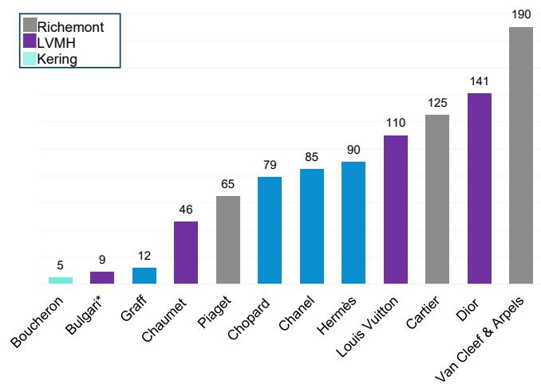
\*Bulgari近期还推出了全钻胶囊系列
来源：公司官网，Bernstein分析

## HERMÈS

图6：该品牌的第九个高级珠宝系列'Into the Horsescape'以马为主题，通过痕迹和符号进行呈现。

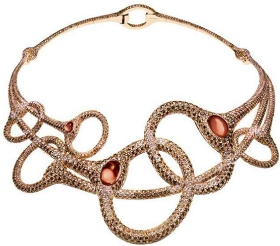
来源：公司官网

## CHANEL

图7：'Signs & Symbols'系列灵感源自Gabrielle Chanel的四个标志性元素：山茶花、星星、太阳、狮子。

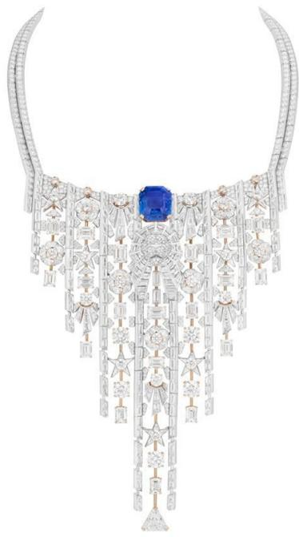

## RICHEMONT

## Cartier

图8：在Cartier，宝石的等级至关重要：宝石优先，设计其次。'Le Chœur des Pierres'系列耗时超过85,000小时，包含125余件孤品。

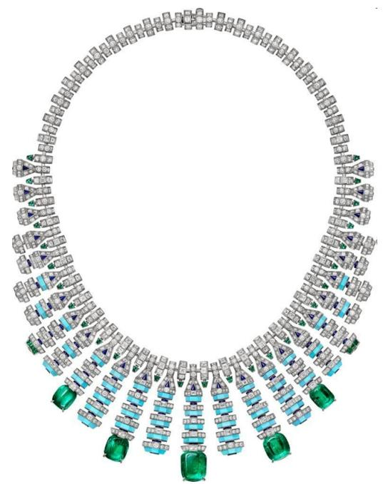
来源：公司官网

## Van Cleef & Arpels

图9：经过四年的研发，Van Cleef & Arpels推出了'Fascinating of Egypt'系列，灵感源自古埃及，同时避免了东方主义的刻板印象。

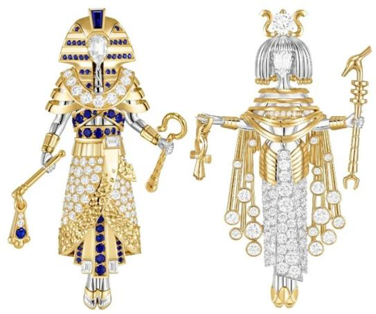
来源：公司官网

## Piaget

图10：'Colours of Extraleganza'系列以色彩丰富的作品为该品牌的高级珠宝三部曲画上句号，唤起1960年代和1970年代的自由精神氛围。

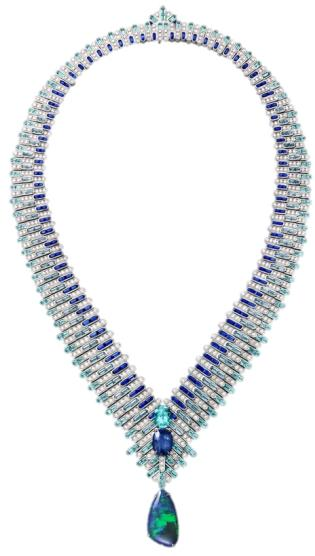
来源：公司官网

## LVMH

## Louis Vuitton

图11：Mythica系列以征服、坚韧和胜利为主题，设计大胆。Victory戒指耗时1,900小时，镶嵌超过19.71克拉的彩色和无色钻石。

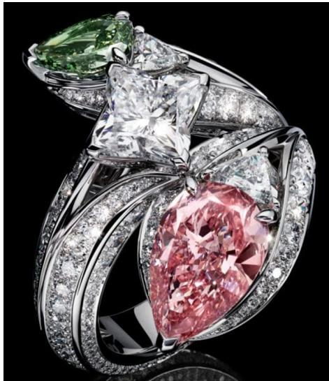
来源：公司官网

## Dior

图12：创意总监Victoire de Castellane自1998年起领导Dior Joaillerie。该标志性的趣味系列摒弃了宏伟的宝石，转而采用精致的宝石镶嵌，呈现出高级版本的儿童拼贴画效果。

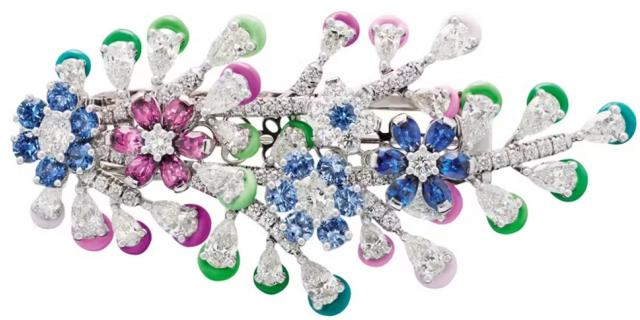
来源：公司官网

## Bulgari

图13：Bulgari的'Eclettica'系列灵感源自装饰艺术风格的几何形态，将彩色宝石与无色钻石融合于项链和长项链之中。

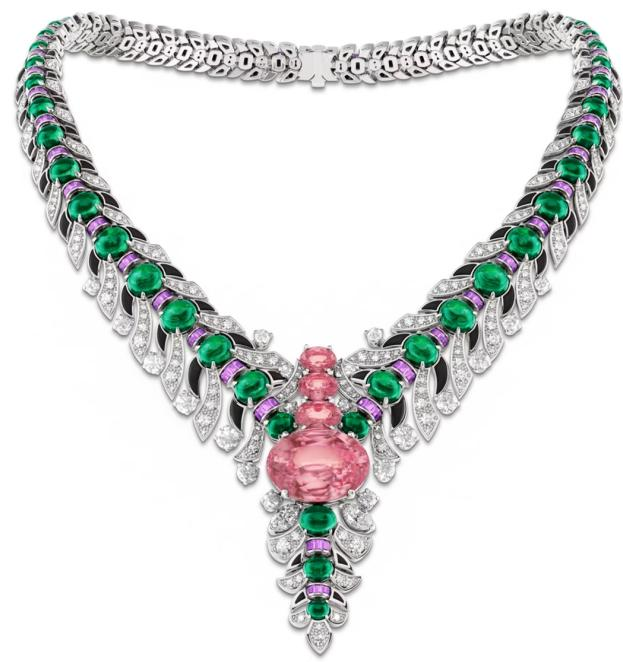

## Tiffany & Co.

图14：Tiffany的Blue Book 'Hidden Garden'系列分为五个篇章——天堂鸟、拉菲草、花瓣、花朵和雏菊——该系列通过彩色宝石颂扬动植物，同时重新诠释了Jean Schlumberger于1965年首次创作的标志性Bird on a Rock。

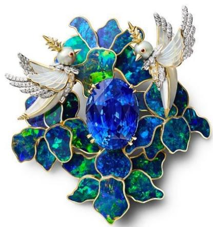
来源：公司官网

## Fred

图15：为庆祝成立90周年，Fred首次展示了Soleil d'Or，一颗重达105.54克拉的祖母绿切割黄钻。然而，虽然展示这颗钻石的围兜式项链可供出售，但钻石本身不出售。

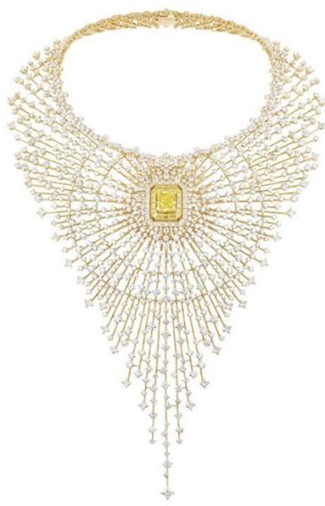
来源：公司官网

## Chaumet

图16：通过'A Journey Through Nature'系列，Chaumet将其246年的自然主义传统与香料世界相结合。主题包括：香草、肉桂、绿茶等，每件作品耗时超过1,000小时。据报道，部分作品在正式发布前已售出。

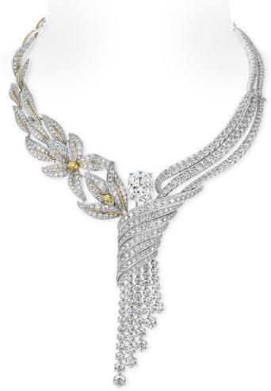
来源：公司官网

## KERING

## Gucci

图17：Gucci通过四个基于品牌历史符号的设计家族来颂扬自然：Gucci Flora（1966年为Grace Kelly创作的图案）、Gucci Nodo（1960年代推出）、标志性的交织GG标志，以及Horsebit和Marina Chain徽章。

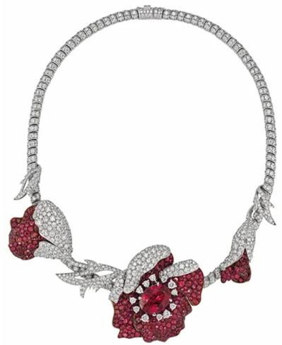
来源：公司官网

## Boucheron

图18：Carte Blanche 'Human Being'系列颂扬了不可替代的人类双手。超过14,000小时的工时用于创造五种独特的手工技艺——每件作品对应一种。

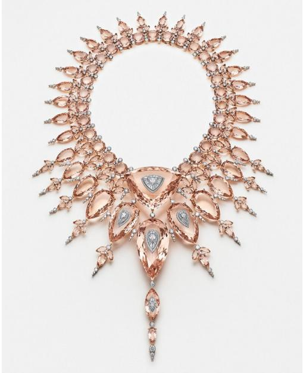
来源：公司官网

## GRAFF（私人公司）

图19：Graff通过十二枚独特的胸针重新诠释其标志性的蝴蝶图案。自1975年以来，蝴蝶一直是品牌的象征，其蜕变设计可转化为吊坠。

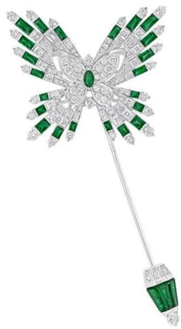
来源：公司官网

## CHOPARD（私人公司）

图20：Chopard的红毯系列'Miracles'围绕生活中的静谧奇迹展开。该系列与戛纳电影节合作生产，Chopard是其官方合作伙伴。系列作品数量与电影节届数相同。

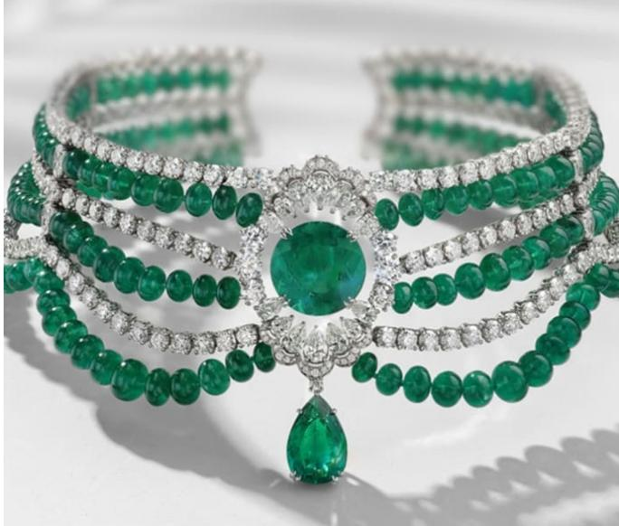
来源：公司官网

## DE BEERS（由Anglo American拥有，由Bob Brackett覆盖）

图21：'The Talisman'系列是De Beers的标志性高级珠宝系列，凸显了其作为矿业公司和珠宝商的双重身份。该系列于2005年推出，是首个将原钻与抛光钻石相结合的高级珠宝系列。

来源：公司官网

## BERNSTEIN 公司列表

<table><tr><td rowspan="2">代码</td><td rowspan="2">评级</td><td colspan="3">2026年7月16日</td><td rowspan="2">TTM相对表现</td><td colspan="4">调整后每股收益</td><td colspan="3">调整后市盈率（倍）</td></tr><tr><td>货币</td><td>收盘价</td><td>目标价</td><td>货币</td><td>2025A</td><td>2026E</td><td>2027E</td><td>2025A</td><td>2026E</td><td>2027E</td></tr><tr><td>BIRK (Birkenstock)</td><td>M</td><td>USD</td><td>44.31</td><td>50.00</td><td>(27.5)%</td><td>EUR</td><td>1.85</td><td>2.01</td><td>2.49</td><td>20.9</td><td>19.2</td><td>15.5</td></tr><tr><td>BC.IM (Brunello Cucinelli)</td><td>O</td><td>EUR</td><td>83.64</td><td>108.00</td><td>(39.8)%</td><td>EUR</td><td>1.99</td><td>2.26</td><td>2.65</td><td>42.1</td><td>37.0</td><td>31.5</td></tr><tr><td>BRBY.LN (Burberry)</td><td>O</td><td>GBp</td><td>1,120.50</td><td>1,300.00</td><td>(26.4)%</td><td>GBP</td><td>0.24</td><td>0.39</td><td>0.55</td><td>45.9</td><td>28.8</td><td>20.4</td></tr><tr><td>CFR.SW (Richemont)</td><td>O</td><td>CHF</td><td>197.40</td><td>240.00</td><td>13.8%</td><td>EUR</td><td>5.96</td><td>8.07</td><td>9.33</td><td>35.8</td><td>26.4</td><td>22.9</td></tr><tr><td>ZGN</td><td>O</td><td>USD</td><td>14.43</td><td>14.00</td><td>54.7%</td><td>EUR</td><td>0.45</td><td>0.42</td><td>0.60</td><td>27.8</td><td>29.8</td><td>20.9</td></tr><tr><td>EL.FP (EssilorLuxottica)</td><td>M</td><td>EUR</td><td>169.50</td><td>185.00</td><td>(48.2)%</td><td>EUR</td><td>6.79</td><td>7.65</td><td>8.95</td><td>24.9</td><td>22.2</td><td>18.9</td></tr><tr><td>RMS.FP (Hermes)</td><td>O</td><td>EUR</td><td>1,706.00</td><td>2,150.00</td><td>(47.5)%</td><td>EUR</td><td>43.12</td><td>43.89</td><td>52.30</td><td>39.6</td><td>38.9</td><td>32.6</td></tr><tr><td>KER.FP (Kering)</td><td>M</td><td>EUR</td><td>255.40</td><td>220.00</td><td>15.4%</td><td>EUR</td><td>4.35</td><td>6.13</td><td>9.86</td><td>58.7</td><td>41.6</td><td>25.9</td></tr><tr><td>MC.FP (LVMH)</td><td>O</td><td>EUR</td><td>503.10</td><td>600.00</td><td>(12.2)%</td><td>EUR</td><td>22.73</td><td>22.22</td><td>26.71</td><td>22.1</td><td>22.6</td><td>18.8</td></tr><tr><td>MONC.IM (Moncler)</td><td>M</td><td>EUR</td><td>52.08</td><td>57.50</td><td>(14.8)%</td><td>EUR</td><td>2.31</td><td>2.44</td><td>2.64</td><td>22.5</td><td>21.3</td><td>19.7</td></tr><tr><td>1913.HK (Prada SpA)</td><td>O</td><td>HKD</td><td>40.96</td><td>45.00</td><td>(48.9)%</td><td>EUR</td><td>0.33</td><td>0.28</td><td>0.32</td><td>13.7</td><td>16.2</td><td>14.5</td></tr><tr><td>SFER.IM (Ferragamo)</td><td>O</td><td>EUR</td><td>10.59</td><td>8.80</td><td>93.6%</td><td>EUR</td><td>(0.30)</td><td>0.04</td><td>0.15</td><td>(35.9)</td><td>282.1</td><td>72.2</td></tr><tr><td>UHR.SW (Swatch)</td><td>M</td><td>CHF</td><td>207.90</td><td>200.00</td><td>33.6%</td><td>CHF</td><td>0.03</td><td>5.74</td><td>8.67</td><td>N/M</td><td>36.2</td><td>24.0</td></tr><tr><td>SPX</td><td></td><td></td><td>7,533.77</td><td></td><td></td><td></td><td></td><td></td><td></td><td></td><td></td><td></td></tr><tr><td>EDME</td><td></td><td></td><td>1,598.24</td><td></td><td></td><td></td><td></td><td></td><td></td><td></td><td></td><td></td></tr><tr><td>EMLSF</td><td></td><td></td><td>6,205.36</td><td></td><td></td><td></td><td></td><td></td><td></td><td></td><td></td><td></td></tr><tr><td>ASIAX</td><td></td><td></td><td>1,921.27</td><td></td><td></td><td></td><td></td><td></td><td></td><td></td><td></td><td></td></tr></table>

O - 跑赢，M - 市场表现，U - 跑输，NR - 未评级，CS - 暂停覆盖

BRBY.LN, CFR.SW 基准年为2026年；

来源：Bloomberg，Bernstein估算及分析。

## I. 必要披露

本披露中提及的"Bernstein"或"公司"指以下实体：Bernstein Institutional Services LLC（自2024年4月1日起）、Bernstein & Co., LLC（2024年4月1日前）、Bernstein Autonomous LLP、BSG France S.A.（自2024年4月1日起）、Bernstein (Hong Kong) Limited 盛博香港有限公司、Bernstein (Canada) Limited、Bernstein (India) Private Limited（SEBI注册号INH000006378）、Bernstein (Singapore) Private Limited、Bernstein Japan KK（サンフォード・C・バーンスタイン株式会社）以及根据Bernstein与SG之间的全球服务协议，由SG Africa Technologies & Services雇用的分析师为Bernstein制作研究报告。

Bernstein是SG（SG）与AllianceBernstein, L.P.（AB）合资企业的一部分。除非另有特别说明，本披露中提及的Bernstein"关联方"指SG和AB及其各自的关联公司。

## 估值方法

本研究涵盖六家或更多公司。有关估值方法及其他公司披露，请访问：https://bernstein-autonomous.bluematrix.com/sellside/Disclosures.action。

或致函：Director of Compliance, Bernstein Institutional Services LLC, 245 Park Avenue, New York, NY 10167。

## 风险

本研究涵盖六家或更多公司。有关风险及其他公司披露，请访问：https://bernstein-autonomous.bluematrix.com/sellside/Disclosures.action。
或致函：Director of Compliance, Bernstein Institutional Services LLC, 245 Park Avenue, New York, NY 10167。

## 评级定义、基准及分布

## 股票评级定义

## Bernstein品牌

Bernstein品牌根据未来12个月相对于特定指数的预期相对表现对股票进行评级：美国及加拿大上市股票相对于标普500指数，欧洲及新兴市场（亚太地区除外）上市股票相对于Bloomberg Europe Developed Markets Large and Mid Cap Price Return Index EUR (EDME)，日本上市股票相对于Bloomberg Japan Large and Mid Cap Price Return Index USD (JPL)，亚洲（除日本外）上市股票相对于Bloomberg Asia ex-Japan Large and Mid Cap Price Return Index (ASIAX) —— 除非另有说明。

Bernstein品牌包含三类评级：

- 跑赢：股票表现将超越市场指数超过15个百分点
- 市场表现：股票表现将与市场指数持平，波动范围在+/-15个百分点以内
- 跑输：股票表现将落后于市场指数超过15个百分点

暂停覆盖：Bernstein品牌对某公司的覆盖已暂停。评级和目标价暂时失效，不再具有时效性，不应再被依赖。

未评级：当股票目前无法准确估值，或公司表现无法准确预测时分配的评级。覆盖分析师可能继续发布关于该公司的研究报告，以向读者更新事件和发展动态。

未覆盖（NC）表示未受覆盖的公司。

Bernstein品牌股票评级基于12个月的时间跨度。

## Autonomous品牌 – 普通股

Autonomous品牌按如下方式对普通股进行评级。我们使用的基准包括：Bloomberg Europe 600 Financials Price Return Index (E600BK) 和 Bloomberg Europe Dev Mkt Financials Large and Mid Cap Price Ret Index EUR (EDMFI) 用于欧洲发达市场银行和支付公司，Bloomberg Europe 600 Insurance Price Return Index (E600IN) 用于欧洲保险公司，标普500和标普金融指数用于美国银行和支付公司覆盖，S5LIFE用于美国保险，标普保险精选行业指数 (SPSIINS) 用于美国非寿险公司覆盖，以及Bloomberg Emerging Markets Financials Large, Mid and Small Cap Price Return Index (EMLSF) 用于新兴市场银行、保险公司和支付公司。评级是相对于行业（而非市场）而言的。

Autonomous品牌包含三类普通股评级：

- 跑赢 (OP)：股票将跑赢相关指数超过10个百分点
- 中性 (N)：股票表现将与市场指数持平，波动范围在+/-10个百分点以内
- 跑输 (UP)：股票将落后于相关指数超过10个百分点

暂停覆盖：Autonomous研究品牌对某公司的覆盖已暂停。评级和目标价暂时失效，不再具有时效性，不应再被依赖。

未评级：当股票目前无法准确估值，或公司表现无法准确预测时分配的评级。覆盖分析师可能继续发布关于该公司的研究报告，以向读者更新事件和发展动态。

标记为'特色'（例如，特色跑赢FOP，特色跑输FUP）的评分为我们的核心观点。

未覆盖（NC）表示未受覆盖的公司。

Autonomous品牌普通股评级基于12个月的时间跨度。

## Autonomous品牌 – 优先股

Autonomous品牌包含三类优先股评级：

- 跑赢 (OP)：该优先工具的总回报预计将在未来六个月内优于在类似行业或评级类别中运营的其他发行人的优先证券。
- 中性 (N)：该优先工具的总回报预计将在未来六个月内与在类似行业或评级类别中运营的其他发行人的优先证券表现一致。
- 跑输 (UP)：该优先工具的总回报预计将在未来六个月内逊于在类似行业或评级类别中运营的其他发行人的优先证券。

Autonomous优先股评级基于6个月的时间跨度。

## AUTONOMOUS 信用研究

若本报告包含对信用工具的研究交流（定义见市场滥用条例第3(1)(35)条），以下信息旨在满足其披露要求。

本报告可能还包含对Autonomous或Bernstein其他分析师就本文提及的发行人股权证券所发表意见的引用。请注意，本报告作者发布的信用工具研究交流可能与本文所含发行人的股权证券分析师的公开观点存在差异，反之亦然。

## 信用评级定义

Autonomous品牌包含三类信用评级：

- 信用跑赢 (C-OP)：参考信用工具的总回报预计将在未来六个月内优于在类似行业或评级类别中运营的其他发行人的债券信用利差。
- 信用中性 (C-N)：参考信用工具的总回报预计将在未来六个月内与在类似行业或评级类别中运营的其他发行人的债券信用利差表现一致。
- 信用跑输 (C-UP)：参考信用工具的总回报预计将在未来六个月内逊于在类似行业或评级类别中运营的其他发行人的债券信用利差。

Autonomous信用评级基于6个月的时间跨度。

可应要求提供本报告作者所作所有研究交流的清单及信用评级历史。

公司自行决定何时启动、更新和终止研究覆盖。公司已建立、维护并依赖信息壁垒，以控制公司内部一个或多个领域（即私密侧）的信息流向公司其他领域、部门、集团或关联方（即公开侧）。

## 股票评级/投资银行服务分布

<table><tr><td>股票评级</td><td>市场滥用条例 (MAR) 和 FINRA 评级类别</td><td>全球评级分布</td><td>投资银行关系*</td></tr><tr><td>跑赢</td><td>买入</td><td>51.2%</td><td>15.3%</td></tr><tr><td>市场表现 (Bernstein品牌) / 中性 (Autonomous品牌)</td><td>持有</td><td>35.8%</td><td>16.2%</td></tr><tr><td>跑输</td><td>卖出</td><td>13.1%</td><td>13.6%</td></tr></table>

\* 这些数字代表每个股票评级类别中，Bernstein关联方在过去12个月内提供过投资银行服务的公司百分比。
截至2026年6月30日。所有数据每季度更新。

## 价格图表/评级及目标价历史

本研究涵盖六家或更多公司。有关价格图表及其他公司披露，请访问 https://bernstein-autonomous.bluematrix.com/sellside/Disclosures.action 或致函：Director of Compliance, Bernstein Institutional Services LLC, 245 Park Avenue, New York, NY 10167。

## 利益冲突

SG和/或其关联方实益拥有以下公司一类普通股证券的1%或以上：Burberry Group PLC。

Bernstein Autonomous LLP 或 BSG France SA 实益持有以下MiFID合格证券一类普通股已发行股本总额的0.5%或以上的净多头或净空头头寸：Burberry Group PLC。

AB和/或其关联方实益拥有以下公司一类普通股证券的1%或以上：Burberry Group PLC。

SG和/或其关联方实益拥有以下公司[已发行股本总额/任何一类普通股证券]的0.5%或以上的净[多头/空头]头寸：Burberry Group PLC, EssilorLuxottica SA 和 Moncler SpA。

Bernstein和/或其关联方在过去十二个月内因投资银行服务从以下公司获得报酬：Burberry Group PLC, Kering SA 和 LVMH Moet Hennessy Louis Vuitton SE。

Bernstein在过去十二个月内因非投资银行证券相关产品或服务从以下客户获得报酬：Birkenstock Holding Plc 和 Hermes International。

Bernstein和/或其关联方在过去十二个月内因非投资银行证券相关产品或服务从以下客户获得报酬：Burberry Group PLC, Cie Financiere Richemont SA, EssilorLuxottica SA, Kering SA, LVMH Moet Hennessy Louis Vuitton SE 和 Swatch Group AG/The。

Maria Meita 已与 Kering SA 就潜在职位进行初步讨论。

Bernstein和/或其关联方预计在未来三个月内将寻求或打算寻求从以下公司获得投资银行服务报酬：EssilorLuxottica SA 和 Kering SA。

Bernstein的某些关联方担任以下公司股权证券的做市商或流动性提供者：Birkenstock Holding Plc, Brunello Cucinelli, Burberry Group PLC, Cie Financiere Richemont SA, EssilorLuxottica SA, Hermes International, Kering SA, LVMH Moet Hennessy Louis Vuitton SE, Moncler SpA, Salvatore Ferragamo SpA 和 Swatch Group AG/The。

Bernstein和/或其关联方在过去十二个月内与以下公司存在投资银行客户关系：Burberry Group PLC, EssilorLuxottica SA, Kering SA 和 LVMH Moet Hennessy Louis Vuitton SE。

Bernstein的某些关联方担任以下公司债务证券的做市商或流动性提供者：Cie Financiere Richemont SA, Kering SA 和 LVMH Moet Hennessy Louis Vuitton SE。

Bernstein的关联方在过去十二个月内管理或共同管理了LVMH Moet Hennessy Louis Vuitton SE的证券公开发行。

## 其他事项

雇用本报告所列分析师的法人实体及其所在地可通过其电话号码的国家代码确定，如下所示：

+1 Bernstein Institutional Services LLC; 纽约, 纽约州, 美国
+44 Bernstein Autonomous LLP; 伦敦, 英国
+212 SG Africa Technologies & Services; 卡萨布兰卡, 摩洛哥
+33 BSG France S.A.; 巴黎, 法国
+34 BSG France S.A.; 马德里, 西班牙
+41 Bernstein Autonomous LLP; 日内瓦, 瑞士
+49 BSG France S.A.; 法兰克福, 德国
+91 Bernstein (India) Private Limited; 孟买, 印度
+852 Bernstein (Hong Kong) Limited 盛博香港有限公司; 香港, 中国
+65 Bernstein (Singapore) Private Limited; 新加坡
+81 Bernstein Japan KK; 东京, 日本

若本报告由非美国关联公司雇用的研究分析师编写，则该分析师（除非另有明确说明）未注册为Bernstein Institutional Services LLC或任何其他SEC注册经纪交易商的关联人士，也未获得FINRA研究分析师的资格或许可。因此，该分析师可能不受FINRA关于（其中包括）研究分析师与主题公司沟通、研究分析师与投资银行人员互动、研究分析师参与与投资银行交易相关的招揽和营销活动、研究分析师公开露面以及研究分析师账户持有证券交易等限制的约束。

若本报告由SG Africa Technologies & Services（SG集团公司的一部分）雇用的研究分析师编写，则其是根据Bernstein与SG之间的全球服务协议代表Bernstein公司编写的。

## 认证

本报告所列每位主要负责本报告内容编写的研究分析师证明，本出版物中表达的所有观点准确反映了该分析师对任何及所有主题证券或发行人的个人观点，并且该分析师的报酬中没有任何部分直接或间接与本出版物中的具体建议或观点相关。

## II. 附加全球利益冲突披露

公司自行决定何时启动、更新和终止研究覆盖。公司已建立、维护并依赖信息壁垒，以控制公司内部一个或多个领域（即私密侧）的信息流向公司其他领域、部门、集团或关联方（即公开侧）。

## III. 其他重要信息及披露

"Bernstein"和"Autonomous"研究产品保持独立品牌。

- Bernstein制作多种不同类型的研究产品，包括但不限于在"Autonomous"和"Bernstein"品牌下的基础分析和定量分析。一种研究产品中包含的建议可能因时间跨度、方法论或其他原因而与另一种研究产品中的建议不同。此外，一个品牌下发布的研究产品中的观点或建议可能与另一个品牌下发布的同类研究产品中的观点或建议不同。两个品牌的研究评级系统以及与这些评级系统相关的其他信息包含在前一节中。

- Autonomous作为以下实体内的独立业务部门运营：Bernstein Institutional Services LLC, Bernstein Autonomous LLP, Bernstein (Hong Kong) Limited 盛博香港有限公司 和 Bernstein (India) Private Limited。有关"Autonomous"品牌产品（包括某些销售材料）的信息，请访问：www.autonomous.com。有关Bernstein品牌产品的信息，请访问：www.bernsteinresearch.com。

分析师的薪酬基于其对研究业务的整体贡献，衡量标准包括客户渗透率、生产力以及投资创意的主动性。没有分析师因在产生投资银行收入方面的表现或贡献而获得薪酬。

本报告由独立分析师编写，定义见欧盟596/2014市场滥用条例 ("MAR") 第3(1)(34)(i)条以及该条例作为2018年欧盟（退出）法案一部分构成英国国内法的相同条款。

致美国读者：Bernstein Institutional Services LLC是一家在美国证券交易委员会（"SEC"）注册的经纪交易商，也是美国金融业监管局（"FINRA"）的成员，正在美国分发本出版物并对其内容负责。若本材料包含对债务产品的分析，则该材料仅面向机构读者，不适用适用于为零售读者准备的债务研究的美国独立性和披露标准。

Bernstein Institutional Services LLC可能作为本人或代理人（包括关联方）在销售或购买本报告主题的任何证券时进行交易。本报告并非旨在满足任何特定个人、实体或账户的目标或需求。

致加拿大读者：若本出版物涉及加拿大注册公司，则由Bernstein (Canada) Limited在加拿大分发，该公司受加拿大投资监管组织许可和监管。若本出版物涉及非加拿大注册公司，则由Bernstein Institutional Services LLC（受SEC和FINRA许可和监管）根据国际交易商豁免在加拿大分发。

本文件不得传递给加拿大的任何人，除非该人符合NI 31-103第1.1节定义的"许可客户"资格。

致巴西读者：本报告由Bernstein Institutional
