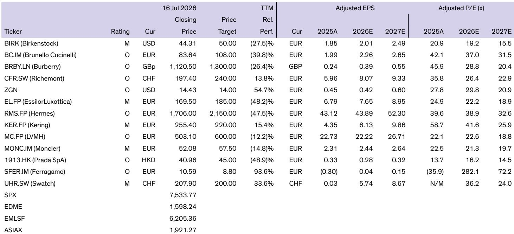
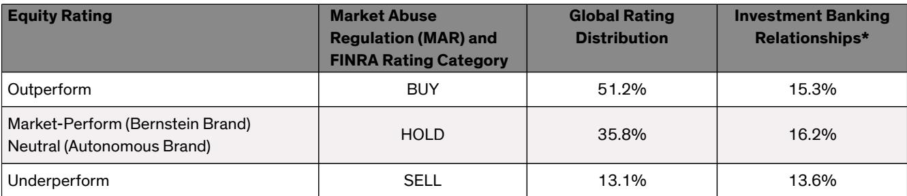
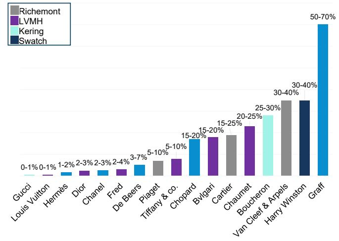

# Bernstein：全球奢侈品-高级珠宝的案例

Richemont 最新季报让市场意外——珠宝部门实现 24% 有机增长，其中约 20% 的销售额来自高级珠宝。这份Bernstein研报选择在这个时点切入一个长期被低估的品类：高级珠宝（Haute Joaillerie）。报告的核心判断是，当消费两极分化加速、AI 创造的新财富向极高端客户集中时，高级珠宝正从品牌形象工具，变成真正驱动增长的战略品类。

这不是一个关于“奢侈品卖得更贵”的故事。报告用一组数据揭示了品类结构的根本变化：过去十年，最顶层 60 万客户的人均消费增长了 48%，达到 39.3 万欧元；而 3.8 亿其他消费者的总支出反而下降了 20%。财富创造正在向极少数人倾斜，而高级珠宝恰好是这个群体的首选消费载体。

> **KC评论：** 报告最值得注意的不是高级珠宝的增速，而是它如何改变了奢侈品牌的利润结构。传统上高级珠宝利润率低于设计珠宝（EBIT 10-20% vs 40-50%），但 Richemont 的案例表明，当它成为获取高质量客户的核心入口时，整体回报逻辑就变了。

## 1. 高级珠宝的悖论：利润最低，但战略价值最高

报告揭示了一个反直觉的事实：高级珠宝的毛利率只有 50-60%，远低于设计珠宝的 70-80%；库存周转超过一年，而设计珠宝不到六个月。Richemont 主席 Johann Rupert 在财报会上直言：“珠宝越高级，利润率越低。”

但正是这个低利润品类，正在成为奢侈品牌争夺高质量客户的核心战场。报告指出，高级珠宝本质上就是珠宝界的“高级定制”——单价极高、产量极低、品牌光环极强。对于大多数品牌而言，它更多是品牌建设和客户获取的工具，而非利润中心。然而，随着极高端客户对独一无二作品的需求持续增长，这个动态正在改变。

## 2. 品牌集体加码：从 Gucci 到 Hermès 的品类扩张

报告列举了多个品牌在高级珠宝领域的战略动作。Gucci 在 2019 年推出了首个高级珠宝系列；Hermès 正在加倍投入，计划在 2027 年 1 月高级定制时装周前推出品牌史上最大规模的高级珠宝系列；Chanel 从 Cartier 挖来了资深高管 Marie-Laure Cérède 担任珠宝工作室总监；Tiffany 则将高级珠宝作为品牌转型的核心支柱，在伦敦、东京和首尔举办了大型展览。

这些动作背后有一个共同逻辑：当大众奢侈品市场增长节奏变化时，高质量客户成为相对少见还在加速增长的群体。而高级珠宝是获取这批客户最高效的入口。

## 3. 地理迁移：北美正在成为下一个增长极

报告提到，高级珠宝的销售活动已经从巴黎旺多姆广场扩展到科莫湖、圣特罗佩、威尼斯等整理版目的地。大中华区、东南亚和中东是近年增长的主要驱动力，但北美正展现出类似其他奢侈品品类的巨大潜力。

这与市场普遍认知不同——很多人认为高级珠宝的增长主要依赖中东和亚洲买家。报告暗示，北美市场的结构性机会可能被低估，尤其是在 AI 驱动的财富创造加速的背景下。

## 4. 一个可复用的观察框架：如何判断一个品牌的高级珠宝战略是否有效

报告虽然没有直接给出框架，但从其分析逻辑中可以提炼出三个关键指标：第一，高级珠宝在品牌总收入中的占比及其变化趋势；第二，品牌是否愿意为高级珠宝投入长期资源（如独立工作室、专属设计师、全球巡展）；第三，高级珠宝是否真正转化为品牌溢价和客户忠诚度，而非仅仅是短期销售刺激。

Chaumet 的案例值得关注：其 CEO 提到，高端珠宝需求韧性极强，但价格在 15 万欧元左右的作品需要更多创新才能吸引客户。这意味着，品牌在高级珠宝上的投入不能简单复制，而需要真正的设计能力和工艺积累。

> **KC评论：** 报告没有展开的是，高级珠宝的竞争壁垒比设计珠宝高得多——它依赖的不只是品牌，还有宝石采购网络、工匠资源和长达数年的作品开发周期。这解释了为什么新进入者很难在短期内建立竞争力。

---

For informational purposes only. Portions may be generated,translated,summarized,or edited with AI assistance based on source materials and may contain omissions or errors. Please verify independently. This is not investment,legal,tax,accounting,or other professional advice.

For informational purposes only. Portions may be generated,translated,summarized,or edited with AI assistance based on source materials and may contain omissions or errors. Please verify independently. This is not investment,legal,tax,accounting,or other professional advice.

