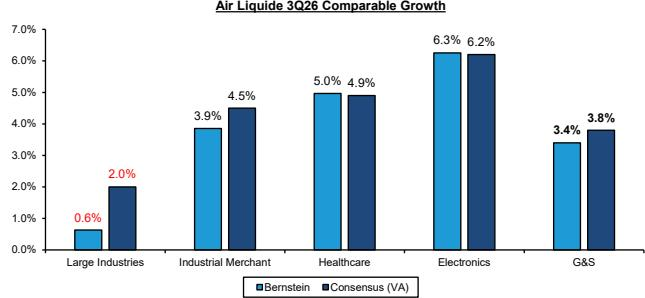
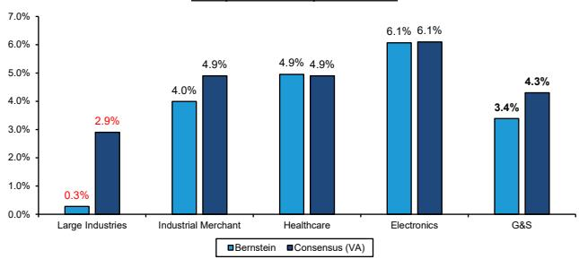
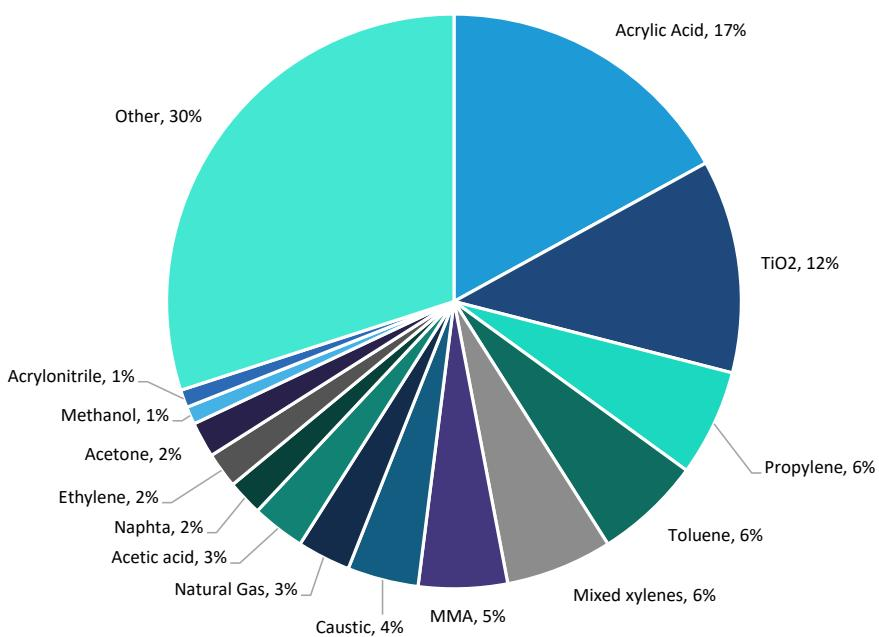
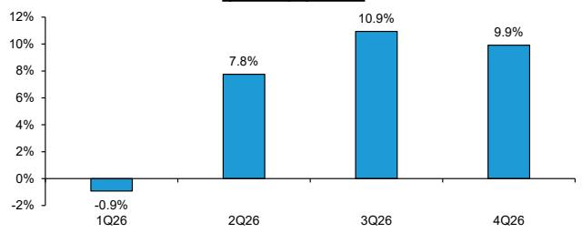
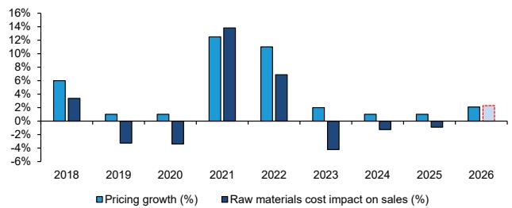

# Chemicals 2Q26 Preview: A tactical long and a couple of prints to be managed

James Hooper

+44 20 7676 6995

james.hooper@bernsteinsg.com

Sebastien Afoy

+44 207 762 1032

sebastien.afoy@bernsteinsg.com

Specialist Sales

James Brady

+44 20 7762 5272

james.brady@bernsteinsg.com

Steve Song

+1 917 344 8401

steve.song@bernsteinsg.com

We expect a mostly solid set of 2Q26 results from our coverage, with few fireworks after BASF pre-announced. We're only expecting further guidance raises from the US industrial gases, and even those by less than $1\%$ on average. Our highest conviction tactical call is long Akzo Nobel, where we think consensus' forecast of a guidance cut is too bearish, and we have asterisks on the prints of Air Liquide, where we believe fundamentals are fine but comparable growth expectations a little bullish, and Solvay, where a miss could be severely punished.

Our highest conviction tactical call is long Akzo Nobel. While we are more in-line for Akzo's 2Q26's EBITDA, our various consensus sources are all telling us that Akzo will cut their FY26 EBITDA guidance of €1.47bn+ (Company €1,420m, Bloomberg €1,424m, Visible Alpha €1,423m). We believe a guidance cut at 2Q26 is highly unlikely and model 2026 EBITDA of €1.48bn. We see limited evidence of sufficient volume declines to change the Company's guidance views. And on the cost side, under our forecasts of their raw material basket (Exhibit 6), only LSD +ve pricing across 2026 is required for the neutral raw material spread assumed by guidance. Higher pricing and resilient volumes could even be a source of 3Q upside to guidance, if Akzo follow their playbook from 1Q results. While we are less certain on the medium-term outlook for Akzo, we like the stock into results.

Slightly cautious on Air Liquide because of growth expectations, but we see fundamentals as sound. Air Liquide sold off after 1Q26 because of their growth commentary (see report Air Liquide 1Q26: Who is the guidance for?), although the shares recovered as the guidance proved conservative. We are worried that something similar may happen with H1 results. Consensus is again forecasting accelerating sequential comparable growth in 2H vs. 2Q. We are slightly less bullish than consensus, mainly through Large Industries (Exhibit 2), where we do not forecast an on-site volume demand inflection outside the Americas, nor materially more ramp-ups outside of Normand'Hy. Despite our lower growth forecasts, we are in-line with FY26 profitability estimates, as in this pricing environment and with their ongoing cost initiatives, we believe Air Liquide will be able to compensate on margins (BernE 2H26 OIR margin improvement +130bps).

For Solvay's print we see risk-reward relatively negatively. We are modelling an in-line 2Q26 EBITDA result, based on sufficient acceleration at Coatis to cover for pricing lags and closures elsewhere (Exhibit 11). However, a miss is likely to lead to investor concerns about Solvay's ability to reach the bottom of their guidance range, whilst even a small beat (e.g. c. \~€185m EBITDA) still puts FY26 guidance under threat from low-demand inflationary environment (Chemicals: Specialty or Commodity, with potentially tough times in between). For Solvay, we model enough sequential underlying EBITDA improvement to reach 2026 guidance, assuming that the Sadara peroxides plant restarts by Q4, and there is no further major raw material inflation, as pricing in some businesses (e.g. silicas) is passed on with a lag. However, we are not modelling a further deterioration in either demand or soda ash pricing, which would make us more bearish.

BERNSTEIN TICKER TABLE

<table><tr><td rowspan="2">Ticker</td><td rowspan="2">Rating</td><td colspan="3">15 Jul 2026</td><td colspan="2">TTM</td><td colspan="4">Adjusted EPS</td><td colspan="3">Adjusted P/E (x)</td></tr><tr><td></td><td>Closing Price</td><td>Price Target</td><td>Rel. Perf.</td><td>Cur</td><td>2025A</td><td>2026E</td><td>2027E</td><td>2025A</td><td>2026E</td><td>2027E</td><td></td></tr><tr><td>AI.FP (Air Liquide)</td><td>O</td><td>EUR</td><td>175.14</td><td>189.00</td><td>(6.6)%</td><td>EUR</td><td>6.70</td><td>6.76</td><td>7.06</td><td>28.7</td><td>28.7</td><td>26.1</td><td></td></tr><tr><td>OLD</td><td></td><td></td><td></td><td>207.00</td><td></td><td></td><td></td><td>7.39</td><td>8.14</td><td></td><td></td><td></td><td></td></tr><tr><td>APD (Air Products )</td><td>O</td><td>USD</td><td>293.69</td><td>345.00</td><td>(18.7)%</td><td>USD</td><td>12.07</td><td>13.28</td><td>14.64</td><td>24.3</td><td>22.1</td><td>20.1</td><td></td></tr><tr><td>OLD</td><td></td><td></td><td></td><td>344.00</td><td></td><td></td><td></td><td>13.25</td><td></td><td></td><td></td><td></td><td></td></tr><tr><td>AKZA.NA (Akzo Nobel)</td><td>M</td><td>EUR</td><td>57.02</td><td>60.00</td><td>(22.2)%</td><td>EUR</td><td>3.63</td><td>3.97</td><td>4.26</td><td>15.7</td><td>14.4</td><td>13.4</td><td></td></tr><tr><td>OLD</td><td></td><td></td><td></td><td>59.00</td><td></td><td></td><td></td><td>3.99</td><td>4.24</td><td></td><td></td><td></td><td></td></tr><tr><td>AKE.FP (Arkema)</td><td>M</td><td>EUR</td><td>56.25</td><td>61.00</td><td>(26.6)%</td><td>EUR</td><td>4.34</td><td>4.42</td><td>5.02</td><td>13.0</td><td>12.7</td><td>11.2</td><td></td></tr><tr><td>OLD</td><td></td><td></td><td></td><td>68.00</td><td></td><td></td><td></td><td>4.62</td><td>5.24</td><td></td><td></td><td></td><td></td></tr><tr><td>BAS.GR (BASF)</td><td>O</td><td>EUR</td><td>47.98</td><td>61.00</td><td>(3.7)%</td><td>EUR</td><td>2.24</td><td>2.62</td><td>2.78</td><td>21.4</td><td>18.3</td><td>17.3</td><td></td></tr><tr><td>BOROUGE.UH (Borouge)</td><td>M</td><td>AED</td><td>2.42</td><td>2.45</td><td>(25.3)%</td><td>USD</td><td>0.04</td><td>0.02</td><td>0.05</td><td>17.9</td><td>26.6</td><td>12.9</td><td></td></tr><tr><td>OLD</td><td></td><td></td><td></td><td>2.48</td><td></td><td></td><td></td><td>0.03</td><td></td><td></td><td></td><td></td><td></td></tr><tr><td>CLN.SW (Clariant)</td><td>M</td><td>CHF</td><td>7.83</td><td>8.00</td><td>(21.6)%</td><td>CHF</td><td>0.68</td><td>0.62</td><td>0.73</td><td>11.6</td><td>12.7</td><td>10.7</td><td></td></tr><tr><td>OLD</td><td></td><td></td><td></td><td>8.30</td><td></td><td></td><td></td><td>0.64</td><td>0.75</td><td></td><td></td><td></td><td></td></tr><tr><td>LIN.UW (Linde)</td><td>O</td><td>USD</td><td>514.15</td><td>559.00</td><td>(6.2)%</td><td>USD</td><td>16.46</td><td>18.02</td><td>19.89</td><td>31.2</td><td>28.5</td><td>25.9</td><td></td></tr><tr><td>OLD</td><td></td><td></td><td></td><td>561.00</td><td></td><td></td><td></td><td>18.10</td><td>19.99</td><td></td><td></td><td></td><td></td></tr><tr><td>PPG (PPG )</td><td>O</td><td>USD</td><td>115.31</td><td>130.00</td><td>(20.5)%</td><td>USD</td><td>7.64</td><td>7.92</td><td>8.71</td><td>15.1</td><td>14.6</td><td>13.2</td><td></td></tr><tr><td>OLD</td><td></td><td></td><td></td><td></td><td></td><td></td><td></td><td>7.95</td><td>8.75</td><td></td><td></td><td></td><td></td></tr><tr><td>SOLB.BB (Solvay)</td><td>M</td><td>EUR</td><td>26.50</td><td>26.20</td><td>(23.9)%</td><td>EUR</td><td>2.82</td><td>2.24</td><td>2.65</td><td>9.4</td><td>11.8</td><td>10.0</td><td></td></tr><tr><td>OLD</td><td></td><td></td><td></td><td>26.60</td><td></td><td></td><td></td><td>2.28</td><td>2.74</td><td></td><td></td><td></td><td></td></tr><tr><td>SYENS.BB (Syensqo)</td><td>O</td><td>EUR</td><td>68.55</td><td>71.00</td><td>(15.9)%</td><td>EUR</td><td>3.72</td><td>3.80</td><td>4.31</td><td>18.4</td><td>18.0</td><td>15.9</td><td></td></tr><tr><td>OLD</td><td></td><td></td><td></td><td>70.00</td><td></td><td></td><td></td><td>3.85</td><td>4.36</td><td></td><td></td><td></td><td></td></tr><tr><td>EDME</td><td></td><td></td><td>1,598.24</td><td></td><td></td><td></td><td></td><td></td><td></td><td></td><td></td><td></td><td></td></tr><tr><td>SPX</td><td></td><td></td><td>7,533.77</td><td></td><td></td><td></td><td></td><td></td><td></td><td></td><td></td><td></td><td></td></tr></table>

PRICE TARGET CHANGE / ESTIMATE CHANGE IN BOLD

O - Outperform, M - Market-Perform, U - Underperform, NR - Not Rated, CS - Coverage Suspended

AI.FP valuation is Reported P/E (x);

Source: Bloomberg, Bernstein estimates and analysis.

## INVESTMENT IMPLICATIONS

Our updated sector thesis is in Chemicals: Specialty or Commodity, with potentially tough times in between.

In preference order, we rate Linde, Air Products, BASF, Air Liquide, PPG and Syensqo Outperform. We rate Akzo Nobel, Arkema, Borouge, Clariant and Solvay Market-Perform.

Model updates: we make a series of mostly minor update based on our recent conversations with the companies. For the details of the model updates and the links to our recent company call updates, please see page 12 onwards.

## DETAILS

EXHIBIT 1: Industrial Gases Earnings Cheat Sheet

<table><tr><td colspan="5">Industrial Gases earnings cheat sheet</td></tr><tr><td colspan="2"></td><td>Air Liquide (€)</td><td>Linde ($)</td><td>Air Products ($) (2Q26)</td></tr><tr><td colspan="2">Expectations Bar / Momentum</td><td>MEDIUM</td><td>HIGH</td><td>HIGH</td></tr><tr><td colspan="2">What should matter most</td><td>Margins and commentary around growth</td><td>Beating / Guidance</td><td>Beating / Guidance</td></tr><tr><td colspan="2">Current Guidance</td><td>Increase op. margin and recurring net profit at cc.</td><td>2Q EPS $4.40-4.5026E EPS $17.60-17.90 (7-9% growth)</td><td>3QFY EPS $3.25-3.35FY26E EPS $13.00-13.25 (8-10% growth)</td></tr><tr><td colspan="2">Guidance Change?</td><td>No change</td><td>RAISE</td><td>RAISE</td></tr><tr><td colspan="2">BernE Guidance</td><td>Increase op. margin and recurring net profit at cc.</td><td>3Q EPS $4.50-4.6026E EPS $17.60-18.10 (7-10% growth)</td><td>FY4Q EPS $3.45-3.60FY26E EPS $13.20-13.35 (9-11% growth)</td></tr><tr><td rowspan="3">Q2 Comp. Growth</td><td>Bernstein</td><td>2.8%</td><td></td><td></td></tr><tr><td>Sell-side Consensus</td><td>2.8%</td><td></td><td></td></tr><tr><td>BERN vs. Consensus</td><td>-0.3%</td><td></td><td></td></tr><tr><td rowspan="3">H1 OIR</td><td>Bernstein</td><td>2,914</td><td></td><td></td></tr><tr><td>Sell-side Consensus</td><td>2,908</td><td></td><td></td></tr><tr><td>BERN vs. Consensus</td><td>0.2%</td><td></td><td></td></tr><tr><td rowspan="3">Cal. Q2 EPS</td><td>Bernstein</td><td></td><td>4.49</td><td>3.35</td></tr><tr><td>Sell-side Consensus</td><td></td><td>4.48</td><td>3.34</td></tr><tr><td>BERN vs. Consensus</td><td></td><td>0.1%</td><td>0.6%</td></tr><tr><td rowspan="3">Cal Q3 Comp growth / EPS</td><td>Bernstein</td><td>3.4%</td><td>4.59</td><td>3.56</td></tr><tr><td>Sell-side Consensus</td><td>4.1%</td><td>4.54</td><td>3.52</td></tr><tr><td>BERN vs. Consensus</td><td>-70bps</td><td>1.2%</td><td>1.1%</td></tr><tr><td rowspan="4">2026E OIR (mn)</td><td>Bernstein</td><td>6,095</td><td></td><td></td></tr><tr><td>Sell-side Consensus</td><td>6,081</td><td></td><td></td></tr><tr><td>BERN Y/Y Growth</td><td>9.2%</td><td></td><td></td></tr><tr><td>BERN vs. Consensus</td><td>0.2%</td><td></td><td></td></tr><tr><td rowspan="4">FY26E EPS</td><td>Bernstein</td><td>6.76</td><td>18.02</td><td>13.28</td></tr><tr><td>Sell-side Consensus</td><td>6.43</td><td>17.86</td><td>13.22</td></tr><tr><td>BERN Y/Y Growth</td><td>0.8%</td><td>9.5%</td><td>10.0%</td></tr><tr><td>BERN vs. Consensus</td><td>5.1%</td><td>0.9%</td><td>0.4%</td></tr><tr><td colspan="2">Upside Potential</td><td>MEDIUM</td><td>MEDIUM</td><td>MEDIUM</td></tr><tr><td colspan="2">Downside Potential</td><td>MEDIUM</td><td>MEDIUM</td><td>MEDIUM</td></tr></table>

Vara consensus for Air Liquide except 3Q comp growth (VA). Bloomberg for LIN and APD  
Source: Company information, Vara, Bloomberg, Visible Alpha, Bernstein estimates and analysis

Air Liquide's consensus comparable growth expectations may be slightly elevated in 2H26, as we are slightly more bearish on Large Industries. Air Liquide sold off after 1Q26 based on conservative comparable growth guidance (see report Air Liquide 1Q26: Who is the guidance for?). We are worried that something similar may happen with H1 results. 2025's comps are similar across 2Q and 2H, so the acceleration in growth will need to come from fundamentals. We continue to forecast volume growth in Large Industries in the Americas (5% 3Q, 2.5% 4Q), but do not expect European or Asian on-site volumes to materially improve in 2H26 absent more clarity on the Strait of Hormuz crisis. We therefore do not forecast an acceleration of Large Industries growth, unlike consensus, and we also believe the hydrogen start-ups which could deliver volume growth outside Normand'Hy are not due until 2027, and even Normand'Hy itself may not generate substantial revenues in the start-up phase.

Air Liquide 4Q26 Comparable Growth

We are less concerned about FY26 profitability, however. c. 70bps lower growth over H2 means only a c. €100m / 3% reduction in 2H OIR and therefore a c. 1.6% reduction in FY OIR by our estimates (assuming +100bps margins); in this pricing environment and with their ongoing cost initiatives, we believe Air Liquide will be able to compensate; we model 2H underlying margin improvement of +130bps. We reiterate our position that we think the underlying business is performing solidly, but this is more about managing investor expectations.

EXHIBIT 2: We see potential for a speed bump in Air Liquide's 2H26 growth expectations from Large Industries (1/2)  
  
Source: Company information, Visible Alpha, Bernstein analysis

EXHIBIT 3: We see potential for a speed bump in Air Liquide's 2H26 growth expectations from Large Industries (2/2)  
  
Source: Company information, Visible Alpha, Bernstein analysis and estimates

EXHIBIT 4: Paints & Coatings 2Q26 Cheat Sheet

<table><tr><td colspan="4">Paints &amp; Coatings earnings cheat sheet</td></tr><tr><td colspan="2"></td><td>Akzo Nobel (€)</td><td>PPG ($)</td></tr><tr><td colspan="2">Expectations Bar / Momentum</td><td>MEDIUM</td><td>MEDIUM</td></tr><tr><td colspan="2">What should matter most</td><td>FY26 Guidance and commentary</td><td>FY26 Guidance and commentary</td></tr><tr><td colspan="2">Current Guidance</td><td>2026E EBITDA: ~€1,470m</td><td>FY26E EPS: $7.70-8.102Q26E EPS: flat to +LSD</td></tr><tr><td colspan="2">Guidance Change?</td><td>No change</td><td>No change</td></tr><tr><td colspan="2">BernE FY26 Guidance</td><td>2026E EBITDA: ~€1,470m</td><td>2026E EPS: $7.70-8.103Q26E EPS: $2.10-2.20</td></tr><tr><td rowspan="3">2Q26E EBITDA (mn)</td><td>Bernstein</td><td>400</td><td></td></tr><tr><td>Sell-side Consensus</td><td>392</td><td></td></tr><tr><td>BERN vs. Consensus</td><td>2.0%</td><td></td></tr><tr><td rowspan="3">2Q26E EPS</td><td>Bernstein</td><td></td><td>2.26</td></tr><tr><td>Sell-side Consensus</td><td></td><td>2.24</td></tr><tr><td>BERN vs. Consensus</td><td></td><td>0.7%</td></tr><tr><td rowspan="3">3Q26E EBITDA (mn)</td><td>Bernstein</td><td>399</td><td></td></tr><tr><td>Sell-side Consensus</td><td>378</td><td></td></tr><tr><td>BERN vs. Consensus</td><td>5.5%</td><td></td></tr><tr><td rowspan="3">3Q26E EPS</td><td>Bernstein</td><td></td><td>2.14</td></tr><tr><td>Sell-side Consensus</td><td></td><td>2.12</td></tr><tr><td>BERN vs. Consensus</td><td></td><td>0.9%</td></tr><tr><td rowspan="4">26E EBITDA (mn)</td><td>Bernstein</td><td>1,476</td><td></td></tr><tr><td>Sell-side Consensus</td><td>1,420</td><td></td></tr><tr><td>BERN Y/Y Growth</td><td>2.2%</td><td></td></tr><tr><td>BERN vs. Consensus</td><td>3.9%</td><td></td></tr><tr><td rowspan="4">26E EPS</td><td>Bernstein</td><td></td><td>7.92</td></tr><tr><td>Sell-side Consensus</td><td></td><td>7.86</td></tr><tr><td>BERN Y/Y Growth</td><td></td><td>3.8%</td></tr><tr><td>BERN vs. Consensus</td><td></td><td>0.8%</td></tr><tr><td colspan="2">Upside Potential</td><td>HIGH</td><td>MEDIUM</td></tr><tr><td colspan="2">Downside Potential</td><td>MEDIUM</td><td>MEDIUM</td></tr></table>

Akzo consensus from the company (Visible Alpha), PPG consensus from Visible Alpha

Source: Company information, Visible Alpha, Bernstein analysis and estimates

We see no guidance cut for Akzo Nobel with 2Q, so consider consensus too bearish. The end consumer has showed some resilience in 2026 to date, meaning we see little reason for a guidance cut based on the volume trajectory. We see the greater threat as raw material inflation constraining profitability. Forecasts for our estimate of Akzo's raw material basket indicate HSD-LDD raw material inflation over 2Q-4Q 2026, which we believe can be offset by c. 2% pricing (Exhibit 5 - Exhibit 7). We see this as very realistic given Akzo's pricing power historically. Given 2026 guidance assumptions factored in \~ flat raw material inflation, we see little reason for the company to change these assumptions at this time. Our forecast of €1,476m is aligned with guidance of €1.47bn+, meaning we consider consensus too bearish.

EXHIBIT 5: Akzo's raw materials cost exposure tilts towards Acrylic Acid and TiO2  
Akzo Nobel - Raw Materials mix (%)  
  
Source: Company information, Bernstein analysis and estimates  
EXHIBIT 6: We see double digit raw material costs increase for the second half of the year  
Akzo Nobel raw materials cost increase quarter by quarter (%) - 2026

  
Source: Company information, ICIS, Bloomberg, Bernstein analysis and estimates  
EXHIBIT 7: Given Akzo's track record of pricing net of inflation, we believe they can pass on the costs  
Akzo Nobel pricing growth vs raw materials cost impact on sales (%) - 2018/2026E

  
Source: Company information, ICIS, Bloomberg, Bernstein analysis and estimates

EXHIBIT 8: 2Q26 Industrial Chemicals Cheat Sheet

<table><tr><td colspan="8">Industrial Chemicals earnings cheat sheet</td></tr><tr><td colspan="2"></td><td>Arkema (€)</td><td>BASF (€)</td><td>Borouge (USD)</td><td>Clariant (CHF)</td><td>Solvay (€)</td><td>Syensqo (€)</td></tr><tr><td colspan="2">Expectations Bar / Momentum</td><td>MEDIUM</td><td>N/A (pre-announced)</td><td>LOW</td><td>MEDIUM</td><td>MEDIUM</td><td>MEDIUM</td></tr><tr><td colspan="2">What should matter most</td><td>Demand differences across the divisions</td><td>Conversion of EBITDA to FCF</td><td>Update on production and sales volumes</td><td>Catalyst recovery trajectory &amp; pricing update</td><td>Sources of acceleration to reach guidance</td><td>Sources of acceleration to reach guidance</td></tr><tr><td colspan="2">Current Guidance</td><td>26E EBITDA: Slight EBITDA growth at cc</td><td>26E EBITDA: €6.9-7.7bn26E FCF: €1.5-2.3bn</td><td>26E Dividend 16.2 AED fils / share</td><td>26E: ~Flat LC revenue growth, ~18% EBITDA Margin</td><td>26E EBITDA: €770-850m26E FCF: €200m+</td><td>26E EBITDA: ~€1.1bn26E OCF: ~€700m</td></tr><tr><td colspan="2">Guidance Change?</td><td>No change</td><td>N/A</td><td>No change</td><td>No change</td><td>No change</td><td>No change</td></tr><tr><td colspan="2">BernE 2026 Guidance</td><td>26E EBITDA: Slight EBITDA growth at cc</td><td>N/A</td><td>26E Dividend 16.2 AED fils / share</td><td>26E: ~Flat LC revenue growth, ~18% EBITDA Margin</td><td>26E EBITDA: €770-850m26E FCF: €200m+</td><td>26E EBITDA: ~€1.1bn26E OCF: ~€700m</td></tr><tr><td rowspan="3">2Q26E EBITDA (mn)</td><td>Bernstein</td><td>376</td><td></td><td>415</td><td>157</td><td>181</td><td>292</td></tr><tr><td>Sell-side Consensus</td><td>362</td><td></td><td>431</td><td>155</td><td>181</td><td>291</td></tr><tr><td>BERN vs. Consensus</td><td>3.9%</td><td></td><td>-3.7%</td><td>1.0%</td><td>-0.4%</td><td>0.4%</td></tr><tr><td rowspan="3">3Q26E EBITDA (mn)</td><td>Bernstein</td><td>336</td><td></td><td>468</td><td>165</td><td>192</td><td>302</td></tr><tr><td>Sell-side Consensus</td><td>329</td><td></td><td>644</td><td>164</td><td>187</td><td>298</td></tr><tr><td>BERN vs. Consensus</td><td>2.2%</td><td></td><td>-27.4%</td><td>0.4%</td><td>2.8%</td><td>1.5%</td></tr><tr><td rowspan="4">26E EBITDA (mn)</td><td>Bernstein</td><td>1,274</td><td></td><td></td><td>666</td><td>774</td><td>1,110</td></tr><tr><td>BERN Y/Y Growth</td><td>1.8%</td><td></td><td></td><td>-4.4%</td><td>-12.1%</td><td>-6.6%</td></tr><tr><td>Sell-side Consensus</td><td>1,259</td><td></td><td></td><td>668</td><td>778</td><td>1,095</td></tr><tr><td>BERN vs. Consensus</td><td>1.2%</td><td></td><td></td><td>-0.3%</td><td>-0.4%</td><td>1.4%</td></tr><tr><td colspan="2">Upside Potential</td><td>MEDIUM</td><td>MEDIUM</td><td>MEDIUM</td><td>MEDIUM</td><td>MEDIUM</td><td>MEDIUM</td></tr><tr><td colspan="2">Downside Potential</td><td>MEDIUM</td><td>MEDIUM</td><td>LOW</td><td>MEDIUM</td><td>MEDIUM</td><td>MEDIUM</td></tr></table>

Company consensus for AKE, Vara for Clariant, Solvay, Bloomberg for Syensqo, Borouge Source: Company information, Bloomberg, Vara, Bernstein estimates and analysis

Two companies need to show accelerating growth in 2H - we have more concerns about Solvay. Our breakdowns of our modelled EBITDA growth for both companies are included in Exhibit 9 to Exhibit 11. For Syensqo, we are more comfortable with the elements of the hockey stick, with an electronics recovery supporting base EBITDA estimates if there is further weakness in other end markets. For Solvay, we model enough sequential underlying EBITDA improvement to reach 2026 guidance, assuming that the Sadara peroxides plant restarts by Q4, and there is no further major raw material inflation, as pricing in some divisions (e.g. silicas) is passed on with a lag. However, we are not modelling a further deterioration in either demand or soda ash pricing. This would cause downwards revisions to our estimates, and may lead to a change in guidance, albeit consensus is already relatively close to the bottom of guidance.

For Sol
