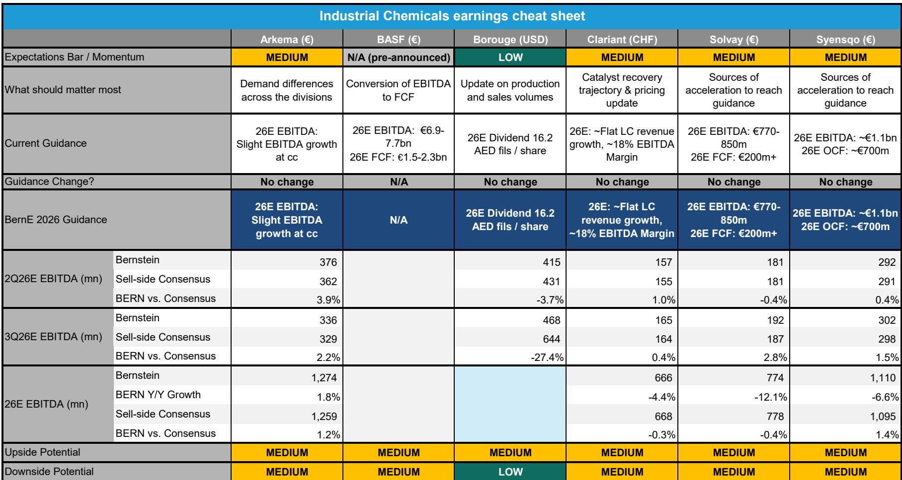
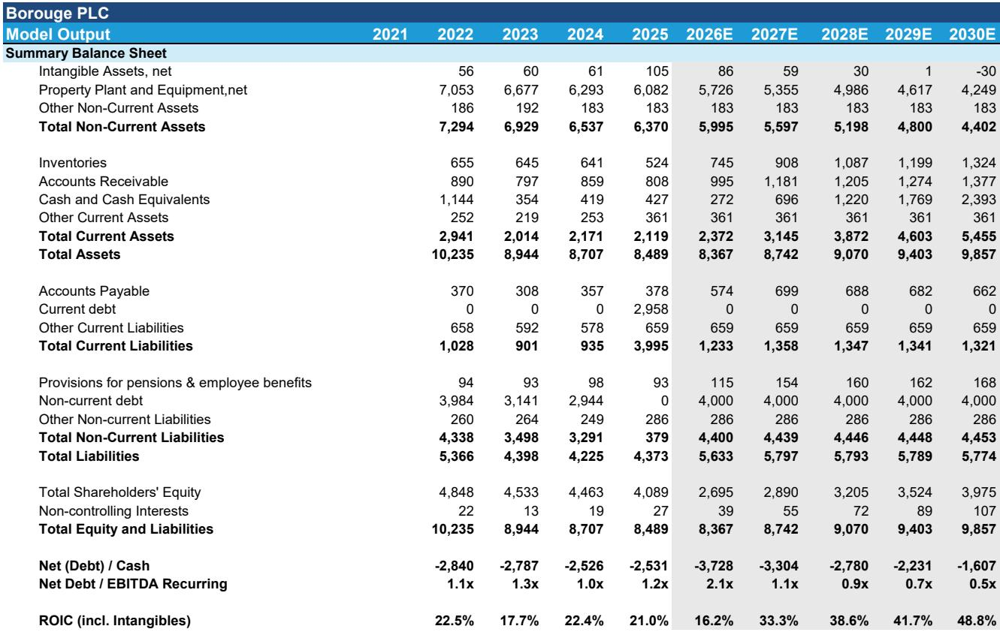
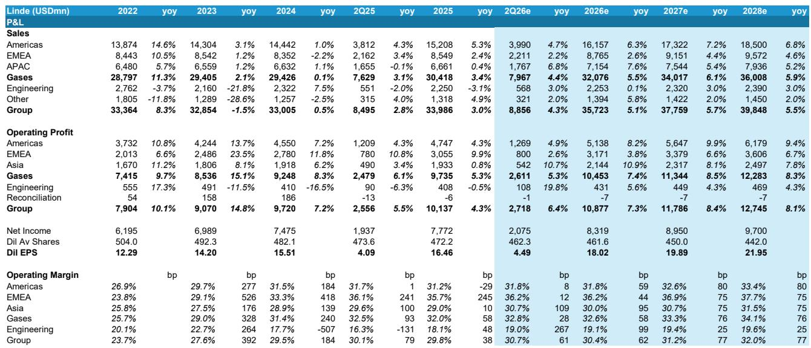

# Akzo Nobel Is the Tactical Opportunity in Chemicals This Quarter;Air Liquide and Solvay Demand Careful Handling

The second-quarter 2026 earnings season for European chemicals companies will be dominated not by dramatic beats or misses,but by the management of expectations around guidance. BASF has already pre-announced,removing much of the suspense from that name. What remains are three specific situations where the consensus view diverges sharply from the fundamentals,creating either a tactical opportunity or a trap. The highest-conviction call is to go long Akzo Nobel into its print,where the market is pricing in a guidance cut that the underlying data simply does not support. Conversely,Air Liquide faces a more nuanced risk:the business is sound,but consensus growth expectations for the second half are too high,setting the stage for a repeat of the post-1Q26 selloff. Solvay presents a different kind of danger,where even a modest miss could trigger an outsized punishment given the fragility of investor confidence in its full-year target.

This is not a quarter for broad sector bets. The macro backdrop remains mixed,with demand signals that are resilient but not strong,and raw material inflation that is real but manageable for those with pricing power. The dispersion of outcomes across the coverage universe is wide enough to reward stock-specific conviction. The key is to distinguish between companies where the earnings trajectory is genuinely under pressure and those where the market has simply become too bearish on a narrative that does not match the numbers.

## Consensus Is Too Bearish on Akzo Nobel:A Guidance Cut at 2Q26 Is Highly Unlikely

The consensus view on Akzo Nobel has turned decisively negative. Across multiple data sources,the average expectation is that management will use the 2Q26 release to lower its full-year 2026 EBITDA guidance from the current €1.47 billion target. That view is based on a plausible-sounding story:raw material costs are rising,and volumes may be softening. But the evidence for a volume-driven cut is thin. The end consumer has shown resilience in 2026 to date,and there is limited evidence of sufficient volume declines to change the company's guidance views.

The real threat is raw material inflation,not demand destruction. Forecasts for Akzo's raw material basket point to high-single-digit to low-double-digit inflation over the second through fourth quarters of 2026. That is a headwind,but it is a manageable one. Akzo has historically demonstrated the ability to pass through cost increases via pricing,and the required offset is modest. Under the current raw material forecasts,only low-single-digit positive pricing across 2026 is needed to maintain the raw material spread that the guidance assumes. That is well within Akzo's track record.

The arithmetic supports the argument. Bernstein models 2026 EBITDA of €1.48 billion,which is aligned with the company's stated guidance of €1.47 billion plus. The consensus of around €1.42 billion is simply too low. If Akzo follows the same playbook as it did after 1Q results,higher pricing and resilient volumes could even provide a source of upside to guidance later in the year,rather than the cut that the market expects. The medium-term outlook for the company may be less certain,but the tactical setup into the 2Q print is clear:the risk-reward is skewed to the upside because the bear case is already priced in,and the data does not support it.

## Air Liquide Has Sound Fundamentals but Faces a Growth Expectation Trap in the Second Half

Air Liquide's 1Q26 results triggered a selloff because the company's growth commentary disappointed the market. The shares later recovered as the guidance proved conservative,but the pattern is instructive. Consensus is once again forecasting accelerating sequential comparable growth in the second half versus the second quarter. That expectation may be too optimistic,and the risk of a repeat of the post-1Q26 volatility is real.

The source of the potential disappointment is Large Industries. Consensus appears to be building in an inflection in on-site volume demand in the second half,particularly outside the Americas. That assumption is questionable. There is no clear evidence of a material improvement in European or Asian on-site volumes,absent more clarity on the Strait of Hormuz crisis. The hydrogen start-ups that could deliver volume growth are not expected until 2027,and even the Normand'Hy project may not generate substantial revenues during its start-up phase. The comparable growth base is similar across the second quarter and the second half,so any acceleration must come from genuine fundamental improvement,not easy comps.

The concern is not about full-year profitability. Air Liquide has ample levers to compensate for slightly lower growth. With a pricing environment that remains supportive and ongoing cost initiatives,the company can offset a roughly 70-basis-point shortfall in second-half growth through margin improvement. The model assumes a 130-basis-point improvement in second-half operating margin. The risk is therefore not to earnings,but to investor sentiment. If the market was disappointed by conservative growth commentary in April,it may react similarly to a print that fails to show the acceleration that consensus expects. The underlying business is performing solidly,but managing expectations around the growth trajectory is the key challenge for this print.

## Solvay's Risk-Reward Is Negatively Skewed:A Miss Will Be Severely Punished

Solvay enters the 2Q26 print with a fragile setup. The base case is an in-line result,assuming sufficient acceleration at Coatis to cover for pricing lags and closures elsewhere. But the margin for error is very thin. Even a small beat would still leave the full-year guidance under threat,given the low-demand,inflationary environment. A miss would be far more damaging.

The reason is structural. Investor confidence in Solvay's ability to reach the bottom of its guidance range is already tenuous. The model for the full year depends on a series of specific assumptions:sequential underlying EBITDA improvement through the year,a restart of the Sadara peroxides plant by the fourth quarter,and no further major raw material inflation,as pricing in some businesses such as silicas is passed on with a lag. If any of these assumptions fail,the guidance becomes difficult to achieve. The model does not assume a further deterioration in demand or a decline in soda ash pricing,which would make the outlook significantly worse.

The asymmetry is clear. An in-line print will be greeted with relief,but it is unlikely to generate enthusiasm because the full-year target remains in question. A miss,however,will trigger immediate concerns about the achievability of guidance,and the stock could be punished severely. The risk-reward is negatively skewed,and investors should approach the print with caution. This is a name where the burden of proof is on the company to deliver,and the market is not in a forgiving mood.

## A Decision Framework for the 2Q26 Chemicals Earnings Season

The three names discussed above represent distinct risk profiles that require different investment approaches. A useful framework is to classify each situation by the alignment between consensus expectations and the fundamental trajectory.

**Akzo Nobel falls into the "consensus too bearish" category.** The market is pricing in a negative event—a guidance cut—that the data does not support. The volume trajectory is resilient,the raw material headwind is manageable,and the company has the pricing power to offset it. The tactical trade is to go long into the print,accepting that the medium-term outlook may be less clear but recognizing that the immediate risk-reward is favorable. The key question to monitor is whether pricing momentum is sufficient to cover raw material inflation,and the evidence suggests it will be.

**Air Liquide is a "fundamentals sound,expectations elevated" case.** The business is performing well,and full-year profitability is not at risk. But the market is expecting an acceleration in comparable growth that may not materialize,creating a sentiment risk. The appropriate approach is to be cautious on the print itself,not because the company is deteriorating,but because the bar for investor reaction is set too high. The stock may offer a better entry point after the print,once the growth expectations have been reset to a more realistic level.

**Solvay is a "low margin for error" situation.** The base case is achievable,but the assumptions required to reach it are numerous and vulnerable. The risk-reward is negatively skewed because the downside from a miss is larger than the upside from an in-line result. The prudent approach is to avoid the print or to hedge the exposure,recognizing that even a good result may not be enough to rebuild confidence in the full-year target.

This framework can be applied more broadly across the sector. The key variable is not whether companies will beat or miss by a few percent. It is whether the narrative that the market has built around each name is aligned with the underlying operational reality. In a quarter where the macro is mixed and guidance management is paramount,the winners will be those where the company's message matches the data,and the losers will be those where the market's expectations have drifted away from what is achievable.

*For informational purposes only. Portions may be generated,translated,summarized,or edited with AI assistance based on source materials and may contain omissions or errors. Please verify independently. This is not investment,legal,tax,accounting,or other professional advice.*

For informational purposes only. Portions may be generated,translated,summarized,or edited with AI assistance based on source materials and may contain omissions or errors. Please verify independently. This is not investment,legal,tax,accounting,or other professional advice.

