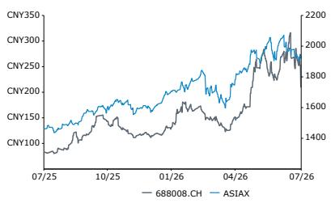
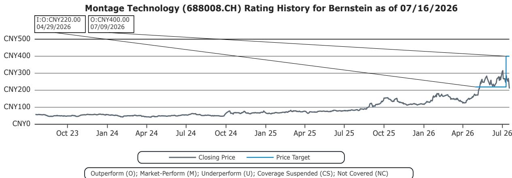

# 中国半导体行业观察

## 澜起科技

**评级**
表现优于市场

**目标价**

688008.CH 400.00 CNY

6809.HK 520.00 HKD

林清源博士
+852 2123 2654
qingyuan.lin@bernsteinsg.com

马志强
+852 2123 2626
francis.ma@bernsteinsg.com

张凯
+852 2123 2665
kai.zhang@bernsteinsg.com

# 澜起科技：2026年上半年业绩超预期；韩国调查不太可能改变基本面

2026年上半年初步业绩从营收到利润均超出预期，尽管存在汇率方面的不利因素。澜起科技2026年上半年营收同比增长26.6%至33.34亿元人民币，比彭博一致预期高3.1%，比我们的预测高0.6%。按中位数计算，归属于股东的净利润同比增长72.6%至20亿元人民币。得益于公允价值变动收益和资产处置收益的正面贡献，中位数净利润率同比扩大1596个基点至60%。重要的是，以人民币计价的业绩低估了实际业务动能：澜起科技以美元定价产品，而人民币持续升值降低了报告的营收增长。维持表现优于市场的评级。

我们不认为韩国当局的调查会对澜起科技的基本面产生实质性影响。该公司及其高管目前均未面临不当行为的指控，客户订单也未受影响。最重要的是，我们认为价格操纵的商业动机有限，且目前也没有事实支持这一说法。澜起科技在产品代际生命周期内每年都会降价；即使在当前内存价格上涨期间，内存接口芯片的价格也并未上涨。这些芯片仅占DDR模组售价的不到1%，内存制造商几乎没有动力去压低价格，因为质量比价格更重要，这也是高利润率的核心原因。因此，我们认为澜起科技的定价、营收或利润率面临的风险有限。在我们的悲观情景下，调查可能导致一次性非经常性损失，而非任何根本性变化。

过去一个月澜起科技A股30%的调整反映了主题性的内存板块抛售，但我们认为市场对澜起科技的基本面存在误解。在股价年内高点累计上涨168%之后，部分获利了结是可以理解的。然而，内存接口芯片的定价并不随内存平均售价波动，因此对内存价格上涨可持续性的担忧与澜起科技的盈利关联有限。更重要的驱动因素是用于服务器的内存比特出货量增长，这由CPU出货量的增长驱动，而CPU出货量正在稳步扩张。因此，我们认为当前由板块驱动的调整与澜起科技的基本出货量和盈利驱动因素脱节。即将公布的全球服务器CPU厂商业绩应会带来更积极的情绪。

<table><tr><td>报告每股收益</td><td>F25A</td><td>F26E</td><td>F27E</td></tr><tr><td>688008.CH (CNY)</td><td>1.97</td><td>3.21</td><td>5.68</td></tr><tr><td>6809.HK (CNY)</td><td>1.97</td><td>3.21</td><td>5.68</td></tr></table>

来源：彭博、Bernstein估计与分析。

<table><tr><td>收盘日期</td><td>2026年7月17日</td></tr><tr><td>688008.CH 收盘价 (CNY)</td><td>183.60</td></tr><tr><td>目标价 (CNY)</td><td>400.00</td></tr><tr><td>上行/（下行）空间</td><td>118%</td></tr><tr><td>52周范围</td><td>332.90/81.66</td></tr><tr><td>ASIAX</td><td>1,921.27</td></tr><tr><td>财年截止日</td><td>12月</td></tr><tr><td>股息率</td><td>0.4%</td></tr><tr><td>市值 (CNY) (百万)</td><td>226,894</td></tr><tr><td>企业价值 (CNY) (百万)</td><td>210,151</td></tr></table>

<table><tr><td>表现</td><td>年初至今</td><td>1个月</td><td>6个月</td><td>12个月</td></tr><tr><td>相对 (%)</td><td>55.9</td><td>(30.1)</td><td>28.8</td><td>112.8</td></tr><tr><td>ASIAX (%)</td><td>17.5</td><td>(5.8)</td><td>11.9</td><td>32.1</td></tr><tr><td>相对 (%)</td><td>38.4</td><td>(24.2)</td><td>16.8</td><td>80.7</td></tr></table>

来源：彭博、Bernstein估计与分析。  
价格表现，1年

<table><tr><td>估值指标</td><td>F25A</td><td>F26E</td><td>F27E</td></tr><tr><td>报告市盈率 (x)</td><td>93.2</td><td>57.3</td><td>32.3</td></tr></table>

图表1：澜起科技2026年上半年初步业绩全面超出一致预期和我们的预测

<table><tr><td colspan="4">澜起科技2026年上半年初步业绩</td></tr><tr><td></td><td>中位数</td><td>低值</td><td>高值</td></tr><tr><td>营收</td><td>3,335</td><td></td><td></td></tr><tr><td>同比</td><td>26.6%</td><td></td><td></td></tr><tr><td>Bernstein营收预测</td><td>3,316</td><td></td><td></td></tr><tr><td>同比</td><td>25.9%</td><td></td><td></td></tr><tr><td>实际 vs. Bernstein</td><td>0.6%</td><td></td><td></td></tr><tr><td>一致预期营收</td><td>3,234</td><td></td><td></td></tr><tr><td>同比</td><td>22.8%</td><td></td><td></td></tr><tr><td>实际 vs. 一致预期</td><td>3.1%</td><td></td><td></td></tr><tr><td>净利润（归属于）</td><td>2,000</td><td>1,900</td><td>2,100</td></tr><tr><td>同比</td><td>72.6%</td><td>63.9%</td><td>81.2%</td></tr><tr><td>Bernstein净利润预测</td><td>1,717</td><td></td><td></td></tr><tr><td>同比</td><td>48.2%</td><td></td><td></td></tr><tr><td>实际 vs. Bernstein</td><td>16.5%</td><td>10.6%</td><td>22.3%</td></tr><tr><td>一致预期净利润</td><td>1,689</td><td></td><td></td></tr><tr><td>同比</td><td>45.7%</td><td></td><td></td></tr><tr><td>实际 vs. 一致预期</td><td>18.4%</td><td>12.5%</td><td>24.3%</td></tr><tr><td>净利润率</td><td>60.0%</td><td>57.0%</td><td>63.0%</td></tr><tr><td>较去年变动</td><td>1596bps</td><td>1296bps</td><td>1896bps</td></tr><tr><td>Bernstein净利润率预测</td><td>51.8%</td><td></td><td></td></tr><tr><td>实际 vs. Bernstein</td><td>818bps</td><td>519bps</td><td>1118bps</td></tr><tr><td>一致预期净利润率</td><td>52.2%</td><td></td><td></td></tr><tr><td>实际 vs. 一致预期</td><td>774bps</td><td>474bps</td><td>1074bps</td></tr><tr><td>经常性净利润（归属于）</td><td>1,350</td><td>1,250</td><td>1,450</td></tr><tr><td>同比</td><td>23.7%</td><td>14.5%</td><td>32.9%</td></tr><tr><td>经常性净利润率</td><td>40.5%</td><td>37.5%</td><td>43.5%</td></tr><tr><td>同比</td><td>(95bps)</td><td>(395bps)</td><td>205bps</td></tr></table>

来源：公司报告、彭博、Bernstein分析与估计

图表2：内存接口芯片仅占模组成本的低个位数百分比，限制了接口芯片供应商面临的定价压力  
  
MRDIMM仍是一个小众产品，没有既定的合同定价记录。图表中显示的MRDIMM定价是基于公开信息的估计；总体而言，我们估计同容量下MRDIMM比RDIMM有300-350美元的溢价。
来源：TrendForce、Bernstein分析与估计

## 研究启示

我们对澜起科技的评级为表现优于市场，A股目标价为400元人民币，H股目标价为520港元。

## BERNSTEIN代码表

<table><tr><td rowspan="2"></td><td colspan="4">2026年7月17日</td><td rowspan="2">TTM相对</td><td colspan="4">报告每股收益</td><td colspan="3">报告市盈率 (x)</td></tr><tr><td>评级</td><td>货币</td><td>收盘价</td><td>目标价</td><td>当前</td><td>2025A</td><td>2026E</td><td>2027E</td><td>2025A</td><td>2026E</td><td>2027E</td></tr><tr><td>688008.CH (澜起科技)</td><td>O</td><td>CNY</td><td>183.60</td><td>400.00</td><td>80.7%</td><td>CNY</td><td>1.97</td><td>3.21</td><td>5.68</td><td>93.2</td><td>57.3</td><td>32.3</td></tr><tr><td>6809.HK (澜起科技)</td><td>O</td><td>HKD</td><td>255.00</td><td>520.00</td><td>NA</td><td>CNY</td><td>1.97</td><td>3.21</td><td>5.68</td><td>111.8</td><td>68.7</td><td>38.8</td></tr><tr><td>ASIAX</td><td></td><td></td><td>1,921.27</td><td></td><td></td><td></td><td></td><td></td><td></td><td></td><td></td><td></td></tr></table>

O - 表现优于市场, M - 与市场同步, U - 表现逊于市场, NR - 未评级, CS - 暂停覆盖  
来源：彭博、Bernstein估计与分析。

## I. 必要披露

参考文献中的"Bernstein"或"公司"涉及以下实体：Bernstein Institutional Services LLC（2024年4月1日起）、Bernstein & Co., LLC（2024年4月1日前）、Bernstein Autonomous LLP、BSG France S.A.（2024年4月1日起）、Bernstein (Hong Kong) Limited 盛博香港有限公司、Bernstein (Canada) Limited、Bernstein (India) Private Limited（SEBI注册号INH000006378）、Bernstein (Singapore) Private Limited、Bernstein Japan KK（サンフォード・C・バーンスタイン株式会社）以及根据Bernstein与SG之间的全球服务协议受雇于SG Africa Technologies & Services为Bernstein制作研究报告的分析师。

Bernstein是SG（SG）与AllianceBernstein, L.P.（AB）合资企业的一部分。除非另有特别说明，就本披露而言，提及Bernstein的"关联方"均指SG和AB及其各自的关联方。

## 估值方法

## 澜起科技

我们将A股目标价设定为400元人民币，基于50倍前瞻市盈率（27年第三季度至28年第二季度盈利）。鉴于对CPU周期和MRDIMM渗透率的更强展望，我们将2027/2028年每股收益预测分别上调至5.68元和10.82元人民币。对于H股，我们设定目标价为520港元，较A股目标价溢价15%（我们使用1:1.13的人民币兑港元汇率）。H股溢价反映了全球读者将澜起科技视为稀缺的中国AI相关标的，且不像许多其他面临实体清单限制或出口管制影响的中国半导体公司那样存在直接的地缘政治风险。在我们的目标价下，H股前瞻市盈率倍数为58倍。

## 风险

## 澜起科技

主要潜在风险：

1. 内存和AIDC服务器需求下降；
2. 竞争加剧导致份额流失和利润率下降；
3. 未能为AIDC网络市场推出新产品。

## 评级定义、基准与分布

## 股票评级定义

## Bernstein品牌

Bernstein品牌根据未来12个月相对于特定基准指数的预期相对表现对股票进行评级：美国和加拿大交易所上市股票相对于标普500指数，欧洲交易所和亚太地区以外新兴市场交易所上市股票相对于彭博欧洲发达市场大中盘价格回报指数欧元（EDME），日本交易所上市股票相对于彭博日本大中盘价格回报指数美元（JPL），亚洲（除日本）交易所上市股票相对于彭博亚洲除日本大中盘价格回报指数（ASIAX）——除非另有说明。

Bernstein品牌有三个评级类别：

- 表现优于市场：股票将跑赢市场指数超过15个百分点
- 与市场同步：股票表现将与市场指数一致，波动在+/-15个百分点以内
- 表现逊于市场：股票将落后市场指数超过15个百分点

暂停覆盖：Bernstein品牌下对某公司的覆盖已暂停。评级和目标价暂时中止，不再有效，因此不应依赖。

未评级：当股票目前无法准确估值，或无法准确预测公司表现时分配的评级。覆盖分析师可能继续发布关于该公司的研究报告，以向读者更新事件和发展。

未覆盖（NC）表示未在覆盖范围内的公司。

Bernstein品牌股票评级基于12个月的时间跨度。

## Autonomous品牌——普通股

Autonomous品牌按如下所示对普通股进行评级。我们使用的基准包括：彭博欧洲600金融价格回报指数（E600BK）和彭博欧洲发达市场金融大中盘价格回报指数欧元（EDMFI）用于发达欧洲银行和支付领域，彭博欧洲600保险价格回报指数（E600IN）用于欧洲保险公司，标普500和标普金融指数用于美国银行和支付覆盖，S5LIFE用于美国保险，标普保险精选行业指数（SPSIINS）用于美国非寿险公司覆盖，以及彭博新兴市场金融大中盘小盘价格回报指数（EMLSF）用于新兴市场银行、保险公司和支付领域。评级是相对于行业（而非市场）给出的。

Autonomous品牌有三个普通股评级类别：

- 表现优于市场（OP）：股票将跑赢相关指数超过10个百分点
- 中性（N）：股票表现将与市场指数一致，波动在+/-10个百分点以内
- 表现逊于市场（UP）：股票将落后相关指数超过10个百分点

暂停覆盖：Autonomous研究品牌下对某公司的覆盖已暂停。评级和目标价暂时中止，不再有效，因此不应依赖。

未评级：当股票目前无法准确估值，或无法准确预测公司表现时分配的评级。覆盖分析师可能继续发布关于该公司的研究报告，以向读者更新事件和发展。

标记为"特色"（例如，特色表现优于市场FOP，特色表现逊于市场FUP）的是我们的核心观点。

未覆盖（NC）表示未在覆盖范围内的公司。

Autonomous品牌普通股评级基于12个月的时间跨度。

## Autonomous品牌——优先股

Autonomous品牌有三个优先股评级类别：

- 表现优于市场（OP）：优先工具的总回报预计将在未来六个月内优于在类似行业或评级类别中运营的其他发行人的优先证券。
- 中性（N）：优先工具的总回报预计将在未来六个月内与在类似行业或评级类别中运营的其他发行人的优先证券表现一致。
- 表现逊于市场（UP）：优先工具的总回报预计将在未来六个月内逊于在类似行业或评级类别中运营的其他发行人的优先证券。

Autonomous优先股评级基于6个月的时间跨度。

## AUTONOMOUS信用研究

如果本报告包含对信用工具的研究交流（定义见市场滥用监管条例第3(1)(35)条），则以下信息旨在满足其披露要求。

本报告还可能包含对Autonomous或Bernstein其他分析师发布的关于本报告所述发行人股票证券的已发表意见的引用。请注意，本报告作者发布的信用工具研究交流可能与本报告所含发行人股票证券分析师的已发表观点不同，反之亦然。

## 信用评级定义

Autonomous品牌有三个信用评级类别：

- 信用表现优于市场（C-OP）：参考信用工具的总回报预计将在未来六个月内优于在类似行业或评级类别中运营的其他发行人的债券信用利差。
- 信用中性（C-N）：参考信用工具的总回报预计将在未来六个月内与在类似行业或评级类别中运营的其他发行人的债券信用利差表现一致。
- 信用表现逊于市场（C-UP）：参考信用工具的总回报预计将在未来六个月内逊于在类似行业或评级类别中运营的其他发行人的债券信用利差。

Autonomous信用评级基于6个月的时间跨度。

可应要求提供本报告作者发布的所有研究交流清单以及信用评级历史。

公司自行决定何时启动、更新和停止研究覆盖。公司已建立、维护并依赖信息壁垒，以控制公司内部一个或多个领域（即私密侧）的信息流向公司其他领域、部门、集团或关联方（即公开侧）。

股票评级/投资银行服务分布

<table><tr><td>股票评级</td><td>市场滥用监管条例（MAR）和FINRA评级类别</td><td>全球评级分布</td><td>投资银行关系*</td></tr><tr><td>表现优于市场</td><td>买入</td><td>51.2%</td><td>15.3%</td></tr><tr><td>与市场同步（Bernstein品牌）/ 中性（Autonomous品牌）</td><td>持有</td><td>35.8%</td><td>16.2%</td></tr><tr><td>表现逊于市场</td><td>卖出</td><td>13.1%</td><td>13.6%</td></tr></table>

## 价格图表/评级与目标价历史

澜起科技 (6809.HK) Bernstein评级历史，截至2026年7月16日  
  
上述图表中的所有目标价和收盘价数据均以本报告代码表中注明的货币计价。

## 其他事项

雇用本报告所列分析师的法人实体及其所在地可通过其电话号码的国家代码确定，如下所示：

+1 Bernstein Institutional Services LLC；美国纽约州纽约市
+44 Bernstein Autonomous LLP；英国伦敦
+212 SG Africa Technologies & Services；摩洛哥卡萨布兰卡
+33 BSG France S.A.；法国巴黎
+34 BSG France S.A.；西班牙马德里
+41 Bernstein Autonomous LLP；瑞士日内瓦
+49 BSG France S.A.；德国法兰克福
+91 Bernstein (India) Private Limited；印度孟买
+852 Bernstein (Hong Kong) Limited 盛博香港有限公司；中国香港
+65 Bernstein (Singapore) Private Limited；新加坡
+81 Bernstein Japan KK；日本东京

如果本报告由非美国关联公司雇用的研究分析师编写，则该分析师（除非下文另有明确说明）未注册为Bernstein Institutional Services LLC或任何其他SEC注册经纪交易商的关联人士，也未获得FINRA研究分析师的许可或资格。因此，此类分析师可能不受FINRA关于（其中包括）研究分析师与主题公司沟通、研究分析师与投资银行人员互动、研究分析师参与与投资银行交易相关的招揽和营销活动、研究分析师公开露面以及研究分析师账户持有证券交易等限制的约束。

如果本报告由SG Africa Technologies & Services（SG集团公司的一部分）雇用的研究分析师编写，则是根据Bernstein与SG之间的全球服务协议代表Bernstein公司编写的。

## 认证

本报告的每位主要负责内容编写的研究分析师证明，本出版物中表达的所有观点准确反映了该分析师对任何及所有主题证券或发行人的个人观点，并且该分析师的薪酬中没有任何部分直接或间接与本次出版物中的具体建议或观点相关。

## II. 附加全球冲突披露

公司自行决定何时启动、更新和停止研究覆盖。公司已建立、维护并依赖信息壁垒，以控制公司内部一个或多个领域（即私密侧）的信息流向公司其他领域、部门、集团或关联方（即公开侧）。

## III. 其他重要信息和披露

"Bernstein"和"Autonomous"研究产品保持独立品牌。

- Bernstein制作多种不同类型的研究产品，包括但不限于"Autonomous"和"Bernstein"品牌下的基本面分析和定量分析。一种研究产品类型中包含的建议可能因时间跨度、方法论或其他原因而与另一种研究产品类型中的建议不同。此外，一个品牌下发布的研究产品中的观点或建议可能与另一个品牌下发布的同一类型研究产品中的观点或建议不同。两个品牌的研究评级系统以及与这些评级系统相关的其他信息包含在前一节中。

- Autonomous作为以下实体内的独立业务部门运营：Bernstein Institutional Services LLC、Bernstein Autonomous LLP、Bernstein (Hong Kong) Limited 盛博香港有限公司和Bernstein (India) Private Limited。有关"Autonomous"品牌产品（包括某些销售材料）的信息，请访问：www.autonomous.com。有关Bernstein品牌产品的信息，请访问：www.bernsteinresearch.com。

分析师的薪酬基于其对研究业务的整体贡献，衡量标准包括账户渗透率、生产力和投资观点的主动性。没有分析师因产生投资银行收入的业绩或贡献而获得薪酬。

本报告由独立分析师编写，该分析师的定义见欧盟596/2014市场滥用监管条例（"MAR"）第3(1)(34)(i)条以及该条例作为英国国内法一部分的同等规定。

致美国读者：Bernstein Institutional Services LLC是一家在美国证券交易委员会（"SEC"）注册的经纪交易商，也是美国金融业监管局（"FINRA"）的成员，在美国分发本出版物并对其内容负责。如果本材料包含对债务产品的分析，则该材料仅面向机构读者，不适用于为零售读者编写的债务研究的美国独立性和披露标准。

Bernstein Institutional Services LLC可能作为本人为其自身账户或作为代理人代表另一人（包括关联方）进行本报告主题任何证券的销售或购买。本报告不旨在满足任何特定个人、实体或账户的目标或需求。

致加拿大读者：如果本出版物涉及加拿大注册公司，则由Bernstein (Canada) Limited在加拿大分发，该公司由加拿大投资监管组织许可和监管。如果出版物涉及非加拿大注册公司，则由Bernstein Institutional Services LLC（由SEC和FINRA许可和监管）根据国际交易商豁免在加拿大分发。

本文件不得传递给加拿大的任何人，除非该人符合NI 31-103第1.1节定义的"许可客户"资格。

致巴西读者：本报告由Bernstein Institutional Services LLC编写，Banco BTG Pactual S.A.（"BTG"）负责在巴西分发本报告。

致英国读者：本出版物已由Bernstein Autonomous LLP在英国发布或批准发布，该公司由金融行为监管局授权和监管，地址为60 London Wall, London EC2M 5SH，电话+44 (0)20-7170-5000。在英格兰和威尔士注册，编号OC343985。

本文件仅分发给以下人士：(i) 具有《2000年金融服务和市场法（金融促销）令2005》（经修订，"金融促销令"）第19(5)条所述投资相关事项专业经验的人士，(ii) 属于金融促销令第49(2)(a)至(d)条（"高净值公司、非法人协会等"）的人士，(iii) 在英国境外的人士，或(iv) 可以合法地以其他方式传达或促使其传达与任何证券发行或销售相关的投资活动邀请或诱导（在FSMA第21条的含义内）的人士（所有此类人士统称为"相关人士"）。本文件仅面向相关人士，非相关人士不得依据或依赖本文件行事。本文件相关的任何投资或投资活动仅面向相关人士，并且仅与相关人士进行。

致欧洲经济区成员国读者：本出版物由BSG France SA分发，该公司由审慎监管与处置局（ACPR）和金融市场管理局（AMF）授权和监管。

致香港读者：本出版物由Bernstein (Hong Kong) Limited 盛博香港有限公司在香港分发，该公司由香港证券及期货事务监察委员会（中央实体编号AXC846）许可和监管，可进行第4类（就证券提供意见）受规管活动，并受SFC公开登记册（https://www.sfc.hk/publicregWeb/corp/AXC846/details）中提及的许可条件约束。本出版物仅面向《证券及期货条例》（第571章）定义的"专业读者"。本报告的目的仅为提供对本报告所述发行人的分析，无意用于违反香港法律的任何目的。

致新加坡读者：本出版物由Bernstein (Singapore) Private Limited在新加坡分发，仅面向《2001年证券及期货法》（"SFA"）定义的"认可读者"或"机构读者"。新加坡的接收者应就本出版物引起或与之相关的事项联系Bernstein (Singapore) Private Limited。Bernstein (Singapore) Private Limited受新加坡金融管理局监管，并根据SFA获得资本市场服务牌照，可进行证券和集体投资计划等资本市场产品的交易，并作为豁免财务顾问就证券提供建议、发布和传播分析报告。Bernstein (Singapore) Private Limited在新加坡注册，公司注册号20213710W，地址为8 Marina Boulevard, #12-01, Marina Bay Financial Centre, Singapore 018981，电话+65-6326-7000。

致中华人民共和国读者：本文件中提及的证券未在中华人民共和国（就此类目的而言，不包括香港和澳门特别行政区或台湾，"中国"）发售或销售，且不得在违反中国任何适用法律的情况下直接或间接在中国发售或销售。

本文件不构成在中国向任何非法向其发出要约或招揽的人出售证券的要约或购买证券的招揽。

我们不表示本文件可以在中国合法分发，或者任何证券可以在中国合法发售，符合任何适用的注册或其他要求，或根据可用的豁免，也不承担促进任何此类分发或发售的责任。特别是，我们未采取任何行动允许任何证券的公开发售或本文件在中国的分发。因此，证券未通过本文件或任何其他文件在中国境内发售或销售。本文件或任何广告或其他发售材料不得在中国分发或发布，除非在将导致遵守任何适用法律法规的情况下。

致日本读者：本出版物由Bernstein Japan KK（サンフォード・C・バーンスタイン株式会社）在日本分发，该公司在日本注册为金融工具业务经营者，注册号为关东财务局（注册号：关东财务局长（金商）第3387号），受金融厅监管。它也是日本投资管理协会的成员。本出版物仅面向日本的合格机构读者，定义见《金融工具与交易法》第2条第(3)款第(i)项。

对于已获得Daiwa集团（"Daiwa"）授予Bernstein网站访问权限的日本机构客户读者，您对本文件的访问不应被解释为Bernstein正在为您提供任何目的的研究交流。虽然Bernstein编写了本文件，但您的关系是与Daiwa的关系，并将继续保持与Daiwa的关系，Bernstein与您既无合同关系，也无任何义务。

致澳大利亚读者：Bernstein (Hong Kong) Limited 盛博香港有限公司负责在澳大利亚分发研究。它受美国法律下的证券交易委员会、英国法律下的金融行为监管局监管，这与澳大利亚法律不同。Bernstein (Hong Kong) Limited 盛博香港有限公司根据《2001年公司法》免于持有澳大利亚金融服务许可证，以向批发客户提供以下金融服务：

- 提供金融产品建议；
- 交易金融产品；
- 为金融产品做市；以及
- 提供托管或存管服务。

致印度读者：本出版物由Bernstein (India) Private Limited（SCB India）在印度分发，该公司由印度证券交易委员会（"SEBI"）根据《2014年SEBI（研究分析师）条例》许可和监管，注册号INH000006378，并作为股票经纪人注册，注册号INZ000213537。SCB India目前从事提供研究和股票经纪服务的业务。更多信息请访问www.bernsteinresearch.in。

- SCB India是一家根据《2013年公司法》于2017年4月12日成立的私人有限公司，公司识别号U65999MH2017FTC293762，注册办公室位于Level 3A, 4th Floor, First International Financial Centre, Plot Nos C-54 and C-55, G Block, Near CBI Office, Bandra Kurla Complex, Bandra (East), Mumbai 400098, Maharashtra, India（电话：+91-22-68421401）。
- 有关SCB India关联方（即关联公司/集团公司）的详细信息，请发送电子邮件至MUM-BERNSTEIN-InCompliance@bernsteinsg.com。
- 截至本报告日期，SCB India没有任何纪律处分历史。
- 除上述说明外，SCB India和/或其关联方（即关联公司/集团公司）、编写本报告的研究分析师及其亲属：
  - 在主题公司中没有任何财务利益；
  - 不实际/实益拥有主题公司百分之一或以上的证券；
  - 未从事任何针对印度公司的投资银行活动；
  - 在过去十二个月内未管理或共同管理任何印度公司的公开发售；
  - 在过去十二个月内未从主题公司获得任何投资银行服务或商人银行服务的报酬；
  - 在过去十二个月内未从主题公司获得经纪服务报酬；
  - 未从主题公司或第三方获得与本报告具体建议或观点相关的任何报酬或其他利益；以及
  - 目前没有，但将来可能，担任本报告所涵盖公司金融工具的做市商。
  - 截至本报告日期，与主题公司没有任何利益冲突。
- 除上述说明外，在本研究报告分发日期之前的十二个月内，主题公司不是SCB India的客户。SCB India及其关联方（即关联公司/集团公司）在过去十二个月内未从主题公司获得除投资银行、商人银行或经纪服务以外的产品或服务报酬。
- 编写本报告的主要研究分析师、分析师团队成员及其家庭成员不是本报告所涵盖公司的管理人员、董事、员工或顾问委员会成员。
- 我们的合规官/申诉官是Rupal Talati女士，可通过电话+91-22-68421451或MUM-BERNSTEIN-InCompliance@bernsteinsg.com / Scbin-investorgrievance@bernsteinsg.com联系。
- SCB India的研究读者章程和条款与条件可在其网站上获取，并可访问Bernstein (India) Private Limited (https://bernsteinresearch.in/) 以供参考。
- 免责声明：SEBI的注册和NISM的认证绝不保证中介机构的业绩或提供任何回报保证。证券市场的投资受市场风险影响。投资前请仔细阅读所有相关文件。

致瑞士读者：本文件由Bernstein Autonomous LLP在瑞士提供，仅面向《瑞士集体投资计划法》（"CISA"）第10条及相关《集体投资计划条例》规定定义的合格读者，并严格遵守适用的瑞士法律法规。本文件中提及的产品可能不适合所有类型的读者。本文件基于瑞士银行家协会（SBA）2008年1月发布的《金融研究独立性指令》。

致中东读者：Bernstein Autonomous LLP, DIFC分支的主要办公室位于Gate Village 06, DIFC, Dubai, UAE。Bernstein Autonomous LLP, DIFC分支由迪拜金融服务局（DFSA）监管，注册号CL10040，提供安排交易投资和就金融产品提供建议的服务。所有通信和服务仅面向专业客户和市场对手方（定义见DFSA规则手册）。专业客户和市场对手方以外的人士，如零售客户，不是我们通信或服务的预期接收者。

## 法律

所有研究出版物通过在我们受密码保护的网站bernsteinresearch.com和autonomous.com上发布的方式分发给我们的客户。某些（但非全部）研究出版物也通过第三方供应商提供给客户，或作为便利通过替代电子方式重新分发给客户。

本出版物已根据公司投资研究利益冲突管理政策发布和分发，该政策副本可从Bernstein Institutional Services LLC, Director of Compliance, 245 Park Avenue, New York, NY 10167获取。有关Bernstein业务的额外披露和信息可在我们的网站www.bernsteinresearch.com上获取。

本文所述的证券可能并非在所有司法管辖区或对某些类别的读者均有资格出售，前提是该许可情况与本文所述实体持有的许可证不一致。本文件仅可在法律允许的范围内分发。本出版物不针对或意图分发给任何位于任何地方、州、国家或其他司法管辖区的公民、居民或人员，或供其使用，如果此类分发、出版、提供或使用将违反法律或法规，或将使本文提及的任何实体或其任何子公司或关联公司受制于该司法管辖区的任何注册或许可要求。本出版物基于我们认为可靠的公开来源，但我们不对出版物的准确性或完整性作任何陈述。我们不承担通知您报告信息或此处意见任何变更的义务。本出版物由本文提及的实体为分发给符合条件的对手方或专业客户而编写和发布。本出版物不是购买或出售任何证券的要约，也不构成投资、法律或税务建议。本文提及的投资可能不适合您。读者必须根据自己的具体情况，在咨询其专业顾问的情况下做出自己的投资决定。研究价值可能波动，以外币计价的投资可能因汇率变动的影响而价值波动。关于投资过往表现的信息不一定是未来表现的指南、指标或保证。

本报告面向并仅适用于我们的客户，这些客户是前述监管机构定义的"合格对手方"、"专业客户"、"机构读者"和/或"专业读者"，不得重新分发给前述监管机构定义的零售客户。收到本报告的零售客户应注意，本文所述实体的服务不适用于他们，不应依赖本材料做出投资决定。此类行为的结果不会使本文所述实体对由此产生的任何损失承担责任，因为本文所述实体未注册/授权/许可与零售客户交易，也不会与零售客户签订任何合同协议/安排。本报告受客户可能与本文所述实体签订的任何协议条款和条件的约束。所有研究报告通过电子方式发布到我们的客户门户，同时分发给符合条件的客户。

本报告中的信息由Bernstein仅为客户的内部业务使用而编写。客户可以仅为这一有限用途存储、显示、分析、重新格式化并打印本报告中的信息。未经Bernstein明确书面同意，客户不得为任何目的复制、更改、创作衍生作品、转售、逆向工程、商业利用、共享或分发本文所含的任何部分信息。这些限制包括提取数据或使用内容开发指数或其他产品。此外，您不得使用本报告或其任何部分来训练或微调任何
