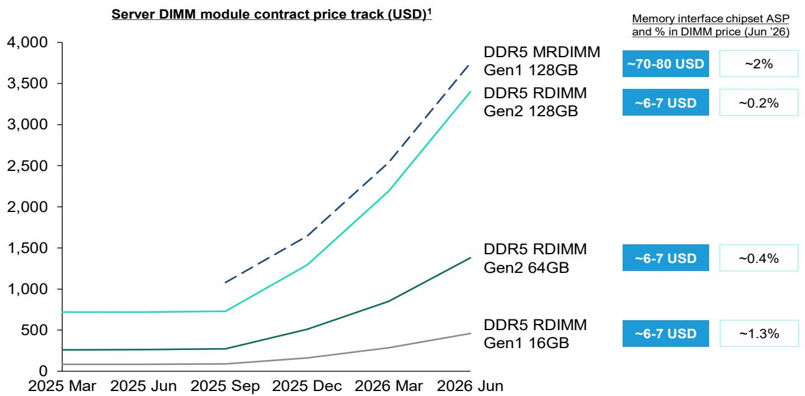
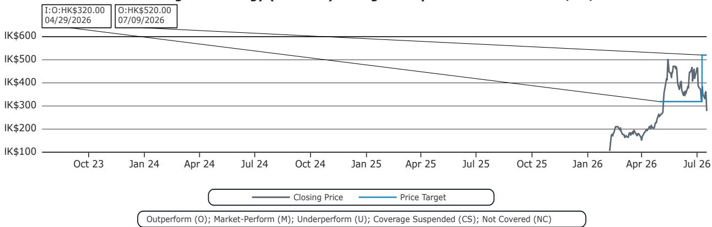

# Montage Technology’s Recent Price Adjustment Creates a Misunderstanding-Driven Opportunity for Observers Who Can Separate Memory Cycles from Interface Chip Fundamentals

Montage Technology reported 1H26 preliminary results that beat consensus across every major metric, yet its A-share price has adjusted 30% in the past month. Revenue grew 26.6% year-over-year to RMB 3.34 billion, exceeding Bloomberg consensus by 3.1%. Net income attributable to shareholders surged 72.6% year-over-year to RMB 2.0 billion at the midpoint, with net margin expanding an extraordinary 1,596 basis points to 60%. The company also faces a Korean authority investigation that has amplified selling pressure. These two facts create a tension that demands careful analytical separation: the business is accelerating, but the stock is being sold as if the opposite were true.

The market is conflating two distinct cycles. Memory interface chip pricing does not move with memory ASP, yet the pullback in Montage shares has tracked the broader memory sector downturn. This is a category error with significant implications for observers. Those who treat Montage as a memory proxy are missing the structural driver of its earnings: CPU-driven bit shipment growth in servers, not memory price inflation. The 30% adjustment reflects thematic profit-taking after shares had risen 168% year-to-date at the peak, combined with regulatory noise from the Korean investigation. Neither factor alters Montage’s underlying volume trajectory or margin structure.

The Korean investigation requires sober assessment. Neither Montage nor its executives currently face allegations of wrongdoing, customer orders remain unaffected, and there is limited commercial rationale for price manipulation. Montage cuts prices annually over each product generation’s lifecycle. Memory interface chips represent less than 1% of a DDR module’s selling price, making quality the dominant purchasing criterion for memory manufacturers rather than price. This structural dynamic is the fundamental reason for Montage’s high margins. The investigation’s worst-case outcome appears to be a one-time nonrecurring loss, not any change to pricing, revenue, or margin fundamentals.

This is not a moment for passive observation. The disconnect between Montage’s operating reality and its stock price creates a rare alignment of strong fundamentals with sector-driven mispricing. The following sections dissect why the pullback is analytically unjustified, where the real earnings drivers lie, and how observers can construct a decision framework that avoids the memory-commodity trap.

## The Korean Investigation Poses Negligible Fundamental Risk Because Memory Interface Chip Economics Make Price Manipulation Both Irrational and Unnecessary

The investigation’s most notable feature is what it has not triggered: no allegations of wrongdoing against the company or its executives, no disruption to customer orders, and no evidence of the behavior being investigated. But the deeper argument against material impact is structural, not procedural. Montage’s pricing model is incompatible with the price manipulation theory. The company reduces prices annually over the lifecycle of each product generation, a pattern that reflects Moore’s Law-driven cost declines and competitive pressure, not market power abuse. Memory interface chip prices did not increase even during the recent surge in memory prices, which is the strongest possible evidence that Montage does not exploit supply-demand tightness to raise prices.

The commercial logic for price manipulation is absent for a more fundamental reason: memory interface chips account for less than 1% of a DDR module’s total selling price. Memory manufacturers optimizing their own margins have virtually no incentive to push for lower interface chip prices because the cost impact is negligible, while the quality impact of inferior chips is catastrophic. A failed memory module due to interface chip defects can cost a manufacturer far more in warranty claims, customer trust, and brand reputation than the pennies saved on a subcomponent. This quality-over-price dynamic is the core structural reason for Montage’s sustained high margins, and it is also the reason why regulatory pressure on pricing is unlikely to change the commercial equilibrium.

The bear case for the investigation is that it may result in a one-time nonrecurring loss, such as legal fees or a settlement. But even this scenario does not alter Montage’s recurring earnings power. The company’s recurring net profit margin in 1H26 was 40.5%, down 95 basis points year-over-year primarily due to FX headwinds, but still indicating a highly profitable core business independent of nonrecurring items. Observers should assess the investigation as a discrete legal event with capped downside, not as a signal of fundamental business deterioration.

## The Market Is Mistaking Memory Price Volatility for Montage’s Earnings Driver, When the True Engine Is CPU-Led Server Volume Growth

The 30% adjustment in Montage’s A-share coincided with a thematic pullback in memory stocks, driven by concerns that memory ASP increases are unsustainable. This correlation is misleading because Montage’s revenue and earnings are not tied to memory pricing. The company’s interface chips are priced per unit, not as a percentage of memory value, and those unit prices follow their own lifecycle trajectory. When memory prices fall, Montage’s per-chip revenue does not decline proportionally. When memory prices rise, Montage does not capture a share of that upside. The two are economically decoupled.

The actual volume driver for Montage is memory bit shipment growth in servers, which is itself driven by CPU volume growth. As server CPU vendors ship more units, the number of memory channels and modules per server increases, directly boosting demand for memory interface chips. This relationship is stable and secular, tied to the expansion of cloud computing, AI inference workloads, and enterprise server refresh cycles. CPU volume growth does not oscillate with memory price cycles; it follows its own trajectory based on data center capital expenditure, processor generation transitions, and workload migration patterns.

Upcoming earnings reports from global server CPU vendors should provide positive sentiment reinforcement. These reports are likely to confirm continued volume growth in server CPU shipments, which directly translates into higher interface chip demand for Montage. The current pullback is therefore disconnected from the company’s underlying volume and earnings drivers. Observers who sell Montage because they are bearish on memory prices are making a logical error that creates an opportunity for those who understand the actual causal chain.

## Montage’s 1H26 Results Reveal a Business That Is Accelerating, Not Slowing, with Margin Expansion That Reflects Structural Advantages, Not One-Time Gains

The 1H26 preliminary results deserve careful parsing because they show two distinct stories. The headline net margin of 60% includes fair-value gains on investments and asset disposal income, which are nonrecurring. But even after stripping these out, recurring net profit margin stood at 40.5%, a level that would be exceptional for any semiconductor company. The revenue beat of 3.1% above consensus and 0.6% above Bernstein’s forecast was achieved despite a significant FX headwind, as Montage prices its products in USD while reporting in RMB. Continued RMB appreciation reduced reported revenue growth, meaning the underlying business momentum was even stronger than the RMB figures suggest.

The net income beat was even more pronounced. At the midpoint, net income attributable to shareholders of RMB 2.0 billion was 18.4% above consensus and 16.5% above Bernstein’s forecast. This level of outperformance across both revenue and profit lines indicates that demand is running ahead of expectations, cost discipline is intact, and the product mix is favorable. The company is not just riding a cyclical wave; it is executing on a structural growth trajectory.

The margin structure of Montage’s core business is sustainable because of the quality-over-price dynamic discussed earlier. Memory manufacturers have limited incentive to squeeze interface chip suppliers when the chip cost is a rounding error in total module cost but the chip performance determines module reliability. This asymmetry creates a pricing environment that is structurally favorable to Montage, allowing it to maintain high margins even as it reduces prices over product lifecycles. The recurring net profit margin of 40.5% in 1H26, while down slightly year-over-year due to FX, still represents a level of profitability that signals significant competitive insulation.

## A Decision Framework for Observers: How to Assess Montage’s Risk-Reward Without Falling Into the Memory Commodity Trap

Observers evaluating Montage at current levels need a framework that separates real risks from market noise. The framework has three dimensions: earnings driver analysis, regulatory risk assessment, and valuation context.

First, earnings driver analysis requires distinguishing between volume growth and price cycles. Montage’s revenue is a function of server memory bit shipments, which grow with CPU volume. This is a volume story, not a price story. Observers should monitor CPU vendor shipment data, data center capex trends, and memory bit shipment growth rates. Memory ASP trends are irrelevant to Montage’s earnings trajectory. If server CPU shipments are growing, Montage’s revenue will grow, regardless of whether memory prices are rising or falling.

Second, regulatory risk assessment requires distinguishing between procedural uncertainty and fundamental business risk. The Korean investigation has not produced any allegations, any customer disruption, or any evidence of wrongdoing. The commercial logic for price manipulation is absent. The worst-case scenario is a one-time nonrecurring loss. Observers should ask: is the market pricing in a worst-case scenario that is far worse than the evidence supports? The 30% adjustment suggests that the market is applying a punitive discount that exceeds any reasonable estimate of regulatory downside.

Third, valuation context matters. At the July 17 close of CNY 183.60, Montage trades at 57.3x 2026E reported P/E and 32.3x 2027E reported P/E. These multiples appear elevated on an absolute basis but must be assessed against the company’s earnings growth trajectory. 2026E EPS of CNY 3.21 represents 63% growth over 2025A EPS of CNY 1.97, and 2027E EPS of CNY 5.68 represents another 77% growth. The PEG ratio based on 2025-2027 growth is below 1x, indicating that the market is not fully pricing in the earnings trajectory. The H-share target of HKD 520 implies 58x 2BF P/E, based on 50x 2BF P/E (27Q3-28Q2 earnings), which reflects confidence in continued EPS growth driven by the CPU cycle and MRDIMM penetration.

The H-share premium reflects a differentiated position without direct geopolitical risks. Unlike many Chinese semiconductor companies that face entity list restrictions or export control headwinds, Montage’s interface chip business is not subject to the same geopolitical constraints. Global observers seeking China AI exposure without geopolitical baggage have limited options, and Montage fills that gap. The H-share target of HKD 520 implies 58x 2BF P/E, a premium that reflects this scarcity value.

The most important risk to monitor is not the Korean investigation or memory price trends, but the health of the server CPU cycle. If CPU volume growth decelerates due to data center capex cuts, AI investment pauses, or enterprise spending weakness, Montage’s volume driver would be impaired. But the current evidence points in the opposite direction: CPU volume growth continues to expand steadily, and upcoming earnings from global server CPU vendors should confirm this trajectory. The market’s current discounting of Montage shares reflects fears that are not supported by the data, creating a mispricing that disciplined observers can analyze.

*For informational purposes only. Portions may be generated, translated, summarized, or edited with AI assistance based on source materials and may contain omissions or errors. Please verify independently. This is not investment, legal, tax, accounting, or other professional advice.*

For informational purposes only. Portions may be generated, translated, summarized, or edited with AI assistance based on source materials and may contain omissions or errors. Please verify independently. This is not investment, legal, tax, accounting, or other professional advice.

