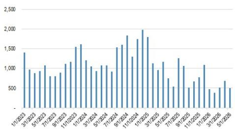
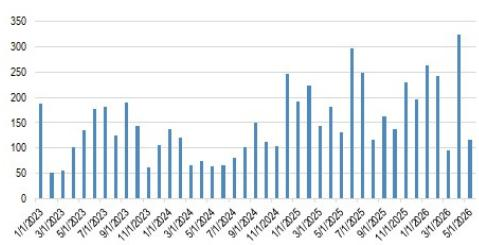
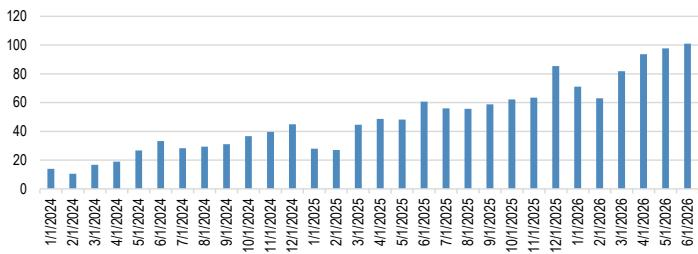
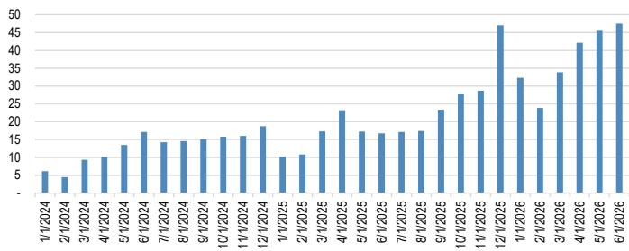
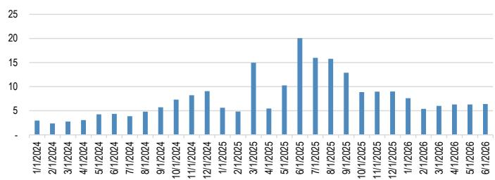
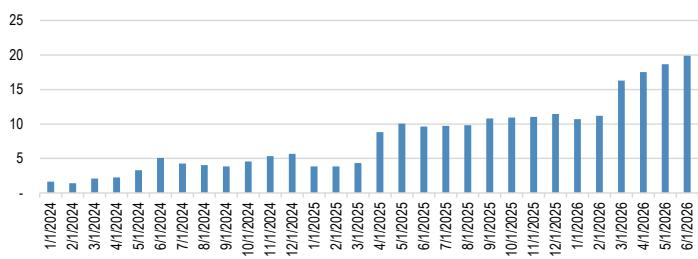
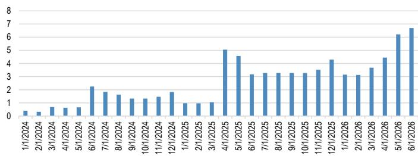
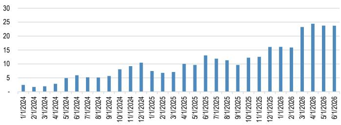
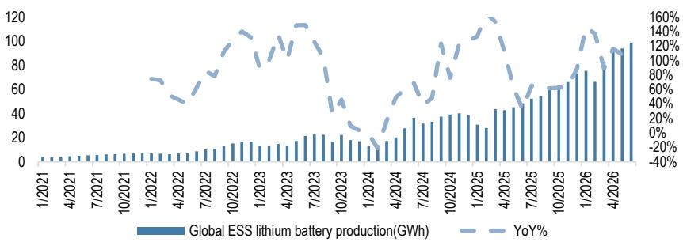

本材料无意向中国大陆读者分发，也不在中国大陆境内提供证券投资咨询服务。未经JPM书面同意，不得转载、出售或重新分发本材料或其任何部分。

## ESS电池

## 6月出货量超过100GWh，环比增长3%，同比增长66%，尽管基数较高；2026财年有望达到1,100GWh

根据ICCSino的数据，全球ESS电池出货量在2026年6月超过100GWh，同比增长66%，环比增长3%。这使得2026年上半年出货量达到508GWh，同比增长98%，有望达到或超过JPM对2026财年1.1TWh（同比增长78%）的预测。2026年第二季度出货量加速，尽管由于高基数，同比增长有所放缓。中国国内需求仍然是主要增长引擎，占全球需求的45%，并在2026年上半年实现了超过140%的同比增长。在海外市场中，欧盟和世界其他地区分别占全球需求的19%和26%，两者均录得超过130%的同比增长；与此同时，美国需求正越来越多地被韩国/日本供应商所满足。展望未来，7月至8月的生产计划仍然积极，大多数ESS电池制造商的目标是环比增长3-4%，7月出货量在国内和海外市场均表现良好。根据ICCSino的最新预测，比亚迪是个例外，原因是其部分产能从ESS电池重新分配至电动汽车电池。总体而言，ESS需求保持稳定，年初至今继续显示出强劲的增长势头。然而，ESS价值链相关公司的报价已从近期高点明显回调，基本回吐了年初至今的涨幅。我们认为，这种回调反映了：（1）围绕宁德时代以及更广泛的ESS和电池行业的技术性和短期情绪因素；（2）读者对中国国内ESS装机量和出货量当前增长速度可持续性的担忧日益增加。在JPM覆盖的亚洲ESS价值链中，我们的首选标的是宁德时代（全球领导者，在非美国地区市场份额增长）、阳光电源（因数据中心直销新应用场景而具有重新评级的潜力）、德业股份（凭借强大的新兴市场敞口，受益于分布式发电ESS）、LGES和SDI（在美国ESS机会中定位良好）。ESS对比亚迪也日益重要，预计在2026年将占其电池总出货量的20%以上。

## ESS装机量：美国2026年前5个月同比增长11%，中国设定2030年ESS目标为300GW

\- 中国首次发布2030年ESS目标为300GW：新能源体系“十五五”规划将2030年储能目标定为300GW。这是首次在官方政府规划中被提及。国家发改委此前设定了到2027年180GW的ESS容量目标，我们预计中国将超额完成这一目标。到2030年达到300GW ESS的目标看似保守，但在方向上具有支持性。重要的是，它指向了2028-30年的持续发展。详情请参阅我们的报告（链接）。

\- 美国BESS装机量在2026年前5个月同比增长11%。根据EIA的数据，2026年5月美国BESS装机量达到570MW，使2026年前5个月的总装机量达到5.6GW，同比增长11%。我们继续看到2026年美国BESS需求强劲，部分原因是来自AIDC的紧张电力市场。JPM观点：这些数据点对阳光电源和韩国电池制造商来说是积极的信号。

\- 中国ESS集成商占据全球76%的份额，阳光电源和比亚迪分别排名第二和第三。Wood Mackenzie发布了全球储能系统集成商市场份额报告（链接），该报告发现，2025年中国储能系统集成商占据了全球76%的份额，前十名中有八家总部位于中国；特斯拉和阳光电源保持第一和第二名，比亚迪升至第三名。随着市场扩大，前三名的合计份额下降，竞争范围扩大。阳光电源在北美和中东排名第二，在欧洲和拉丁美洲排名第一。请注意，由于对地缘政治紧张局势的担忧，阳光电源的报价已有所回落，我们认为其当前估值具有吸引力，并维持对阳光电源的增持评级。

## 全球ESS电池出货量：2026年上半年同比增长98%

\- 尽管由于高基数，6月同比增长放缓至66%，但全球ESS电池需求在6月依然强劲。从之前几个月的超过100%同比增长放缓至6月的66%，主要反映了2025年6月的高基数，部分与预期政策变化（包括美国IRA和关税以及中国的136号文件）前的出货量提前有关。5-6月的环比出货量增长也放缓至3-4%，而3-4月为两位数增长，这主要是由于产能限制。6月的增长主要由中国国内需求（同比增长超过180%）和中国对除美国外所有地区的强劲出口（同比增长超过80%）推动。2026年上半年，全球ESS电池供应仍以中国为主导（占97%的份额），而需求则较为均衡，约55%来自海外，约45%来自国内。

\- 2026年上半年，中国ESS电池对欧盟的出口激增133%，对世界其他地区的出口激增136%。尽管出口退税政策发生变化（自4月1日起，出口退税从9%降至6%），但2026年第二季度ESS出口保持了强劲势头，环比增长25%，同比增长56%。美国ESS电池采购持续从中国供应商转向韩国企业，韩国/日本企业的出货量同比激增约190%，而中国企业对美国的ESS出货量在2025年上半年同比下降约40%。美国电池进口数据也证实了这一趋势：2026年前5个月，中国产锂电池出货量同比下降52%，而韩国产（主要来自SDI）出货量同比增长约40%，这突显了在OBBBA法规持续生效的情况下，采购正在发生转变。

\- 分布式储能增加了第二个增长引擎，而公用事业规模仍是数量支柱。2026年上半年，公用事业规模出货量达到约380 GWh，同比增长约90%，占中国企业出货量的77%（低于2025财年的81%）。工商业和住宅出货量增长更快，2026年上半年分别同比增长150%和130%。我们认为这是行业增长动力的拓宽：公用事业规模对相对数量仍然至关重要，而工商业和住宅储能则提供了增量增长，并可能通过渠道、产品和区域敞口实现更大的差异化。

\- 市场的焦点已转向2027年的需求——我们是否应该担心需求的可持续性？我们认为2026年下半年ESS广泛增长放缓的风险有限，但指出从2027年下半年开始，中国特有的出货量放缓风险更高。我们在6月2日的报告中强调，国家发改委的最新目标要求到2027年中国ESS装机容量达到180GW（而2024年约为75GW），而JPM的基本情景已经假设到2027年装机量将超过320GW。这表明有可能超额完成官方目标，进而意味着2028年上半年存在急剧放缓或增长减速的风险。我们预测中国ESS装机量增长将从2027年的25%放缓至2028年的4%，更显著的放缓可能发生在2028年上半年；由于ESS电池出货量通常领先装机量约六个月，出货量放缓风险最早可能在2027年下半年开始。然而，我们认为任何2027年后的疲软可能是暂时性的，而非结构性的，因为与可再生能源渗透率上升相关的潜在储能需求应能使增长持续到2030年，预计中国的可再生能源占比将从2025年底的约24%上升到2030年的约35%，而ESS渗透率将从约7%追赶至约18%（这仍然与英国等市场一致，即使在接近18%的渗透率下，储能仍是电网优先事项）。最后，其他需求驱动因素可能缓冲中国ESS的任何放缓，因为预计2026年中国ESS将占电池总需求的不到20%，而海外ESS，特别是欧洲和新兴市场，可能成为电池增长更重要的贡献者。

## 建议

下表总结了JPM亚洲股票覆盖范围内的主要相关公司及其对ESS业务的敞口。

\- 最大的PCS供应商 – 阳光电源（增持）：阳光电源是全球产量最大的太阳能逆变器制造商，近年来凭借成本优势获得了市场份额。与国内同行相比，阳光电源提供卓越的产品质量和更强的品牌认知度。我们预计阳光电源将从强劲的ESS需求和公用事业及数据中心订单的增长中受益。

\- 德业股份（增持）是一家分布式发电储能生产商，在新兴市场具有先发优势。短期内，能源供应冲击正在加速分布式光伏+储能的采用，尤其是在柴油分布式发电普遍的地区。长期来看，政策可能转向韧性，支持持续增长。德业股份的家电背景通过提高内部制造比例支持其成本领先地位。

\- 中国ESS电池：宁德时代（增持）是全球最大的ESS电池制造商，也是我们在中国电池价值链中的首选。亿纬锂能（中性）在覆盖的电池制造商中拥有最高的ESS敞口，其次是中创新航（增持）。我们也看好比亚迪（增持），原因是其电动汽车车型在海外市场需求强劲，以及其在电动汽车和ESS领域的垂直整合优势。

\- 韩国电池企业在美国ESS领域看到了改善的机会和利润率。LGES（增持）的ESS订单赢得势头强劲，我们估计该公司在韩国电池制造商中拥有最大的LFP ESS订单积压。SDI（增持）的ESS可见度也在改善：美国电池进口数据显示，自2025年7月（OBBBA之后）以来，中国产出货量进一步下降，而韩国产（主要是SDI）出货量环比上升，这支持了在美国法规持续生效的情况下正在进行的采购转移。

## JPM覆盖的ESS相关公司摘要

表1：JPM覆盖的ESS价值链公司摘要

<table><tr><td rowspan="2">公司</td><td rowspan="2">代码</td><td rowspan="2">覆盖分析师</td><td rowspan="2">JPM评级</td><td rowspan="2">ESS业务</td><td colspan="3">ESS收入敞口</td><td colspan="3">ESS数量敞口</td></tr><tr><td>FY25A</td><td>FY26E</td><td>FY27E</td><td>FY25A</td><td>FY26E</td><td>FY27E</td></tr><tr><td>宁德时代</td><td>300750 CH</td><td>Rebecca Wen</td><td>增持</td><td>ESS电池</td><td>15%</td><td>18%</td><td>22%</td><td>18%</td><td>22%</td><td>26%</td></tr><tr><td>中创新航</td><td>3931 HK</td><td>Rebecca Wen</td><td>增持</td><td>ESS电池</td><td>32%</td><td>26%</td><td>29%</td><td>41%</td><td>39%</td><td>42%</td></tr><tr><td>亿纬锂能*</td><td>300014 CH</td><td>Rebecca Wen</td><td>中性</td><td>ESS电池</td><td>40%</td><td>38%</td><td>40%</td><td>59%</td><td>54%</td><td>56%</td></tr><tr><td>国轩高科</td><td>002074 CH</td><td>Rebecca Wen</td><td>减持</td><td>ESS电池</td><td>19%</td><td>21%</td><td>24%</td><td>30%</td><td>33%</td><td>37%</td></tr><tr><td>比亚迪-H</td><td>1211 HK</td><td>Nick Lai</td><td>增持</td><td>ESS电池</td><td>4%</td><td>5%</td><td>n/a</td><td>20%</td><td>27%</td><td>n/a</td></tr><tr><td>LGES</td><td>373220 KS</td><td>Parsley Ong</td><td>增持</td><td>ESS电池</td><td>13%</td><td>33%</td><td>41%</td><td>8%</td><td>23%</td><td>31%</td></tr><tr><td>三星SDI</td><td>006400 KS</td><td>Sonny Lee</td><td>增持</td><td>ESS电池</td><td>22%</td><td>30%</td><td>31%</td><td>33%</td><td>44%</td><td>49%</td></tr><tr><td>阳光电源</td><td>300274 CH</td><td>Alan Hon</td><td>增持</td><td>PCS+EMS+集成</td><td>42%</td><td>49%</td><td>53%</td><td>n/a</td><td>n/a</td><td>n/a</td></tr><tr><td>德业股份</td><td>605117 CH</td><td>Alan Hon</td><td>增持</td><td>PCS+电池+电池包</td><td>74%</td><td>86%</td><td>89%</td><td>n/a</td><td>n/a</td><td>n/a</td></tr><tr><td>国电南瑞</td><td>600406 CH</td><td>Stephen Tsui</td><td>增持</td><td>BMS+PCS+EMS+集成</td><td>&lt;10%</td><td>n/a</td><td>n/a</td><td>n/a</td><td>n/a</td><td>n/a</td></tr></table>

来源：公司数据，JPM估计。注：ESS电池可能包括BMS或系统集成。亿纬锂能的ESS数量敞口是指ESS电池数量占总动力电池数量的比例，不包括消费电池。注：国轩高科FY25敞口为JPMe。注：SDI的总收入包括电子材料和小型电池，而数量不包括电子材料和小型电池。

表2：全球ESS出货量预测

<table><tr><td>ESS电池出货量</td><td>2021</td><td>2022</td><td>2023</td><td>2024</td><td>2025</td><td>2026E</td><td>2027E</td><td>2028E</td></tr><tr><td colspan="9">按终端需求市场划分的全球出货量</td></tr><tr><td rowspan="2">中国市场需求</td><td>26</td><td>64</td><td>139</td><td>155</td><td>257</td><td>501</td><td>606</td><td>697</td></tr><tr><td></td><td>145%</td><td>117%</td><td>12%</td><td>65%</td><td>95%</td><td>21%</td><td>15%</td></tr><tr><td rowspan="2">除中国外市场需求</td><td>39</td><td>62</td><td>74</td><td>175</td><td>382</td><td>635</td><td>892</td><td>1,091</td></tr><tr><td></td><td>57%</td><td>20%</td><td>136%</td><td>118%</td><td>66%</td><td>40%</td><td>22%</td></tr><tr><td>全球ESS电池出货量 (GWh)</td><td>66</td><td>126</td><td>213</td><td>330</td><td>639</td><td>1,136</td><td>1,498</td><td>1,789</td></tr><tr><td>同比</td><td></td><td>92%</td><td>70%</td><td>55%</td><td>93%</td><td>78%</td><td>32%</td><td>19%</td></tr></table>

来源：ICCSino，JPM估计。

图1：美国BESS装机量 (MW)  
  
来源：EIA。

图2：美国：中国电池进口额 (百万美元) 2026年前5个月同比下降52%  
  
来源：美国国际贸易委员会。

图3：美国：韩国电池进口额 (百万美元) 2026年前5个月同比增长38%  
  
来源：美国国际贸易委员会。

## 最新ESS电池生产和出货趋势摘要

表3：ESS电池生产趋势摘要

<table><tr><td></td><td colspan="2">2025</td><td colspan="3">1Q26</td><td colspan="3">2Q26</td><td></td><td colspan="2">1H26</td></tr><tr><td>GWh</td><td>产量</td><td>同比</td><td>产量</td><td>环比</td><td>同比</td><td>产量</td><td>环比</td><td>同比</td><td></td><td>产量</td><td>同比</td></tr><tr><td>全球ESS电池产量</td><td>609.1</td><td>76%</td><td>224.7</td><td>11%</td><td>119%</td><td>285.5</td><td>27%</td><td>109%</td><td></td><td>510.2</td><td>113%</td></tr><tr><td>按电池生产国划分：</td><td></td><td></td><td></td><td></td><td></td><td></td><td></td><td></td><td></td><td></td><td></td></tr><tr><td>韩国/日本电池企业</td><td>19.9</td><td>121%</td><td>7.9</td><td>-5%</td><td>192%</td><td>10.1</td><td>27%</td><td>195%</td><td></td><td>18.1</td><td>194%</td></tr><tr><td>中国电池企业</td><td>589.2</td><td>75%</td><td>216.8</td><td>11%</td><td>117%</td><td>275.4</td><td>27%</td><td>107%</td><td></td><td>492.2</td><td>111%</td></tr></table>

来源：ICCSino，JPM。

表4：ESS电池出货趋势摘要（月度）

<table><tr><td>GWh</td><td>26年6月</td><td>同比</td><td>环比</td><td>占比</td></tr><tr><td>全球ESS电池出货量</td><td>100.9</td><td>66%</td><td>3%</td><td>100%</td></tr><tr><td>韩国/日本电池企业</td><td>3.4</td><td>194%</td><td>3%</td><td>3%</td></tr><tr><td>中国电池企业</td><td>97.5</td><td>64%</td><td>3%</td><td>97%</td></tr><tr><td>按终端需求地区划分的全球ESS电池出货量</td><td>100.9</td><td>66%</td><td>3%</td><td>100%</td></tr><tr><td>中国国内需求</td><td>47.5</td><td>184%</td><td>4%</td><td>47%</td></tr><tr><td>除中国外需求</td><td>53.5</td><td>22%</td><td>3%</td><td>53%</td></tr><tr><td>中国出口（直接出口 + ESS客户出口）</td><td>50.0</td><td>17%</td><td>3%</td><td>50%</td></tr><tr><td>日本/韩国企业</td><td>3.4</td><td>194%</td><td>3%</td><td>3%</td></tr><tr><td>按终端需求应用划分的中国企业出货量</td><td>97.5</td><td>64%</td><td>3%</td><td>100%</td></tr><tr><td>公用事业规模</td><td>70.7</td><td>43%</td><td>0%</td><td>73%</td></tr><tr><td>工商业</td><td>11.6</td><td>165%</td><td>9%</td><td>12%</td></tr><tr><td>电信基站</td><td>1.7</td><td>101%</td><td>13%</td><td>2%</td></tr><tr><td>住宅</td><td>12.2</td><td>170%</td><td>13%</td><td>12%</td></tr><tr><td>便携式</td><td>0.4</td><td>95%</td><td>14%</td><td>0.4%</td></tr><tr><td>UPS</td><td>1.0</td><td>1517%</td><td>162%</td><td>1.0%</td></tr><tr><td>按终端市场划分的中国企业出货量</td><td>97.5</td><td>64%</td><td>3%</td><td>97%</td></tr><tr><td>中国</td><td>47.5</td><td>184%</td><td>4%</td><td>49%</td></tr><tr><td>美国</td><td>6.4</td><td>-68%</td><td>2%</td><td>7%</td></tr><tr><td>欧盟</td><td>19.9</td><td>106%</td><td>7%</td><td>20%</td></tr><tr><td>世界其他地区</td><td>23.7</td><td>82%</td><td>0%</td><td>24%</td></tr></table>

来源：ICCSino，JPM。注：公用事业储能包括光伏和风电储能以及独立储能电站。

表5：ESS电池出货趋势摘要（年初至今）

<table><tr><td>GWh</td><td>2025</td><td>同比</td><td>占比</td><td>1H26</td><td>同比</td><td>占比</td><td>1Q26</td><td>同比</td><td>2Q26</td><td>环比</td><td>同比</td></tr><tr><td>全球ESS电池出货量</td><td>638.8</td><td>93%</td><td>100%</td><td>508.3</td><td>98%</td><td>100%</td><td>215.9</td><td>117%</td><td>292.4</td><td>35%</td><td>86%</td></tr><tr><td>韩国/日本电池企业</td><td>17.3</td><td>87%</td><td>3%</td><td>17.0</td><td>188%</td><td>3%</td><td>7.0</td><td>173%</td><td>10.0</td><td>43%</td><td>200%</td></tr><tr><td>中国电池企业</td><td>621.5</td><td>94%</td><td>97%</td><td>491.3</td><td>96%</td><td>97%</td><td>208.9</td><td>115%</td><td>282.4</td><td>35%</td><td>83%</td></tr><tr><td>按终端需求地区划分的全球ESS电池出货量</td><td>638.8</td><td>93%</td><td>100%</td><td>508.3</td><td>98%</td><td>100%</td><td>215.9</td><td>117%</td><td>292.4</td><td>35%</td><td>86%</td></tr><tr><td>中国国内需求</td><td>256.8</td><td>66%</td><td>40%</td><td>230.3</td><td>141%</td><td>45%</td><td>90.0</td><td>148%</td><td>135.3</td><td>50%</td><td>137%</td></tr><tr><td>除中国外需求</td><td>381.9</td><td>118%</td><td>60%</td><td>278.0</td><td>72%</td><td>55%</td><td>125.9</td><td>105%</td><td>157.0</td><td>25%</td><td>56%</td></tr><tr><td>中国出口（直接出口 + ESS客户出口）</td><td>364.7</td><td>120%</td><td>57%</td><td>265.9</td><td>71%</td><td>52%</td><td>118.9</td><td>102%</td><td>147.0</td><td>24%</td><td>52%</td></tr><tr><td>日本/韩国企业</td><td>17.3</td><td>87%</td><td>3%</td><td>17.0</td><td>188%</td><td>3%</td><td>7.0</td><td>173%</td><td>10.0</td><td>43%</td><td>200%</td></tr><tr><td>按终端需求应用划分的中国企业出货量</td><td>621.5</td><td>94%</td><td>97%</td><td>491.3</td><td>96%</td><td>97%</td><td>208.9</td><td>115%</td><td>282.4</td><td>35%</td><td>83%</td></tr><tr><td>公用事业规模</td><td>501.2</td><td>97%</td><td>81%</td><td>377.5</td><td>88%</td><td>77%</td><td>166.1</td><td>109%</td><td>211.4</td><td>27%</td><td>74%</td></tr><tr><td>工商业</td><td>54.9</td><td>104%</td><td>9%</td><td>55.2</td><td>148%</td><td>11%</td><td>22.3</td><td>140%</td><td>32.9</td><td>47%</td><td>154%</td></tr><tr><td>电信基站</td><td>10.0</td><td>-2%</td><td>2%</td><td>7.2</td><td>54%</td><td>1%</td><td>2.8</td><td>29%</td><td>4.4</td><td>56%</td><td>75%</td></tr><tr><td>住宅</td><td>51.8</td><td>110%</td><td>8%</td><td>48.3</td><td>128%</td><td>10%</td><td>17.1</td><td>248%</td><td>31.2</td><td>83%</td><td>91%</td></tr><tr><td>便携式</td><td>2.5</td><td>-8%</td><td>0%</td><td>1.6</td><td>24%</td><td>0%</td><td>0.6</td><td>-6%</td><td>1.0</td><td>62%</td><td>54%</td></tr><tr><td>UPS</td><td>1.0</td><td>-32%</td><td>0%</td><td>1.7</td><td>142%</td><td>0%</td><td>0.2</td><td>-46%</td><td>1.5</td><td>619%</td><td>372%</td></tr><tr><td>按终端市场划分的中国企业出货量</td><td>621.5</td><td>94%</td><td>97%</td><td>491.3</td><td>96%</td><td>97%</td><td>208.9</td><td>115%</td><td>282.4</td><td>35%</td><td>83%</td></tr><tr><td>中国</td><td>256.8</td><td>66%</td><td>40%</td><td>230.3</td><td>141%</td><td>45%</td><td>90.0</td><td>148%</td><td>135.3</td><td>50%</td><td>137%</td></tr><tr><td>美国</td><td>132.7</td><td>126%</td><td>21%</td><td>38.0</td><td>-38%</td><td>8%</td><td>19.0</td><td>-25%</td><td>19.0</td><td>0%</td><td>-47%</td></tr><tr><td>欧盟</td><td>104.2</td><td>140%</td><td>17%</td><td>94.2</td><td>133%</td><td>19%</td><td>38.1</td><td>217%</td><td>56.1</td><td>47%</td><td>97%</td></tr><tr><td>世界其他地区</td><td>127.7</td><td>101%</td><td>21%</td><td>127.2</td><td>136%</td><td>26%</td><td>55.3</td><td>160%</td><td>71.9</td><td>30%</td><td>120%</td></tr></table>

来源：ICCSino，JPM。注：公用事业储能包括光伏和风电储能以及独立储能电站。

## 不同地区的ESS电池需求

图4：全球ESS电池出货量（月度）（单位：Gwh）  
  
来源：ICCSino，JPM

图5：中国国内需求ESS出货量（月度）（单位：Gwh）  
  
来源：ICCSino，JPM

图6：中国企业向美国出口的ESS电池（月度）（单位：Gwh）  
  
来源：ICCSino，JPM

图7：中国企业向欧盟出口的ESS电池（月度）（单位：Gwh）  
  
来源：ICCSino，JPM

图8：中国企业向欧盟住宅市场出口的ESS电池（月度）（单位：Gwh）  
  
来源：ICCSino。

图9：中国企业向世界其他地区（不包括中国、美国和欧盟的市场）出口的ESS电池（月度）（单位：Gwh）  
  
来源：ICCSino。

## ESS电池库存趋势

表6：中国企业ESS电池产量、出货量和库存趋势

<table><tr><td>GWh</td><td>1Q25</td><td>2Q25</td><td>3Q25</td><td>4Q25</td><td>1Q26</td><td>FY25</td><td></td><td>26年1月</td><td>26年2月</td><td>26年3月</td><td>26年4月</td><td>26年5月</td><td>26年6月</td></tr><tr><td>行业产量</td><td>100</td><td>133</td><td>162</td><td>194</td><td>217</td><td>589</td><td></td><td>73</td><td>64</td><td>80</td><td>89</td><td>91</td><td>96</td></tr><tr><td>行业出货量</td><td>97</td><td>154</td><td>166</td><td>205</td><td>209</td><td>622</td><td></td><td>69</td><td>61</td><td>79</td><td>90</td><td>94</td><td>98</td></tr><tr><td>库存变化</td><td>3</td><td>-21</td><td>-4</td><td>-10</td><td>8</td><td>-32</td><td></td><td>4</td><td>3</td><td>1</td><td>-1</td><td>-4</td><td>-2</td></tr></table>

来源：ICCSino，JPM。

## 全球ESS电池数量趋势

由于产能限制，全球ESS电池出货量的环比增长放缓，但同比势头依然强劲，在2025财年同比增长93%的基础上，年初至今同比增长98%。增长由以下因素驱动：（1）中国出口强劲，得益于新兴市场和欧盟需求的激增；（2）中国国内需求强劲，受136号文件、114号文件以及支持性的国家和省级政策推动。

图10：全球ESS电池产量趋势  
  
来源：ICCSino，JPM。

## 中国企业ESS电池数量趋势

中国电池制造商年初至今持有全球97%的份额（与2025/2024年的97%持平）。

图11：中国ESS电池企业占全球的份额（基于产量）  
![](images/a12bcd56e
