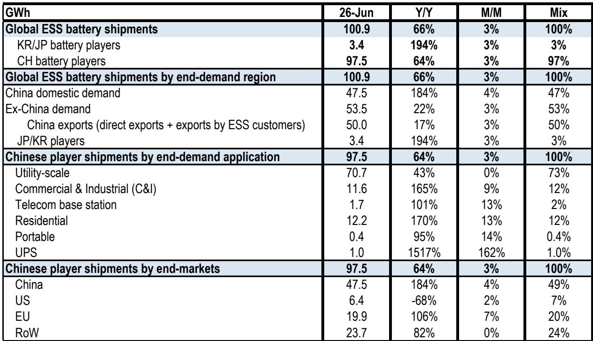
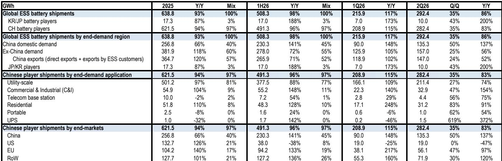
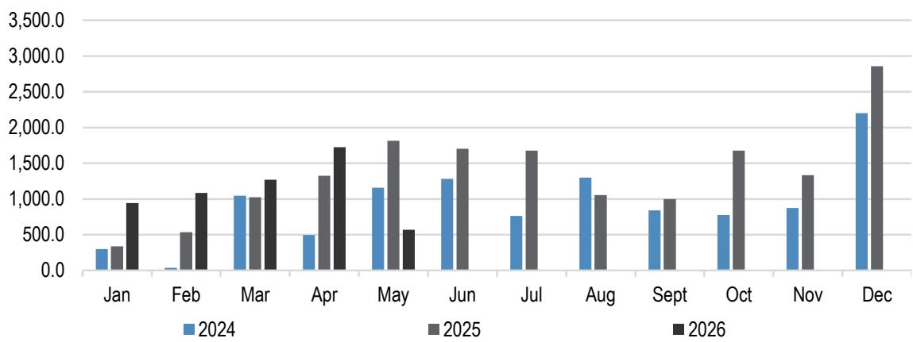

# 全球储能系统电池出货量突破100 GWh，但市场的真正考验在于增长能否持续

全球储能系统电池出货量在2026年6月超过100吉瓦时，同比增长66%，环比增长3%，数据来自一家全球投资银行整理的ICC Sino资料。这使得2026年上半年出货量达到508 GWh，同比增长98%，全年预测的1.1太瓦时目标似乎触手可及。该行业的生产速度在两年前看来几乎难以想象。

然而，这种成功本身引发了一个悖论。储能价值链相关公司的报价已从近期高点明显回落，基本回吐了年初至今的涨幅。这一回调反映了两种重叠的担忧：围绕该行业最大参与者的短期情绪波动，以及一个更根本的问题——中国国内安装热潮能否维持当前轨迹。观察者并非质疑储能需求是否存在，而是质疑它能否以证明当前市场定价合理的速度持续增长。

答案需要厘清三种不同的力量。首先，需求构成正在发生变化，既带来机遇也带来风险。其次，监管驱动的减速风险是真实存在的，但主要集中在中国，且最早要到2027年底才开始。第三，供应链的地域重构，特别是美国市场减少从中国供应商采购的趋势，正在创造一个双轨市场，赢家越来越取决于他们能在哪里提供产品，而不仅仅是能生产多少。

## 中国国内市场仍是主要引擎，但其增速按设计难以持续

2026年上半年，中国国内需求占全球储能电池需求的45%，同比增长超过140%。这是表面数据。较少被讨论的潜在信息是，这种增长正被政策截止日期提前拉动，而官方目标本身暗示着明显的减速。

中国“十五五”新型能源体系规划设定了到2030年累计储能装机容量300 GW的国家目标。这是此类目标首次出现在官方政府规划中。国家发展和改革委员会此前设定了到2027年达到180 GW的目标。该投资银行的基准情景已假设中国到2027年将超过320 GW，这意味着官方2027年目标很可能被大幅超越。这种超额完成创造了减速的数学条件。

该银行预测，中国储能装机增速将从2027年的25%放缓至2028年的4%，最明显的放缓可能出现在2028年上半年。由于储能电池出货量通常领先装机约六个月，出货量减速风险最早可能在2027年下半年开始。这不是需求崩溃，而是在政策驱动加速期之后的正常化，这种加速本就意在前期集中释放。

关键的缓解因素是，这种放缓很可能是暂时的，而非结构性的。中国的可再生能源占比预计将从2025年底的约24%上升到2030年的约35%。储能渗透率，即储能容量相对于总装机容量的比例，预计将从约7%提升至约18%。这个18%的水平与英国等市场一致，即使在类似的渗透率下，电网级储能仍是优先事项。由风能和太阳能间歇性驱动的储能根本需求在2027年后不会消失，它将继续增长，只是速度放缓。

## 海外市场正成为更重要的增长动力，其构成也在变化

2026年上半年，中国以外的需求约占全球储能电池需求的55%，其相对增速快于中国国内需求。这不是新趋势，但其影响正变得更加明显。欧盟和除美国外的世界其他市场，上半年均同比增长超过130%。同期，中国储能电池对欧盟出口同比增长133%，对世界其他市场出口同比增长136%，尽管中国自4月1日起将出口退税率从9%降至6%。

美国市场则呈现不同情况。美国储能电池采购正持续从中国供应商转向韩国和日本供应商。2026年上半年，韩国和日本储能出货量同比增长约190%，而中国供应商对美国的出货量在2025年上半年同比下降约40%。美国电池进口数据证实了这一分化：2026年前五个月，中国产锂电池出货量同比下降52%，而韩国产出货量（主要来自三星SDI）同比增长约40%。

这种地域重构并非短期贸易中断，而是由美国监管要求驱动的结构性转变，包括仍在生效的《境外电池及电池组件采购规定》中的条款。对于韩国电池制造商，这在美国创造了一个受保护的可寻址市场，其定价能力和利润率在结构上高于中国主导的全球市场。对于中国供应商，美国市场正成为阻力而非增长来源，但欧盟和世界其他市场足够大，可以吸收被转移的产量。

## 应用领域正在拓宽，为公用事业规模之外创造第二增长引擎

2026年上半年，公用事业规模储能出货量达到约380 GWh，同比增长约90%，占中国供应商出货量的77%。这低于2025年全年的81%，下降反映了商业和工业储能以及住宅储能的更快增长，上半年分别同比增长150%和130%。

增长动力的拓宽之所以重要，有两个原因。首先，它降低了行业依赖单一公用事业规模采购周期的集中风险。其次，它创造了差异化机会。商业和工业储能以及住宅储能对渠道关系、产品特性和区域监管框架比公用事业规模采购更敏感，后者往往更商品化和价格驱动。在分布式发电领域具有优势的公司，例如在新兴市场具有先发优势的德业，有望在这一增量增长中占据更大份额。

该银行估计，德业的储能收入占比将从2025年全年的74%上升到2026年全年的86%和2027年全年的89%。如果分布式发电需求减弱，这种集中度是一种风险，但它也反映了市场中的结构性机遇，在这些市场中，能源供应冲击正在加速太阳能加储能的采用，尤其是在柴油发电机曾是主要备用电源的地区。

## 储能价值链定位的决策框架

数据和预测指向一个市场，它正从政策驱动加速的第一阶段过渡到结构性持续但增速放缓的第二阶段。以下框架将此转化为可操作的定位逻辑。

首先，识别那些在监管顺风仍在加强而非见顶的市场中有业务的公司。韩国电池制造商LG新能源和三星SDI正在美国市场获得份额，正是因为中国供应商被排除在外。该银行估计，LG新能源的储能收入占比将从2025年全年的13%上升到2026年全年的33%和2027年全年的41%。三星SDI的占比预计同期将从22%升至30%再升至31%。这些公司受益于不太可能迅速消除的监管护城河。

其次，区分纯数量增长和利润率增长。中国电池制造商如宁德时代，在2026年上半年继续以97%的产量份额主导全球储能电池供应。宁德时代的储能产量占比预计将从2025年全年的18%上升到2026年全年的22%和2027年全年的26%。但美国市场对中国供应商日益关闭，而中国国内市场面临2027年底后的减速风险。数量故事依然完整，但随着竞争加剧，利润率故事可能变得更加具有挑战性。

第三，寻找具有差异化商业模式、较少依赖纯电池商品定价的公司。阳光电源，按产量计全球最大的太阳能逆变器制造商，其42%的收入来自储能相关的电力转换系统、能源管理系统和集成服务，这一比例预计到2027年将达到53%。阳光电源在2025年全球储能系统集成商中排名第二，在欧洲和拉丁美洲排名第一，在北美和中东排名第二。其业务组合包括更高价值的系统集成和直接面向数据中心销售，这些业务受电池电芯价格压缩的影响较小。

第四，关注分布式发电渠道。德业对住宅和商业储能的业务，加上其在电网可靠性较差的新兴市场的存在，创造了一个部分独立于公用事业规模安装周期的需求驱动因素。该公司在家电制造方面的传统支持通过提升内部制造能力实现成本领先，这是一种纯电池制造商难以复制的结构性优势。

## 2027年后的减速风险真实但可控，且已在回调中被定价

该投资银行的预测显示，全球储能电池出货量增速将从2026年的同比增长78%放缓至2027年的32%和2028年的19%。减速几乎完全由中国驱动，预计中国出货量增速将从2026年的95%降至2027年的21%和2028年的15%。中国以外的需求增速预计将更平缓地放缓，从2026年的66%降至2027年的40%和2028年的22%。

储能价值链相关公司的回调表明，观察者已在为这种减速定价。问题是这种折价是适当还是过度。答案取决于人们是将2027年后的放缓视为结构性天花板还是暂时平台。

证据支持平台解释。中国的可再生能源占比仍不到使储能渗透率与成熟市场相当水平的一半。该银行描述为保守的2030年300 GW目标，意味着即使速度放缓，2028-2030年期间仍将持续发展。海外市场，特别是欧洲和新兴经济体，随着时间的推移可能成为电池增长更重要的贡献者，而这些市场仍处于其采用曲线的早期阶段。

值得关注的风险不是需求破坏，而是行业产能建设可能已超过可持续需求，导致中国国内市场产能过剩和利润率压缩。该银行指出，5月和6月出货量环比增速放缓至3-4%，而3月和4月为两位数增长，部分原因是产能限制。这是供应紧张的迹象，而非过剩。但产能增加需要12到18个月才能上线，而今天正在建设的产能将在其投产时进入一个可能以20%而非100%速度增长的市场。

对于观察者而言，这意味着选股必须从对储能主题的贝塔驱动敞口转向阿尔法驱动的差异化。拥有美国市场、分布式发电渠道或更高价值集成服务的公司，更有能力在减速期间维持利润率。纯粹的中国国内公用事业规模电池电芯制造商，从2027年底起将面临更具挑战性的盈利轨迹。

储能行业并非接近顶峰，而是正从指数增长向逻辑增长过渡。能够成功驾驭这一过渡的公司，将是那些建立了在潮水退去时仍能存续的竞争护城河的公司。

*仅供参考。部分内容可能基于源材料通过AI辅助生成、翻译、总结或编辑，可能存在遗漏或错误。请独立核实。这不构成投资、法律、税务、会计或其他专业建议。*

仅供参考。部分内容可能基于源材料通过AI辅助生成、翻译、总结或编辑，可能存在遗漏或错误。请独立核实。这不构成投资、法律、税务、会计或其他专业建议。

