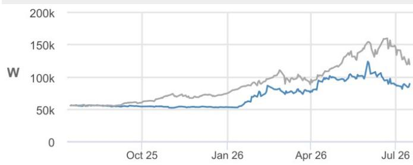
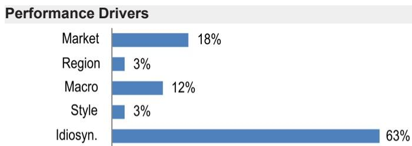
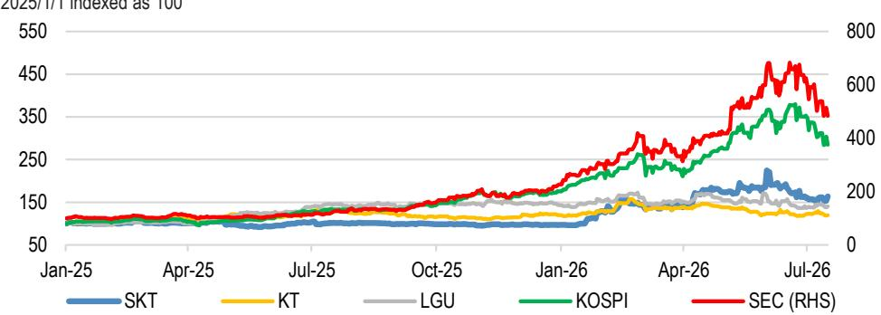
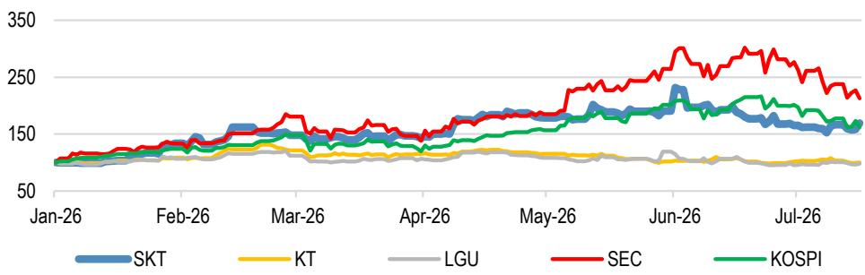
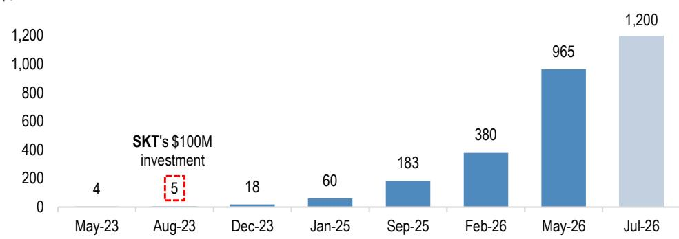
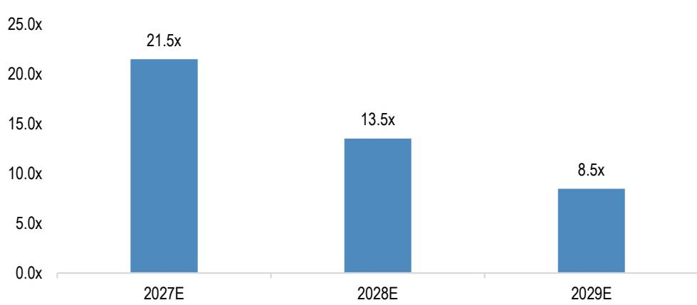

# SK Telecom

## AI数据中心建设成为新催化剂；上调至增持

SKT的股价从近期高点回落27%（同期KOSPI下跌22%），反映出市场对Anthropic相关交易的观点趋于理性。我们认为，随着乐观情绪已被基本定价，与该交易相关的波动性有望减弱。我们转而关注SKT作为AI数据中心（"AI工厂"）参与者的研究价值，该公司已公布积极的产能扩张计划。我们认为，在SK集团于全球AI价值链中的强势地位支撑下，公司有望取得实质性进展——这正成为其越来越重要的价值驱动因素。我们上调评级至增持，并将基于分部加总法的2027年12月目标价上调38%至110,000韩元（潜在上行空间23%），以反映其持有的Anthropic不足0.3%股权价值3万亿韩元，以及AI数据中心业务（含海底电缆）价值3万亿韩元（此前2026年12月目标价为80,000韩元）。

- SKT由AI驱动的价值重估应使其与传统电信同业进一步区分。年初至今，该股上涨69%（同期KT/LGU+为0%/-2%；较2026年6月高点回落27%），受AI相关战略、基本面及市场情绪驱动。关键波动因素为"Anthropic相关交易"（参见我们此前报告）：SKT持有Anthropic不足0.3%股权，基于2026年5月最新融资轮估值9,650亿美元（链接），我们对其估值约为29亿美元（4.3万亿韩元）。相比之下，SKT年初至今市值增长约8万亿韩元（或自6月高点增长15万亿韩元），表明市场对Anthropic持股隐含价值的过度乐观情绪仍有残留。不过，随着乐观情绪已被基本定价，我们预计与该交易相关的波动性将减弱。

- SKT的AI布局在政府主导项目、基础设施及战略持股方面日益具体：1）其联合体入选韩国主权AI竞赛四强（与LG AI研究院、Upstage及Motif Technologies并列），虽然商业化路径尚不清晰，但可能开启中长期B2G AI业务机会；2）基础设施方面，SKT正与AWS合作在蔚山建设大型AI数据中心，目标2029年达到100MW（长期可扩展至1GW），并已提出更宏大的AI数据中心规划——2035年达5GW，长期目标15GW；3）AI半导体方面，SKT通过持有SAPEON INC 62.5%股权间接投资于本土无晶圆厂芯片商Rebellion（SAPEON持有Rebellion 26%股权，后者正筹备2027年上半年IPO；来源：Digitimes）。

- SKT正积极推进AI数据中心建设，SK Broadband（SKBB；全资持有）预计将成为集团"AI数据中心工厂"战略的关键执行主体。继崔会长提出包括1,000万亿韩元AI数据中心专项资金的长期规划后，SKT/SKBB近期公布了2029-2035年5GW AI数据中心容量目标（含蔚山项目）及长期15GW目标。考虑到所需资金规模（例如每GW约需75万亿韩元），我们预计SKT将借助项目融资及全球科技巨头合作伙伴的资本来减轻自身负担。潜在的AI算力终端需求来源涵盖全球AI纯业务公司（如OpenAI、Anthropic）、超大规模云服务商（如亚马逊、微软、谷歌）、国内企业/政府/机构以及SK集团内部需求。

- AI数据中心的上行空间尚未完全反映在SKT的估值中，我们对此持

来源：风格暴露——JPM全球市场策略；其余表格为公司数据及JPM估计。

## ▲增持

此前：中性

分析师认证及重要披露（含非美国分析师披露）请参见第9页。

017670.KS, 017670 KS
价格（2026年7月16日）：89,400韩元

▲ 目标价（2027年12月）：110,000韩元
此前（2026年12月）：80,000韩元

## 互联网与电信

Stanley Yang AC
(82-2) 758-5712
stanley.yang@JPM.com

Benjamin Kim
(82-2) 758-5580
benjamin.kim@JPM.com
JPM证券（远东）有限公司首尔分行

<table><tr><td colspan="4">主要变动（财年截至12月）</td></tr><tr><td></td><td>此前</td><td>当前</td><td>变动</td></tr><tr><td>调整后EBIT - 2026E（十亿韩元）</td><td>1,852</td><td>1,932</td><td>4.3%</td></tr><tr><td>调整后EBIT - 2027E（十亿韩元）</td><td>1,955</td><td>2,063</td><td>5.5%</td></tr></table>

## 季度预测（财年截至12月）

<table><tr><td colspan="4">调整后每股收益（韩元）</td></tr><tr><td></td><td>2025A</td><td>2026E</td><td>2027E</td></tr><tr><td>第一季度</td><td>1,698</td><td>1,486A</td><td>1,800</td></tr><tr><td>第二季度</td><td>391</td><td>1,634</td><td>1,778</td></tr><tr><td>第三季度</td><td>(783)</td><td>1,452</td><td>1,582</td></tr><tr><td>第四季度</td><td>456</td><td>1,069</td><td>1,120</td></tr><tr><td>全年</td><td>1,762</td><td>5,641</td><td>6,279</td></tr></table>

风格暴露

<table><tr><td rowspan="2">量化因子</td><td rowspan="2">当前%排名</td><td colspan="4">历史%排名（1=最高）</td></tr><tr><td>6个月</td><td>1年</td><td>3年</td><td>5年</td></tr><tr><td>价值</td><td>60</td><td>42</td><td>42</td><td>37</td><td>28</td></tr><tr><td>成长</td><td>38</td><td>94</td><td>46</td><td>48</td><td>85</td></tr><tr><td>动量</td><td>29</td><td>91</td><td>32</td><td>72</td><td>56</td></tr><tr><td>质量</td><td>57</td><td>66</td><td>13</td><td>18</td><td>55</td></tr><tr><td>低波动</td><td>7</td><td>2</td><td>1</td><td>91</td><td>2</td></tr><tr><td>ESG质量</td><td>96</td><td>97</td><td>21</td><td>-</td><td>22</td></tr></table>

价格表现  

— 017670.KS 价格（韩元） — KOSPI（基准调整后）

<table><tr><td></td><td>年初至今</td><td>1个月</td><td>3个月</td><td>12个月</td></tr><tr><td>相对</td><td>67.1%</td><td>-11.2%</td><td>-7.4%</td><td>59.9%</td></tr><tr><td>相对</td><td>5.3%</td><td>10.6%</td><td>-17.0%</td><td>-54.1%</td></tr></table>

公司数据

<table><tr><td>流通股数（百万）</td><td>219</td></tr><tr><td>52周区间（韩元）</td><td>140,300-51,400</td></tr><tr><td>市值（百万美元）</td><td>13,166</td></tr><tr><td>汇率</td><td>1,486</td></tr><tr><td>自由流通比例（%）</td><td>61.8%</td></tr><tr><td>3个月日均成交量（千股）</td><td>2,590.0</td></tr><tr><td>3个月日均成交额（百万美元）</td><td>183.2</td></tr><tr><td>波动率（90天）</td><td>68</td></tr><tr><td>指数</td><td>KOSPI</td></tr><tr><td>彭博分析师评级（买入|持有|卖出）</td><td>16|11|4</td></tr></table>

关键指标（财年截至12月）

<table><tr><td>十亿韩元</td><td>FY25A</td><td>FY26E</td><td>FY27E</td></tr><tr><td colspan="4">财务估计</td></tr><tr><td>收入</td><td>17,099</td><td>17,655</td><td>17,892</td></tr><tr><td>调整后EBITDA</td><td>4,663</td><td>5,497</td><td>5,670</td></tr><tr><td>调整后EBIT</td><td>1,073</td><td>1,932</td><td>2,063</td></tr><tr><td>调整后净利润</td><td>375</td><td>1,201</td><td>1,337</td></tr><tr><td>调整后每股收益</td><td>1,762</td><td>5,641</td><td>6,279</td></tr><tr><td>报告每股收益</td><td>1,762</td><td>5,641</td><td>6,279</td></tr><tr><td>彭博每股收益</td><td>1,764</td><td>5,595</td><td>6,088</td></tr><tr><td>经营活动现金流</td><td>3,924</td><td>4,666</td><td>4,834</td></tr><tr><td>公司自由现金流</td><td>1,136</td><td>1,798</td><td>1,895</td></tr><tr><td colspan="4">利润率与增长</td></tr><tr><td>收入同比增长（%）</td><td>(4.7%)</td><td>3.2%</td><td>1.3%</td></tr><tr><td>EBITDA利润率</td><td>27.3%</td><td>31.1%</td><td>31.7%</td></tr><tr><td>EBITDA同比增长（%）</td><td>(15.5%)</td><td>17.9%</td><td>3.1%</td></tr><tr><td>EBIT利润率</td><td>6.3%</td><td>10.9%</td><td>11.5%</td></tr><tr><td>净利润率</td><td>2.2%</td><td>6.8%</td><td>7.5%</td></tr><tr><td>调整后每股收益增长</td><td>(73.0%)</td><td>220.2%</td><td>11.3%</td></tr><tr><td colspan="4">比率</td></tr><tr><td>调整后税率</td><td>28.8%</td><td>27.0%</td><td>25.0%</td></tr><tr><td>利息覆盖倍数</td><td>-</td><td>-</td><td>-</td></tr><tr><td>净债务/权益</td><td>0.7</td><td>0.7</td><td>0.6</td></tr><tr><td>净债务/EBITDA</td><td>2.0</td><td>1.7</td><td>1.7</td></tr><tr><td>已动用资本回报率</td><td>3.4%</td><td>5.8%</td><td>6.1%</td></tr><tr><td>净资产回报表现</td><td>3.1%</td><td>8.9%</td><td>9.1%</td></tr><tr><td colspan="4">估值</td></tr><tr><td>公司自由现金流回报表现</td><td>6.0%</td><td>9.4%</td><td>10.0%</td></tr><tr><td>股息回报表现</td><td>1.9%</td><td>4.0%</td><td>4.0%</td></tr><tr><td>企业价值/收入</td><td>1.2</td><td>1.2</td><td>1.2</td></tr><tr><td>企业价值/EBITDA</td><td>4.6</td><td>3.9</td><td>3.8</td></tr><tr><td>调整后市盈率</td><td>50.7</td><td>15.8</td><td>14.2</td></tr></table>

## 投资主题与估值总结

## 投资主题

SKT的股价从近期高点回落27%（同期KOSPI下跌22%），反映出市场对Anthropic相关交易的观点趋于理性。我们认为，随着乐观情绪已被基本定价，与该交易相关的波动性有望减弱。我们转而关注SKT作为AI数据中心（"AI工厂"）参与者的研究价值，该公司已公布积极的产能扩张计划。我们认为，在SK集团于全球AI价值链中的强势地位支撑下，公司有望取得实质性进展——这正成为其越来越重要的价值驱动因素。我们上调评级至增持，并将基于分部加总法的目标价上调38%至110,000韩元（潜在上行空间23%），以反映其持有的Anthropic不足0.3%股权价值3万亿韩元，以及AI数据中心业务（含海底电缆）价值3万亿韩元。

## 估值

我们基于分部加总法得出2027年12月目标价110,000韩元（此前为80,000韩元）：（1）电信业务的现金流折现估值，（2）SKT持有的Anthropic股权按最新融资轮估值，（3）AI数据中心业务按企业价值/EBIT倍数估值。

<table><tr><td>因子</td><td>6个月相关性</td><td>1年相关性</td></tr><tr><td>市场：MSCI亚太（除日本）</td><td>0.48</td><td>0.42</td></tr><tr><td>地区：韩国</td><td>0.10</td><td>0.20</td></tr><tr><td colspan="3">宏观：</td></tr><tr><td>通用1st 'CO' 期货</td><td>-0.34</td><td>-0.21</td></tr><tr><td>JPMGBI-EM全球分散</td><td>0.30</td><td>0.19</td></tr><tr><td>JPM中国A股情绪</td><td>-0.12</td><td>-0.16</td></tr><tr><td colspan="3">量化风格：</td></tr><tr><td>低波动</td><td>0.12</td><td>0.17</td></tr><tr><td>股息回报表现</td><td>0.07</td><td>0.11</td></tr><tr><td>价值</td><td>0.11</td><td>0.10</td></tr></table>

我们对该战略的看法更为积极，原因在于：（1）SK集团在全球AI价值链中的强势定位，（2）全球AI服务和基础设施参与者对韩国作为潜在AI生态系统枢纽的投资兴趣上升，（3）偏向外部资本（项目融资/合作伙伴）的融资方式，以及（4）具有吸引力的单位经济性（营业利润率约15-20%）。作为参考，相较于CoreWeave的长期目标（到2027年活跃容量超过1GW、已锁定超过3.5GW，到2030年超过8GW），我们假设SKT到2030-2031年达到约0.5GW的活跃AI数据中心容量。基于此，我们采用6.6倍企业价值/EBIT倍数（2030-2031年预期，与CoreWeave一致，基于彭博一致预期），估算AI数据中心（含海底电缆）价值为3万亿韩元。

- 基于分部加总法的目标价上调至110,000韩元（潜在上行空间23%）：我们采用分部加总估值框架，包括：1）核心电信业务（无线和固网，含传统数据中心运营）的现金流折现价值17.6万亿韩元，2）Anthropic不足0.3%股权价值3万亿韩元（30%资产净值折价），以及3）AI数据中心业务（含海底电缆）价值3万亿韩元，按2030-2031年预期收益的6.6倍企业价值/EBIT估值。

图1：SK Telecom：2025年1月以来价格表现  
  
来源：彭博金融信息

图2：SK Telecom：年初至今价格表现
2026年1月1日指数化为100  
  
来源：彭博金融信息

图3：Anthropic估值历史  
  
来源：新闻文章（MK新闻、韩经、Business Insider等）、公司数据。
注：2026年7月数据基于二级市场隐含估值，非融资轮（链接）。

表2：SK Telecom：AI数据中心容量计划

<table><tr><td>时间线</td><td>目标容量</td><td>关键计划</td></tr><tr><td>至2027年11月</td><td>40MW</td><td>与AWS合作建设蔚山AI数据中心</td></tr><tr><td>至2029年</td><td>100MW</td><td>蔚山数据中心一期扩建</td></tr><tr><td>至2035年</td><td>5GW</td><td>蔚山扩展至约1GW，在岭南地区确保约1GW，以及额外数据中心容量</td></tr><tr><td>长期</td><td>15GW</td><td>完成15GW规模的AI数据中心基础设施</td></tr></table>

来源：本地新闻（MK新闻、韩经等）、公司数据。

表3：SK Telecom：分部加总估值
万亿韩元  
图4：CoreWeave：企业价值/EBIT估值  
  
来源：彭博金融信息

<table><tr><td></td><td>价值</td></tr><tr><td>总权益价值</td><td>23.6</td></tr><tr><td>（1）电信业务价值（现金流折现）</td><td>17.6</td></tr><tr><td>（2）Anthropic股权价值</td><td>3.0</td></tr><tr><td>最新融资估值</td><td>1,448</td></tr><tr><td>持股比例</td><td>0.3%</td></tr><tr><td>股权价值</td><td>4.3</td></tr><tr><td>资产净值折价比例</td><td>-30%</td></tr><tr><td>（3）AI数据中心价值（2030-2031年预期0.5GW）</td><td>3.0</td></tr><tr><td>收入（含海底电缆）</td><td>3.0</td></tr><tr><td>EBIT利润率</td><td>15%</td></tr><tr><td>EBIT</td><td>0.45</td></tr><tr><td>目标企业价值/EBIT倍数</td><td>6.6倍</td></tr><tr><td>流通股数（百万）</td><td>214.8</td></tr><tr><td>目标价（韩元）</td><td>110,000</td></tr></table>

来源：彭博金融信息、JPM估计。

表4：SK Telecom：电信业务现金流折现估值
十亿韩元

<table><tr><td></td><td>2021</td><td>2022</td><td>2023</td><td>2024</td><td>2025</td><td>2026E</td><td>2027E</td><td>2028E</td><td>2029E</td><td>2030E</td></tr><tr><td>EBIT（1-税率）</td><td>1,082</td><td>1,257</td><td>1,367</td><td>1,422</td><td>805</td><td>1,449</td><td>1,547</td><td></td><td></td><td></td></tr><tr><td>净利息</td><td>-243</td><td>-270</td><td>-320</td><td>-316</td><td>-310</td><td>-329</td><td>-298</td><td></td><td></td><td></td></tr><tr><td>折旧与摊销</td><td>3,820</td><td>3,755</td><td>3,750</td><td>3,695</td><td>3,590</td><td>3,565</td><td>3,607</td><td></td><td></td><td></td></tr><tr><td>资本支出</td><td>-3,307</td><td>-3,046</td><td>-3,081</td><td>-2,559</td><td>-2,323</td><td>-2,403</td><td>-2,474</td><td></td><td></td><td></td></tr><tr><td>频谱支付</td><td>-465</td><td>-465</td><td>-465</td><td>-465</td><td>-465</td><td>-465</td><td>-465</td><td></td><td></td><td></td></tr><tr><td>营运资本及其他</td><td>373</td><td>416</td><td>150</td><td>286</td><td>-161</td><td>-19</td><td>-22</td><td></td><td></td><td></td></tr><tr><td>合并自由现金流</td><td>1,259</td><td>1,648</td><td>1,402</td><td>2,063</td><td>1,136</td><td>1,798</td><td>1,895</td><td>1,989</td><td>2,089</td><td>2,193</td></tr><tr><td>债务成本</td><td>4.4%</td><td></td><td></td><td></td><td></td><td></td><td></td><td></td><td></td><td></td></tr><tr><td>权益成本</td><td>11.5%</td><td></td><td></td><td></td><td></td><td></td><td></td><td></td><td></td><td></td></tr><tr><td>税率</td><td>24.0%</td><td></td><td></td><td></td><td></td><td></td><td></td><td></td><td></td><td></td></tr><tr><td>无风险利率</td><td>4.0%</td><td></td><td></td><td></td><td></td><td></td><td></td><td></td><td></td><td></td></tr><tr><td>市场风险溢价</td><td>7.5%</td><td></td><td></td><td></td><td></td><td></td><td></td><td></td><td></td><td></td></tr><tr><td>贝塔</td><td>1.0</td><td></td><td></td><td></td><td></td><td></td><td></td><td></td><td></td><td></td></tr><tr><td>债务/资本</td><td>44%</td><td></td><td></td><td></td><td></td><td></td><td></td><td></td><td></td><td></td></tr><tr><td>权益/资本</td><td>56%</td><td></td><td></td><td></td><td></td><td></td><td></td><td></td><td></td><td></td></tr><tr><td>加权平均资本成本</td><td>8.4%</td><td></td><td></td><td></td><td></td><td></td><td></td><td></td><td></td><td></td></tr><tr><td>现金流现值（2028E-30E）</td><td>5,335</td><td></td><td></td><td></td><td></td><td></td><td></td><td></td><td></td><td></td></tr><tr><td>终值现值</td><td>21,517</td><td></td><td></td><td></td><td></td><td></td><td></td><td></td><td></td><td></td></tr><tr><td>净债务</td><td>9,248</td><td></td><td></td><td></td><td></td><td></td><td></td><td></td><td></td><td></td></tr><tr><td>电信业务估值</td><td>17,604</td><td></td><td></td><td></td><td></td><td></td><td></td><td></td><td></td><td></td></tr></table>

来源：彭博金融信息、JPM估计。

# 投资主题、估值与风险

SK Telecom（增持；目标价：110,000韩元）

## 投资主题

SKT的股价从近期高点回落27%（同期KOSPI下跌22%），反映出市场对Anthropic相关交易的观点趋于理性。我们认为，随着乐观情绪已被基本定价，与该交易相关的波动性有望减弱。我们转而关注SKT作为AI数据中心（"AI工厂"）参与者的研究价值，该公司已公布积极的产能扩张计划。我们认为，在SK集团于全球AI价值链中的强势地位支撑下，公司有望取得实质性进展——这正成为其越来越重要的价值驱动因素。我们上调评级至增持，并将基于分部加总法的目标价上调38%至110,000韩元（潜在上行空间23%），以反映其持有的Anthropic不足0.3%股权价值3万亿韩元，以及AI数据中心业务（含海底电缆）价值3万亿韩元。

## 估值

我们基于分部加总法得出2027年12月目标价110,000韩元：（1）电信业务的现金流折现估值，（2）SKT持有的Anthropic股权按最新融资轮估值，（3）AI数据中心业务按企业价值/EBIT倍数估值。

表6：SK Telecom：分部加总估值
万亿韩元

<table><tr><td></td><td>价值</td></tr><tr><td>总权益价值</td><td>23.6</td></tr><tr><td>（1）电信业务价值（现金流折现）</td><td>17.6</td></tr><tr><td>（2）Anthropic股权价值</td><td>3.0</td></tr><tr><td>最新融资估值</td><td>1,448</td></tr><tr><td>持股比例</td><td>0.3%</td></tr><tr><td>股权价值</td><td>4.3</td></tr><tr><td>资产净值折价比例</td><td>-30%</td></tr><tr><td>（3）AI数据中心价值（2030-2031年预期0.5GW）</td><td>3.0</td></tr><tr><td>收入（含海底电缆）</td><td>3.0</td></tr><tr><td>EBIT利润率</td><td>15%</td></tr><tr><td>EBIT</td><td>0.45</td></tr><tr><td>目标企业价值/EBIT倍数</td><td>6.6倍</td></tr><tr><td>流通股数（百万）</td><td>214.8</td></tr><tr><td>目标价（韩元）</td><td>110,000</td></tr></table>

来源：彭博金融信息、JPM估计。

## 评级与目标价风险

我们评级与目标价的下行风险包括：1）AI数据中心业务进展慢于预期；2）数据泄露事件的后果比预期更严重；以及3）持续的监管压力。

## SK Telecom：财务摘要

利润表

<table><tr><td>十亿韩元，财年截至12月</td><td>FY24</td><td>FY25</td><td>FY26E</td><td>FY27E</td></tr><tr><td>收入</td><td>17,941</td><td>17,099</td><td>17,655</td><td>17,892</td></tr><tr><td>营业费用</td><td>(16,117)</td><td>(16,026)</td><td>(15,723)</td><td>(15,829)</td></tr><tr><td>人工</td><td>(2,726)</td><td>(2,711)</td><td>(2,634)</td><td>(2,713)</td></tr><tr><td>佣金</td><td>(5,564)</td><td>(5,495)</td><td>(5,552)</td><td>(5,534)</td></tr><tr><td>营销</td><td>(186)</td><td>(183)</td><td>(179)</td><td>(183)</td></tr><tr><td>折旧与摊销</td><td>(3,695)</td><td>(3,590)</td><td>(3,565)</td><td>(3,607)</td></tr><tr><td>其他</td><td>(3,946)</td><td>(4,047)</td><td>(3,792)</td><td>(3,792)</td></tr><tr><td>营业利润</td><td>1,823</td><td>1,073</td><td>1,932</td><td>2,063</td></tr><tr><td>EBITDA</td><td>5,518</td><td>4,663</td><td>5,497</td><td>5,670</td></tr><tr><td>净非营业收支</td><td>(62)</td><td>(351)</td><td>(287)</td><td>(280)</td></tr><tr><td>税前利润</td><td>1,762</td><td>722</td><td>1,645</td><td>1,782</td></tr><tr><td>所得税</td><td>(375)</td><td>(208)</td><td>(444)</td><td>(446)</td></tr><tr><td>净利润</td><td>1,387</td><td>375</td><td>1,201</td><td>1,337</td></tr><tr><td>净利润（不含Hynix）</td><td>1,387</td><td>375</td><td>1,201</td><td>1,337</td></tr><tr><td>每股收益（韩元）</td><td>6,516</td><td>1,762</td><td>5,641</td><td>6,279</td></tr><tr><td>每股收益（韩元，调整后，不含Hynix）</td><td>6,516</td><td>1,762</td><td>5,641</td><td>6,279</td></tr></table>

资产负债表

<table><tr><td>十亿韩元，财年截至12月</td><td>FY24</td><td>FY25</td><td>FY26E</td><td>FY27E</td></tr><tr><td>流动资产合计</td><td>7,477</td><td>6,727</td><td>6,912</td><td>7,034</td></tr><tr><td>现金及现金等价物</td><td>2,024</td><td>1,490</td><td>1,345</td><td>1,107</td></tr><tr><td>短期投资</td><td>324</td><td>151</td><td>154</td><td>158</td></tr><tr><td>应收账款</td><td>2,358</td><td>2,265</td><td>2,310</td><td>2,356</td></tr><tr><td>其他流动资产</td><td>2,771</td><td>2,821</td><td>3,103</td><td>3,413</td></tr><tr><td>固定资产合计</td><td>23,039</td><td>23,381</td><td>24,150</td><td>25,131</td></tr><tr><td>投资</td><td>4,220</td><td>5,427</td><td>6,124</td><td>7,026</td></tr><tr><td>有形资产</td><td>12,644</td><td>11,942</td><td>12,062</td><td>12,182</td></tr><tr><td>无形资产</td><td>4,267</td><td>3,783</td><td>3,670</td><td>3,559</td></tr><tr><td>其他长期资产</td><td>1,907</td><td>2,228</td><td>2,295</td><td>2,364</td></tr><tr><td>资产总计</td><td>30,515</td><td>30,108</td><td>31,062</td><td>32,165</td></tr><tr><td>
