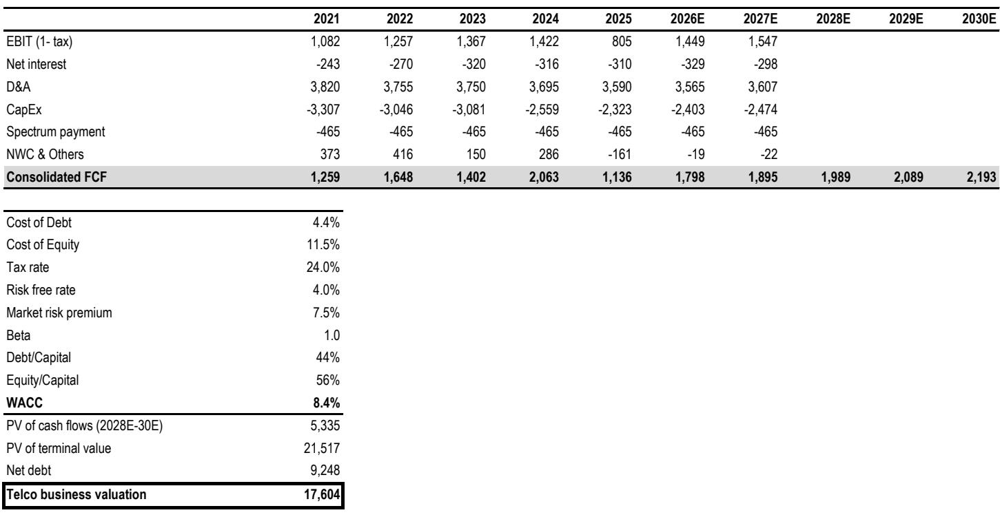
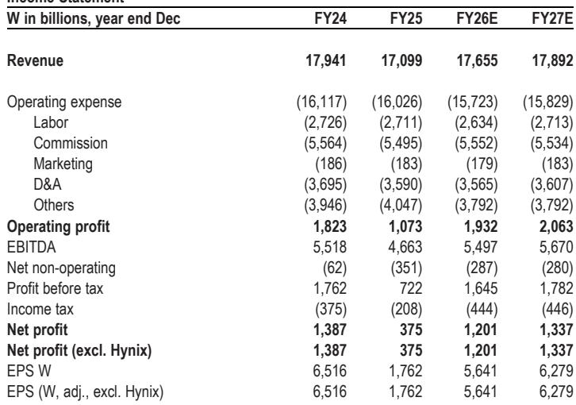
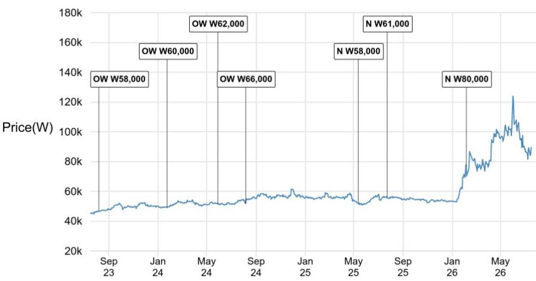

# JPM：SK电讯AI工厂建设成为新催化剂-上调至超配

SK电讯的报价从近期高点回落了27%，同期韩国综合报价指数下跌22%。市场对Anthropic相关交易的乐观情绪已基本被定价，波动性预计将逐步收敛。JPM在这份研报中提出的核心判断是：真正驱动SK电讯长期价值的，不是它持有的不到0.3%的Anthropic股权，而是它正在推进的AI数据中心建设计划——一个被市场关注的“AI工厂”故事。

这家韩国电信运营商正在从传统的通信服务商，转向AI基础设施的建造者和运营者。SK集团在全球AI价值链中的强势地位，为这一转型提供了支撑。SK电讯的AI数据中心扩张计划规模可观：到2035年建成5GW容量，长期目标达到15GW。作为参照，全球知名的AI云服务商CoreWeave的长期目标也不过是超过8GW。SK电讯的计划如果兑现，将使其成为亚洲最大的AI数据中心运营商之一。

## 1. 从交易到AI工厂：市场正在重新理解SK电讯的故事

过去一年，SK电讯的报价上涨69%，远超韩国电信同行（KT和LGU+同期基本持平）。市场最初将这一涨幅归因于“Anthropic相关交易”——SK电讯持有Anthropic不到0.3%的股权，按后者2026年5月最新融资估值9650亿美元计算，这部分股权价值约43万亿韩元。但JPM指出，SK电讯今年以来市值增长约80万亿韩元，远超其Anthropic股权的隐含价值，说明市场存在一定程度的乐观预期。

但报告认为，随着Anthropic相关波动性减弱，市场焦点正在转移。SK电讯的AI数据中心业务才是真正的增量。其AI数据中心业务（含海底光缆）的估值目前仅为3万亿韩元，而JPM认为，仅0.5GW的活跃AI数据中心容量，就足以支撑这一估值。考虑到SK电讯2035年5GW的目标，这一业务的价值重估空间较大。

> **KC评论：** 市场往往高估短期催化剂（如Anthropic股权），却低估长期结构性变化（如AI数据中心）。SK电讯的AI工厂计划如果执行顺利，其估值逻辑将从“电信股+期权”切换为“AI基础设施运营商”，后者享受的估值倍数完全不同。

## 2. 5GW不是口号：SK电讯的AI数据中心计划有具体路径和合作伙伴

这份研报提供了SK电讯AI数据中心扩张的具体时间表：2027年11月前建成40MW的蔚山AI数据中心（与AWS合作），2029年扩展到100MW，2035年达到5GW。其中蔚山项目将贡献约1GW，岭南地区再贡献约1GW，其余通过额外数据中心容量实现。

融资是市场最关心的问题。每1GW AI数据中心需要约750万亿韩元的资本支出。JPM认为，SK电讯不会全部自己出资，而是依赖项目融资和全球科技巨头的资本。潜在的需求方包括OpenAI、Anthropic等AI公司，亚马逊、微软、谷歌等云服务商，以及韩国本土企业和相关机构。SK集团自身的AI需求也是重要的内部消化渠道。

报告还提到，SK电讯的AI数据中心业务有望实现15%-20%的营业利润率。这一数字与CoreWeave等专业AI云服务商相当，远高于传统电信业务。如果SK电讯能在2030-2031年实现0.5GW的活跃容量，按6.6倍EV/EBIT估值（与CoreWeave一致），仅此一项就价值3万亿韩元。

## 3. 韩国AI竞赛：一个被关注的催化剂

SK电讯的AI布局不仅限于数据中心。其财团被选为韩国“AI”竞赛的四家入围者之一（其他三家包括LG AI Research、Upstage和Motif Technologies）。虽然商业化路径尚不清晰，但这为SK电讯打开了中长期的企业对相关机构AI业务机会。

此外，SK电讯通过其控股的SAPEON INC（持股62.5%）间接持有韩国AI芯片设计公司Rebellion的26%股权。Rebellion计划在2027年上半年IPO。这意味着SK电讯在AI基础设施的三个关键环节——算力（数据中心）、算法（AI）、芯片（Rebellion）——都有布局。这种垂直整合能力，在亚洲电信运营商中较为少见。

## 4. 估值框架切换：SOTP模型揭示的潜在价值重估

JPM将SK电讯的估值方法从单一的DCF模型切换为SOTP（分部分加总）模型，这本身就是一种信号。新的估值框架包含三部分：传统电信业务DCF估值17.6万亿韩元，Anthropic股权按30% NAV折价后估值3万亿韩元，AI数据中心业务估值3万亿韩元。合计23.6万亿韩元，较当前报价有23%的潜在上行空间。

值得注意的是，AI数据中心业务的估值仅基于0.5GW的活跃容量假设，而SK电讯的目标是5GW甚至15GW。如果执行顺利，这一业务的估值可能数倍于当前假设。同时，传统电信业务的DCF估值（17.6万亿韩元）相对保守，并未计入AI数据中心对电信业务的协同效应。

> **KC评论：** 读者可以关注SK电讯AI数据中心建设的两个关键节点：一是蔚山项目2027年能否如期投产，二是能否获得全球科技巨头的长期合同。这两个节点的进展，将决定AI数据中心业务从“期权价值”转化为“实际价值”的速度。

For informational purposes only. Portions may be generated,translated,summarized,or edited with AI assistance based on source materials and may contain omissions or errors. Please verify independently. This is not investment,legal,tax,accounting,or other professional advice.

