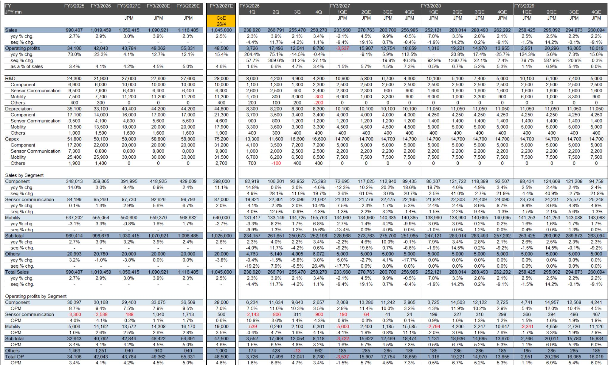
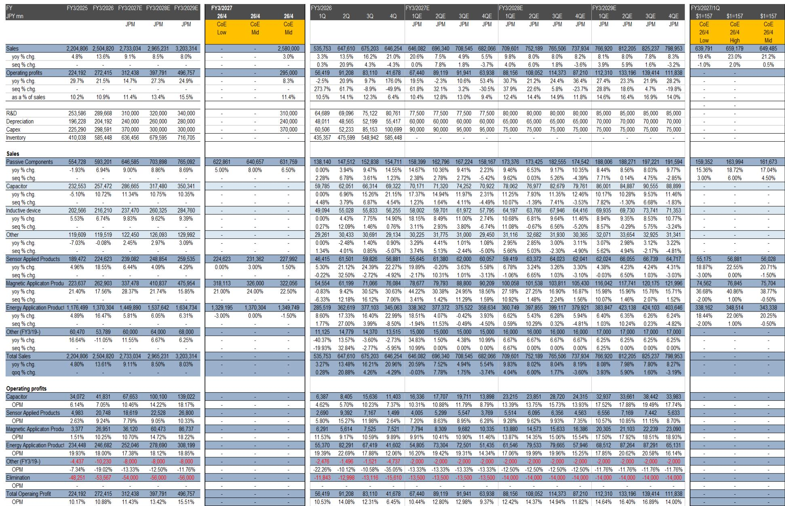
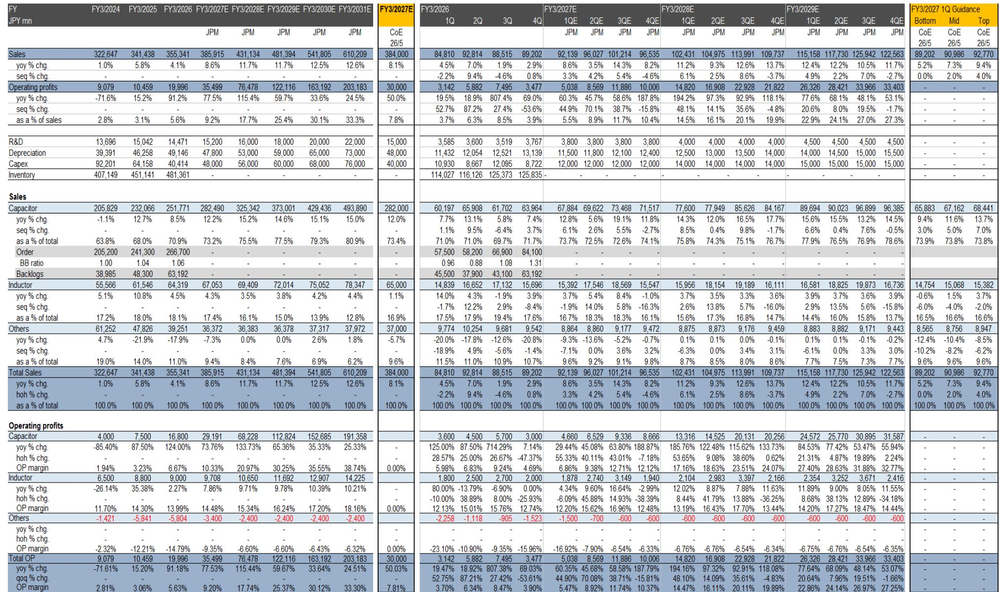

# JPM：电子元件-技术板块

日本电子元件板块正在经历一轮被低估的盈利修复。JPM最新覆盖的16家公司中，11家获得公司观点，简单平均预期回报率达36.5%。这不是一个温和的行业回暖——从村田制作所到太阳诱电，从TDK到罗姆，多家龙头公司的盈利预测曲线在FY26-FY28年间呈现出罕见的陡峭斜率。

报告的核心判断是：电子元件行业的周期性底部已经确认，而市场对这一修复的定价仍不充分。以村田为例，其FY26至FY28的每股收益预期从177日元跃升至428日元，增幅超过140%。太阳诱电的EPS预期同期从176日元升至644日元，翻了近三倍。这些数字背后不是单一产品驱动，而是整个下游需求的系统性恢复。

> **KC评论：** 报告中的盈利预测跨度长达三个财年，这在日本电子元件研报中并不常见。通常分析师只给出FY26-FY27的预测，而JPM将预测延伸至FY28，本身就暗示了对这轮修复持续性的信心。

## 1. 盈利修复的广度与深度同时改善

从估值角度看，这轮修复并非仅由少数公司驱动。16家公司中，有11家获得公司观点，只有尼得科被更新公司观点。简单平均的FY26市盈率为29.5倍，到FY27降至21.1倍——盈利增长正在快速消化当前估值。

更值得关注的是ROE的改善轨迹。村田的ROE预期从FY26的11.6%升至FY28的22.4%，太阳诱电从6.9%升至20.3%，TDK从9.9%升至13.6%。这些数字意味着，企业不仅是在恢复利润，更是在重建资本回报能力。报告中的ROIC数据同样支持这一判断：村田的ROIC从11.2%升至22.1%，太阳诱电从5.6%升至16.1%。

盈利修复的另一个信号是自由现金流的快速回升。村田的自由现金流从FY26的2450亿日元增至FY28的6660亿日元，TDK从946亿日元增至3373亿日元。现金流的改善为这些公司提供了更大的财务灵活性，无论是用于资本开支还是股东回报。

## 2. 市场定价仍落后于基本面改善

尽管盈利预测大幅上调，但市场定价并未完全反映这一变化。当前报价8400日元，隐含回报率81%，当前12525日元，隐含回报率79.6%，当前3085日元，隐含回报率78.3%。

这种定价差距部分源于市场对日本电子元件行业周期性的固有认知。过去几年，该行业经历了从供不应求到库存调整的完整周期，读者倾向于等待更多确认信号。但报告认为，当前的需求恢复具有结构性支撑——不仅仅是补库存，而是终端应用领域的真实增长。

尼得科是报告中相对少见的公司观点案例，低于当前报价2583日元，隐含-30.3%的回报。这一反差说明，JPM并非对整个板块无差别乐观，而是基于具体公司的竞争地位和盈利可见性做出了差异化判断。

## 3. 读者需要区分周期修复与结构增长

报告覆盖的公司横跨多个子领域：被动元件（村田、太阳诱电、TDK）、半导体（罗姆、京瓷）、连接器（广濑电机、日本航空电子）、电机（尼得科、美蓓亚三美）以及印刷电路板（揖斐电）。这些公司的盈利修复节奏和幅度并不相同。

揖斐电的案例值得单独关注。其FY26至FY28的EPS预期从272日元升至489日元，ROE从13.7%升至18.6%，但自由现金流在FY26和FY27均为负值。这说明公司的盈利增长可能伴随着较高的资本开支，读者需要评估其现金流改善的时间表。

另一个观察点是股息政策。多数公司预期提高股息，但增速差异明显。村田的每股股息从70日元升至100日元，太阳诱电从95日元升至125日元，而京瓷和日本化学电容器则维持股息不变。股息增长与盈利增长的匹配程度，可以作为判断管理层信心的一个参考指标。

> **KC评论：** 报告中的股息支付率数据值得留意。村田的支付率从39.5%降至23.4%，太阳诱电从54%降至19.4%。支付率下降并非坏事——它意味着盈利增长远超股息增长，企业保留了更多资金用于再研究。这与ROE改善的逻辑是一致的。

对于关注日本电子元件行业的读者，这份报告提供了一个清晰的观察框架：先看盈利修复的斜率（EPS增速），再看修复的质量（ROE和ROIC），最后看市场定价是否充分反映了这些变化。当前阶段，盈利修复的斜率可能是最值得跟踪的变量。

For informational purposes only. Portions may be generated,translated,summarized,or edited with AI assistance based on source materials and may contain omissions or errors. Please verify independently. This is not investment,legal,tax,accounting,or other professional advice.

