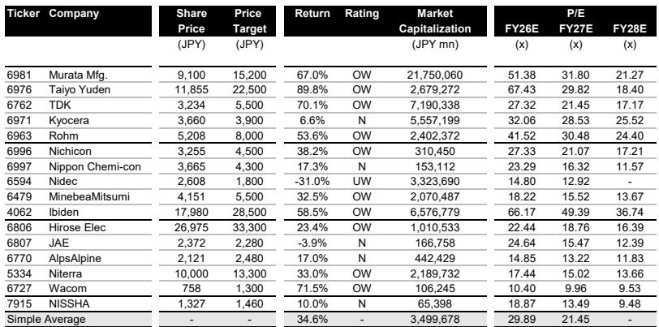
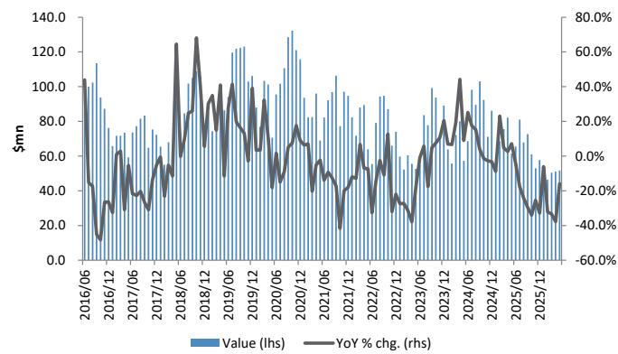
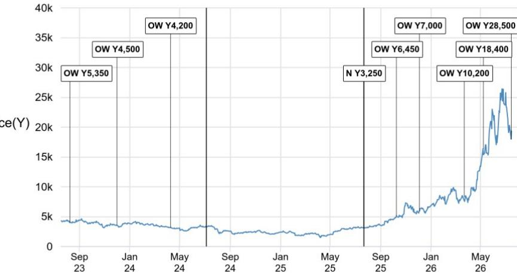

# 日本电子元件市场并非同步复苏：三大分化信号定义未来半年走势

日本经济产业省2026年5月的生产统计数据显示，电子元件市场远未呈现同步复苏态势。国内电子元件总生产值大体符合过去20年的季节性规律，但这一总量数据掩盖了关键的分化。以多层陶瓷电容器（MLCC）为代表的被动元件显著低于正常季节性趋势，MLCC生产值环比下降17%，同比下降17%，至3.7亿美元。与此形成鲜明对比的是，刚性模块基板——包括ABF基板和FC-BGA——以美元计环比增长20%，延续明显上升趋势。同时，半导体板块内存生产值同比增长548%，这一增速被描述为前所未有。这不是广泛的周期性回升，而是一个正在分化为三条不同轨迹的市场，若将其视为单一复苏，将导致资源配置失当。

这种分化之所以重要，是因为2026年下半年的走势将取决于4-6月财报季是否确认或反驳这些信号。报告指出，工业机械需求的强劲复苏以及汽车需求在库存调整后的广泛回升，是未来一个季度的催化剂。但数据也显示，MLCC生产值趋势线正从持平转向小幅下行，而MLCC的订单出货比——在4-6月期间因AI服务器需求维持在1.3至1.4之间——历史上从未连续两个季度保持在1.3以上。高订单出货比与生产值下降之间的张力是核心谜题。解决这一问题需要区分AI基础设施的结构性需求与消费及汽车被动元件的周期性逆风。

## MLCC数据冲突预示从生产驱动转向出口驱动的复苏

5月数据中最重要的分析挑战，是经产省MLCC生产统计与财务省MLCC出口数据之间日益扩大的分歧。自2025年12月以来，这两个序列已出现背离。2026年5月，经产省报告MLCC生产值为3.7亿美元，而财务省出口值为4.11亿美元——差距约11%。根据经产省数据，生产值同比下降17%，环比下降17%，但出口值同比增长9%，环比仅下降12%。经产省多项生产统计的标准被认为较为模糊，而财务省贸易数据显示，以美元计，出口值和平均单价均实现增长。

其含义显而易见：经产省生产数据的疲软可能反映了价值捕获地点的转移，而非真实需求不足。日本MLCC制造商可能更多在海外生产，或通过海外子公司增加产出，导致国内生产数据低估了终端市场的实际强度。财务省的出口数据——记录离开日本的货物，无论其生产地点——提供了更完整的图景。出口值和平均单价的逐步上升趋势表明，MLCC需求，尤其是来自AI服务器和高端工业应用的需求，依然稳固。在评估近期MLCC需求时，应更多参考贸易数据而非生产数据，但也需认识到，生产数据可能预示着制造布局的结构性变化，这可能影响国内收益贡献。

## 刚性模块基板是相对少见展现真正结构性增长的子板块

在电子元件领域中，刚性模块基板——包括ABF基板和FC-BGA——表现突出。2026年5月，该子板块生产值以美元计环比增长20%，同比增长24%，达到1.759亿美元。即使剔除日元走弱的影响，增长依然可观。趋势线持续显示逐步、稳定的增长，平均售价的进一步上升使上升趋势更加清晰。这是5月相对少见显著优于季节性规律的子板块。

这种强劲并非周期性波动。它由AI加速器、高性能计算和网络基础设施对先进封装基板的需求驱动。报告特别指出，ABF基板依然强劲，应关注Ibiden——这一趋势的主要受益者——是否有任何新的产能扩张公告。对Ibiden而言，生产值上升、平均售价上涨以及产能扩张潜力相结合，创造了该板块其他领域所缺乏的复合增长叙事。关键风险不在于需求，而在于执行：如果产能扩张公告延迟，或下一代基板的良率难以规模化，该公司的溢价估值——基于FY26预期收益的66倍——可能面临压缩。但基本轨迹是明确的。

## 内存的爆发式增长真实存在，但造成板块分析的失真

2026年5月，内存生产值以美元计同比增长548%，环比增长30%，达到18.1亿美元。报告将其描述为以空前速度增长。这一爆发是半导体板块整体增长的最大单一驱动力，但对于关注日本电子元件的观察者而言，它也是数据集中最具误导性的数字。内存是一个由少数全球参与者主导的商品驱动、资本密集型板块。其生产值深受平均售价周期影响，当前的激增反映了供应紧张与AI驱动的高带宽内存需求的结合。

对于关注日本电子元件公司的观察者而言，内存激增主要作为AI基础设施支出的信号而具有相关性，这也惠及ABF基板及用于服务器电源管理的某些被动元件。然而，这并非表明更广泛的半导体周期健康的信号。分立半导体生产值同比下降19%，微控制器下降21%，逻辑IC持平。除内存外的半导体板块仍在收缩。应将内存数据视为AI相关需求的背景指标，而非日本更广泛半导体生态系统健康状况的代理变量。

## 电子元件公司配置决策框架

5月数据支持未来六个月的三个分类配置框架，基于每家公司最暴露于哪种信号。

第一类是结构性增长标的，定义为受AI基础设施和先进基板影响的公司。Ibiden是最明确的候选，因其与ABF基板的直接联系及产能扩张潜力。报告给予评级I,980。关键催化剂是4-6月财报对基板强劲的确认以及任何新的产能公告。第二类是周期性复苏且高可见度标的，定义为受工业机械和汽车复苏影响的公司。Rohm和村田制作所是首选。Rohm受益于Si MOSFET及类似产品供需趋紧，尤其在一级汽车和工业客户中。报告预计去库存将持续至4-6月，收益扩张将从7-9月开始。村田是被动元件首选，受益于AI服务器的MLCC需求及广泛的汽车复苏。第三类是低可见度标的，收益风险较高。太阳诱电、尼吉康和日本化学电容器属于此类。近期季度收益可见度低，且季度利润水平相对于股价涨幅仍较低，结果可能导致波动性急剧上升。报告建议在确认4-6月收益水平后再增加这些头寸。

对于广濑电机，报告预计4-6月业绩将超出指引，由工业机械驱动，并维持积极看法。这将其置于第二类，但催化剂基础比Rohm或村田更窄。

## 二阶风险：MLCC订单出货比正常化可能引发轮动

该板块最被低估的风险是围绕MLCC订单出货比的历史模式。报告指出，在过去的周期中，订单出货比1.3从未连续两个季度持续，但估计4-6月因AI服务器需求，该比率维持在1.3至1.4之间。如果该比率在7-9月正常化——正如历史模式所示——市场可能将其解读为需求放缓，即使根本原因仅仅是供应赶上了订单激增。这可能引发MLCC相关公司的获利了结，尤其是如果4-6月财报季未显示收入和利润率相应改善的话。

相反的观点是，AI服务器需求在结构上不同于驱动过去MLCC周期的消费电子周期。AI服务器每单位需要更多MLCC，且设计周期更长，这可能使高订单出货比持续更久。但报告的数据尚未证实这一点。MLCC生产值趋势线正从持平转向小幅下行，5月产量环比下降19%。在4-6月财报显示高订单出货比转化为收入增长之前，从MLCC相关公司轮出的风险依然真实存在。应利用MLCC公司在财报后的任何强势来重新评估头寸规模，尤其是那些已因AI热情上涨但缺乏收益动能支撑当前估值的公司。

*仅供参考。部分内容可能基于源材料通过AI辅助生成、翻译、总结或编辑，可能存在遗漏或错误。请独立核实。本文不构成专业建议。*

仅供参考。部分内容可能基于源材料通过AI辅助生成、翻译、总结或编辑，可能存在遗漏或错误。请独立核实。本文不构成专业建议。

