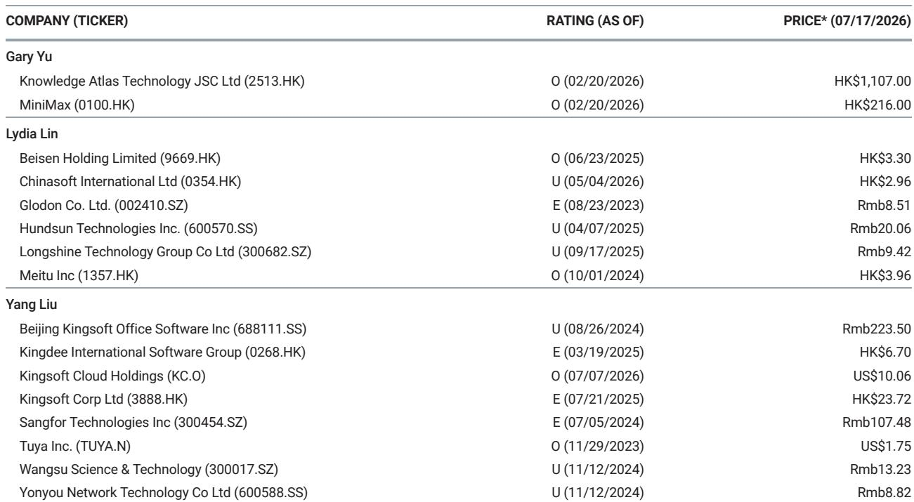
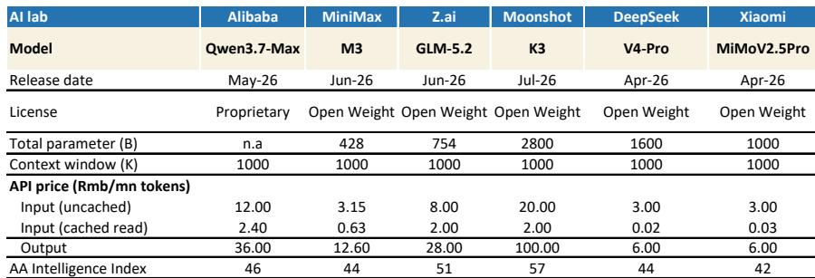
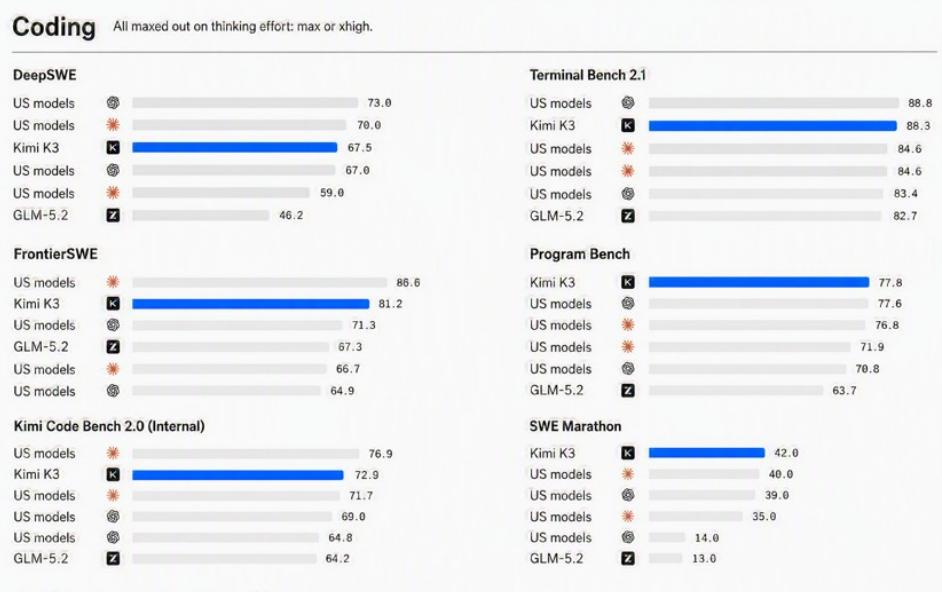

# Moonshot K3 Proves China’s AI Models Have Closed the Gap with US Leaders—and the Scaling Law Is Still Alive

On July 17, Moonshot released K3, a 2.8-trillion-parameter open-weight large language model that now ranks third globally in the Artificial Analysis Intelligence Index, behind only two top US models. In coding benchmarks, K3 achieved the number one position worldwide. This is not an overnight miracle. It is the result of cumulative progress across China’s AI model industry, and it signals a structural shift in the competitive landscape. The implications for enterprise buyers, researchers, and the broader AI ecosystem are profound and immediate.

The significance of K3 extends beyond a single model release. It demonstrates that Chinese LLMs have achieved all-round catch-up with US leaders in three critical dimensions: model size, benchmark performance, and pricing power. With 2.8 trillion parameters, K3 is the largest open-weight Chinese model to date. Its API output price of RMB 100 per million tokens is the highest among leading Chinese models, narrowing the gap with US pricing. This suggests that the market can sustain higher prices for superior capability—a positive signal for the entire LLM industry’s economics.

The timing matters. K3 follows GLM-5.2 from Z.ai in June, which was already outstanding, and comes amid a wave of releases from Alibaba, MiniMax, DeepSeek, and Xiaomi. The pattern is clear: China’s AI labs are not just keeping pace; they are competing on frontier capability. For any organization making long-term technology bets, the assumption that US models hold an unbridgeable lead is now outdated.

## Moonshot K3’s Architecture and Performance Data Confirm That Scaling Laws Remain Operative and That Algorithmic Innovation Delivers Measurable Gains

K3’s 2.8 trillion parameters make it the largest open-weight Chinese model by a wide margin. DeepSeek V4-Pro, at 1.6 trillion parameters, and Xiaomi’s MiMo V2.5 Pro, at 1 trillion, are significantly smaller. The scale alone is a statement: the scaling law—the principle that larger models, trained on more data, yield better performance—has not hit a wall. K3’s performance validates this. Its Artificial Analysis Intelligence Index score of 57 places it ahead of GLM-5.2 at 51, Qwen3.7-Max at 46, and MiniMax M3 at 44. The gap between K3 and the top US models is now narrow enough to be measured in single-digit index points.

But scale is only part of the story. K3 incorporates original algorithmic innovations—Kimi Delta Attention and Attention Residual—that improve compute efficiency. These are not incremental tweaks; they represent genuine architectural advances that allow the model to handle longer contexts and more complex reasoning tasks with less computational waste. In coding benchmarks, where thinking effort is maxed out, K3 ranks first globally. For enterprises evaluating models for software development, code review, or technical documentation, this is a decisive capability advantage.

The pricing data reinforces the point. K3’s uncached input price of RMB 20 per million tokens and output price of RMB 100 are multiples of DeepSeek V4-Pro’s RMB 3 and RMB 6, respectively. Yet the market is absorbing this premium because the performance justifies it. This is a healthy dynamic: it rewards quality and innovation rather than forcing a race to the bottom on price.

## Chinese AI Labs Are Now Competing on All Fronts Simultaneously, and the Pace of Improvement Is Accelerating

The release calendar tells the story. DeepSeek V4-Pro arrived in April. Xiaomi’s MiMo V2.5 Pro followed in April as well. MiniMax released M3 in June. Z.ai released GLM-5.2 in June, which was already a standout model. Alibaba’s Qwen3.7-Max launched in May. Now K3 in July. This is not a series of isolated events; it is a coordinated escalation. Each new model pushes the frontier higher, and the interval between releases is shrinking.

The competitive dynamics are important to understand. All of these models except Qwen3.7-Max are open-weight. This means the underlying model weights are publicly available, enabling enterprises to fine-tune and deploy them on their own infrastructure. The open-weight strategy creates a powerful flywheel: more developers use the models, improve them, and build applications, which in turn generates more demand for the underlying API services. Moonshot, MiniMax, Z.ai, DeepSeek, and Xiaomi are all pursuing this approach. Alibaba’s proprietary model is the outlier, but its high API pricing—RMB 12 input and RMB 36 output—suggests it is targeting enterprise customers who value vendor lock-in and support over flexibility.

The implication for buyers is clear: the market now offers multiple high-quality options at different price points and capability levels. The days of a single dominant player are over. Procurement decisions should be based on specific use-case requirements, not on general reputation or brand recognition.

## The K3 Release Provides a Decision Framework for Evaluating Chinese LLMs Based on Five Strategic Criteria

For any organization considering adopting Chinese LLMs, the K3 release makes it possible to establish a rigorous evaluation framework. The five criteria that matter most are model size and architecture, benchmark performance, pricing structure, licensing model, and ecosystem maturity.

First, model size and architecture. K3’s 2.8 trillion parameters and its novel attention mechanisms set a new baseline. Any model below 1 trillion parameters should be scrutinized for whether it can handle the most demanding tasks. Second, benchmark performance. The Artificial Analysis Intelligence Index and coding leaderboards provide objective, comparable data. A score below 50 on the Intelligence Index should be a red flag for complex reasoning or knowledge work. Third, pricing structure. The uncached input price, cached read price, and output price must be evaluated together. K3’s high output price of RMB 100 is justified for high-value tasks, but for high-volume, low-complexity work, DeepSeek’s RMB 6 output price may be more appropriate. Fourth, licensing model. Open-weight models offer more flexibility and lower long-term dependency risk. Proprietary models like Qwen3.7-Max may offer better integration but create vendor lock-in. Fifth, ecosystem maturity. Consider the availability of fine-tuning tools, community support, and integration with existing infrastructure. Moonshot, with its full weight release scheduled before July 27, is signaling strong commitment to the open ecosystem.

Applying this framework, a typical enterprise might choose K3 for mission-critical knowledge work and coding, DeepSeek for high-volume inference, and MiniMax or GLM-5.2 for specialized tasks where their particular strengths align. The key is to avoid the trap of treating all Chinese LLMs as interchangeable commodities. They are not.

## The Economic Implications of China’s LLM Progress Are Positive for the Industry but Demand Careful Portfolio Construction

The pricing trends across Chinese LLMs are more encouraging than many observers expected. K3’s high pricing, combined with strong demand, suggests that the market can sustain premium pricing for superior capability. This is a welcome departure from the race-to-the-bottom dynamics that have plagued other technology markets. For observers, this implies that the leading Chinese AI labs may be able to achieve better unit economics than previously assumed.

However, the competitive intensity is also rising. Six major labs are now releasing frontier models within a three-month window. This level of competition will compress margins for mid-tier models and force continuous investment in R&D. The winners will be those that can sustain the pace of innovation while maintaining pricing discipline. Moonshot, with K3, has established a strong position, but it will need to follow up quickly to defend it.

For enterprise buyers, the abundance of choice is a double-edged sword. The risk of selecting the wrong model or overpaying for unnecessary capability is real. The recommended approach is to run controlled pilot programs using the decision framework outlined above, with clear success metrics tied to specific business outcomes. Do not rely on benchmarks alone; test the models on your own data and workflows. The cost of switching models later will be far higher than the cost of careful evaluation now.

The broader strategic implication is that China’s AI ecosystem has reached a critical mass. The talent, capital, and infrastructure are now in place to sustain a competitive industry. This is not a temporary surge. The cumulative progress across GLM-5.2, K3, and other models indicates a structural capability that will persist and deepen. For global enterprises, ignoring Chinese LLMs is no longer a viable option. The question is not whether to engage, but how to engage strategically.

*For informational purposes only. Portions may be generated, translated, summarized, or edited with AI assistance based on source materials and may contain omissions or errors. Please verify independently. This is not professional advice.*

For informational purposes only. Portions may be generated, translated, summarized, or edited with AI assistance based on source materials and may contain omissions or errors. Please verify independently. This is not professional advice.

