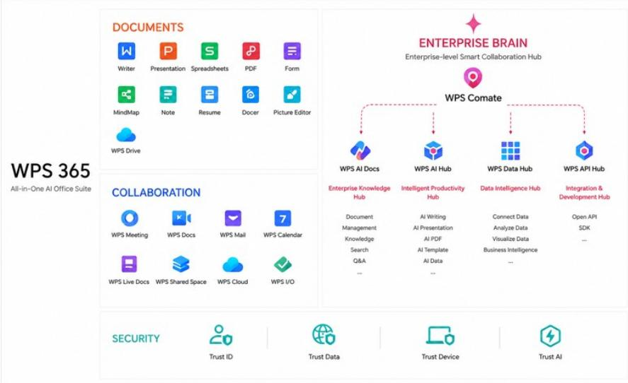

# 北京金山办公软件股份有限公司 | 亚太WAIC 2026新产品发布

## 核心观察

Lingxi Pro与腾讯Workbuddy及其他通用智能体形成竞争关系。

WPS 365正从AI办公协作工具向一站式办公工作平台转型，切入企业管理领域。

我们认为，金山办公的全套办公+协作套件、现有云文档基础以及在办公场景的垂直聚焦，是其关键竞争要素。

随着AI发展，工具、智能体和企业管理软件之间的界限正变得愈发模糊。

在世界人工智能大会上，金山办公发布了两款产品：

- **Lingxi Pro**：面向个人的高级办公智能体，支持WPS Office和Microsoft Office插件。具备项目导向的上下文管理、高质量任务交付和专业办公软件操作能力。

- **WPS Comate（WPS 365升级版）**：企业级AI工作空间，内置内部专家/技能/应用库，包含以下模块：(1) Token审计（WPS AI Hub），(2) 文档管理（WPS AI Docs），(3) 数据管理（WPS Data Hub），(4) 软件系统集成（WPS API Hub），(5) 安全（WPS Trust）。

图1：WPS 365升级

来源：公司数据
大中华区IT服务与软件 | 中国

## 估值方法与风险

## 北京金山办公软件股份有限公司（688111.SS）

基准情景，采用现金流折现法。该方法与我们用于其他中国SaaS公司的方法一致。我们采用9.8%的加权平均资本成本和3%的终值增长率。

## 上行风险

- 付费率提升速度快于预期
- AI应用广泛普及
- 严格成本控制带来更高的运营利润率

## 下行风险

- AI渗透速度慢于预期
- 因边界模糊导致在线协作新领域竞争加剧
- 软件国产化方面的预算约束
