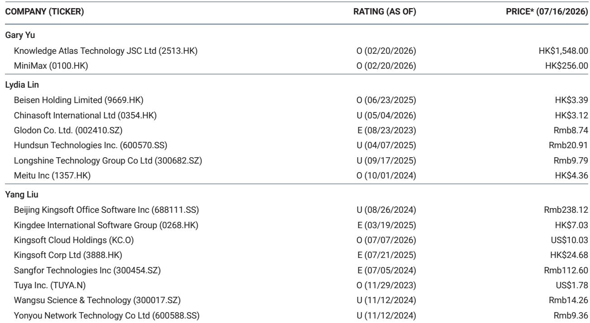
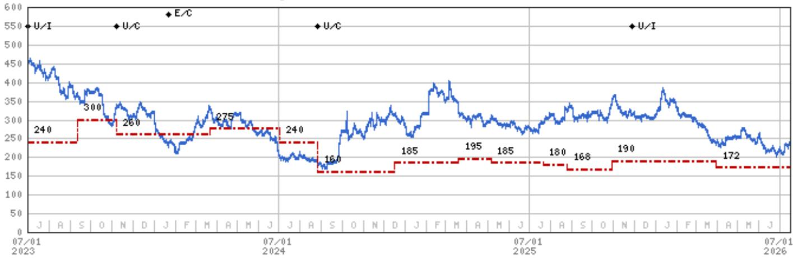

# MS：金山办公WAIC2026新品发布

在2026年世界人工智能大会上，金山办公发布了两款产品。一款是面向个人的高级办公助手Lingxi Pro，另一款是企业级AI工作空间WPS Comate。MS在最新研究报告中给出的判断是：WPS 365正在从AI办公协作工具转向一站式办公工作平台，开始切入企业管理领域。这个转变的意义，远不止产品功能的叠加。

报告认为，金山办公的核心竞争力在于完整的办公加协作套件、已有的云文档基础，以及在办公场景上的垂直聚焦。但真正值得关注的，是AI正在让工具、助手和企业管理软件之间的界限变得越来越模糊。

> **KC观察：** 这份报告的核心观察不是金山办公推出了什么新功能，而是AI正在改变办公软件的产品形态和竞争维度。当WPS 365开始涉及token审计、文档管理、数据管理、软件系统集成和安全模块时，它实际上已经进入了企业级管理软件的领地。

## 1. Lingxi Pro的推出，意味着个人办公助手开始进入专业级竞争

Lingxi Pro被定位为高级办公助手，可以直接在WPS Office和Microsoft Office中运行。它的核心能力包括项目导向的上下文管理、高质量任务交付和专业办公软件操作。MS将其与腾讯Workbuddy及其他通用助手并列比较。

这个定位值得注意。过去，办公软件的AI功能更多是辅助性的，比如自动生成文档、智能排版。但Lingxi Pro强调的是“助手”能力——它能够理解项目上下文，独立完成复杂任务。这标志着个人办公AI从工具向助手的跃迁。

## 2. WPS Comate的五个模块，揭示了企业AI工作空间的新架构

WPS Comate作为WPS 365的升级版，构建了一个包含五个模块的企业AI工作空间：token审计（WPS AI Hub）、文档管理（WPS AI Docs）、数据管理（WPS Data Hub）、软件系统集成（WPS API Hub）和安全（WPS Trust）。

这五个模块的组合，实际上勾勒出一个企业级AI工作空间的完整架构。其中，token审计模块尤其值得关注——它意味着企业可以对AI使用进行成本控制和权限管理，这是企业大规模部署AI应用的前提条件。而软件系统集成模块，则暗示WPS 365正在尝试成为企业数字化系统的中枢。

> **KC观察：** 这五个模块的设计逻辑，与过去两年企业级SaaS平台的演进方向高度一致。但金山办公的优势在于，它从办公文档这个高频入口切入，用户粘性和数据积累是其他从零开始搭建的企业管理软件难以比拟的。

## 3. 竞争格局正在被AI重新定义，办公软件厂商获得了新的发展空间

报告提到，随着AI的发展，工具、助手和企业管理软件之间的界限正在变得模糊。这意味着，金山办公的竞争对手不再只是传统的办公软件厂商，还包括腾讯、字节跳动等互联网公司的办公协作产品，以及用友、金蝶等企业管理软件厂商。

但金山办公也有自己的优势。MS指出，其完整的办公加协作套件、已有的云文档基础和在办公场景上的垂直聚焦，是关键的竞争因素。特别是云文档基础——这意味着企业用户的数据和工作流已经沉淀在金山办公的生态中，迁移成本较高。

对于产业决策者来说，这个趋势意味着在选择办公协作平台时，需要考虑的维度正在增加。过去，选型主要看文档处理能力和协作效率。现在，还需要评估这个平台能否成为企业AI工作空间的基础设施，能否与现有的管理系统集成，以及能否提供安全可控的AI使用环境。

For informational purposes only. Portions may be generated,translated,summarized,or edited with AI assistance based on source materials and may contain omissions or errors. Please verify independently. This is not investment,legal,tax,accounting,or other professional advice.

