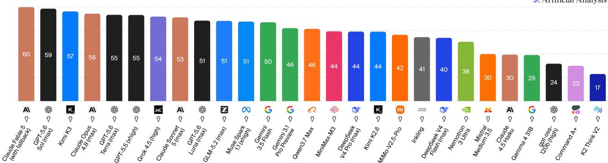
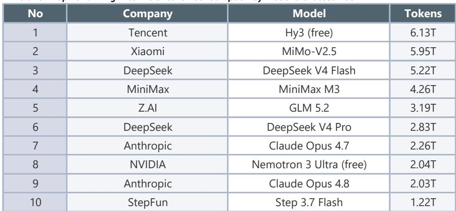
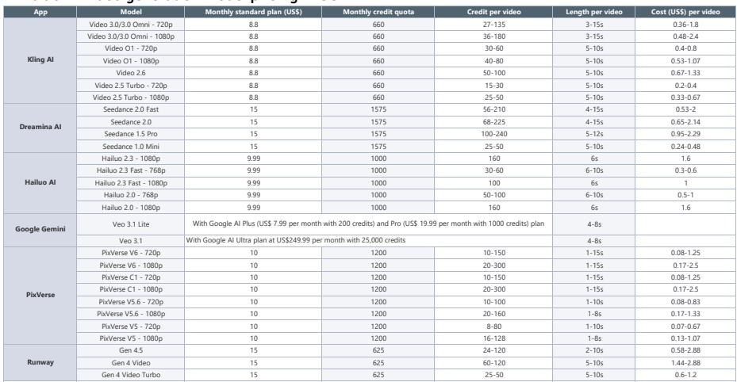

# JEF：AISeries58

Moonshot AI 刚刚发布了首个公开的 2.8T 参数模型 Kimi K3，在 Artificial Analysis 综合排名中位列第三，仅次于 Fable5 和 GPT-5.6 Sol (Max)，并在 Frontend Code Arena 中拿到第一。JEF在最新研究报告中直接用了“unexpected surprise”来形容这次发布——不是渐进式改进，而是在编码、通用智能体和视觉智能体三个维度同时进入全球第一梯队。

这一突破的时间点值得注意。就在几周前，市场还在讨论中国大模型是否已经触及能力天花板，API 价格竞争是否在侵蚀行业价值。K3 的出现至少说明两件事：第一，中国模型在架构创新上仍有空间，MoE 和注意力机制的优化远未到终点；第二，当模型能力差距快速收窄时，竞争焦点正在从“谁更便宜”转向“谁能把低成本高性能应用于实际使用场景”。

## 1. 2.8T 参数不是堆规模，而是架构效率的验证

K3 的参数规模是 DeepSeek V4 Pro 的 1.75 倍、Qwen3.7 Max 的 2.3 倍，但JEF强调的关键不是参数数量，而是背后的架构创新。Delta Attention 让百万 token 上下文中的解码速度提升了 6.3 倍，Attention Residuals 以不到 2% 的额外成本换来了 25% 的训练效率提升。配合 Stable LatentMoE 框架，K3 在 896 个专家中有效激活 16 个，整体扩展效率相比 K2 提升了 2.5 倍。

这意味着，K3 的竞争力不是来自“更大的模型”，而是来自“更聪明的稀疏化”。在同样算力预算下，Moonshot AI 把资源集中到了推理效率和长上下文处理上，这在编码和智能体场景中直接体现为可衡量的优势——SWE Marathon 得分 42.0，高于 Fable5 的 35.0 和 GPT-5.6 Sol 的 39.0；BrowseComp 得分 91.2，同样领先于两个对标模型。

> **KC评论：** 注意 K3 的定价——输入 3 美元、输出 15 美元，介于 DeepSeek V4 Pro 和 Claude Opus 4.8 之间。这不是低价策略，而是能力定价。JEF的图表（Exhibit 1）清楚显示，中国模型正在从“价格竞争”转向“性价比竞争”，而 K3 是这一转变的标志性产品。

## 2. Token 消耗指数走弱，但中国模型份额在逆势上升

JEF跟踪的 Silicon Data LLM Token Expenditure Index 在 7 月 12 日当周降至 1.57-1.61，低于 5 月 31 日的 2.04。这个指数衡量的是用户对高端模型的付费意愿——指数下降意味着更多使用量流向了低成本模型。媒体也报道，部分科技和互联网公司开始对员工设置 token 消耗上限。

但 OpenRouter 的数据给出了另一个视角：7 月 6 日当周，全球 token 消耗量环比增长 12.6%，达到 52.6 万亿。其中中国模型的 token 消耗量环比增长 17.7%，达到 27.6 万亿，首次超过美国模型的 6.3 万亿。按公司看，腾讯 Hy3（免费版）以 6.13 万亿排名第一，小米 MiMo-V2.5 以 5.95 万亿紧随其后，DeepSeek V4 Flash 以 5.22 万亿位列第三。

这个反差说明：企业端在控制高端模型的 token 预算，但开发者社区和中小型应用正在大规模迁移到中国模型。JEF认为，驱动因素包括编码和智能体场景的爆发，以及一批高性价比中国模型的集中发布——Kimi K2.5（1 月）、M2.5（2 月）、GLM-5（2 月）都在过去半年内上线。

## 3. 中美模型智能差距收窄至 2.7%，但 API 成本差距仍在 10 倍以上

根据 2026 年斯坦福 AI 指数报告，美国高质量模型仅领先中国模型 2.7%。在 Arena Elo 评分中，Anthropic（1503）、xAI（1495）、Google（1494）、OpenAI（1481）、Alibaba（1449）和 DeepSeek（1424）占据了前六名。中国模型在智能水平上已经进入同一梯队。

但 API 定价的差距仍然显著。JEF的对比显示（Exhibit 2），中国模型的混合价格仅为美国模型的几分之一。这背后的结构性原因包括：MoE 架构、线性注意力机制和更高的模型算力利用率（MFU）。以 K3 为例，其 2.8T 参数中仅激活 16 个专家，推理成本远低于同等参数规模的稠密模型。

JEF认为，这种成本优势正在转化为实际的市场份额。在 OpenRouter 的 token 消耗排名中，前五名中有四个是中国模型。而受益者不仅是模型厂商本身，还包括提供算力和云服务的公司——百度、阿里巴巴、腾讯、金山云，以及 AI 实验室和视频生成平台 Kling。

## 4. 编码和智能体是下一个主战场，K3 已经卡位

从 K3 的基准测试成绩看，它的优势集中在编码和智能体场景。Frontend Code Arena 排名第一，Terminal Bench 2.1 得分 88.3（高于 Fable5 的 84.6），Automation Bench 得分 30.8（高于 Fable5 的 29.1 和 GPT-5.6 Sol 的 29.7）。在 BrowseComp 和 DeepSearchQA 等需要长上下文理解和多步推理的任务中，K3 同样领先。

JEF在报告中指出，编码、工作空间场景和中长文本内容将迎来显著机会。这与 OpenRouter 的数据相互印证——token 消耗在 2 月出现大幅跃升，正是由于编码和智能体场景的采用率上升，用户从“对话式使用”转向“工作式使用”。

对于企业决策者来说，这意味着评估模型的标准正在变化。过去大家比的是“哪个模型能回答更多问题”，现在比的是“哪个模型能完成更多任务”。K3 的架构设计——1M 上下文、原生多模态、Delta Attention 加速——都是为这个新标准服务的。

> **KC评论：** JEF的图表（Exhibit 7 和 8）展示了“每任务成本”的对比。K3 在编码任务上的成本效率优于 Fable5 和 GPT-5.6 Sol，但在浏览任务上仍有差距。这提醒我们：没有模型在所有场景下都最优，选择模型需要匹配具体任务类型。

For informational purposes only. Portions may be generated,translated,summarized,or edited with AI assistance based on source materials and may contain omissions or errors. Please verify independently. This is not investment,legal,tax,accounting,or other professional advice.

For informational purposes only. Portions may be generated,translated,summarized,or edited with AI assistance based on source materials and may contain omissions or errors. Please verify independently. This is not investment,legal,tax,accounting,or other professional advice.

