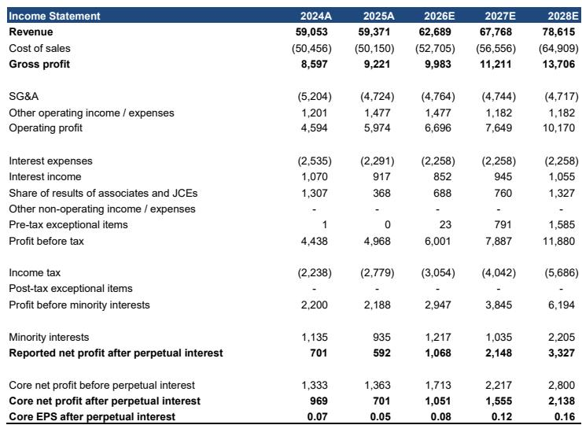
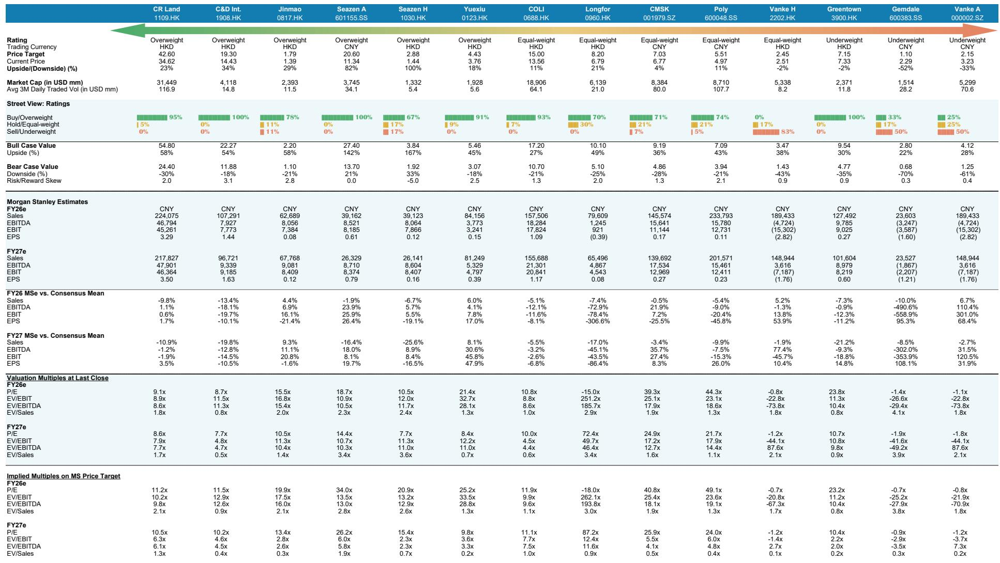
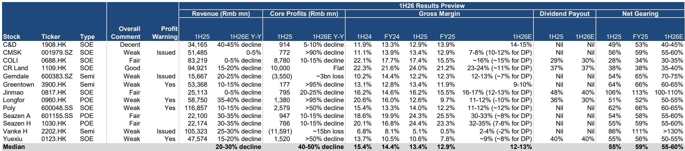

# 中国房地产行业2026年上半年业绩观察：结构性调整下的新研究框架

受覆盖的中国房地产开发商2026年上半年核心每股收益中位数预计同比下降40-50%，这一降幅远超20-30%的收入收缩幅度，反映出更深层次的结构性问题：开发业务毛利率平均压缩约2个百分点，同时资产减值持续侵蚀利润。这不是一个会迅速反弹的周期性低谷，而是开发业务模式的根本性重新定价。随着毛利率恶化的全貌逐渐显现，市场对2026-2028年的共识预期可能会被显著下调。

从8月下旬开始的业绩期将揭示明显的分化。一方面，华润置地尽管收入下降15-20%，但可能报告持平的核心利润，因为一笔估计超过30亿元的大额处置收益将抵消开发毛利率的压缩。另一方面，龙湖集团和绿城中国等开发商面临核心利润下降超过95%的情况，部分业务板块的开发毛利率转为负值。在这两个极端之间，一系列不同的结果将迫使研究者放弃行业层面的笼统判断，转而构建针对具体公司的模型，考虑三个不同的驱动因素：历史项目消化的速度、经常性收入流的质量，以及吸收进一步减值的资产负债表能力。

对研究者而言，关键洞察在于2026年上半年的业绩并非对已知疲弱的滞后确认，而是一个前瞻性指标，表明行业的盈利基础正在被永久性降低。能够在这一时期维持盈利的公司，将是那些已经完成大部分高成本土地储备拨备的公司，而不是那些仍在为2020-2022年收购的项目计提亏损的公司。当前的市场定价并未完全反映这种分化。

## 毛利率压缩幅度大于市场预期，且更具持续性，源于收入确认与成本结构的双重挤压

受覆盖开发商中位数的开发毛利率预计在2026年上半年降至约12-13%，低于2025年上半年的13.4%和2025年全年的12.9%。这种压缩不仅仅是房价下跌的函数，更是2021-2023年入账项目的成本基础与2025-2026年可实现售价之间结构性错配的结果。

对于已发布盈利预警的招商蛇口，尽管收入稳定，其开发毛利率预计将从一年前的13.4%降至10-12%。这意味着毛利率压缩并未被收入下降所掩盖，而是一个独立的盈利侵蚀因素。类似地，保利发展的开发毛利率可能从14.0%降至约12%，越秀地产从10.6%降至约8-9%，这两家公司都可能发布盈利预警。

这背后的机制直白但未被充分认识。2020-2022年土地拍卖价格高峰期支付的土地溢价，现在正被确认为销售成本。与此同时，2026年上半年已完工单位的售价仍在下降，2026年7月的AlphaWise调查显示，尽管市场情绪有所改善，但购房计划仍然有限。历史土地成本与当前售价之间的差距并未缩小——对于在繁荣时期土地收购最为激进的开发商群体而言，这一差距正在扩大。

对市场共识盈利的影响是严重的。如果中位数开发毛利率在2026年剩余时间及2027年保持在12-13%，而不是像许多卖方模型假设的那样恢复到15-17%的范围，那么2026-2028年的盈利基础必须在已报告的2026年上半年下降基础上再下调20-30%。这不是一次性的重置，而是多年的压缩，将使大多数开发商的股本回报率低于资本成本。

## 经常性收入不再是可靠的盈利缓冲，商场租金增长面临高基数和零售销售放缓

多年来，龙湖集团和华润置地等开发商看涨的逻辑基于一个论点：投资物业的经常性收入最终将取代开发利润成为主要盈利驱动因素。2026年上半年的数据对这一论点提出了挑战。

华润置地的经常性收入可能在强劲商场租金收入的支持下同比增长10-15%。然而，这一增长是在2025年下半年强劲表现之后出现的，这意味着下半年的基数效应将不利。更重要的是，将部分商场分拆为REIT减少了流向母公司损益表的租金收入比例。此次分拆的处置收益是一次性事件，而非可持续的盈利来源。

对于龙湖集团而言，情况更糟。下半年经常性收入增长可能保持低迷，公司开发业务预计在2026年上半年录得约-10%的负毛利率，这意味着经常性收入流正被用于吸收开发亏损，而非产生净利润增长。龙湖集团恢复正盈利的时间点已被推迟至2028年，取决于开发亏损消化的速度。

更广泛的观点是，经常性收入并非万能药。对于仍有大量开发业务的开发商，经常性收入流正被开发亏损交叉补贴。使用投资物业资本化率进行分部加总估值的研究者，必须调整开发部门正在消耗现金而非产生现金这一事实。那些假设从开发到经常性收入平稳过渡的资产净值模型，对风险敞口最大的公司高估了内在价值15-25%。

## 资产负债表分化是真正的风险区分器，国企因减少土地储备受益，民企面临流动性困境

2026年上半年业绩预览中最反直觉的发现之一是，一些国有企业尽管盈利疲弱，但杠杆率可能下降。例如，建发国际的净负债率预计将从2025年底的53%降至40-45%，这不是因为强劲的现金流，而是因为上半年土地储备有限。该公司只是停止了购地，这机械地改善了杠杆率，因为债务偿还超过了新增借款。

这是一个关键区别。由资产负债表收缩驱动的杠杆率下降，与由有机现金生成驱动的杠杆率下降不同。对于建发国际和华润置地等国企，减少土地储备是一种防御性举措，保留了财务灵活性，但也表明管理团队在当前市场看不到有吸引力的研究线索。持有现金的机会成本很低，但对未来收入增长的信号效应是负面的。

对于民营企业和混合所有制企业，情况根本不同。万科的净负债率预计将超过130%，高于2025年的111%，公司面临持续的流动性风险，且没有大规模再融资计划。其国有股东深圳地铁的持续资金支持可能延续至2027年，但这只是一条生命线，而非解决方案。金地集团的净负债率也在上升，达到70-75%，其预售前景因土地储备枯竭而恶化。

对研究者的启示是，资产负债表比率必须结合背景来解读。对于已停止土地储备的国企，净负债率下降充其量是一个中性信号。对于仍在努力销售房屋和偿还债务的民企，净负债率上升是一个警示信号。在这种环境下，财务健康的真正衡量标准不是杠杆率本身，而是开发商在不依赖资产出售或股东支持的情况下，从运营中产生正自由现金流的能力——定义为预售减去建设成本和利息支付。

## 应对2026年上半年业绩期的决策框架：区分可持续公司与价值陷阱的三个过滤器

2026年上半年的业绩将产生大量数据点，但对于研究决策而言，只有三个过滤器至关重要。第一个过滤器是开发毛利率轨迹。能够在不利环境下将开发毛利率维持在15%以上的公司——例如建发国际，预计约为14-15%——具有结构性成本优势。毛利率低于10%的公司则面临开发业务的结构性减值，需要数年时间才能逆转。

第二个过滤器是盈利的构成。像华润置地这样能够通过大规模、可信的处置收益或经常性收入增长来抵消开发毛利率压缩的公司，正在管理这一转型，但研究者必须区分一次性收益和可持续盈利。华润置地的处置收益是真实现金，但不可重复。其经常性收入增长是可持续的，但不足以完全弥补开发盈利的下降。

第三个过滤器是2026年下半年的预售展望。报告指出，尽管下半年基数较低，但大多数开发商预计将调低全年销售增长目标。这是一个领先指标，表明2027年的收入下降将比2026年更为陡峭。能够在第三季度显示预售势头加速的开发商——例如中国金茂，有11-12个全新项目在低基数上推出——表明它们仍拥有项目储备和执行能力来产生未来收入。无法显示这种势头的开发商，实际上是在没有补充计划的情况下消耗现有土地储备。

应用这三个过滤器会得出一个清晰的层级。华润置地和建发国际提供了最具吸引力的风险回报，因为它们结合了高于中位数的开发毛利率与强劲的经常性收入或资产负债表纪律。中国金茂已被上调评级，因为其改善的预售前景可能抵消近期的盈利逆风，且当前估值已反映了显著的疲弱。在另一端，万科、金地集团、绿城中国和龙湖集团面临结构性盈利减值，任何估值折扣都无法完全弥补，因为恢复正盈利的路径不确定，且依赖于房价稳定和零售销售复苏等外部因素。

市场尚未充分定价这种分化。定位最佳开发商与最弱开发商之间的价差，比基本面盈利差距所证明的要窄。2026年上半年的业绩期将成为扩大这一价差的催化剂，奖励能够展示盈利韧性的公司，惩罚那些不能做到的公司。

*仅供参考。部分内容可能基于源材料通过AI辅助生成、翻译、总结或编辑，可能存在遗漏或错误。请独立核实。本文不构成任何专业建议。*

仅供参考。部分内容可能基于源材料通过AI辅助生成、翻译、总结或编辑，可能存在遗漏或错误。请独立核实。本文不构成任何专业建议。

