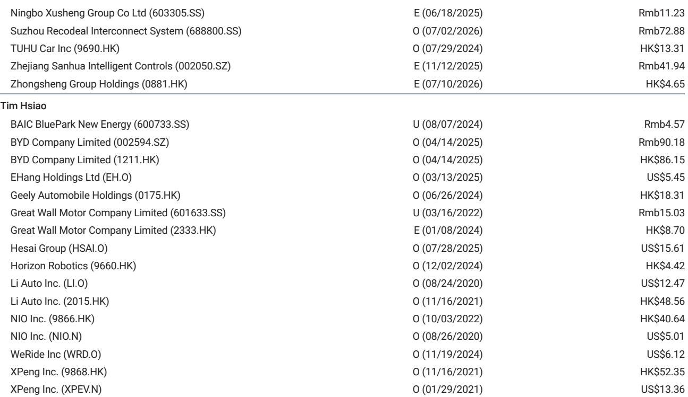
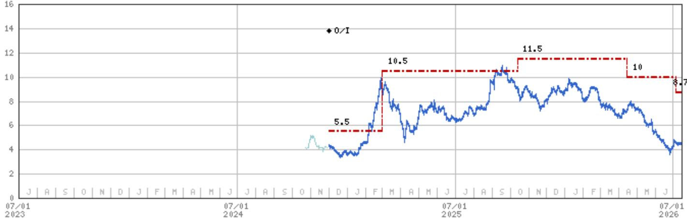
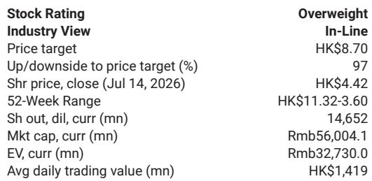

# Horizon Robotics的HSD 2.0：安全优先的策略选择及其对产品与公司定位的影响

Horizon Robotics的HSD 2.0高级驾驶辅助系统在深圳道路测试中表现如下：在高速公路和宽阔城市主干道上运行流畅，但在复杂场景——例如在并线车流中绕行停靠车辆或穿越对向车流转弯时——会长时间犹豫。系统还因缺乏后视摄像头数据而无法倒车。这些限制并非缺陷，而是有意为之的设计选择。管理层明确表示，系统宁可偏向谨慎，且几乎未记录到安全关键的接管事件，认为不安全行为比犹豫更根本。

这种“安全优先于敏捷”的权衡，是理解当前Horizon Robotics最关键的一点。它解释了为何公司报价处于当前水平。市场并非在定价失败，而是在定价一种不确定性：谨慎的软件需要多快才能变得自信，以及这种转变能否在竞争对手赶上之前转化为单车收入增长。

公司目前处于两股力量之间。一方面，负面因素已基本被消化：2025年上半年的表现、近期缺乏催化剂、以及明确的估值锚点缺失。另一方面，催化剂仍然缺失。公司需要触发因素，而非底部支撑。这一触发因素将来自三个可观察的里程碑：J6和Starry 6P芯片部署的节奏、iCAR集成解决方案从单一参考案例向主流采用的进展、以及比亚迪等核心客户设计中标收益的量化。

仅关注HSD 2.0原始性能的观察者会错过战略层面的论证。Horizon Robotics并非试图在当下赢得所有自动驾驶基准测试。它正努力成为“汽车界的Wintel”——即为主机厂提供计算和软件栈的供应商，而非作为全栈自动驾驶供应商与之竞争。这一雄心需要不同于特斯拉或华为的风险评估方式。本文将从五个维度展开这一评估：安全-犹豫权衡、商业化优势、参考案例策略、订阅收入模式以及海外机会。

## HSD 2.0的犹豫是特性而非缺陷，但它带来了可衡量的“时间-信心”风险

试乘结果之所以具有启发性，正是因为其表现不一。在高速公路和宽阔城市道路上，HSD 2.0既不过于激进也不过于保守，驾驶表现如同一位称职的人类驾驶员。然而在复杂场景中，它会犹豫。系统会暂停、评估，有时在转弯或并线前等待的时间比人类驾驶员更长。它无法倒车，因为缺乏后视摄像头数据——管理层预计这一缺口将通过后续软件更新来弥补，随着更多驾驶数据（包括后视画面）被纳入训练。

管理层将此视为正确的权衡。系统几乎未记录到安全关键的接管事件。这是一个有意义的成就。偶尔犹豫的系统令人烦恼，而偶尔引发事故的系统则是危险的。Horizon Robotics优先处理后者风险而非前者，这一优先级对于部署在真实交通中的量产级系统而言是合理的。

然而，战略层面的含义是，公司正押注于快速迭代。管理层承认HSD 2.0仍处于早期阶段。随着数据积累，系统将不断改进，且改进预计通过空中软件更新而非硬件重新设计来实现。这是一条可行的路径，但也需要时间，而时间是市场不会轻易给予的资源。

因此，观察者需要评估的并非HSD 2.0最终是否会变好，而是它需要多快才能变得足够好，从而推动大规模采用。从“安全但犹豫”到“安全且果断”之间的差距，是以月和TB级数据来衡量的。每多一个月的犹豫，都会缩小Horizon Robotics将先发优势转化为持久市场份额的时间窗口——在此之前，主机厂内部解决方案或竞争对手的产品可能已填补这一空白。

## Horizon Robotics的竞争优势在于执行而非发明——这既是优势也是约束

管理层明确表示，其竞争优势在于执行而非专有技术。世界模型、视觉-语言-动作模型和强化学习在行业内广为人知。Horizon Robotics的优势在于将这些技术大规模商业化。

这是一个诚实且具有战略重要性的表述。这意味着公司并非押注于竞争对手无法复制的技术突破，而是押注于运营卓越：供应链整合、软硬件协同优化、成本效率以及跨多个主机厂平台部署解决方案的能力。这些都是真实的优势，但相比专利护城河也更难防御。

约束在于，执行优势只有在产生结果后才能被看到。声称执行卓越的公司必须通过出货量、客户留存率和利润率轨迹来证明这一点。Horizon Robotics尚未在大规模上做到这一点。基础情景中的收入预测显示，产品解决方案收入将从2025年的16亿元人民币增长至2026年的39亿元和2027年的71亿元，但公司预计到2027年仍将亏损，直到2028年才实现盈亏平衡。悲观情景则预计亏损将持续到2028年。

执行是一个可信的策略，但也是一个需要观察者耐心和清晰里程碑视野的策略。市场目前正要求看到这一视野，才会重新评估公司。

## iCAR部署是一个参考案例，必须规模化才能验证“汽车界Wintel”的论点

Horizon Robotics正在奇瑞的iCAR品牌上部署其集成智能驾驶和座舱解决方案。管理层将此视为更广泛采用的参考案例。逻辑很简单：如果该解决方案在一个主机厂平台上有效，并能带来可衡量的成本和性能优势，其他主机厂将选择采用而非自研。

参考案例策略在汽车供应链中很常见，且此前已有成功先例。博世和大陆等公司通过在一个平台上证明解决方案，然后跨行业扩展，建立了主导地位。不同之处在于，这些公司供应的是规格明确的硬件组件，而Horizon Robotics供应的是需要持续更新、训练和验证的软件定义栈。因此，参考案例必须证明的不仅是初始集成，还有持续改进和成本控制。

风险在于参考案例可能成为一次性事件。如果iCAR采用速度缓慢，或者奇瑞在从Horizon Robotics的实施中学习后决定将解决方案内部化，那么参考案例的说服力将大打折扣。乐观情景假设2026年ADAS和自动驾驶总出货量超过550万套，2027年超过800万套。悲观情景则因主机厂转向内部解决方案导致订单流失，出货量分别低于500万和600万套。这些情景之间的差异，取决于有多少主机厂会审视iCAR的部署并决定采用而非自研。

## 订阅收入模式是长期目标，但需要尚未形成的规模

Horizon Robotics旨在构建一种经常性、类似订阅的单车收入模式。这是公司计划中战略上最具雄心的元素。公司希望从每辆配备其解决方案的车辆上，通过软件更新、功能升级和数据服务产生持续收入，而非销售一次性软硬件捆绑包。

订阅模式之所以有吸引力，是因为它将收入轨迹从零散、项目制转变为经常性、可预测。它还能使激励机制保持一致：Horizon Robotics在车辆持续上路并产生数据时受益，而非在新车型周期开始时受益。

挑战在于，订阅模式需要Horizon Robotics尚未拥有的装机量规模。公司2025年收入为38亿元人民币，其中产品解决方案贡献16亿元，许可和服务贡献19亿元。许可和服务线预计仅温和增长，到2028年达到22亿元。真正的增长预计来自产品解决方案，必须在三年内从16亿元增长至109亿元。

在产品增长之上叠加订阅模式将非常强大，但在财务预测中尚不可见。观察者应关注任何经常性收入指标、单车收入运行率或锁定持续付款的合同结构的披露。在这些指标出现之前，订阅论点仍是一个愿景，而非估值驱动因素。

## 海外扩张面临的障碍少于中国主机厂，但贡献将是渐进的

管理层认为，像Horizon Robotics这样的解决方案供应商在海外市场面临的障碍可能少于中国主机厂，因为它们可以定位为技术合作伙伴，而非当地汽车行业的竞争对手。这是一个合理的论点。针对中国品牌车辆的关税、监管审查和政治阻力已有充分记录。一家向德国或日本主机厂供应软件和芯片的中国公司，所面临的风险状况与试图在那些市场销售汽车的中国主机厂不同。

管理层提到的具体机会是大众汽车据报道正在减少对博世作为供应商的依赖。如果大众降低对博世的依赖并为替代供应商打开大门，Horizon Robotics可能获得部分业务。然而，管理层承认任何海外贡献都可能是渐进的、长期的。

渐进的时间线是关键注意事项。海外收入不太可能在2026年或2027年产生实质性影响。基础情景的财务预测完全由中国市场出货量驱动。海外扩张是一个看涨期权：如果实现则具有价值，但并非基础情景成立的必要条件。观察者应将其视为上行空间，而非核心论点驱动因素。

## 观察者的决策框架：三个值得关注的里程碑

报告提供了足够的数据来构建一个简单的决策框架。观察者应关注三个里程碑，它们将决定Horizon Robotics是从区间波动的状态转向重新评估的状态。

第一，J6和Starry 6P芯片的节奏。这些下一代产品是公司出货量增长的基础。量产延迟或主机厂采用速度慢于预期将验证悲观情景。按时推进并伴随设计中标公告将支持基础情景。加速推进并获得多个主机厂承诺将支持乐观情景。

第二，iCAR向主流的进展。iCAR部署必须不仅产生一个可用的产品，还要产生一系列额外的主机厂合同。每一个新客户公告都会降低Horizon Robotics是单一平台供应商的风险。

第三，核心客户（尤其是比亚迪）的项目中标量化。比亚迪是中国最大的主机厂，也是Horizon Robotics出货量的潜在摇摆因素。如果比亚迪在多个车型上采用Horizon Robotics的解决方案，单车收入轨迹将发生显著变化。如果比亚迪继续开发内部解决方案，Horizon Robotics必须在其他地方赢得业务以弥补。

这三个里程碑是可观察、可衡量的，并且与基础情景中的财务预测直接相关。跟踪它们的观察者将更清楚地了解公司当前报价是在反映暂时的不确定性还是永久性的价值减损。

---

*仅供参考。部分内容可能基于源材料通过AI辅助生成、翻译、总结或编辑，可能包含遗漏或错误。请独立核实。本文不构成任何专业建议。*

仅供参考。部分内容可能基于源材料通过AI辅助生成、翻译、总结或编辑，可能包含遗漏或错误。请独立核实。本文不构成任何专业建议。

