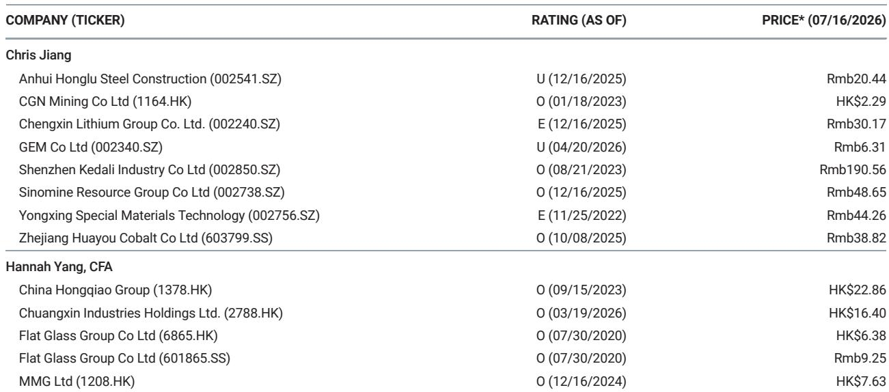
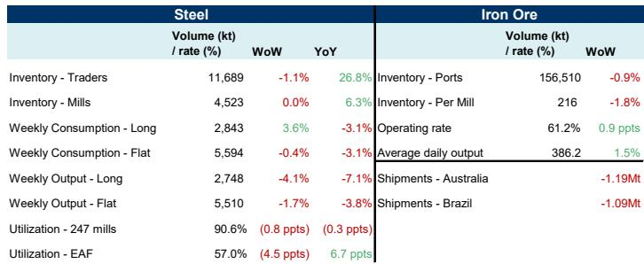
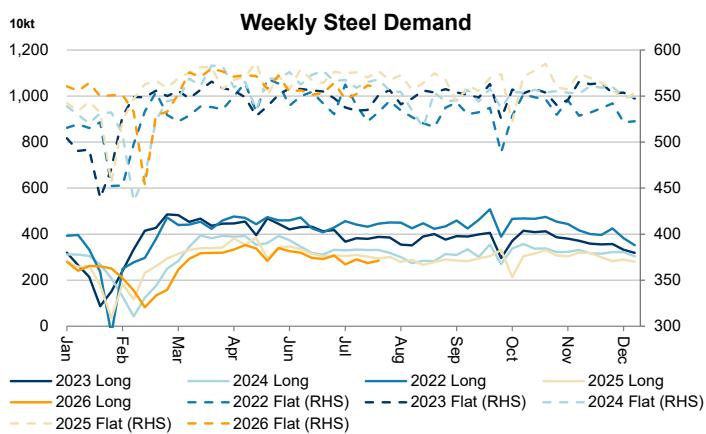

# MS：中国钢铁与铁矿石周度更新

这份MS最新周度报告揭示了一个容易被忽略的信号：中国钢铁市场的需求并非整体疲软，而是出现了明显的品种分化。截至7月12日当周，长材的表观消费量环比上升3.6%，而板材则环比下降0.4%。两者同比均下滑3.1%，但方向上的差异值得关注。

报告的核心数据来自Mysteel的周度统计，覆盖了钢材库存、产量、开工率以及铁矿石到港量等多个维度。对于关注工业品需求和宏观节奏的读者来说，这份周报提供了一个高频的观察窗口。

## 1. 长材需求回暖，但供给端并未同步跟上

长材消费的环比增长是本周最突出的变化。3.6%的周度增幅，在近期数据中并不常见。但与此同时，长材的周度产量却下降了4.1%，同比降幅更是达到7.1%。这意味着需求的改善更多来自库存消化，而非生产端的主动扩张。

贸易商库存环比下降1.1%，钢厂库存则基本持平。这种“下游去库、上游稳库”的组合，暗示终端用户可能在价格或预期触底后开始补货，但钢厂对增产仍持谨慎态度。

> **KC评论：** 长材主要用于建筑领域，其消费回暖可能与部分基建项目加速落地有关。但产量下降说明钢厂对持续性存疑，这轮补库的力度和时长仍需观察后续几周的数据。

## 2. 板材供需双弱，库存不确定性仍在积累

与长材不同，板材的表现更为仍在调整。消费量环比下降0.4%，产量也下滑1.7%。板材下游对应汽车、家电、机械等制造领域，其需求走弱可能反映了制造业订单的阶段性节奏变化。

值得注意的是，板材的产量降幅小于消费降幅，这意味着供需缺口仍在扩大。如果后续需求没有明显改善，板材库存不确定性可能进一步上升，进而压制钢厂利润。

## 3. 电炉开工率骤降，供给端自我调节信号明确

报告中最引人注目的数字之一是电炉开工率。当周电炉开工率仅为57.0%，环比大幅下降4.5个百分点。相比之下，247家样本钢厂的总体开工率为90.6%，环比仅下降0.8个百分点。

电炉是钢铁供给中最灵活的部分，其开工率对利润变化极为敏感。4.5个百分点的周度降幅，说明短流程钢厂在当前价格和成本组合下已经缺乏生产动力。这种供给端的自我调节，客观上会缓解部分品种的过剩不确定性，但也反映出行业盈利状况并不乐观。

## 4. 铁矿石到港量下降，但钢厂补库意愿不强

原料端同样出现分化。当周澳大利亚和巴西的铁矿石发运量合计环比下降229万吨，其中澳大利亚减少119万吨，巴西减少109万吨。港口库存环比下降0.9%，钢厂库存则下降1.8%。

钢厂日均产量环比上升1.5%，但铁矿石库存却在下降。这说明钢厂在增产的同时，并没有积极补充原料库存，而是选择消耗现有库存。这种“随用随采”的策略，反映出钢厂对后市价格和需求的判断仍偏谨慎。

> **KC评论：** 铁矿石发运量的下降是短期扰动还是趋势性变化，需要结合矿山财报和季节性因素判断。但钢厂的低库存策略本身就是一个信号：他们对未来的需求强度没有足够信心，不愿意承担额外的库存不确定性。

## 5. 一个可复用的观察框架：品种分化比总量更重要

这份周报最有价值的地方，不在于它给出了一个“好”或“坏”的总量判断，而在于它揭示了结构性的差异。长材和板材的分化、电炉和长流程的分化、钢厂对原料库存的态度，这些细节组合在一起，才能拼凑出真实的需求图景。

对于关注工业品市场的读者，可以建立一个简单的跟踪框架：每周关注长材和板材的消费量变化方向是否一致，电炉开工率是否持续下降，以及钢厂原料库存的变动趋势。这三个指标的组合，比单一的总量数据更能反映市场的真实温度。

For informational purposes only. Portions may be generated,translated,summarized,or edited with AI assistance based on source materials and may contain omissions or errors. Please verify independently. This is not investment,legal,tax,accounting,or other professional advice.

For informational purposes only. Portions may be generated,translated,summarized,or edited with AI assistance based on source materials and may contain omissions or errors. Please verify independently. This is not investment,legal,tax,accounting,or other professional advice.

