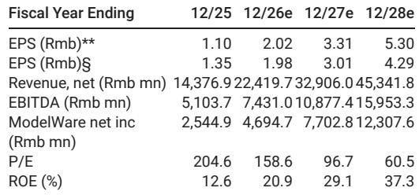
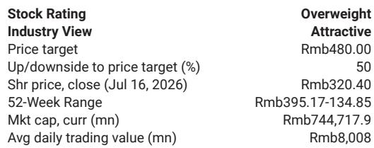

# China's AI Computing Demand Is Accelerating Faster Than Domestic Supply Can Match, and Hygon Is Positioned to Capture the Structural Gap

Hygon Information Technology reported second-quarter fiscal 2026 revenue of RMB 4.9 billion, up 59 percent year-over-year and 21 percent quarter-over-quarter, on the back of surging demand for AI computing in China. Net profit reached RMB 1.1 billion, exceeding analyst estimates by 8 percent. These numbers are not merely a beat. They signal a structural shift: China's domestic AI infrastructure buildout is accelerating at a pace that its semiconductor supply chain, particularly for CPUs and AI GPUs, cannot yet satisfy from local sources alone. Hygon sits at the intersection of this demand-supply imbalance, and the earnings trajectory suggests the company is becoming a primary beneficiary of a multi-year replacement cycle.

The timing matters. China's push for AI self-sufficiency is not a gradual trend but an intensifying imperative driven by both technology adoption and strategic autonomy. The company attributed its revenue surge to three forces: strong AI demand including AI agents, the localization drive, and product performance upgrades. Each of these forces reinforces the others. As domestic enterprises and government entities accelerate AI deployment, they increasingly require computing hardware that is both performant and domestically sourced. Hygon's product upgrades have allowed it to meet this requirement at a moment when alternatives from international suppliers face access restrictions.

What makes this earnings release more than a quarterly data point is the underlying earnings momentum. Recurring profit in the quarter reached RMB 1.0 billion, up 69 percent sequentially and 57 percent year-over-year. This metric strips out one-time items and provides a cleaner view of operating trajectory. The fact that recurring profit growth outpaced reported net profit growth indicates that the core business is strengthening faster than headline numbers suggest. For those focused on sustainability of earnings, this is the more relevant signal.

The strategic question is not whether Hygon will benefit from China's AI buildout. It is whether the company can sustain this trajectory as competition intensifies and as the domestic semiconductor ecosystem matures. The evidence so far points to a company that is not merely riding a tailwind but actively widening its competitive moat through product performance improvements and market share gains in both CPU and GPU segments. The following sections examine the specific mechanisms driving this performance, the structural factors that support its continuation, and the framework to use when evaluating the opportunity.

## The Earnings Beat Reveals an Acceleration in AI Infrastructure Spending That Is Broader Than Headline Numbers Suggest

Second-quarter revenue of RMB 4.9 billion represented a 59 percent year-over-year increase, but the composition of that growth matters more than the aggregate. The company cited AI agents as a specific demand driver, which points to a shift from experimental AI deployments to production-grade applications. AI agents require continuous inference compute rather than sporadic training workloads, which creates a more predictable and recurring demand pattern for hardware. This is qualitatively different from the initial wave of AI investment, which was concentrated among a handful of large cloud providers building out training clusters.

The localization drive adds another layer of demand that is less cyclical and more policy-driven. Chinese enterprises across sectors from finance to manufacturing are under increasing pressure to reduce reliance on foreign computing infrastructure. This is not a voluntary optimization but a compliance-driven reconfiguration. Hygon's positioning as a domestic supplier of both CPUs and GPUs makes it a natural beneficiary of this shift. The company does not need to win every competitive bid on pure performance metrics. It benefits from a procurement environment where domestic sourcing is a weighted criterion, sometimes the dominant one.

Product performance upgrades complete the picture. Hygon has improved its product lineup sufficiently that customers are not forced to choose between performance and domestic sourcing. The company can now compete on technical grounds in addition to benefiting from localization preferences. This dual advantage explains why revenue growth accelerated to 59 percent year-over-year from what was already a strong base. The sequential growth of 21 percent quarter-over-quarter further confirms that the acceleration is ongoing rather than a one-time comp effect.

## Recurring Profit Growth Outpacing Reported Net Profit Signals Operating Leverage and Pricing Power

Recurring profit of RMB 1.0 billion grew 69 percent sequentially and 57 percent year-over-year, compared to reported net profit growth of 57 percent sequentially and 55 percent year-over-year. The divergence is small in absolute terms but significant in implication. It suggests that the company's core operating performance is strengthening even faster than the bottom line, which may be absorbing some one-time charges or conservative accounting provisions.

This pattern typically emerges when a company experiences both volume growth and margin expansion simultaneously. Revenue growth of 59 percent year-over-year combined with recurring profit growth of 57 percent indicates that margins are broadly stable to improving. In a semiconductor business with high fixed costs and significant R&D investment, this is a favorable configuration. It implies that Hygon is not being forced to cut prices to win business, and that its product mix is shifting toward higher-value components.

The sequential comparison is particularly instructive. Second-quarter recurring profit grew 69 percent from the first quarter on a 21 percent revenue increase. This implies substantial operating leverage. As revenue scales, fixed costs such as depreciation and R&D are spread over a larger base, allowing profit to grow faster than revenue. For a company in the middle of a capacity expansion cycle, this is a positive signal that demand is absorbing new supply without depressing margins.

## The Valuation Discount to Peers Reflects Execution Risk That the Earnings Trajectory Is Rapidly Closing

Hygon trades at approximately 23 times estimated 2027 sales, compared to a peer group average of 30 times. This discount exists despite the company's accelerating revenue growth, improving margins, and structural tailwinds from China's localization drive. The valuation gap suggests that the market has not fully priced in the sustainability of Hygon's growth trajectory.

The discount can be explained by several factors. First, Hygon operates in a politically sensitive sector where regulatory changes or technology restrictions could alter the competitive landscape. Second, the company faces competition from other domestic semiconductor firms that are also targeting the AI computing market. Third, there is uncertainty about the pace of capacity expansion at domestic foundries, which could constrain Hygon's ability to scale production.

Each of these risks is real, but the earnings trajectory provides evidence that they are manageable. The company is growing revenue at nearly 60 percent year-over-year, which suggests it is gaining market share even as competitors ramp up. The localization drive creates a demand floor that is independent of cyclical fluctuations in global semiconductor markets. And the operating leverage demonstrated in the second quarter indicates that the company can grow profitably even as it invests in capacity.

The valuation discount creates a margin of safety for those who believe the earnings trajectory is sustainable. If Hygon continues to deliver the kind of results seen in the second quarter, the multiple should converge toward the peer average over time. Even if the multiple remains discounted, earnings growth alone would generate attractive returns.

## A Decision Framework for Evaluating Hygon's Position in the Domestic AI Computing Cycle

Those evaluating Hygon should focus on three leading indicators rather than lagging financial metrics. These indicators provide early signals about whether the company's growth trajectory is accelerating, decelerating, or inflecting.

First, monitor the pace of domestic foundry capacity expansion for leading nodes. Hygon's ability to ship products depends on access to advanced manufacturing capacity. If domestic foundries accelerate their capacity buildout, Hygon can grow faster. If capacity expansion is slower than expected, the company may face supply constraints that limit revenue growth regardless of demand. The second-quarter results suggest that capacity is currently not a binding constraint, but this is a variable that requires continuous monitoring.

Second, track the breadth of AI agent adoption across Chinese enterprises. The company specifically cited AI agents as a demand driver, which implies a shift from training infrastructure to inference infrastructure. Inference workloads are more distributed and require more diverse hardware configurations. If AI agent adoption broadens beyond early adopters, Hygon's addressable market expands significantly. If adoption remains concentrated, the growth rate may moderate as the initial wave of deployments matures.

Third, observe competitive dynamics in the domestic CPU and GPU markets. Hygon currently benefits from a relatively fragmented competitive landscape. If a domestic competitor achieves a significant product performance advantage or secures preferential access to foundry capacity, Hygon's market share could come under pressure. Conversely, if Hygon continues to differentiate itself through product upgrades, it can sustain or expand its market position. The earnings beat suggests the company is currently winning on both performance and market access.

These three indicators form a coherent framework because they capture the key variables that determine Hygon's future trajectory: supply availability, demand breadth, and competitive positioning. Each is independently important, and the interaction among them determines whether the current growth rate is sustainable.

*For informational purposes only. Portions may be generated, translated, summarized, or edited with AI assistance based on source materials and may contain omissions or errors. Please verify independently. This is not professional advice.*

For informational purposes only. Portions may be generated, translated, summarized, or edited with AI assistance based on source materials and may contain omissions or errors. Please verify independently. This is not professional advice.

