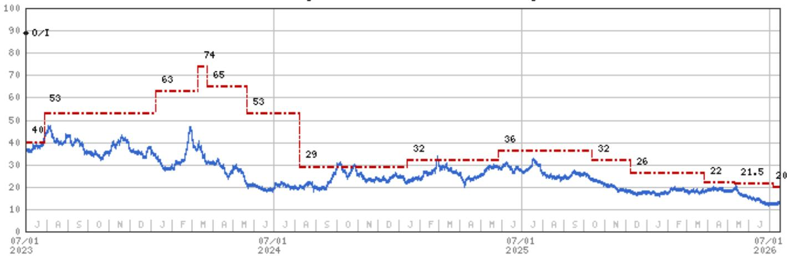
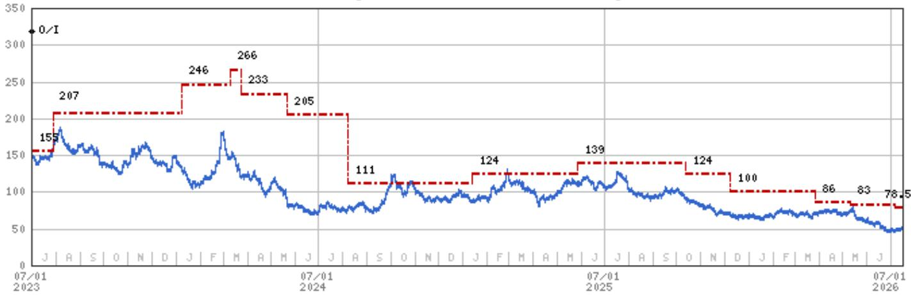
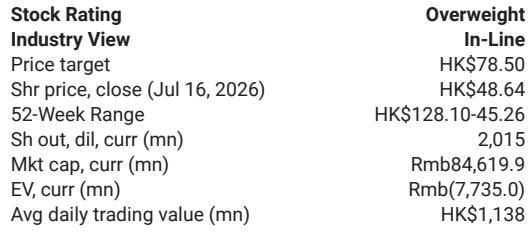

# MS：理想L6换代-同徽章新体验

理想汽车在7月推出了全新L6，起售价维持24.98万元不变。这份MS研究的核心判断是：这轮换代不是常规的年度改款，而是用一次硬件和体验的全面跃升，重新锚定了五座SUV细分市场的价值基准。

报告指出，新款L6将电池容量提升至51kWh，纯电续航从212公里拉长到300公里，并首次在L6上搭载5C超充——充电12分钟即可完成补能。同时，自研M100芯片（算力1280 TOPS）取代了此前的供应商方案，座舱芯片升级为骁龙8797，配合29英寸6K显示屏和AR-HUD。这些变化直接回应了上一代L6在续航和智能化上的体验优化方向。

一个容易被忽略的细节是：新款L6只保留了一个配置版本。这意味着理想不再通过多配置拉宽价格带，而是将所有资源集中在一个SKU上，把“满配”做成标准配置。这种做法在25万元级别的SUV市场并不多见，它考验的是企业对用户核心需求的判断力——哪些功能必须标配，哪些可以留给选装。

> **KC评论：** 单配置策略的本质是产品定义权的集中。理想选择在L6上做减法，把选择权从用户手里拿回，前提是它确信自己比用户更清楚什么值得买。这需要极强的用户洞察和供应链控制力。

研究认为，新款L6的月交付量有望从2026年上半年的平均5000辆，在未来几个月内回升至1万辆以上。与L8、L9形成合力后，理想的整体交付将从7月起实现环比增长，并在第三季度恢复同比正增长。

在竞争格局上，L6所处的25-30万元区间正变得异常拥挤。特斯拉Model Y、小米YU7、蔚来子品牌ONVO L80都瞄准同一批年轻家庭用户。MS在对比表中列出了八款竞品的关键参数：L6是其中相对少见一款增程动力、价格最低、续航最短但充电最快的车型。这种差异化定位能否持续奏效，取决于用户对“300公里纯电续航+5C快充”这一组合的接受度——它本质上是在用补能体验换取纯电续航数字上的差异。

对于关注智能电动车竞争格局的读者，这份报告提供了一个观察框架：当产品力趋同成为常态，竞争将从参数堆砌转向体验定义。L6换代的核心不是电池大了多少、芯片算力翻了几倍，而是理想能否把硬件升级转化为可感知的日常使用差异。这个问题的答案，将决定L6在1万辆月销之后还能走多远。

For informational purposes only. Portions may be generated,translated,summarized,or edited with AI assistance based on source materials and may contain omissions or errors. Please verify independently. This is not investment,legal,tax,accounting,or other professional advice.

For informational purposes only. Portions may be generated,translated,summarized,or edited with AI assistance based on source materials and may contain omissions or errors. Please verify independently. This is not investment,legal,tax,accounting,or other professional advice.

