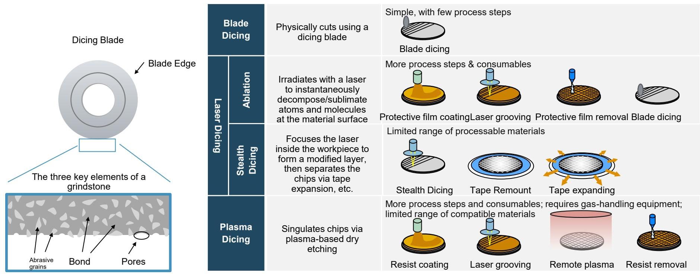

# MS：日本暑期学校-半导体生产设备

一份来自MSMUFG标的的日本半导体设备行业全景报告，在2026年7月发布。它没有给出宏大的市场预测，而是花大量篇幅拆解了从光刻、刻蚀到研磨、测试的每一个工艺环节，以及每个环节中日本企业的市场位置。这份报告最值得关注的判断是：日本半导体设备公司的竞争力，不是靠单一吸引人的产品，而是靠在一系列“不起眼但不可或缺”的工艺节点上形成了难以替代的积累。

报告开篇就给出了一个关键数据：2025年全球WFE（晶圆前端设备）市场规模中，逻辑/代工是最大应用领域，而台积电一家就占了其中的30%到50%。这个集中度意味着，任何一家设备商的命运，都与少数几家头部晶圆厂的工艺路线深度绑定。日本设备商的策略，正是在这种绑定中寻找自己的生态位。

## 1. 日本企业不是全能冠军，而是细分赛道的“工艺守门人”

报告通过各环节的市场份额图，清晰地展示了日本企业的分布逻辑。在光刻机这个最受关注的领域，ASML以超过80%的份额占据主要市场，日本尼康和佳能合计不到20%。但在光刻的配套环节——涂布/显影设备（Coater/Developer）上，东京电子（TEL）占据了全球约50%的市场。同样，在刻蚀设备这个210亿美元的市场中，虽然泛林半导体和应用材料在导体刻蚀上领先，但东京电子在介质刻蚀领域拥有强势地位，尤其是在存储芯片的高深宽比刻蚀（HARC）中。

这种“主设备不占优，但关键配套和细分工艺占主导”的模式，贯穿了整个报告。在垂直热处理炉管市场，东京电子和KOKUSAI电气合计占据了超过70%的份额；在清洗设备中，SCREEN在单片清洗市场以约50%的份额领先；在划片和研磨设备中，Disco和东京精密几乎形成了双头垄断。这些环节单个市场规模可能只有几十亿美元，但它们是芯片制造中“必须经过”的节点。

> **KC评论：** 这份报告最有价值的部分不是结论，而是它提供的工艺-设备-公司映射关系。读者可以从中理解，为什么一家在光刻机上没有存在感的日本公司，能在整个设备产业链中保持高利润率——因为芯片制造的良率，往往取决于这些“中间环节”的精度。

## 2. 硅周期的结构性变化：资本密集度从20%升至30%，设备商受益逻辑变了

报告在“硅周期”一节中提供了一个值得关注的长期视角。它指出，排除2000年互联网泡沫后的停滞期，半导体设备市场大约每六年翻一番。但更关键的变化是资本密集度——半导体资本支出占销售额的比例，已从历史水平的约20%上升至目前的约30%。

这个数字意味着，即使芯片销售额增速节奏变化，设备支出的增速也可能保持更高弹性。背后的驱动力，报告虽然没有明说，但从其展示的工艺复杂性中可以推断：随着制程微缩进入3纳米以下，以及3D NAND层数持续增加，每单位产能所需的设备研究额在上升。对于日本设备商而言，它们所擅长的那些“高精度、高稳定性”的工艺设备，恰恰是资本密集度上升中最受益的部分。

## 3. 中国市场的角色：既是增长极，也是不确定性敞口

报告专门用一页分析了WFE市场的区域分布。中国市场的份额在过去十年快速扩张，目前主要前端设备商的中国收入占比，与整体WFE市场的中国占比大致一致。报告没有给出具体数字，但从图表趋势看，中国市场已成为全球设备商不可忽视的收入来源。

对于日本设备商，这意味着双重影响：一方面，中国本土晶圆厂的扩产为日本设备商提供了增量订单；另一方面，地缘政治因素可能随时改变这个市场的可及性。报告没有展开讨论这一点，但读者可以从其提供的“中国收入占比”图表中自行判断各公司的敞口差异。

## 4. 一个可复用的观察框架：从工艺路线反推设备需求

这份报告本质上是一份“工艺技术手册”式的行业导读。它提供了一个实用的分析框架：要判断一家设备公司的前景，不是看它有多少种产品，而是看它覆盖的工艺步骤在未来的技术路线中是否“不可绕过”。

例如，报告详细介绍了从FEOL到BEOL的完整制造流程，并标注了每个步骤对应的主要设备商。在先进封装和3D堆叠（如TSV工艺）中，刻蚀、沉积和研磨设备的角色正在从“辅助”变为“核心”。这意味着，那些在介质刻蚀、CMP和临时键合/解键合设备上有积累的日本公司，可能会在AI芯片和HBM（高带宽存储器）的制造中获得新的增长空间。

报告最后附上了覆盖公司的评级列表，但真正值得反复阅读的，是那些工艺流程图和市场份额图。它们构成了理解日本半导体设备业竞争格局的基础素材。

For informational purposes only. Portions may be generated,translated,summarized,or edited with AI assistance based on source materials and may contain omissions or errors. Please verify independently. This is not investment,legal,tax,accounting,or other professional advice.

