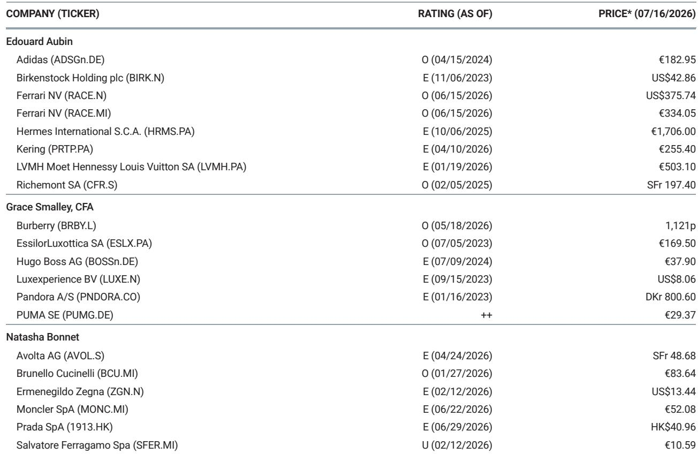
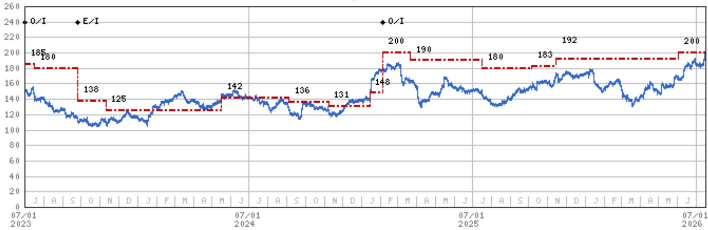
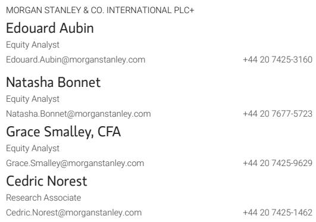

# 历峰集团：硬奢持续加速，软奢增长放缓

历峰集团在2027财年第一季度实现集团销售额按固定汇率计算增长20%，其中珠宝部门增长24%。这一结果显著高于市场普遍预期，且较上一季度有所加速。此次表现不仅因其规模引人注目，更因其出现的时机。此前，许多行业观察者曾预测珠宝超级周期将结束，认为软奢品牌一系列创意总监的任命将推动消费支出回流至成衣和鞋履领域。然而，这一预测并未成为现实。相反，硬奢与软奢之间的差距进一步扩大。

对于关注者而言，问题不在于历峰集团当前表现是否良好，而在于其背后结构性驱动力是否持久、下一阶段增长将来自何处，以及管理层应如何运用公司91亿欧元的创纪录净现金头寸。要回答这些问题，需要按地区、品牌、产品类别和消费者群体分解增长，然后评估每个驱动因素如何与宏观环境相互作用。第一季度的业绩提供了足够的细节来构建这一分析框架。

历峰集团的增长并非单一故事，而是三个不同引擎的组合：正在复苏的中国市场集群、加速增长的美国集群，以及同比增长超过50%的韩国集群。每个引擎都有不同的动力来源和风险特征。理解它们之间的相互作用，是评估当前趋势能否持续的核心分析任务。

## 美国集群正驱动财富效应，且渗透率尚未见顶

美国集群在第一季度实现了约30%的增长，而上一年的可比基数已为15%。这并非从低迷中反弹，而是在强劲增长基础上的加速。最合理的解释是K型财富效应，即资产增值集中在高收入家庭，这些家庭随后将更多支出用于高端珠宝。管理层应确认，最高收入消费者的升级消费是否已成为重要驱动力，以及高级珠宝是否跑赢了投资组合中的其他部分。

关键的战略问题是这种势头还能持续多久。美国奢侈品支出出现周期性放缓总是可能的，但更相关的指标是渗透率。卡地亚和梵克雅宝在美国消费者中的渗透率低于其在欧洲客户群中的水平。这一差距代表了一个独立于宏观周期的结构性增长机会。如果管理层认为美国市场仍有显著空白，那么即使财富效应减弱，美国集群也能维持高于趋势的增长。风险不在于增长停止，而在于观察者可能将结构性机会误认为是周期性顺风，从而高估了近期的减速幅度。

## 中国消费者海外支出正在恢复，但境内市场面临结构性挑战

中国集群在第一季度实现了约9%的增长，较2026财年第四季度1%至2%的负增长有显著改善。但构成情况值得关注。中国大陆市场可能出现了低个位数的下降，而中国消费者海外支出则增长了近30%。这种分化非常明显且具有启示性。中国消费者再次开始旅行并在境外购买奢侈品，但境内需求依然偏弱。

这种模式造成了一个悖论。自疫情前以来，中国集群的支出复合年增长率仅为约1%，而同期历峰集团珠宝部门的销售额增长了15%。管理层应解释为何卡地亚和梵克雅宝未能在中国消费者支出中占据更大份额。如果答案是中国消费者在别处购买，或者境内渠道渗透不足，那么中国消费者海外支出的复苏只是部分抵消，而非解决方案。结构性问题在于，历峰集团能否重振中国境内需求，还是该集群将继续拖累整体增长。市场对集团2027和2028财年9.6%和7.2%的固定汇率增长预测，已隐含了对中国业务正常化的预期。任何低于预期的表现都将带来下行风险。

## 韩国市场的繁荣真实存在，但易受资产价格调整影响

韩国可能是第一季度增长最快的集群，同比增长超过50%。这从任何标准来看都非同寻常。问题在于可持续性。韩国奢侈品支出部分受到强劲股票市场和类似美国模式的财富效应的推动。但韩国综合股价指数近期已回吐了相当一部分涨幅。管理层应披露是否在7月份观察到韩国支出出现回落。如果韩国股市表现与奢侈品支出之间的相关性紧密，那么韩国引擎的减速可能与其加速一样迅速。观察者应将此集群视为高贝塔贡献者，它在市场向好时放大整体增长，但在市场转弱时增加波动性。

## 珠宝部门并非周期性业务，而是基于结构性原因从软奢手中夺取份额

关于软奢的创意复兴将终结珠宝超级周期的说法，已被第一季度的数据实证否定。事实上，西方珠宝品牌相对于软奢品牌的表现优势反而扩大了。解释并非珠宝不受时尚周期影响，而是领先的珠宝品牌已经建立了软奢品牌难以复制的优势：兼具身份象征和情感消费功能的标志性产品线。

卡地亚Love手镯和梵克雅宝Alhambra系列不受成衣那样的季节性变化或潮流风险影响。它们是为人生大事、纪念日和里程碑而购买的。它们的定价方式使其对广泛的高收入消费者具有可及性，同时对低于该门槛的消费者仍保持吸引力。普及化的风险是真实存在的，但迄今为止的数据表明，这些产品线在销售中的占比持续上升，且并未削弱其吸引力。管理层应澄清标志性产品线是否确实在投资组合中表现更优，以及在何种程度上他们认为普及化可能成为不利因素。

黄金价格自3月初以来已下跌超过20%。这对珠宝需求是净利好，因为较低的投入成本减少了提价需求，并提高了消费者的可负担性。这也为毛利率提供了顺风，毛利率在2026财年因大宗商品成本上升而收缩了250个基点。如果金价保持在当前水平，2027财年与2026财年相比的同比增幅仅为2%，这意味着来自大宗商品的毛利率压力应会显著降低。

## 专业制表部门在疲软市场中表现优于同行，但整体份额仍在流失

专业制表部门在第一季度实现了8%的固定汇率增长，而同期瑞士手表出口截至5月同比下降了3%。江诗丹顿、积家和朗格表现突出，可能实现了两位数的增长。这种优于同行的表现令人鼓舞，但它掩盖了一个长期问题。过去十年中，专业制表部门几乎持续失去市场份额，目前其规模已小于卡地亚手表单独的业务。

管理层应解释积家近期表现改善的原因，以及是否正在实施“收缩以求增长”的策略，以重新聚焦于标志性产品线。该部门相对于更广泛手表市场的表现不佳并非不可避免。它反映了产品策略和品牌定位的选择，这些是可以改变的。但在有证据表明市场份额持续增长之前，观察者应将手表部门视为一个转型故事，而非增长引擎。

## 评估历峰集团增长轨迹的分析框架

对于试图评估历峰集团能否维持两位数增长的观察者而言，关键变量并非宏观预测，而是以下四个因素，每个因素都可以通过公开数据进行追踪。

第一，美国市场的渗透率差距。如果卡地亚和梵克雅宝在美国的渗透率显著低于欧洲，那么美国增长就有一个高于奢侈品市场平均水平的结构性底部。需要关注的指标是美国收入占珠宝部门总销售额的比例是否持续上升。

第二，中国消费者的支出结构。中国消费者境内与境外支出的比例将决定该集群是恢复正向贡献还是继续拖累。如果境外支出继续以30%的速度增长，而境内支出仍为负值，那么净效果是正向但脆弱的。旅行模式或关税政策的变化可能迅速逆转这一趋势。

第三，标志性产品份额。如果标志性产品线的增长速度超过投资组合中的其他部分，这将支持利润率稳定并降低时尚风险。但如果份额变得过高，则会带来集中度风险和潜在吸引力下降。管理层应披露前五大产品系列的收入占比。

第四，韩国股市相关性。韩国奢侈品支出与韩国综合股价指数高度相关。如果这种相关性成立，韩国集群将在2027财年下半年减速。观察者应监测月度韩国奢侈品进口数据作为领先指标。

## 现金部署是下一个战略决策，且影响重大

历峰集团91亿欧元的净现金头寸处于其10年区间（24亿至91亿欧元）的顶部。这为管理层提供了显著的选择权。问题不在于公司是否有能力采取行动，而在于基于增长前景，资本的最佳用途是什么。

最明显的用途是内部再投资。2027财年的资本支出指引应予以披露，部门层面的细分将揭示管理层是否在投资于零售扩张、数字能力或制造产能。如果数据表明美国市场的空白机会足够大，那么在美国开设门店和增加营销投入应成为优先事项。

第二个选择是并购。历峰集团一直是行业整合者，于2019年收购了布契拉提，2022年收购了德尔沃，2024年收购了詹巴迪斯塔·罗西70%的股份，并于2025年收购了Vhernier。管理层应澄清他们是否打算保持活跃，以及是否会考虑收购一家拥有大量天然钻石敞口的珠宝品牌。黄金价格的下跌和钻石市场的结构性挑战可能创造有吸引力的入场时机。

第三个选择是股东回报。股息支付率一直保持稳定，公司并未定期使用特别股息。鉴于股票交易价格约为31倍远期收益，回购在较低估值环境下的增值效果会更好。但如果管理层认为当前增长轨迹可持续，那么相对于该轨迹，股票并不昂贵。

现金部署的决策框架应与增长框架遵循相同的逻辑。如果美国市场的渗透率差距真实存在，且中国集群能够恢复正常，那么内部再投资和选择性并购将比加速股东回报提供更高的长期回报。如果增长引擎正在见顶，那么将资本返还给股东则变得更具吸引力。

*仅供参考。部分内容可能基于源材料通过AI辅助生成、翻译、总结或编辑，可能存在遗漏或错误。请独立核实。本文不构成专业建议。*

仅供参考。部分内容可能基于源材料通过AI辅助生成、翻译、总结或编辑，可能存在遗漏或错误。请独立核实。本文不构成专业建议。

