# Swiss Watches: Secondary Market Continues to Show Sequential Improvement in 2Q26

## Key Takeaways

In 2Q26, all three listed groups – Richemont, Swatch Group and LVMH – recorded a sequential uptick in secondhand prices.

Gains were stronger than in 1Q for LVMH and broadly stable for Richemont/Swatch Group, with LVMH leading at +1.7%, followed by Richemont at +1.3% and Swatch Group at +1.0%.

Among the listed players, the standout performers by brand QoQ include TAG Heuer (+3.8%) from LVMH, Cartier (+2.2%) and Vacheron Constantin (+1.4%) from Richemont, as well as Omega (+0.9%) from Swatch Group.

- Importantly, the value retention ratio (a barometer of desirability) continued to improve sequentially for most leading brands owned by listed groups, despite retail price increases.

All in all, while most secondhand market metrics improved again in 2Q and the recovery became more broad-based, gains for the listed players remain relatively modest, and VR ratios continue to suggest limited pricing power outside the Big Three in the coming quarters.

Tracking the price evolution of secondhand watches is interesting for market observers, as, in general, it provides a good barometer of a brand's desirability and thus future pricing power/growth trajectory.

Overall, secondary watch market fundamentals continued to improve in 2Q26, although the pace of recovery moderated. (1) Secondary prices rose by +1.5% QoQ in 2Q26, marking a fourth consecutive quarter of gains above +1% – see Exhibit 1. The recovery is becoming increasingly broad-based, with 27 of the 35 brands we track posting positive QoQ performance in 2Q26, up from 25 in 1Q26. (2) Encouragingly, value retention also continued to slowly but gradually improve for most tracked brands, despite retail price increases. Value Retention is defined as the premium/discount that an in-production watch trades for on the secondary market relative to its retail price. Seven of the eight brands we track posted sequential improvement on a like-for-like basis. This indicates that secondary demand overall remains reasonably healthy and increasingly organic, even as near-term dynamics were distorted by Watches & Wonders anticipation, which drove a surge in listings and strong April performance before prices softened in May and June. All in all, these trends indicated a strengthening of leading brands' desirability for the three listed groups (Richemont, Swatch Group and LVMH). However we caveat that, outside the Big Three, all tracked brands continue to trade at discounts of at least -27% to retail, which should limit pricing power despite improving market momentum.

What's new? We break down the latest trends in the secondary watch market in 2Q26 in this note, using data from the secondary watch market research platform WatchCharts.

## What the data says:

Secondary prices rose +1.5% in 2Q26, a fourth consecutive quarter of gains exceeding +1%. While the pace of growth moderated compared to previous quarters (+2.5% in both 4Q25 and 1Q26), gains were the most widespread of the recovery so far: 27 of the 35 brands we track posted positive QoQ performance (compared to 25 in 1Q26). Within the Big Three, Patek Philippe gained +2.2%, Audemars Piguet gained +1.5%, and Rolex gained +1.0%.

Performance of all leading Groups improved QoQ, led by LVMH (+1.7%). LVMH's performance was driven by TAG Heuer (+3.8%). However, LVMH lacks a consistent performer with significant secondary market share (such as Omega for Swatch Group and Cartier for Richemont); as a result, its long-term performance lags notably behind the other Swiss groups (see Exhibit 7). For Richemont (+1.3%), Cartier (+2.2%) remains the standout performer, while Vacheron Constantin (+1.4%) posted a third consecutive quarter of recovery. Richemont reported its sales for the three months to June this week (see note here): triangulating data points, we estimate that Cartier Watches grew in excess of 20% YoY at constant FX, still far outperforming the rest of the Swiss watch industry (as per Swiss watch exports). Interestingly, the Specialty Watchmakers division also positively surprised (constant FX sales up +8% YoY). Richemont does not disclose its sales by brand, but we estimate that Vacheron, Lange and Jaeger all grew double digit YoY (we think it is particularly encouraging for Jaeger, which had been facing challenges in recent years). On the secondary market, WatchCharts data shows that Jaeger-LeCoultre saw positive price momentum, rising +1.2% QoQ. As for the Rolex Group (+1.1%) gains essentially track Rolex, though Tudor (+2.6%) prices also rose. Similarly, Swatch Group's (+1.0%) performance is largely reflective of Omega (+0.9%) – though the Swatch brand was the top performer in the quarter (+9.4%). On a YoY basis, all four groups are trending positive for the first time since early 2022 (as per Exhibit 2 below).

Value retention continued to improve for most brands, despite retail price increases. Seven out of the eight brands that we track saw a sequential improvement in VR on a LfL basis. All tracked brands saw secondary prices of in-production models rise QoQ, while at the same time retail price increases also affected five out of the eight brands – most notably Cartier, Rolex, and Patek Philippe. The Big Three (Rolex, PP and AP) continue to trade above retail, led by Patek Philippe (+15.4% VR), while all other brands trade for at least -27% below retail (and up to -38% for IWC).

Exhibit 1: Quarterly sequential performance of the WatchCharts Overall Market price tracker since 2022  
  
Source: WatchCharts

Exhibit 2: Performance of WatchCharts price trackers for Swiss groups in 2Q26, QoQ and YoY  
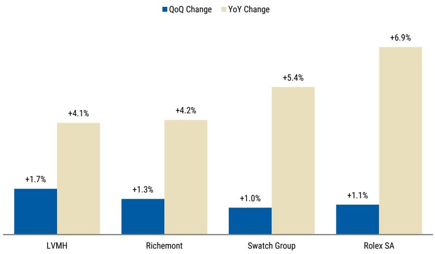  
Source: WatchCharts

# What's new in 2Q26

We outline several of the key trends shaping the secondary watch market in 2Q26.

Secondary prices rose +1.5% in 2Q26, the fourth consecutive quarter of gains exceeding +1%. While the pace of growth moderated compared to previous quarters (+2.5% in both 4Q25 and 1Q26), gains were the most widespread of the recovery so far: 27 of the 35 brands we track posted positive QoQ performance (compared to 25 in 1Q26). Within the Big Three, Patek Philippe gained +2.2%, Audemars Piguet gained +1.5%, and Rolex gained +1.0%.

Performance of all Groups improved QoQ, led by LVMH (+1.7%).

- LVMH's performance was driven by TAG Heuer (+3.8%) and Zenith (+2.8%).

- For Richemont (+1.3%), Cartier (+2.2%) remains the standout performer, while Vacheron Constantin (+1.4%) posted a third consecutive quarter of recovery.

- Rolex SA (+1.1%) gains essentially track Rolex, though Tudor prices also rose (+2.6%).

- Similarly, Swatch Group's (+1.0%) performance is largely reflective of Omega (+0.9%) – though the Swatch brand was the top performer in the quarter (+9.4%). On a YoY basis, all four groups are trending positive for the first time since early 2022.

Value retention continued to improve for most brands, despite retail price increases. Seven out of the eight brands that we track saw a sequential improvement in VR on a LfL basis. All tracked brands saw secondary prices of in-production models rise QoQ, while at the same time retail price increases also affected five out of the eight brands – most notably Cartier, Rolex, and Patek Philippe. The Big Three continue to trade above retail, led by Patek Philippe (+15.4% VR), while all other brands trade for at least -27% below retail.

## Market health dynamics were defined by rising supply and Watches & Wonders anticipation

Supply levels reached record or near-record highs for all tracked brands over the past two quarters, driven primarily by an influx of new listings in March and April. We believe this influx was triggered by Watches & Wonders (which saw record-high interest this year) as dealers sought to capitalize on anticipation for the event. While demand remained steady, the surplus of new listings caused prices to stabilize in May and June, moderating momentum from a historically strong April (the best single calendar month of performance since 2022, according to the WatchCharts Overall Market price tracker). Looking forward, we believe the events of 1H26 will have limited carryover into the third quarter, though the excess supply accumulated (particularly for Rolex) will still need to be absorbed.

Rolex CPO posted record sales of $186 million in 2Q26. Sales rose +28% QoQ and +67% YoY, with 1H26 sales of $330 million already representing about two-thirds of the program's FY25 total. Available inventory stands at approximately 11,300 watches valued at $285 million, with three key retailers (Bucherer, Watches of Switzerland, The 1916 Company) continuing to hold roughly half of total supply across 157 RCPO retailers globally. We also observed a significant increase in median per-retailer sales, from $578K in 1H25 to $899K in 1H26.

Exhibit 3: Performance of the WatchCharts Overall Market price tracker and price trackers for the Big Three brands since 2021  
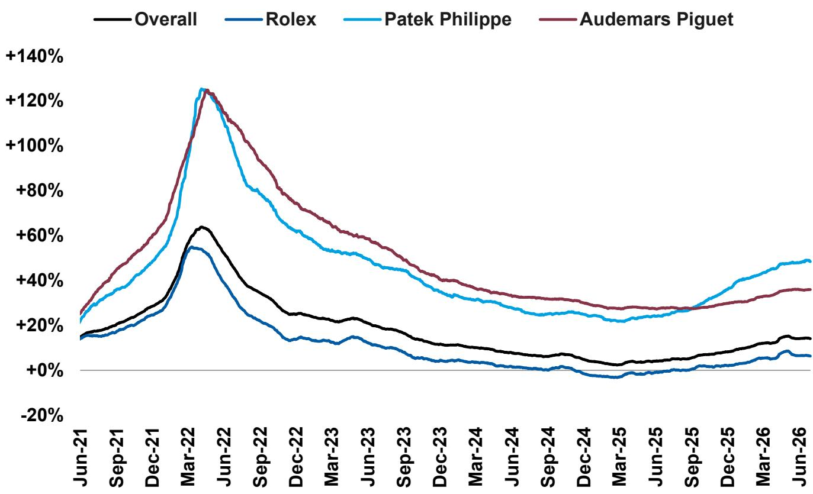  
Source: WatchCharts

Exhibit 4: Quarterly sequential performance of the WatchCharts Overall Market price tracker since 2022  
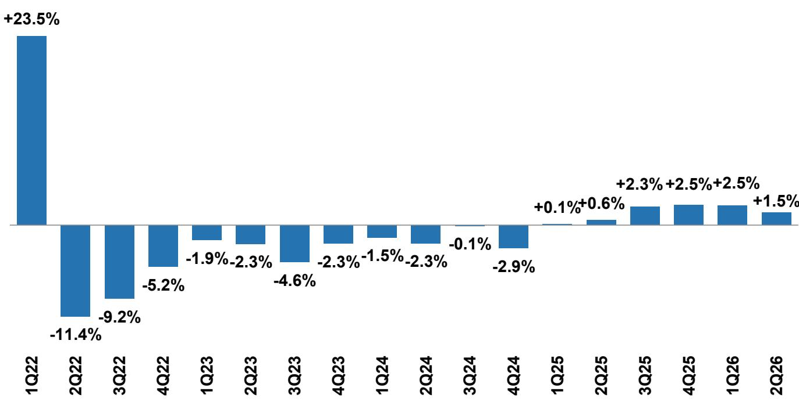  
Source: WatchCharts

Unless otherwise stated, the analysis of the overall watch market in this report is based on the WatchCharts Overall Market price tracker, which aggregates the secondary market performance of 300 watches from 10 major brands, weighted by annual transaction value in USD. Brand or collection performance is analyzed using its respective WatchCharts price tracker, derived from the top 30 watches within the brand or collection. Group performance is based on the top 30 watches for each brand within the group, all weighted by annual transaction value in USD. WatchCharts data can be subsequently revised or adjusted. The most recent publications prevail.

# Secondary prices see broad-based gains for fourth consecutive quarter in 2Q26

The WatchCharts Overall Market price tracker rose +1.5% in 2Q26, marking the fourth consecutive quarter of gains exceeding +1%. More brands continued to see prices rise than fall, with 27 out of 35 tracked brands being up QoQ and 29 up YoY. However, the vast majority of 2Q26 growth can be attributed to April's performance specifically, primarily driven by anticipation for Watches & Wonders. Specifically, the WatchCharts Overall Market price tracker rose +2.5% in April (the single best month since March 2022), yet fell by -1.0% across May and June. As a result, the pace of growth was in line with previous quarters (+2.3% in 3Q25, +2.5% in 4Q25, +2.5% in 1Q26).

Exhibit 5: Price performance summary for watch brands on the secondary market in 2Q26 (QoQ change)  
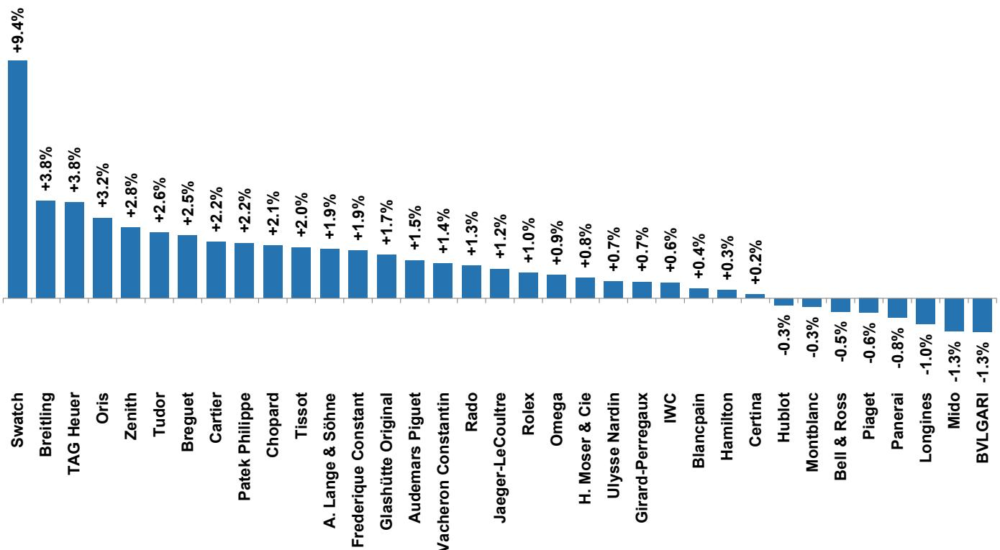  
Source: WatchCharts

Exhibit 6: Price performance summary for watch brands on the secondary market in 2Q26 (YoY change)  
  
Source: WatchCharts

Rolex (+1.0% QoQ): despite sports hype, classic models led the rise. While the GMT-Master collection and specifically the "Pepsi" reference 126710BLRO were in the spotlight, they were not among the brand's best performers. The GMT-Master collection was up just +0.3% QoQ, and Pepsi prices actually fell by -2.3% QoQ as buyers had front-run the widely anticipated discontinuation. Instead, Rolex's QoQ gains can primarily be attributed to its dressier models, with Air-King (+2.1%), Datejust (+1.7%), and Sky-Dweller (+1.6%) collections all outperforming. Meanwhile, the Sea-Dweller collection continued to see adjustment, down -2.0% QoQ.

Patek Philippe (+2.2% QoQ) and Audemars Piguet (+1.5% QoQ) both continued to rise in 2Q, though momentum similarly moderated in May and June, mirroring Rolex. For Patek, prices of all collections continued to rise QoQ, led by Aquanaut (+3.6%), Gondolo (+2.2%), and Nautilus (+1.7%). Meanwhile for AP, the Royal Oak (+2.0%) was strong while CODE 11.59 (-0.5%) and Royal Oak Offshore (-1.5%) fell QoQ.

Among mid-level brands, TAG Heuer and Breitling emerged as top performers ... TAG Heuer (+3.8% QoQ, +9.9% YoY) and Breitling (+3.8% QoQ, +8.7% YoY) ranked among the top performers both QoQ and YoY.

- TAG Heuer's recent gains have been concentrated in motorsports collections, most notably Formula 1 (+5.0% QoQ, +8.7% YoY) and Monaco (+2.2% QoQ, +8.0% YoY) – likely driven by increased interest as a result of the brand's return to Formula 1 as its official timekeeper last year.

- Meanwhile, Breitling's gains were broad-based, led by the Superocean Heritage (+4.5%) and Chronomat (+4.4%). However, both brands generally lag behind mid-level leaders in terms of value retention; popular in-production TAG Heuer Formula 1 models trade more than -60% below retail, while popular in-production Breitling Navitimer, Endurance, and Chronomat models trade for around -40% to -50% below retail.

... while Tudor (+2.6%), Cartier (+2.2%) and Omega (+0.9%) saw continued growth. For Cartier, all collections saw QoQ gains, with Panthère (+3.8%), Santos (+3.0%), and Tank (+2.9%) QoQ performance being particularly strong. Meanwhile, Tudor's performance continues to be driven by its dive watch collections, with the vintage Submariner collection up +3.2% QoQ and the modern Black Bay collection up +2.6% QoQ. Meanwhile, Omega's performance was led by the Speedmaster and De Ville collections, both up +1.4% QoQ.

## All three listed groups were up +1% or more QoQ.

- LVMH led the listed groups at +1.7%, as a result of strong performance from TAG Heuer (+3.8%, discussed above) and Zenith (+2.8%). Hublot (-0.3%) remains the group's laggard, though prices have stabilized over the past year.

- For Richemont (+1.3%), Cartier (+2.2%) remains the standout, while Vacheron Constantin (+1.4%) also outperformed thanks to broad gains from its collections (in particular, the Overseas was up +1.6%).

- For Swatch Group (+1.0%), Omega (+0.9%), Breguet (+2.5%), and Glashütte Original (+1.7%) rose, while Mido (-1.3%) lagged. The Swatch brand jumped +9.4%. On a YoY basis, all four Swiss groups recorded positive performance for the first time since 2022.

Exhibit 7: Performance of WatchCharts price trackers for Swiss groups since 2021  
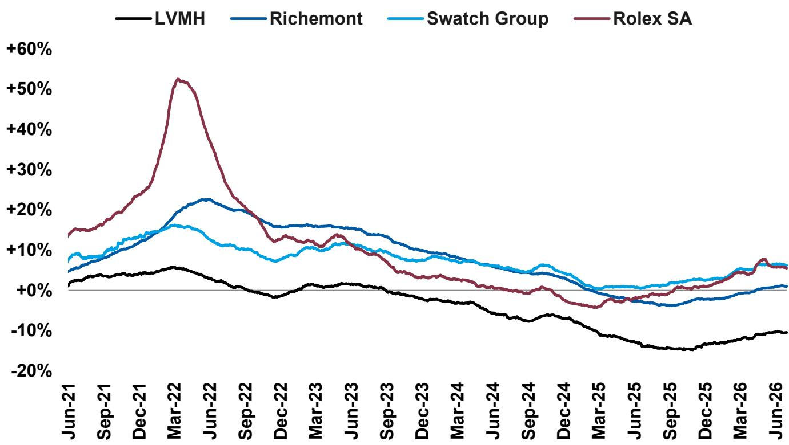  
Source: WatchCharts

Exhibit 8: Performance of WatchCharts price trackers for Swiss groups in 2Q26, QoQ and YoY  
  
Source: WatchCharts

## Analysis of market health and fundamentals

We propose four key indicators for evaluating the health of the secondary watch market or one of its segments: total supply (the amount of inventory on the market), absorption rate (the rate at which the inventory is turning over), age of inventory (how old the available inventory is), and days on market (how fast sold inventory is selling). Our analysis in this section covers the Big Three (Rolex, Patek Philippe, and Audemars Piguet) and three key mid-level brands (Cartier, Omega, and IWC).

Secondary market dynamics in 2Q26 were driven by Watches & Wonders anticipation. Excitement for Watches & Wonders 2026 (which took place on April 14-20) surpassed previous years by a wide margin, based on Google Trends data. This was driven by several key events, including the anticipated discontinuation of the Rolex GMT-Master "Pepsi" and the releases surrounding the 50th anniversary of the Patek Philippe Nautilus. For reasons we explain below, we believe that the market health and secondary pricing dynamics we observed in the past quarter can be explained by this unprecedented anticipation, as well as (in retrospect) many deferred purchases from 1Q26.

Exhibit 9: Worldwide search interest for "Watches and Wonders" over the past five years, based on Google Trends data  
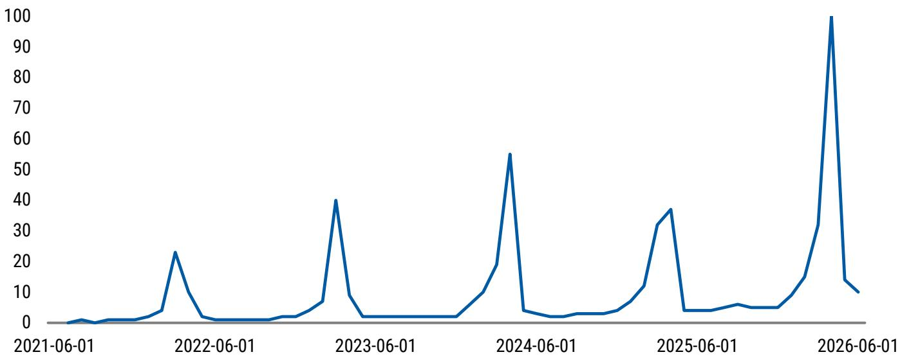  
Source: WatchCharts

Exhibit 10: Total value of available inventory on the secondary market for the Big Three and mid-level brands since 2021  
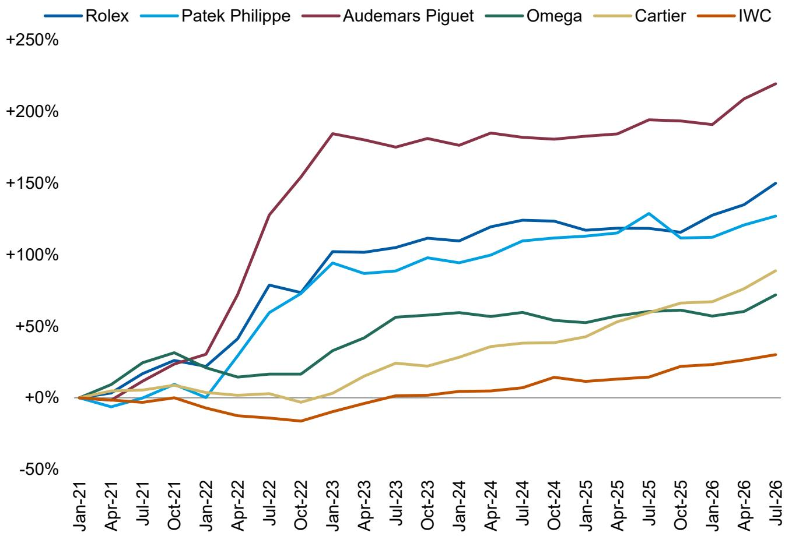  
Source: WatchCharts

Exhibit 11: Average quarterly absorption rate (measure of inventory turnover, defined as sold inventory value divided by total inventory value over a given period) for the Big Three and mid-level brands since 2021  
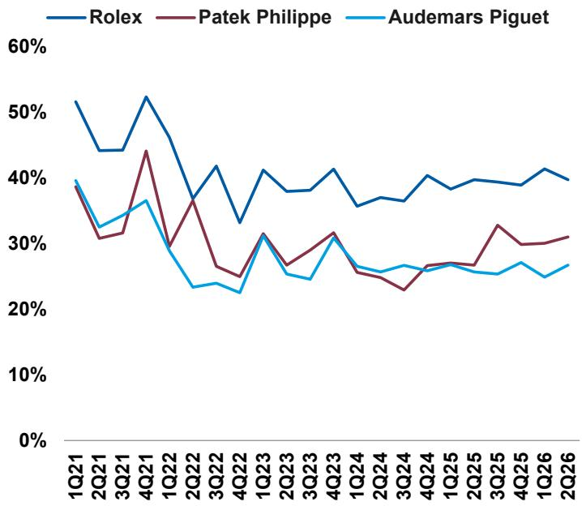  
Source: WatchCharts

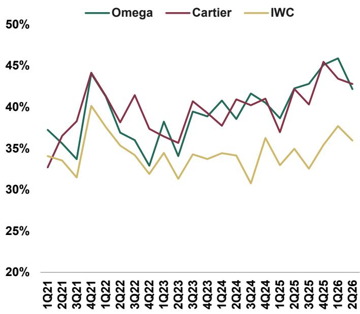

Exhibit 12: Price-adjusted median age of inventory (number of days for which purchased inventory is held by sellers) evolution for the Big Three and mid-level brands since 2021

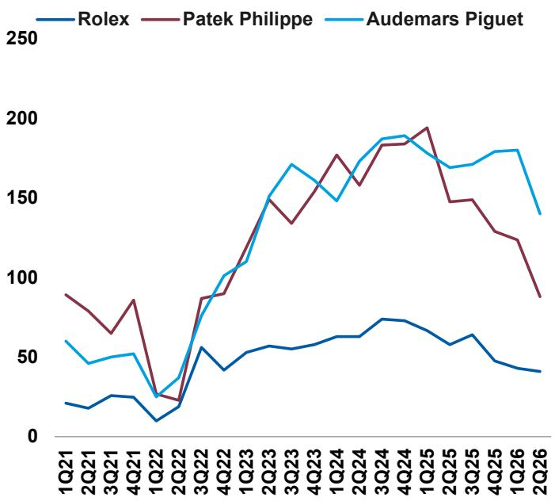

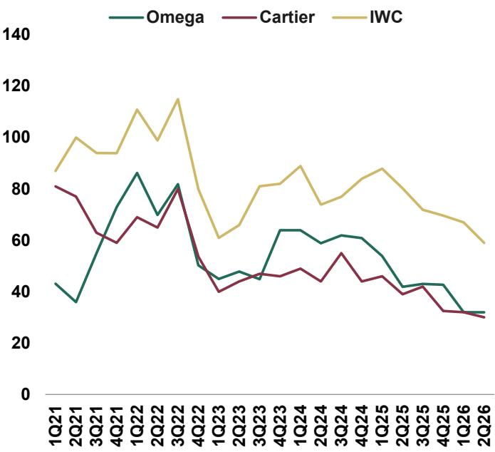  
Source: WatchCharts

Exhibit 13: Average quarterly days on market (median number of days for which sold inventory was available on the market) evolution for the Big Three and mid-level brands since 2021

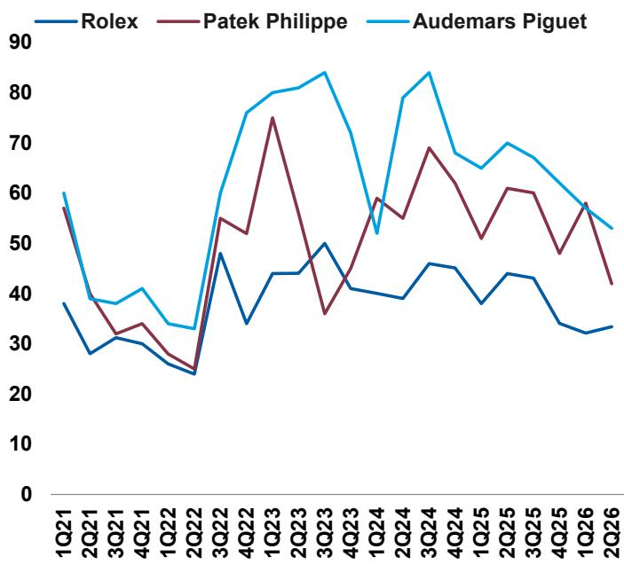  
Source: WatchCharts

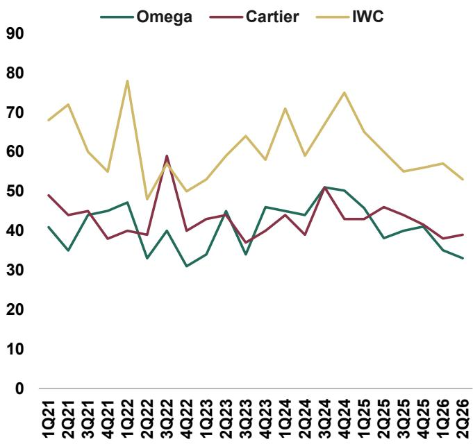

## Analysis of value retention and market performance by brand

We think value retention (VR), defined as the premium/discount that an in-production watch trades for on the secondary market relative to its retail price, is a key metric to gauge brand desirability. Our value retention analysis methodology reflects a global average of five key markets: United States (USD), United Kingdom (GBP), Germany (EUR), Japan (JPY), and Hong Kong (HKD). See the Methodology section at the end of this report for a more in-depth explanation.

Value retention for most brands continued to improve sequentially. Seven out of the eight brands we tracked saw value retention improve on a like-for-like basis compared to 1Q26, with the sole exception being Cartier as a result of significant retail price increases. Secondary prices of in-production models also improved for all tracked brands, in line with the performance of their corresponding WatchCharts price trackers. Patek Philippe (+2.9pp) and IWC (+1.2pp) saw the largest improvements in LfL value retention, while Rolex, Audemars Piguet, and Omega improved by +1.0pp.

Exhibit 14: Value retention by brand (prices as at June 29, 2026 and March 31, 2026)  
■ Jun-29-26 VR ■ Mar-31-26 VR  
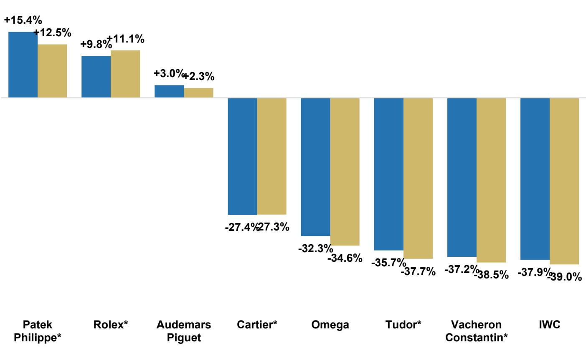  
\*Brands that altered retail prices since March 31, 2026  
Source: WatchCharts

Exhibit 15: Value retention by brand (prices as at June 29, 2026). Brands that altered retail prices since March 31, 2026 are denoted with an asterisk.

<table><tr><td></td><td># Watches</td><td>Jun-29-26 VR</td><td>Avg Retail</td><td>Avg Market</td><td>3M MKT CHG</td><td>6M MKT CHG</td><td>1Y MKT CHG</td></tr><tr><td>Patek Philippe*</td><td>126</td><td>+15.4%</td><td>$183,209</td><td>$120,948</td><td>+2.5%</td><td>+5.1%</td><td>+10.4%</td></tr><tr><td>Rolex*</td><td>139</td><td>+9.8%</td><td>$31,888</td><td>$30,618</td><td>+0.5%</td><td>+2.1%</td><td>+7.2%</td></tr><tr><td>Audemars Piguet</td><td>87</td><td>+3.0%</td><td>$53,076</td><td>$54,979</td><td>+0.9%</td><td>+2.9%</td><td>+4.3%</td></tr><tr><td>Cartier*</td><td>91</td><td>-27.4%</td><td>$14,324</td><td>$9,195</td><td>+2.5%</td><td>+5.2%</td><td>+8.1%</td></tr><tr><td>Omega</td><td>257</td><td>-32.3%</td><td>$11,902</td><td>$7,097</td><td>+0.7%</td><td>+2.7%</td><td>+3.2%</td></tr><tr><td>Tudor*</td><td>56</td><td>-35.7%</td><td>$6,144</td><td>$3,522</td><td>+1.9%</td><td>+5.5%</td><td>+7.2%</td></tr><tr><td>Vacheron Constantin*</td><td>42</td><td>-37.2%</td><td>$42,650</td><td>$26,276</td><td>+1.2%</td><td>+1.7%</td><td>+0.9%</td></tr><tr><td>IWC</td><td>114</td><td>-37.9%</td><td>$12,559</td><td>$7,469</td><td>+1.3%</td><td>+2.6%</td><td>+3.7%</td></tr></table>

Source: WatchCharts

Exhibit 16: Value retention evolution since March 31, 2026 based on all in-production models and LfL models only. Brands that altered retail prices since March 31, 2026 are denoted with an asterisk.

<table><tr><td>Brand</td><td>Jun-29-26 VR</td><td>Mar-31-26 VR</td><td>VR Evolution</td><td>LfL VR Evolution</td><td>LfL Count</td></tr><tr><td>Patek Philippe*</td><td>+15.4%</td><td>+12.5%</td><td>+2.9pp</td><td>+2.9pp</td><td>124</td></tr><tr><td>Rolex*</td><td>+9.8%</td><td>+11.1%</td><td>-1.3pp</td><td>+1.0pp</td><td>139</td></tr><tr><td>Audemars Piguet</td><td>+3.0%</td><td>+2.3%</td><td>+0.7pp</td><td>+1.0pp</td><td>82.4</td></tr><tr><td>Cartier*</td><td>-27.4%</td><td>-27.3%</td><td>-0.1pp</td><td>-0.5pp</td><td>65.4</td></tr><tr><td>Omega</td><td>-32.3%</td><td>-34.6%</td><td>+2.3pp</td><td>+1.0pp</td><td>255</td></tr><tr><td>Tudor*</td><td>-35.7%</td><td>-37.7%</td><td>+2.0pp</td><td>+0.7pp</td><td>51</td></tr><tr><td>Vacheron Constantin*</td><td>-37.2%</td><td>-38.5%</td><td>+1.3pp</td><td>+0.5pp</td><td>42</td></tr><tr><td>IWC</td><td>-37.9%</td><td>-39.0%</td><td>+1.1pp</td><td>+1.2pp</td><td>114</td></tr></table>

Source: WatchCharts

The Big Three continue to command secondary premiums; all other tracked brands trade at least -27% below retail. Patek Philippe continues to lead all brands by VR, with the gap between Patek and second-place Rolex widening as a result of the latter's product discontinuations (most notably the Pepsi). Audemars Piguet continues to maintain positive LSD value retention, supported by Royal Oak demand. 47 out of 126 Patek models (37%), 52 out of 139 Rolex models (37%), and 51 out of 87 AP models (59%) trade above retail, while only four tracked models outside the Big Three (two each from Omega and Vacheron) command secondary premiums. Patek Philippe is the only brand with multiple watches that trade for more than double retail, with a total of 12 from Aquanaut and Nautilus collections.

Retail price increases continue to be prevalent, with five out of eight tracked brands raising prices last quarter. Cartier, Vacheron Constantin, Rolex, and Tudor raised retail prices across all five regions we track, while Patek Philippe only raised prices in Japan. Cartier's retail price increases were by far the largest out of the tracked brands last quarter, which explains why it was the only tracked brand which saw a decline in VR on a LfL basis.

Exhibit 17: Global average retail price increase by brand in 2Q26, based on retail price increases in US, UK, Germany, Japan, and Hong Kong  
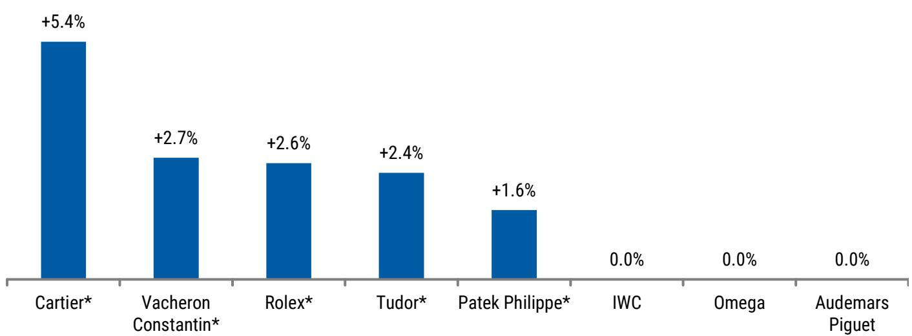  
Source: WatchCharts

Exhibit 18: Retail price changes for tracked brands in 2Q26 by country

<table><tr><td>Brand</td><td>Global Average</td><td>USD</td><td>EUR</td><td>GBP</td><td>HKD</td><td>JPY</td></tr><tr><td>Cartier*</td><td>+5.4%</td><td>+4.8%</td><td>+4.7%</td><td>+5.9%</td><td>+6.1%</td><td>+5.2%</td></tr><tr><td>Vacheron Constantin*</td><td>+2.7%</td><td>+1.9%</td><td>+1.8%</td><td>+2.0%</td><td>+2.2%</td><td>+5.8%</td></tr><tr><td>Rolex*</td><td>+2.6%</td><td>+2.6%</td><td>+2.6%</td><td>+2.6%</td><td>+2.6%</td><td>+2.6%</td></tr><tr><td>Tudor*</td><td>+2.4%</td><td>+3.1%</td><td>+2.0%</td><td>+2.0%</td><td>+1.9%</td><td>+3.0%</td></tr><tr><td>Patek Philippe*</td><td>+1.6%</td><td>0.0%</td><td>0.0%</td><td>0.0%</td><td>0.0%</td><td>+7.8%</td></tr><tr><td>IWC</td><td>0.0%</td><td>0.0%</td><td>0.0%</td><td>0.0%</td><td>0.0%</td><td>0.0%</td></tr><tr><td>Omega</td><td>0.0%</td><td>0.0%</td><td>0.0%</td><td>0.0%</td><td>0.0%</td><td>0.0%</td></tr><tr><td>Audemars Piguet</td><td>0.0%</td><td>0.0%</td><td>0.0%</td><td>0.0%</td><td>0.0%</td><td>0.0%</td></tr></table>

Source: WatchCharts

Exhibit 19: VR breakdown by country; global VR reflects a flat average of the five markets

<table><tr><td>Brand</td><td>Global VR</td><td>USD VR</td><td>GBP VR</td><td>EUR VR</td><td>JPY VR</td><td>HKD VR</td></tr><tr><td>Patek Philippe</td><td>+15.4%</td><td>+18.0%</td><td>+10.4%</td><td>+11.3%</td><td>+13.5%</td><td>+23.9%</td></tr><tr><td>Rolex</td><td>+9.8%</td><td>+14.0%</td><td>+2.8%</td><td>+3.1%</td><td>+20.9%</td><td>+8.2%</td></tr><tr><td>Audemars Piguet</td><td>+3.0%</td><td>-0.3%</td><td>-1.5%</td><td>+0.2%</td><td>+11.3%</td><td>+5.1%</td></tr><tr><td>Cartier</td><td>-27.4%</td><td>-27.1%</td><td>-28.8%</td><td>-27.7%</td><td>-29.2%</td><td>-24.2%</td></tr><tr><td>Omega</td><td>-32.3%</td><td>-32.2%</td><td>-35.1%</td><td>-35.1%</td><td>-29.1%</td><td>-30.2%</td></tr><tr><td>Tudor</td><td>-35.7%</td><td>-36.0%</td><td>-35.5%</td><td>-35.7%</td><td>-33.4%</td><td>-38.1%</td></tr><tr><td>Vacheron Constantin</td><td>-37.2%</td><td>-33.9%</td><td>-39.7%</td><td>-38.2%</td><td>-36.1%</td><td>-38.1%</td></tr><tr><td>IWC</td><td>-37.9%</td><td>-37.1%</td><td>-35.0%</td><td>-40.1%</td><td>-38.7%</td><td>-38.7%</td></tr></table>

Source: WatchCharts

Exhibit 20: Comparison of the number of in-production models trading above retail from Rolex, Patek Philippe, and Audemars Piguet as at June 29, 2026 and their value retention levels

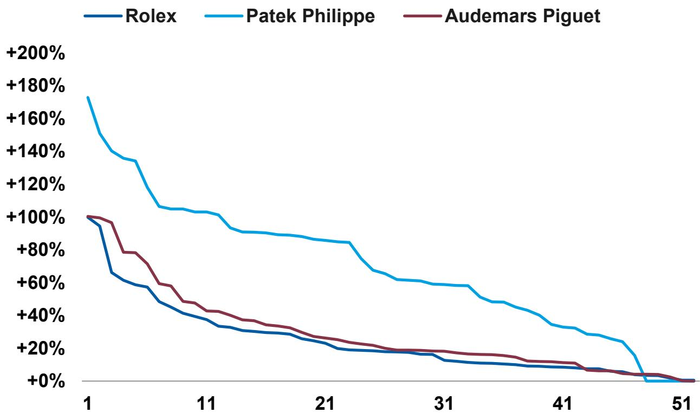  
Source: WatchCharts

## PATEK PHILIPPE

• Global VR: +15.4%

• VR range: +10.4% (GBP) to +23.9% (HKD)

• Retail price changes: JPY: +7.8%

In-production Patek Philippe models trade for an average of +15.4% above retail, compared to +12.5% in March 2026 (+2.9pp, +2.9pp LfL), based on our analysis of 126 models. Since our last report, Patek raised retail prices in Japan by +7.8% while leaving the other four tracked markets unchanged, for a global average retail price increase of +1.6%.

Market prices of in-production models rose by an average of +2.5% in 2Q26, led by the Nautilus (+5.0%) and Aquanaut (+3.6%) collections. VR dynamics
