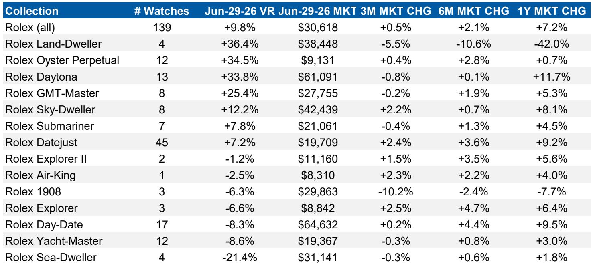
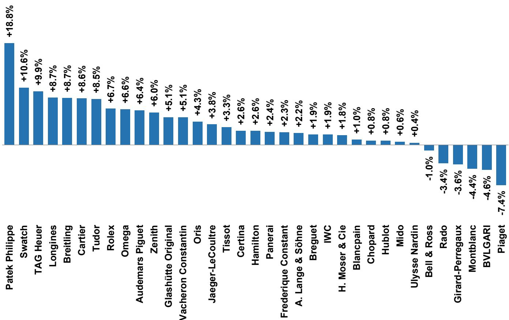
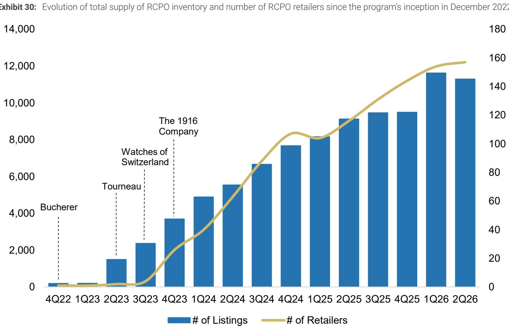

# 瑞士腕表二级市场在2026年第二季度持续走高

2026年第二季度，瑞士腕表二级市场延续了自2025年第三季度以来的修复趋势。最新跟踪数据显示，WatchCharts整体市场价格指数环比上涨1.5%，已是连续第四个季度涨幅超过1%。但这份报告真正值得关注的信号，并非涨幅本身，而是修复的结构正在变宽、变浅。

上涨的品牌数量从一季度的25个扩大到27个，覆盖了35个跟踪品牌中的绝大多数。然而，涨幅的驱动力高度集中在4月——WatchCharts整体指数当月上涨2.5%，创下2022年3月以来最佳单月表现。5月和6月则合计下跌1.0%。报告认为，这一波动与日内瓦“钟表与奇迹”展的预期炒作直接相关：经销商在展前大量上架新表，推高价格，随后需求消化导致价格回落。

> **观察评论：** 二级市场价格连续四个季度上涨，但5-6月的回落说明这轮修复仍依赖事件驱动，而非有机需求的持续改善。读者需要区分“展前囤货带来的价格脉冲”和“品牌真实吸引力提升”之间的差异。

## 1. 三大上市集团全部录得环比正增长，但LVMH的结构性短板暴露

二级市场价格表现与上市钟表集团的业绩高度相关。二季度，历峰集团、斯沃琪集团和LVMH旗下品牌均实现环比上涨。LVMH以1.7%的涨幅领跑，主要靠泰格豪雅（+3.8%）和真力时（+2.8%）拉动。但报告指出，LVMH缺乏一个在二级市场拥有稳定份额的“常青款”品牌——不像斯沃琪有欧米茄、历峰有卡地亚。这一结构性差异导致LVMH的长期二级市场表现明显落后于另外两家集团。

历峰集团整体上涨1.3%，卡地亚（+2.2%）仍是核心驱动，江诗丹顿（+1.4%）连续第三个季度复苏。报告结合历峰近期披露的季度数据估算，卡地亚腕表在固定汇率下同比增长超过20%，远高于瑞士腕表出口整体增速。斯沃琪集团上涨1.0%，欧米茄（+0.9%）贡献最大，但斯沃琪品牌本身以9.4%的季度涨幅成为集团内最大亮点。

## 2. 价值留存率持续改善，但“三巨头”与其余品牌之间出现断层

价值留存率（VR，即二级市场价格相对于零售价的溢价或折价）是衡量品牌吸引力的核心指标。报告跟踪的8个品牌中，有7个在二季度实现了VR的环比改善。但关键分界线依然清晰：百达翡丽（+15.4%）、劳力士和爱彼继续以高于零售价的价格交易，而所有其他品牌至少折价27%，最高折价达38%（万国表）。

这意味着，尽管二级市场整体回暖，但定价权仍然高度集中在“三巨头”手中。对于其他品牌，零售价上调的空间极为有限——即便需求改善，二级市场折价的存在也会抑制品牌提价的能力。报告特别指出，泰格豪雅和百年灵虽然涨幅领先，但热门在产型号的折价幅度高达40%-60%，这限制了它们将二级市场热度转化为零售定价权的可能性。

## 3. 劳力士CPO计划销售额创纪录，但库存消化仍是隐忧

劳力士的认证二手表（CPO）计划在二季度实现销售额1.86亿美元，环比增长28%，同比增长67%。上半年累计销售额已达3.3亿美元，约为2025年全年总额的三分之二。参与该计划的零售商从157家扩展，库存规模约1.13万只腕表，价值2.85亿美元。

但报告同时提醒，二级市场的供给水平在过去两个季度达到或接近历史高位，主要由3-4月的新增挂牌驱动。劳力士的库存尤其需要时间消化。5-6月的价格回落表明，需求并未同步跟上供给的扩张速度。这一供需错配可能在未来几个季度对价格形成不确定性，尤其是对劳力士这类依赖稀缺性维持溢价的品牌。

> **观察评论：** 劳力士CPO的快速增长是一把双刃剑。它扩大了品牌在二手市场的参与度和收入，但也可能稀释“一表难求”的稀缺感。读者需要关注CPO库存周转率的变化，这是判断品牌长期溢价的先行指标。

## 4. 一个可复用的观察框架：四个指标判断二级市场健康度

报告提出了评估二级市场健康度的四个指标：总供给（市场库存量）、吸收率（库存周转速度）、库存年龄（持有时间）和上市天数（销售速度）。二季度，这四项指标均受到“钟表与奇迹”展的显著扰动：展前供给激增、吸收率短暂上升、库存年龄和上市天数在5-6月重新出现变化。

对于关注腕表行业的研究者而言，这套框架可以用于持续追踪品牌真实需求的变化，而非仅看价格涨跌。当供给增长但吸收率同步提升时，说明需求是真实的；如果供给增长而吸收率下降，则价格修复可能不可持续。当前，劳力士和百达翡丽的吸收率仍处于健康区间，但中档品牌的吸收率已出现边际走弱迹象。

整体来看，二级市场在二季度延续了修复趋势，但修复的可持续性仍取决于两个变量：一是展前囤货的消化速度，二是中档品牌能否缩小与“三巨头”之间的价值留存差距。报告认为，在折价幅度收窄之前，大多数品牌的定价权仍将受限。

For informational purposes only. Portions may be generated,translated,summarized,or edited with AI assistance based on source materials and may contain omissions or errors. Please verify independently. This is not investment,legal,tax,accounting,or other professional advice.

