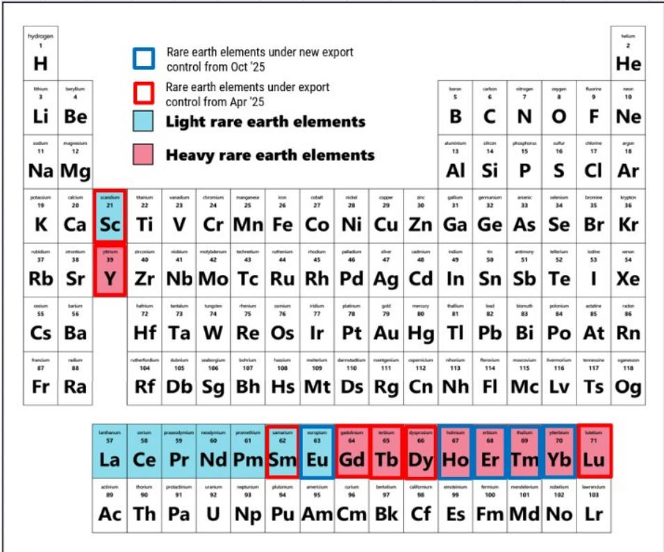
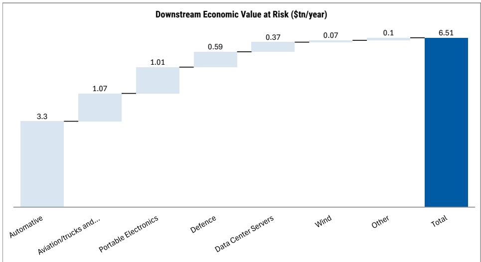
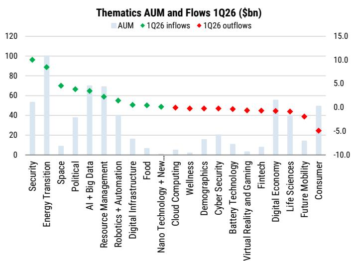
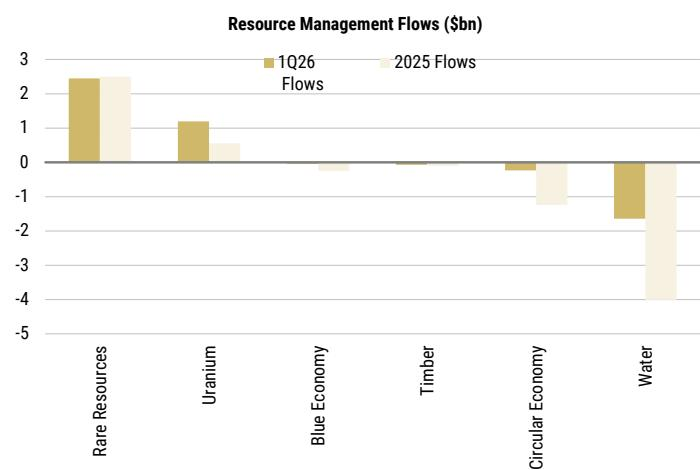
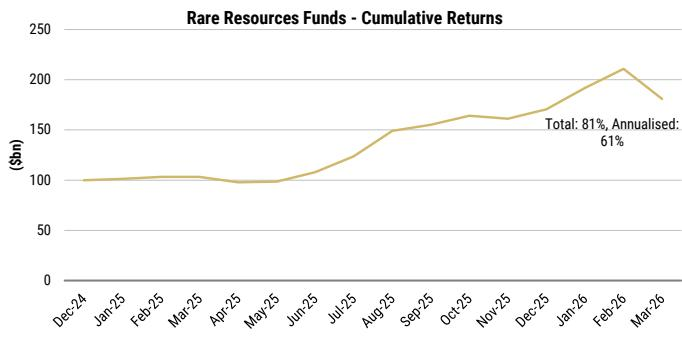
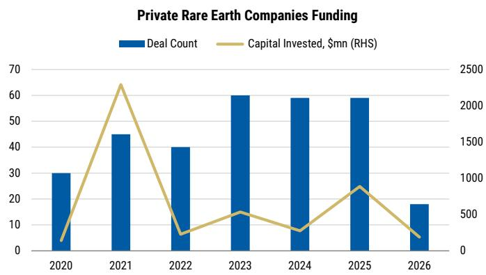
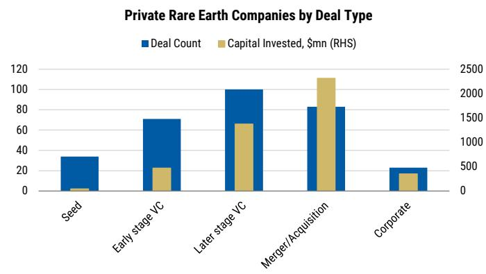
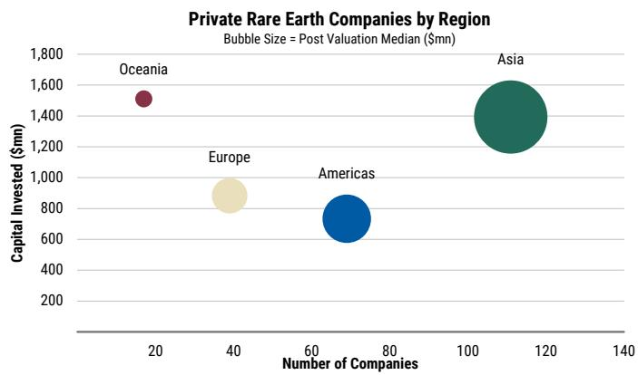
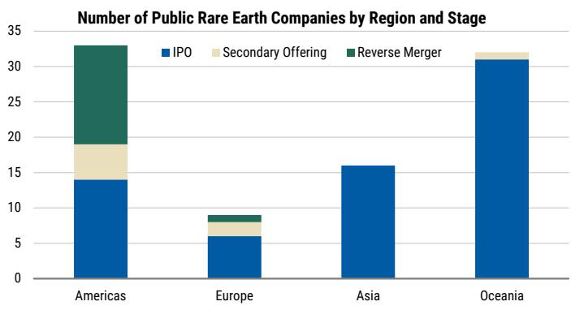
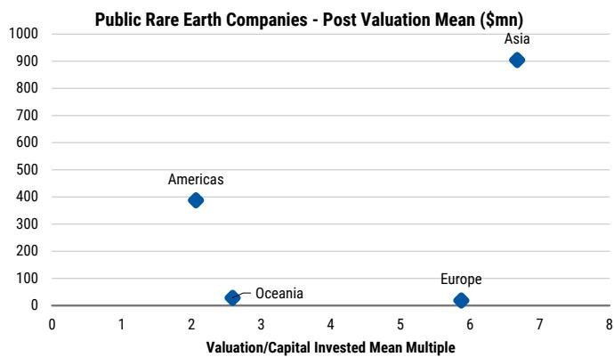

# Sustainability & Metals & Mining

# Rare Earths: Where Is The Money Flowing?

Rare Earths export controls are driving investor focus and inflows into the theme. We map public equity holdings and private capital flows. Public equity exposure is dominated by China and up/mid-stream, while late stage private pipeline seems more focused on downstream companies.

## Sustainability

Export controls are driving focus on Rare Earths. These materials are critical to defence, offshore wind, EVs, semis, and humanoids. China controls most of the value chain and has imposed several export restrictions, resulting in higher prices, up 90% in some cases. The IEA estimates rare earth controls could put $6.5tn of downstream production at risk, with Autos the most exposed.

Global policy is pushing towards a multi-year diversification strategy. G7 leaders have pledged to reduce dependence on any single rare-earth supplier to below 60% by 2030, while the IEA estimates $60bn of investment is needed over the next decade to meet ex-China rare-earth magnet demand.

This focus is already translating into higher thematic inflows. In 1Q26, Resource Management ($69bn in AUM) broke a two-year streak of outflows, recording $1.65bn of net inflows. This move was driven by the Rare Resources sub-theme, which largely consists of Rare Earths-focused funds, as it registered $2.5bn inflows. These funds have also performed strongly, with the average composite returning 61% annually since 2024.

China remains a core exposure but ex-China names are gaining traction. MS-covered Lynas Rare Earths, MP Materials and Iluka Resources appear among top holdings for Rare Earth funds. Whilst they are not as widely held as Chinese players, there has been an increase in exposure to these names since December 2024.

Private market pipeline is becoming more mature. Over half of the $4.5bn capital invested has gone into M&A, while over 30% of companies are in later-stage VC. Asia leads with 111 companies ($57mn median valuation), followed by the Americas (69, $25mn), while Australia has attracted the most capital ($1.5bn).

IPO activity is clustered within upstream, but late stage private pipeline is downstream-led. Australia and the Americas have produced the most public listings (30+), while Asia (6.7x) and Europe (5.9x) lead on value creation. Across all regions IPO activity has been focused on upstream exploration projects. Meanwhile, late-stage private companies are concentrated in magnet technology, recycling and substitutes, offering a more promising downstream pipeline.

## Why are Rare Earths in focus?

Rare Earths are critical for EVs, offshore wind, defence and robotics. Rare earths are a group of 17 elements (Exhibit 1) which are critical for a wide range of strategic technologies, including EV, offshore wind, defence, semiconductors and increasingly humanoid robotics. EVs are the most dominant use with NdFeB magnets enabling high-efficiency, high-power and compact motor designs. According to the IEA, each EV traction motor requires approximately 2-4 kg of these magnets (compared with only a few hundred grams in conventional cars). Direct-drive turbines for offshore wind can require up to 20kg of rare earths per MW (European Commission). For Defence, rare earth use can be as high as thousands of pounds for fighter jets and submarines (US DOD).

They have been the focus of multiple export restrictions since 2025. In 2024, China accounted for 60% of global mined production of magnet rare earths, 91% of refined output and 94% of sintered permanent magnet production (IEA). This concentration has become more important as rare earths have moved into the centre of trade policy. Last year, China imposed two waves of rare-earth export controls. The first wave (April 2025, see MOFCOM) introduced licensing requirements for seven rare earths (samarium, gadolinium, terbium, dysprosium, lutetium, scandium and yttrium) and related magnets, and is still in force. The second wave (October 2025, see IEA) extended controls to five more elements (holmium, erbium, thulium, europium and ytterbium), including technological know-how, although these additional measures are suspended until November 2026 (see EU Parliament). These export control measures have extraterritorial control i.e. they stipulate that non-China players using China-originated rare-earths in their manufacturing process will need approval from Chinese authorities. This year, dual-use controls have been used more broadly to place 20 Japanese, seven European and 10 US military-related companies on an exports control list.

The pressure on supply has contributed to higher prices and slowed downstream application. Since the April 2025 controls, Chinese export volumes of affected rare earths and magnets have fallen. Exports to Japan are down by 34% this year. For specific elements like dysprosium and terbium, used in EV motors, exports have fallen to zero. Exports to the US of yttrium, which is used in computer chips, are down by 70% from January 2025 levels (CSIS). Prices have also climbed in response – the price of dysprosium in Europe stood at $1,750 per kilogram as of mid-June, up about 90% from the end of last year. Whilst downstream producers are already exploring alternatives and substitutes, in many cases these materials provide very specific use cases which can be hard to substitute. The IEA has noted that automakers in the US and Europe struggled to source permanent magnets, and had to cut utilisation and temporarily shut down production in response. The IEA estimates that full-scale rare-earth export controls could put US$6.5tn of downstream production at risk outside China, with regions like the US and Europe and sectors such as Autos the most exposed.

Exhibit 1: Rare Earth Elements affected by Chinese Export Controls  
  
Source: MS

Exhibit 2: Full scale implementation of Rare Earth exports could put $6.5tn of ex-China demand at risk  
  
Source: IEA, MS.

As a result, we are seeing a global push to build a rare earth diversification strategy. At the recent G7 summit held in Évian, France, leaders published a joint statement outlining the aim to lower dependence on a single supplier of rare earths to below 60% by 2030. This is in line with EU's 2030 targets under its Critical Raw Materials act to limit third country single supplier dependence to 65% of EU consumption. We are also seeing significant efforts in Australia and the US to build rare-earths supply (see EU's Critical Raw Materials Security in a Multipolar World). The IEA estimates that meeting ex-China demand for magnet rare earths will require about US$60bn of investment over the next decade.

## How is this focus impacting investor sentiment?

In 1Q26, the Resource Management theme broke a two-year trend of outflows, attracting $1.65bn in net inflows. At $69bn in AUM, it is the third largest theme in our thematic database, behind Energy Transition ($100bn) and AI ($70bn). Net inflows were primarily driven by Rare Resources, the majority of which are Rare Earth-focused funds, accounting for 12% of the theme's AUM and attracting $2.45bn in net inflows over 1Q26.

3: Resource Management recorded inflows in 1Q26...  

Exhibit 4: ...driven by Rare-Earths focused funds.  
  
Source: Morningstar, MS.  
Source: Morningstar, MS.

Exhibit 5: Rare Resources Funds have performed strongly since Jan 2025  
  
Source: Morningstar, MS.

Since Jan 2025, Rare Resources funds have generated positive returns, with the average composite up 81% (61% annualized). Whilst the return profile was volatile at the start of the period, the theme recovered strongly, with trailing 12-month returns of 75% for the average composite.

©2026 Morningstar. All Rights Reserved. The information contained herein: (1) is proprietary to Morningstar and/or its content providers; (2) may not be copied or distributed; and (3) is not warranted to be accurate, complete or timely. Neither Morningstar nor its content providers are responsible for any damages or losses arising from any use of this information. Past performance is no guarantee of future results.

## What are Rare Earth focused thematic funds holding?

Exhibit 6 shows the top rare earth-related stock holdings across rare resources thematic funds. The holdings span the full chain, from REE mining and oxide production through separation, refining, alloys, magnet materials and end-use manufacturers. Since December 2024, exposure to many of these names has broadly increased.

China is a core exposure for rare-earth funds, given supply chain leadership. The top holdings are heavily comprised of Chinese companies, reflecting China's dominant position across rare earths industry. These names are also widely held across the fund universe.

But ex-Asia names are also gaining traction. Three ex-China MS covered companies - Lynas Rare Earths, MP Materials and Iluka Resources - also appear among the top holdings. Whilst these are not as widely held as some of the Chinese players, there has been an increase in exposure to these names since December 2024. The uptick in exposure suggests investors are increasingly looking for non-China beneficiaries as supply-chain diversification and reshoring become more important for raw materials security.

Exhibit 6: Top 15 REE exposed stocks

<table><tr><td>Company Name</td><td>Country</td><td>GICS Industry</td><td>REE Value Chain</td><td>Composite Weight %</td><td>Change since Dec '24</td><td>% No of Funds</td></tr><tr><td>CHINA NORTHERN RARE EARTH GRP ORD A</td><td>China</td><td>Metals & Mining</td><td>Integrated REE mining & oxides</td><td>10%</td><td>↑</td><td>77%</td></tr><tr><td>XIAMEN TUNGSTEN CO LTD ORD A</td><td>China</td><td>Metals & Mining</td><td>REE separation & magnet materials</td><td>6%</td><td>↑</td><td>77%</td></tr><tr><td>SHENGHE RESOURCES HOLDING ORD A</td><td>China</td><td>Metals & Mining</td><td>REE mining & processing</td><td>4%</td><td>↑</td><td>77%</td></tr><tr><td>GOLDWIND SCIENCE (XINJIANG) ORD A</td><td>China</td><td>Electrical Equipment</td><td>Magnet end-use (wind turbines)</td><td>3%</td><td>↑</td><td>31%</td></tr><tr><td>CHINA RARE EARTH (MINMETALS) ORD A</td><td>China</td><td>Metals & Mining</td><td>REE separation & oxides</td><td>3%</td><td>↓</td><td>62%</td></tr><tr><td>LYNAS RARE EARTHS (CORP) LTD ORD</td><td>Australia</td><td>Metals & Mining</td><td>REE mining & oxides</td><td>3%</td><td>↑</td><td>23%</td></tr><tr><td>GEM (SHENZHEN GREEN ECO) CO ORD A</td><td>China</td><td>Electrical Equipment</td><td>Recycling / battery materials</td><td>2%</td><td>→</td><td>31%</td></tr><tr><td>INNER MONGOLIA BAOTOU STEEL ORD A</td><td>China</td><td>Metals & Mining</td><td>REE resource exposure / steel</td><td>2%</td><td>→</td><td>31%</td></tr><tr><td>LINGYI ITECH (GUANGDONG) ORD A</td><td>China</td><td>Electronics</td><td>Magnetic components</td><td>2%</td><td>→</td><td>31%</td></tr><tr><td>WOLONG ELECTRIC GROUP ORD A</td><td>China</td><td>Electrical Equipment</td><td>Magnet end-use (motors)</td><td>2%</td><td>→</td><td>31%</td></tr><tr><td>MP MATERIALS CORP CL A</td><td>US</td><td>Metals & Mining</td><td>Integrated REE-to-magnets</td><td>2%</td><td>↑</td><td>15%</td></tr><tr><td>JL MAG RARE EARTH CO LTD ORD A</td><td>China</td><td>Electrical Equipment</td><td>Permanent magnet manufacturer</td><td>2%</td><td>→</td><td>62%</td></tr><tr><td>CHINA RARE EARTH NONFERROUS ORD A</td><td>China</td><td>Metals & Mining</td><td>REE oxides / alloys</td><td>1%</td><td>↑</td><td>62%</td></tr><tr><td>HENGDIAN GROUP DMEGC MAGNETICS ORD A</td><td>China</td><td>Electronics</td><td>Magnet materials / magnets</td><td>1%</td><td>↓</td><td>62%</td></tr><tr><td>ILUKA RESOURCES LTD ORD</td><td>Australia</td><td>Metals & Mining</td><td>REE mineral sands / refinery</td><td>1%</td><td>↑</td><td>15%</td></tr></table>

Source: Morningstar, Factset, MS.

## What does the private market landscape look like?

We use private market activity since 2020 to track where new rare earth supply, processing and technology capacity is forming.

Deal making has picked up but capital invested remains below peak levels. Deal activity has picked up since 2020, reaching a new high in the past three years, and remaining more or less steady at ~60 deals annually. On the other hand, capital invested remains significantly below 2021 peak levels ($2.3bn) but it picked up (3x Y/Y) in 2025, suggesting continued funding support for the theme,

Private pipeline is becoming more mature. Over 50% of the $4.5bn capital invested has gone into merger and acquisition activity, which suggests this is not just an early-stage VC theme anymore. It points to consolidation, asset ownership and strategic positioning across the rare earth value chain. At the same time, many companies (~100) are in later-stage VC rather than seed or early-stage funding, which suggests parts of the private pipeline are becoming more mature.

Exhibit 7: Deal making in Rare Earths has picked up but capital invested is below peak  
  
Source: Pitchbook, MS. Data covers period from 01/01/2020 to 31/03/2026.  
Exhibit 8: >50% of private capital has been invested in M&A; the majority of the companies are in Late Stage

  
Source: Pitchbook, MS. Data covers period from 01/01/2020 and 31/03/2026.

Asia also dominates the rare earth private company landscape. Asia, mainly China, has the largest number of companies in the dataset, with 111 names, and also the highest median post-money median valuation ($57mn). This reflects China's established position across the rare earth value chain. The Americas is the second-largest region with 69 companies and $25mn in post-money median valuation, making it the clearest emerging ex-China supply region.

Australia stands out for capital intensity. While Oceania, mainly Australia, has only 17 companies, it has attracted the largest amount of capital invested ($1.5bn). This likely reflects the nature of the opportunity. Rare earth mining, processing and refinery projects are capital-intensive, so a smaller number of companies can still absorb large amounts of funding.

The ex-China pipeline is still early-stage, but it is broadening. Asia has companies across all venture stages, but the Americas and Europe are taking a larger share ( $>50\%$ ) of seed, early-stage and M&A activity. This reflects the recent push to build rare earth supply chains outside China. The heightened M&A activity also suggests the market is starting to consolidate around assets, technology and processing capacity.

Exhibit 9: Asia also dominates the rare earth private company landscape  
  
Source: Pitchbook, MS. Data covers period from 01/01/2020 and 31/03/2026.  
Exhibit 10: The Americas and Europe have a larger share of seed, early-stage and M&A activity

  
Source: Pitchbook, MS. Data covers period from 01/01/2020 and 31/03/2026.

We drill into rare earth companies in later-stage VC as these are more mature private businesses. We narrow the screen to companies directly involved in the rare earth value chain - upstream, midstream and downstream - and exclude broader end-use application companies, which make up a large share of the late-stage universe.

The majority of the activity is in the downstream part of the value chain. Most of the later-stage companies are focused on magnet manufacturing technology, recycling and substitutes. This indicates that private market is building around key bottlenecks in the rare earth supply chain and where ex-China capacity has historically been limited.

Exhibit 11: Late Stage Private Companies across the REE value chain

<table><tr><td>Companies</td><td>Value Chain Role</td><td>Active Patent Documents</td><td>Total Raised ($mn)</td><td>Last Known Valuation ($mn)</td><td>Last Financing Deal Type</td><td>Year Founded</td><td>HQ Global Region</td><td>HQ Location</td></tr><tr><td>Niron Magnetics</td><td>Substitute</td><td>13</td><td>107</td><td>3000</td><td>Later Stage VC</td><td>2014 US</td><td></td><td>Minneapolis, MN</td></tr><tr><td>Earth AI</td><td>Mineral exploration</td><td>2</td><td>32</td><td>71</td><td>Later Stage VC</td><td>2017 US</td><td></td><td>Santa Monica, CA</td></tr><tr><td>AML</td><td>Magnet Manufacturing technology</td><td>50</td><td>11</td><td>46</td><td>Later Stage VC</td><td>1995 US</td><td></td><td>Melbourne, FL</td></tr><tr><td>C-Motive</td><td>Substitute</td><td>26</td><td>25</td><td>20</td><td>Later Stage VC</td><td>2012 US</td><td></td><td>Middleton, WI</td></tr><tr><td>Grant Lake</td><td>Mining/extraction</td><td></td><td>2</td><td>10</td><td>Later Stage VC</td><td>1946 US</td><td></td><td>Anchorage, AK</td></tr><tr><td>Carester</td><td>Mining and processing</td><td></td><td></td><td></td><td>PE Growth/ Expansion</td><td>2019 France</td><td></td><td>Lyon, France</td></tr><tr><td>MagREEsource</td><td>Magnet recycling</td><td>10</td><td>32</td><td>6</td><td>Later Stage VC</td><td>2020 France</td><td></td><td>France</td></tr><tr><td>Chenda New Material</td><td>NdFeB/flexible magnets</td><td></td><td></td><td></td><td>Later Stage VC</td><td>2014 China</td><td></td><td>Guangzhou, China</td></tr><tr><td>Magnet Lab</td><td>Magnet Manufacturing technology</td><td></td><td></td><td></td><td>Later Stage VC</td><td>2003 China</td><td></td><td>Shenzhen, China</td></tr><tr><td>Skyrock Rare Earth New Materials</td><td>Metals and magnetic materials</td><td></td><td></td><td></td><td>Later Stage VC</td><td>2006 China</td><td></td><td>Baotou, China</td></tr><tr><td>Tongchang Strong Magnet</td><td>Magnet manufacturing</td><td></td><td></td><td></td><td>Later Stage VC</td><td>2004 China</td><td></td><td>Ningbo, China</td></tr><tr><td>Zhuoqun Nanometer New Materials</td><td>Nanomaterial manufacturer</td><td></td><td></td><td></td><td>Later Stage VC</td><td>2003 China</td><td></td><td>Changzhou, China</td></tr><tr><td>Jinlong Rare Earth</td><td>Oxides, metals and magnets</td><td>42</td><td>191</td><td>543</td><td>Later Stage VC</td><td>2000 China</td><td></td><td>Longyan, China</td></tr><tr><td>Fortune Electronics</td><td>Magnet material</td><td></td><td>11</td><td>54</td><td>Later Stage VC</td><td>2011 China</td><td></td><td>Ganzhou, China</td></tr><tr><td>Cyclic Materials</td><td>Magnet recycling</td><td></td><td>158</td><td></td><td>Later Stage VC</td><td>2021 Canada</td><td></td><td>Toronto, Canada</td></tr></table>

Source: Pitchbook, MS. Data covers period from 01/01/2020 and 31/03/2026.

## Public Market Conversions

Oceania and the Americas have seen the most companies go public. We look at companies that have moved into public markets over the last six years to see where private activity has translated into listed equity opportunities. At over 30 companies, Oceania and the Americas have seen the most companies go public. The route to market differs by region: in the Americas, companies have used both IPOs and reverse mergers, while in Oceania, Asia and Europe, IPOs have been the main route.

Asia screens best on value creation, while the Americas has been more capital-heavy. We compare average post valuation with average capital invested as a simple capital-efficiency measure. Asian companies have the highest capital-efficiency multiple (6.7x), followed by Europe (5.9x), suggesting better value creation relative to capital invested. On the other hand, though the Americas has had a high number of public companies (33) and meaningful capital invested ($387mn), it has the lowest valuation-to-capital multiple (2.1x).

Exhibit 12: Over the past 6 years, the number of companies that have gone public has been highest in Oceania and the Americas.  
  
Source: Pitchbook, MS. Data covers period from 01/01/2020 and 31/03/2026.

Exhibit 13: Asian companies have the highest valuation and multiple, while American companies have the second highest valuation but the lowest multiple  
  
Source: Pitchbook, MS. Data covers period from 01/01/2020 and 31/03/2026.

Since most companies used the IPO route to go public, we focus on IPO names that are directly involved in the rare earths value chain, excluding broader end-use application companies. We also focus on ex-Asia supply, where the public market opportunity is most relevant for investors looking at supply-chain diversification.

The listed pipeline is still narrow, with most recent IPOs focused on exploration. Most rare earth IPO'd companies are upstream businesses, especially exploration companies. This is particularly true in Europe and the Americas, where all the IPO names in the dataset are focused on exploration. Oceania has a broader mix, with some companies exposed to midstream processing and downstream recycling as well. No magnet manufacturers have gone public, which highlights a gap in the listed market.

Exhibit 14: Companies in Europe and Americas that IPO'd in the last six years across the Rare-Earths Value Chain

<table><tr><td>ISIN</td><td>Companies</td><td>Value Chain Role</td><td>Region</td><td>IPO Date</td><td>Share price</td><td>Curr.</td><td>Market Cap (USDmn)</td></tr><tr><td>GB00BN92HZ16</td><td>East Star Resources</td><td>Exploration</td><td>Europe</td><td>04/05/2021</td><td>0.046</td><td>GBP</td><td>34</td></tr><tr><td>GB00BPJGTF16</td><td>First Class Metals</td><td>Exploration/development</td><td>Europe</td><td>29/07/2022</td><td>0.0325</td><td>GBP</td><td>18</td></tr><tr><td>NO0010907744</td><td>Green Minerals</td><td>Deep sea mining</td><td>Europe</td><td>23/03/2021</td><td>1.235</td><td>NOK</td><td>3</td></tr><tr><td>CA00461M1032</td><td>Aclara Resources</td><td>Exploration/development</td><td>Americas</td><td>10/12/2021</td><td>3.84</td><td>CAD</td><td>655</td></tr><tr><td>CA03753D1042</td><td>Apex Critical Metals</td><td>Exploration</td><td>Americas</td><td>15/03/2023</td><td>1.56</td><td>CAD</td><td>106</td></tr><tr><td>CA87357T3001</td><td>Tactical Resources</td><td>Exploration/development</td><td>Americas</td><td>14/03/2022</td><td>7.4</td><td>CAD</td><td>46</td></tr><tr><td>CA59100N1042</td><td>Meta Critical Minerals</td><td>Exploration</td><td>Americas</td><td>08/09/2022</td><td>0.165</td><td>CAD</td><td>15</td></tr><tr><td>CA91839J1049</td><td>V Ten Metals</td><td>Exploration</td><td>Americas</td><td>27/09/2023</td><td>0.57</td><td>CAD</td><td>10</td></tr><tr><td>CA45829L1076</td><td>Integral Metals</td><td>Exploration</td><td>Americas</td><td>31/10/2024</td><td>0.31</td><td>CAD</td><td>10</td></tr><tr><td>CA5609251098</td><td>Makenita Resources</td><td>Exploration</td><td>Americas</td><td>30/12/2024</td><td>0.16</td><td>CAD</td><td>4</td></tr><tr><td>CA92281A1049</td><td>Ventra Metals</td><td>Exploration</td><td>Americas</td><td>24/03/2026</td><td>0.22</td><td>CAD</td><td>2</td></tr><tr><td>CA0529421095</td><td>Automata Rare Earth Corp.</td><td>Exploration</td><td>Americas</td><td>17/02/2022</td><td>0.38</td><td>CAD</td><td>1</td></tr><tr><td>CA2372343079</td><td>Dark Star Minerals</td><td>Exploration</td><td>Americas</td><td>06/02/2023</td><td>0.115</td><td>CAD</td><td>1</td></tr></table>

Source: Pitchbook, MS. Data covers period from 01/01/2020 and 31/03/2026.

Exhibit 15: Companies in Oceania that IPO'd in the last six years across the Rare-Earths Value Chain

<table><tr><td>ISIN</td><td>Companies</td><td>Value Chain Role</td><td>IPO Date</td><td>Share Price</td><td>Curr.</td><td>Market Cap (USDmn)</td></tr><tr><td>AU0000305815</td><td>Brazilian Rare Earths</td><td>Exploration</td><td>21/12/2023</td><td>4.35</td><td>AUD</td><td>845</td></tr><tr><td>AU0000190829</td><td>Viridis Mining & Minerals</td><td>Exploration/processing</td><td>24/01/2022</td><td>3.8</td><td>AUD</td><td>343</td></tr><tr><td>AU0000343253</td><td>Andean Silver</td><td>Exploration/development</td><td>30/09/2021</td><td>2.14</td><td>AUD</td><td>316</td></tr><tr><td>AU0000155228</td><td>Metallium</td><td>Recycling</td><td>13/07/2021</td><td>0.44</td><td>AUD</td><td>225</td></tr><tr><td>AU0000210734</td><td>Osmond Resources</td><td>Development</td><td>14/04/2022</td><td>0.67</td><td>AUD</td><td>64</td></tr><tr><td>AU0000253189</td><td>VHM</td><td>Exploration/development</td><td>09/01/2023</td><td>0.275</td><td>AUD</td><td>59</td></tr><tr><td>AU0000222143</td><td>OD6 Metals</td><td>Exploration</td><td>22/06/2022</td><td>0.14</td><td>AUD</td><td>28</td></tr><tr><td>AU0000278095</td><td>Ittani Resources</td><td>Exploration/development</td><td>20/06/2023</td><td>0.43</td><td>AUD</td><td>24</td></tr><tr><td>AU0000245763</td><td>Desoto Resources</td><td>Exploration</td><td>16/12/2022</td><td>0.115</td><td>AUD</td><td>22</td></tr><tr><td>AU0000154684</td><td>Australian Rare Earths</td><td>Exploration/development</td><td>01/07/2021</td><td>0.11</td><td>AUD</td><td>20</td></tr><tr><td>AU0000172025</td><td>Dalaroo Metals</td><td>Exploration/development</td><td>28/09/2021</td><td>0.078</td><td>AUD</td><td>19</td></tr><tr><td>AU0000128357</td><td>OzAurum Resources</td><td>Exploration</td><td>08/02/2021</td><td>0.088</td><td>AUD</td><td>18</td></tr><tr><td>AU0000154015</td><td>Locksley Resources</td><td>Exploration/development</td><td>08/07/2021</td><td>0.064</td><td>AUD</td><td>17</td></tr><tr><td>AU0000119810</td><td>BPM Minerals</td><td>Exploration/development</td><td>30/12/2020</td><td>0.175</td><td>AUD</td><td>16</td></tr><tr><td>AU0000284960</td><td>Great Divide Mining</td><td>Exploration/development</td><td>25/08/2023</td><td>0.325</td><td>AUD</td><td>15</td></tr><tr><td>AU0000446015</td><td>Barkly Rare Earths</td><td>Exploration/development</td><td>30/01/2026</td><td>0.205</td><td>AUD</td><td>12</td></tr><tr><td>AU0000430498</td><td>Moonlight Resources</td><td>Exploration</td><td>11/12/2025</td><td>0.17</td><td>AUD</td><td>11</td></tr><tr><td>AU0000321333</td><td>Litchfield Minerals</td><td>Exploration</td><td>13/03/2024</td><td>0.22</td><td>AUD</td><td>10</td></tr><tr><td>AU0000105025</td><td>Megado Minerals</td><td>Exploration</td><td>27/10/2020</td><td>0.016</td><td>AUD</td><td>8</td></tr><tr><td>AU0000336018</td><td>Axel Ree</td><td>Exploration/development</td
