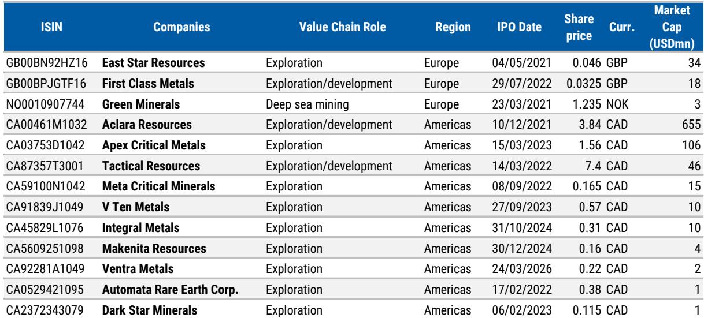
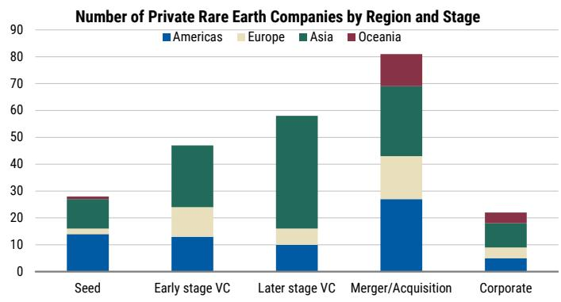

# The Rare Earth Supply Chain Is No Longer a China-Only Bet:Capital Is Rotating Toward Ex-China Assets,but the Real Bottleneck Lies Downstream

The rare earths market has reached an inflection point that goes far beyond commodity price spikes. Since April 2025,Chinese export controls have pushed the price of dysprosium in Europe to approximately $1,750 per kilogram,a 90% increase from year-end 2025 levels. Exports of critical magnet elements like dysprosium and terbium to Japan have fallen to zero. The International Energy Agency estimates that full-scale controls on rare earth exports could place $6.5 trillion of downstream production outside China at risk,with the automotive sector as the most exposed. This is not a supply disruption story. It is a structural reallocation of capital along a value chain that has been dominated by a single country for decades.

The market response has been decisive. In the first quarter of 2026,the Resource Management theme,with $69 billion in assets under management,broke a two-year streak of outflows by attracting $1.65 billion in net inflows. The Rare Resources sub-theme,composed largely of rare earth-focused funds,alone drew $2.45 billion. The average composite return for these funds has been 61% annualized since 2024. But the most telling signal is not the aggregate inflow number. It is where that capital is going. Public equity holdings remain anchored to Chinese integrated producers,yet exposure to ex-China names such as Lynas Rare Earths,MP Materials,and Iluka Resources has increased since December 2024. Meanwhile,the private market reveals a more nuanced picture:over $4.5 billion has been invested since 2020,with more than half going into mergers and acquisitions,and the late-stage private pipeline is concentrated not in mining but in downstream magnet technology,recycling,and substitutes.

The strategic question for investors is no longer whether rare earths matter. It is where along the value chain the next wave of value creation will emerge,and which assets will command scarcity premiums as diversification accelerates.

## Export Controls Have Transformed Rare Earths from a Niche Input into a Geopolitical Bottleneck That Threatens Trillions in Downstream Output

The scale of the exposure is what elevates rare earths beyond a typical commodity cycle. The IEA's $6.5 trillion risk estimate is not a projection of lost mining revenue. It represents the value of downstream manufacturing that depends on rare earth permanent magnets:electric vehicle traction motors,direct-drive offshore wind turbines,defense systems including fighter jets and submarines,semiconductor fabrication equipment,and humanoid robotics. Each EV motor requires 2 to 4 kilograms of neodymium-iron-boron magnets,compared with a few hundred grams in conventional cars. Direct-drive offshore wind turbines can require up to 20 kilograms of rare earths per megawatt.

China controls 60% of global mined production of magnet rare earths,91% of refined output,and 94% of sintered permanent magnet production. The export controls imposed in April 2025 introduced licensing requirements for seven elements and related magnets. The October 2025 wave extended controls to five more elements and included technological know-how,with extraterritorial provisions that require non-Chinese manufacturers using China-originated rare earths to obtain approval from Chinese authorities. These measures are not theoretical. Exports of yttrium,used in computer chips,to the United States are down 70% from January 2025 levels. The IEA has documented that automakers in the US and Europe have already been forced to cut utilization and temporarily shut down production due to difficulty sourcing permanent magnets.

The price signal confirms the severity. Dysprosium at $1,750 per kilogram is not a speculative spike. It reflects a market where supply has been physically constrained by regulatory fiat,not by geology. The implication is clear:any investor with exposure to downstream manufacturing,particularly in autos,defense,or renewable energy,now has a direct interest in rare earth supply chain security. The material has moved from a cost line item to a strategic risk factor.

## Public Equity Investors Are Still 报告观点China,but the Shift toward Ex-China Holdings Has Begun and Is Accelerating

The top holdings of rare earth-focused thematic funds remain dominated by Chinese companies. China Northern Rare Earth Group commands a 10% composite weight and is held by 77% of funds. Xiamen Tungsten and Shenghe Resources follow at 6% and 4% respectively. This concentration reflects the reality that China controls the integrated value chain from mining through oxide production to magnet manufacturing. No other country currently offers comparable scale or vertical integration.

Yet the direction of change matters more than the starting point. Since December 2024,exposure to Lynas Rare Earths,MP Materials,and Iluka Resources has increased. Lynas,with a 3% composite weight and held by 23% of funds,is the largest ex-China holding. MP Materials,at 2%,is held by 15% of funds. These are not yet dominant positions,but the trend is unambiguous. Investors are beginning to price in the diversification imperative that G7 leaders formalized at the Évian summit,where they pledged to reduce dependence on any single rare earth supplier to below 60% by 2030. The EU's Critical Raw Materials Act sets a similar target of 65%.

The performance data supports the rotation. Rare Resources funds have generated an average composite return of 81% since January 2025,or 61% annualized. The volatility in early 2025 gave way to a sustained recovery,with trailing twelve-month returns of 75%. This performance has likely reinforced the inflow momentum,creating a self-reinforcing cycle:as fund returns attract capital,fund managers face pressure to maintain exposure to the names that drove those returns. The question is whether the current portfolio composition,still heavily weighted toward China,can sustain that performance if export controls tighten further or if geopolitical tensions escalate.

## The Private Market Pipeline Is Maturing,and the Capital Is Flowing Where Public Markets Are Not

The private market data reveals a structural shift that public equity holdings obscure. Since 2020,deal activity in rare earths has remained steady at approximately 60 transactions annually,but capital invested rose threefold year-on-year in 2025,reaching levels that,while below the 2021 peak of $2.3 billion,signal sustained institutional commitment. Critically,over 50% of the $4.5 billion in total capital invested has gone into mergers and acquisitions rather than early-stage venture capital. This is not a sector of experimental startups. It is a sector undergoing consolidation and strategic positioning.

The regional breakdown is instructive. Asia,led by China,has the largest number of private companies at 111,with a median post-money valuation of $57 million. The Americas follow with 69 companies and a $25 million median valuation. Australia,with only 17 companies,has attracted the most capital at $1.5 billion,reflecting the capital-intensive nature of rare earth mining,processing,and refinery projects. A small number of Australian companies can absorb large amounts of funding because building a rare earth mine and processing facility requires billions in capital expenditure,not millions.

The most important insight from the private market is the value chain distribution of late-stage companies. When the analysis is narrowed to companies directly involved in the rare earth value chain,excluding broad end-use applications,the majority of late-stage private companies are focused on downstream activities:magnet manufacturing technology,recycling,and substitutes. This is the opposite of the public market,where IPO activity has been concentrated in upstream exploration. The private pipeline is building around the bottlenecks that public markets have not yet addressed:the conversion of rare earth oxides into finished magnets,the recovery of materials from end-of-life products,and the development of chemistries that reduce or eliminate reliance on critical elements.

## The Downstream Bottleneck Is the Most Underappreciated Investment Opportunity in the Rare Earth Value Chain

The asymmetry between public and private market positioning creates a clear strategic implication. Public equity investors have access to upstream and midstream players. They can 报告观点Lynas for mining and processing,MP Materials for integrated production,or Chinese giants for the full chain. But the downstream segment,where the value is concentrated and where ex-China capacity is most limited,remains largely private.

Consider the data. Late-stage private companies in the downstream segment include firms focused on magnet manufacturing,recycling,and substitutes. These companies 报告观点active patent portfolios,have raised significant capital,and in some cases carry valuations in the hundreds of millions or billions of dollars. They represent the emerging ex-China capacity for the most critical step in the value chain:turning rare earth elements into the finished magnets that power EVs,wind turbines,and defense systems. The IEA has estimated that meeting ex-China demand for magnet rare earths will require approximately $60 billion in investment over the next decade. That $60 billion will not go primarily to mining. It will go to processing,separation,and magnet manufacturing.

For investors,the decision framework should be organized around three questions. First,does the investment target have exposure to the downstream bottleneck,either through direct magnet production,recycling technology,or substitution chemistry? Second,does the asset have a clear path to commercialization within the next three to five years,when policy mandates and supply constraints are likely to intensify? Third,is the valuation already pricing in the diversification premium,or does it still reflect the pre-control status quo? Companies that can demonstrate proprietary technology,established offtake agreements,and a credible timeline to production are likely to command scarcity premiums that are not yet reflected in current valuations.

## The Diversification Timeline Creates a Window of Opportunity That Will Not Remain Open Indefinitely

The G7 commitment to reduce single-supplier dependence to below 60% by 2030,combined with the EU's 65% target under the Critical Raw Materials Act,establishes a clear regulatory timeline. The IEA's $60 billion investment estimate provides a rough order of magnitude for the capital required. But the gap between ambition and execution remains wide. Building a rare earth mine takes five to ten years. Building a separation and processing facility takes three to five years. Building a magnet manufacturing plant takes two to four years. The clock is running.

The export controls imposed in 2025,including the suspended measures that could be reinstated in November 2026,add urgency. The extraterritorial provisions mean that even non-Chinese manufacturers using Chinese-originated materials face regulatory risk. The IEA has already documented production shutdowns in the US and European auto sectors. As downstream producers become more aware of their exposure,demand for secure,non-Chinese supply will accelerate. The companies that can deliver that supply,whether through mining,processing,or recycling,will capture the scarcity premium.

The risk is that investors treat rare earths as a cyclical commodity play and miss the structural transformation. This is not about predicting the next price spike in dysprosium or neodymium. It is about recognizing that a critical input for multiple trillion-dollar industries is undergoing a forced diversification that will reshape the value chain over the next decade. The capital is flowing. The policy direction is clear. The bottlenecks are identifiable. The question is whether investors have positioned themselves to capture the value creation that will occur not in the upstream,where most public market exposure sits,but in the downstream,where the private market is already building the future.

*For informational purposes only. Portions may be generated,translated,summarized,or edited with AI assistance based on source materials and may contain omissions or errors. Please verify independently. This is not investment,legal,tax,accounting,or other professional advice.*

For informational purposes only. Portions may be generated,translated,summarized,or edited with AI assistance based on source materials and may contain omissions or errors. Please verify independently. This is not investment,legal,tax,accounting,or other professional advice.
