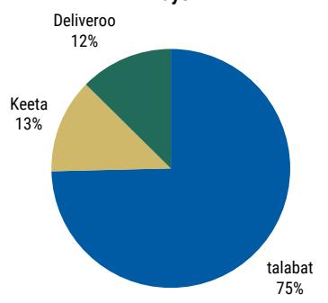
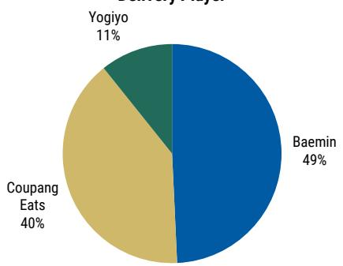
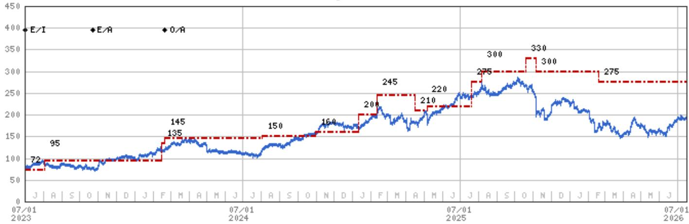
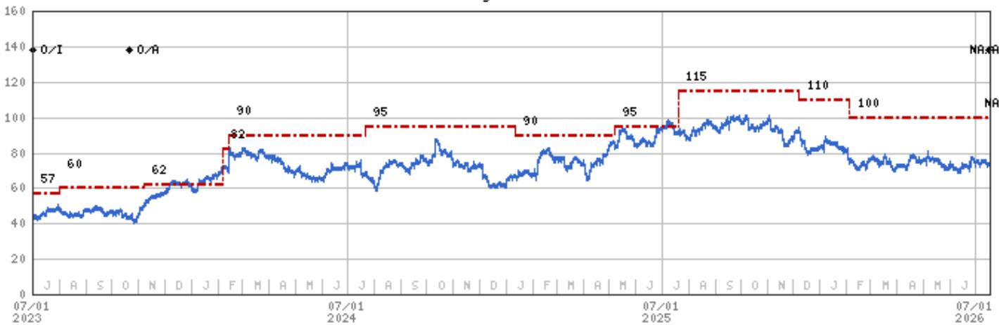

July 16, 2026 09:43 PM GMT

Uber Technologies Inc | North America

# Delivering a Cross Platform 'Hero'

We analyze UBER's potential acquisition of DHER, the cross sell opportunity to reach 60% of UBER's global footprint, which markets are most important to monitor (Middle East, Korea and Argentina), key execution risks and read-throughs to DASH.

What Happened? Uber announced an acquisition offer for DHER (covered by Luke Holbrook) of €41.50/share in cash; equivalent to \$14.8bn for 100% of the company, or \$13.7bn adjusted for Uber's prior stake purchases (source of funds include existing cash and new debt financing). UBER is acquiring 50 of DHER's 64 markets, which represents \~\$4.2bn of '25 gross bookings (see Exhibit 1). Per UBER, the \$14.8bn deal size implies \~8X UBER's '27 Pro-forma Adj. EBITDA estimates (\~\$1.9bn), which is inclusive of \$1.2bn of run-rate synergies and adjusted for UBER's US GAAP reporting standards (vs IFRS). UBER estimates the transaction will be accretive to non-GAAP EPS immediately upon close and \~HSD% accretive to non-GAAP EPS in 3 years (which implies \~\$0.75 to our current \$9 of '30 non-GAAP EPS). The transaction is expected to close in the second half of 2027.

\(1.2bn(+) of Synergies (\~65% of Pro-Forma '27e DHER EBITDA)...with Headcount the Largest Driver: Uber expects \(1.2bn total synergies associated with the potential deal, with headcount the largest driver of savings (DHER has more total headcount than Uber excluding Freight). DHER is currently run on a localized basis (with local teams) and Uber expects to migrate the 7 acquired brands over to the Uber platform on a rolling basis starting late '27 and into '28. We believe the migration to Uber's platform will lead to headcount and tech stack savings that build over time. Notably, Revenue synergies driven by cross platform users represent a very small portion of the underwritten \(1.2bn run-rate synergies. These scaling marketplace efficiencies would represent upside.

Cross-Platform Offering Strengthens...With \~60% of Uber's Markets Potentially Offering Leading Rides and Delivery Post Deal: We believe Uber's opportunity to leverage DHER's leading food delivery position in certain markets with its own leading rideshare business to drive cross platform users and increase volume and loyalty/repeat behavior is material. Uber has both mobility and delivery offerings in 34 of its markets today (\~40%)...and following this potential transaction will grow to 58, or \~60%. Uber has executed this cross sell effectively across many markets in the past...and for perspective, on average 20% of Uber users globally are cross platform (28% in their top market)...with cross platform users spending an average of 3X more than single platform.

Of the 50 Markets Acquired, Middle East, South Korea and Argentina Among Largest Potential Areas for Improved Performance: We believe talabat (based in the Middle East) and Baemin (based in South Korea) are two of the most significant assets Uber is attempting to acquire. These two assets make up an estimated \~

<table><tr><td colspan="2">MS &amp; CO. LLC</td></tr><tr><td colspan="2">Brian Nowak, CFA</td></tr><tr><td colspan="2">Equity Analyst</td></tr><tr><td>Brian.Nowak@morganstanley.com</td><td>+1 212 761-3365</td></tr><tr><td colspan="2">Julian Herrera</td></tr><tr><td colspan="2">Research Associate</td></tr><tr><td>Julian.Herrera@morganstanley.com</td><td>+1 212 761-1784</td></tr><tr><td colspan="2">Kavya A Narayanan</td></tr><tr><td colspan="2">Research Associate</td></tr><tr><td>Kavya.Narayanan@morganstanley.com</td><td>+1 212 761-4183</td></tr><tr><td colspan="2">Gregory Gao</td></tr><tr><td colspan="2">Research Associate</td></tr><tr><td>Greg.Gao@morganstanley.com</td><td>+1 212 296-3125</td></tr><tr><td colspan="2">Nikhil Javeri</td></tr><tr><td colspan="2">Research Associate</td></tr><tr><td>Nikhil.Javeri1@morganstanley.com</td><td>+1 212 761-3742</td></tr></table>

## Uber Technologies Inc (UBER.N, UBER UN)

<table><tr><td colspan="2">Internet | United States of America</td></tr><tr><td>Stock Rating</td><td>++</td></tr><tr><td>Industry View</td><td>Attractive</td></tr><tr><td>Price target</td><td>++</td></tr><tr><td>Shr price, close (Jul 15, 2026)</td><td>$72.67</td></tr><tr><td>Mkt cap, curr (mm)</td><td>$152,090</td></tr><tr><td>52-Week Range</td><td>$101.98-67.21</td></tr></table>

For analyst certification and other important disclosures, refer to the Disclosure Section, located at the end of this report.

\$900mn in EBITDA, nearly 100% of consolidated '25 DHER Adj. EBITDA and \~80% of DHER '25 Adj. EBITDA attributable to the markets UBER is acquiring. The cross sell opportunity is substantial in these markets (with Uber previously not having a significant rides business in Korea or delivery business in the Middle East), but we believe execution will be key. In our view Korea could be more challenging given current private company market leadership in the ride share industry. Latin America is another market where the cross-sell opportunity could be substantial in our view, particularly in Argentina. We estimate Argentina is \~LSD% of UBER Mobility bookings, but note DHER's Argentina business is larger (DHER's Latin America business, of which Argentina is its biggest market, contributed \~8% of GMV in '25). The size of Argentina (\~47mn people) combined with a leading cross platform make this a significant business opportunity.

## Next Key Factors and Execution Points:

\- Multi-staged, Brand-by-Brand Tech Migration: As mentioned, a material portion of the underwritten synergies are expected to come from UBER migrating the DHER brands onto the Uber tech platform. While not a multi-year re-platforming (which we have seen carry material execution risk because of rebuilding needs), the plan is to migrate the 7 acquired DHER brands one by one. There is still risk associated with this (data loss, downtime) and migration will be the gating factor for fixed cost efficiencies at each of the brands.

\- Local Competition: Food delivery is competitive globally, but we see local competition in the UAE + Korea as most notable given talabat/Baemin strategic and financial importance to the remain co. In UAE, while talabat is the #1 player, Meituan (covered by Gary Yu), via its Keeta brand, is a challenger (entered in 2024) investing aggressively to take share in the region and Deliveroo operates in the UAE, and is improving its operations after being acquired by DASH (food delivery leader). In Korea, while Baemin is the #1 player, Coupang (covered by Seyon Park, with its core business in e-comm) is a formidable competitor via its Coupang Eats food-delivery arm (see Exhibit 2 and Exhibit 3).

\- Capital Allocation: While UBER said that its capital allocation philosophy remains unchanged in the medium to long-term, the company said that in the very near term it prioritized the DHER transaction over share buybacks in 2Q. As such, it may take \~1-2 quarters to revert to its \~\$1.5bn quarterly buyback cadence.

2 DASH Readthroughs: 1) We see overlap between UBER and DASH in the UAE (talabat vs. Deliveroo). While talabat is the #1 player in the region (see here), we believe the transition/integration creates a window of opportunity for DASH/ROO to take share. That said a more comprehensive multi-product offering from Uber will lead to higher competition for DASH. 2) Note too, DASH (via Wolt) has overlap with some DHER markets (Nordics, mix of Southern, Central and Eastern European countries) being acquired by private equity in a separate agreement announced today. UBER also noted that these markets (in aggregate) are loss making. These

subscale assets being acquired by a financial sponsor could create an opportunity for DASH to take share or look to gain scale through further acquisition.

Exhibit 1: UBER is acquiring 50 of DHER's markets which represented \~\$42bn in Gross Bookings and \~\$1.1bn in Adj. EBITDA in '25

<table><tr><td>Businesses being acquired by Uber 50 markets generating $42B of Gross Bookings2 in 2025</td><td>Businesses being acquired by SSW Partners 14 markets generating $11B of Gross Bookings in 2025</td></tr><tr><td>Baedal Minjok (Republic of Korea); foodora (Hungary); foodpanda (Bangladesh, Cambodia, Hong Kong, Laos, Malaysia, Myanmar, Pakistan, Philippines, Singapore); Glovo (Armenia, Bosnia and Herzegovina, Bulgaria, Cote d’Ivoire, Croatia, Georgia, Italy, Kazakhstan, Kenya, Kyrgyzstan, Montenegro, Morocco, Nigeria, Serbia, Tunisia, Uganda, Ukraine); Hungerstation (Saudi Arabia); PedidosYa (Argentina, Bolivia, Costa Rica, Dominican Republic, El Salvador, Guatemala, Honduras, Nicaragua, Panama, Paraguay, Peru, Uruguay, Venezuela); talabat (Bahrain, Egypt, Iraq, Jordan, Kuwait, Oman, Qatar, United Arab Emirates)</td><td>foodora (Austria, Czechia, Norway, Sweden); efood (Greece); Foody (Cyprus); Glovo (Moldova, Poland, Portugal, Romania, Spain); PedidosYa (Chile, Ecuador); Yemeksepeti (Türkiye)</td></tr></table>

Source: Company data, MS  
UAE Share of MAUs by Food Delivery Player

Exhibit 2: DHER's talabat has \~75% market share in the UAE among pure-play delivery players

Exhibit 3: DHER's Baemin has \~50% market share in South Korea among pure-play delivery players  
  
South Korea Share of MAUs by Food Delivery Player

  
Source: Sensor Tower, Company Data, MS  
Source: Sensor Tower, Company Data, MS

MS & Co. LLC (“MS”) is acting as financial advisor to Uber Technologies, Inc. (“Uber”) in connection with the proposed takeover offer for Delivery Hero SE (“Delivery Hero”), as announced on July 16, 2026. The takeover offer is subject to a minimum acceptance threshold of 50% plus one share of Delivery Hero’s outstanding share capital (inclusive of shares owned by Uber) and certain further conditions, including receipt of certain merger control and financial regulatory clearances. This report and the information provided herein is not intended to (i)

provide advice with respect to the tender offer, (ii) serve as an endorsement of the tender offer, or (iii) result in the procurement, withholding or revocation of a tender in the exchange or any other action by a security holder. Uber has agreed to pay fees to MS for its services. Please refer to the notes at the end of the report.

## Valuation Methodology and Risks

## DoorDash Inc (DASH.O)

We apply a 25X EV/EBITDA multiple to our '27 DASH Adj. EBITDA of \$4.8bn. On a growth adj. basis, our \$275 PT implies paying a 0.8x growth adj. EBITDA multiple, a premium to peers but discount to ABNB/BKNG, among the best executors of the group.

## Risks to Upside

■ Faster GOV Growth

■ International/New Vertical Profitability

■ Advertising Opportunity

## Risks to Downside

■ Macro/Consumer Weakness

■ Share Loss in Core US Restaurant Market

■ Limited Share Gains in Intl Markets

## Disclosure Section

The information and opinions in MS were prepared by MS & Co. LLC, and/or MS C.T.V.M. S.A., and/or MS Mexico, Casa de Bolsa, S.A. de C.V., and/or MS Canada Limited. As used in this disclosure section, "MS" includes MS & Co. LLC, MS C.T.V.M. S.A., MS Mexico, Casa de Bolsa, S.A. de C.V., MS Canada Limited and their affiliates as necessary.

For important disclosures, stock price charts and equity rating histories regarding companies that are the subject of this report, please see the MS Disclosure Website at www.morganstanley.com/eqr/disclosures/webapp/generalresearch, or contact your investment representative or MS at 1585 Broadway, (Attention: Research Management), New York, NY, 10036 USA.

For valuation methodology and risks associated with any recommendation, rating or price target referenced in this research report, please contact the Client Support Team as follows: US/Canada +1 800 303-2495; Hong Kong +852 2848-5999; Latin America +1 718 754-5444 (U.S.); London +44 (0)20-7425-8169; Singapore +65 6834-6860; Sydney +61 (0)2-9770-1505; Tokyo +81 (0)3-6836-9000. Alternatively you may contact your investment representative or MS at 1585 Broadway, (Attention: Research Management), New York, NY 10036 USA.

## Analyst Certification

The following analysts hereby certify that their views about the companies and their securities discussed in this report are accurately expressed and that they have not received and will not receive direct or indirect compensation in exchange for expressing specific recommendations or views in this report: Brian Nowak, CFA.

## Global Research Conflict Management Policy

MS has been published in accordance with our conflict management policy, which is available at www.morganstanley.com/institutional/research/conflictpolicies. A Portuguese version of the policy can be found at www.morganstanley.com.br

## Important Regulatory Disclosures on Subject Companies

The analyst or strategist (or a household member) identified below owns the following securities (or related derivatives): Gregory Gao - Alphabet Inc.(common or preferred stock), Amazon.com Inc(common or preferred stock), Meta Platforms Inc(common or preferred stock), Reddit Inc(common or preferred stock), Uber Technologies Inc(common or preferred stock).

As of June 30, 2026, MS beneficially owned 1% or more of a class of common equity securities of the following companies covered in MS: Airbnb Inc, Alphabet Inc., Amazon.com Inc, AppLovin Corp, Booking Holdings Inc, Chewy Inc, Criteo SA, DoorDash Inc, DoubleVerify Holdings Inc, Duolingo Inc, eBay Inc, Electronic Arts Inc, Etsy Inc, Expedia Inc., Grindr Inc., Instacart, Lyft Inc, Match Group Inc, Meta Platforms Inc, MNTN Inc, Opendoor Technologies Inc, Peloton Interactive, Inc., Pinterest Inc, Reddit Inc, Roblox Corporation, Shutterstock Inc, Take-Two Interactive Software, Trade Desk Inc, Uber Technologies Inc, Unity Software Inc, Webtoon Entertainment Inc, Yelp Inc, Zillow Group Inc.

Within the last 12 months, MS managed or co-managed a public offering (or 144A offering) of securities of Airbnb Inc, Alphabet Inc., Amazon.com Inc, Compass, Inc., eBay Inc, Liftoff Mobile Inc., Match Group Inc, Meta Platforms Inc, Uber Technologies Inc.

Within the last 12 months, MS has received compensation for investment banking services from Airbnb Inc, Alphabet Inc., Amazon.com Inc, Chewy Inc, eBay Inc, Instacart, Liftoff Mobile Inc., Match Group Inc, Meta Platforms Inc, Uber Technologies Inc.

In the next 3 months, MS expects to receive or intends to seek compensation for investment banking services from Airbnb Inc, Alphabet Inc., Amazon.com Inc, AppLovin Corp, Booking Holdings Inc, Bumble Inc., Chewy Inc, Criteo SA, DoorDash Inc, DoubleVerify Holdings Inc, Duolingo Inc, eBay Inc, Electronic Arts Inc, Etsy Inc, Expedia Inc., FIGS, Inc., Instacart, Liftoff Mobile Inc., Lyft Inc, Match Group Inc, Meta Platforms Inc, MNTN Inc, Opendoor Technologies Inc, Peloton Interactive, Inc., Pinterest Inc, Playtika Holding Corp, Reddit Inc, Revolve Group Inc, Roblox Corporation, Shutterstock Inc, Snap Inc., Take-Two Interactive Software, Trade Desk Inc, Uber Technologies Inc, Unity Software Inc, Webtoon Entertainment Inc, Yelp Inc, Zillow Group Inc. Within the last 12 months, MS has received compensation for products and services other than investment banking services from Airbnb Inc, Alphabet Inc., Amazon.com Inc, AppLovin Corp, Booking Holdings Inc, Chewy Inc, DoorDash Inc, eBay Inc, Electronic Arts Inc, Expedia Inc., Instacart, Liftoff Mobile Inc., Match Group Inc, Meta Platforms Inc, Peloton Interactive, Inc., Pinterest Inc, Playtika Holding Corp, Reddit Inc, Revolve Group Inc, Snap Inc., Take-Two Interactive Software, Uber Technologies Inc, Unity Software Inc, WW International Inc, Zillow Group Inc.

Within the last 12 months, MS has provided or is providing investment banking services to, or has an investment banking client relationship with, the following company: Airbnb Inc, Alphabet Inc., Amazon.com Inc, AppLovin Corp, Booking Holdings Inc, Bumble Inc., Chewy Inc, Compass, Inc., Criteo SA, DoorDash Inc, DoubleVerify Holdings Inc, Duolingo Inc, eBay Inc, Electronic Arts Inc, Etsy Inc, Expedia Inc., FIGS, Inc., Instacart, Liftoff Mobile Inc., Lyft Inc, Match Group Inc, Meta Platforms Inc, MNTN Inc, Opendoor Technologies Inc, Peloton Interactive, Inc., Pinterest Inc, Playtika Holding Corp, Reddit Inc, Revolve Group Inc, Roblox Corporation, Shutterstock Inc, Snap Inc., Take-Two Interactive Software, Trade Desk Inc, Uber Technologies Inc, Unity Software Inc, Webtoon Entertainment Inc, Yelp Inc, Zillow Group Inc.

Within the last 12 months, MS has either provided or is providing non-investment banking, securities-related services to and/or in the past has entered into an agreement to provide services or has a client relationship with the following company: Airbnb Inc, Alphabet Inc., Amazon.com Inc, AppLovin Corp, Booking Holdings Inc, Chewy Inc, DoorDash Inc, eBay Inc, Electronic Arts Inc, Etsy Inc, Expedia Inc, Instacart, Liftoff Mobile Inc., Lyft Inc, Match Group Inc, Meta Platforms Inc, Opendoor Technologies Inc, Peloton Interactive, Inc., Pinterest Inc, Playtika Holding Corp, Reddit Inc, Revolve Group Inc, Snap Inc., Take-Two Interactive Software, Uber Technologies Inc, Unity Software Inc, WW International Inc, Zillow Group Inc.

An employee, director or consultant of MS is a director of eBay Inc. This person is not a research analyst or a member of a research analyst's household.

MS & Co. LLC makes a market in the securities of DoubleVerify Holdings Inc, FIGS, Inc., Grindr Inc., Playtika Holding Corp, Revolve Group Inc, Shutterstock Inc, Webtoon Entertainment Inc, Yelp Inc.

The equity research analysts or strategists principally responsible for the preparation of MS have received compensation based upon various factors, including quality of research, investor client feedback, stock picking, competitive factors, firm revenues and overall investment banking revenues. Equity Research analysts' or strategists' compensation is not linked to investment banking or capital markets transactions performed by MS or the profitability or revenues of particular trading desks.

MS and its affiliates do business that relates to companies/instruments covered in MS, including market making, providing liquidity, fund management, commercial banking, extension of credit, investment services and investment banking. MS sells to and buys from customers the securities/instruments of companies covered in MS on a principal basis. MS may have a position in the debt of the Company or instruments discussed in this report. MS trades or may trade as principal in the debt securities (or in related derivatives) that are the subject of the debt research report.

Certain disclosures listed above are also for compliance with applicable regulations in non-US jurisdictions.

## STOCK RATINGS

MS uses a relative rating system using terms such as Overweight, Equal-weight, Not-Rated or Underweight (see definitions below). MS does not assign ratings of Buy, Hold or Sell to the stocks we cover. Overweight, Equal-weight, Not-Rated and Underweight are not the equivalent of buy, hold and sell. Investors should carefully read the definitions of all ratings used in MS. In addition, since MS contains more complete information concerning the analyst's views, investors should carefully read MS, in its entirety, and not infer the contents from the rating alone. In any case, ratings (or research) should not be used or relied upon as investment advice. An investor's decision to buy or sell a stock should depend on individual circumstances (such as the investor's existing holdings) and other considerations.

## Global Stock Ratings Distribution

## (as of June 30, 2026)

The Stock Ratings described below apply to MS's Fundamental Equity Research and do not apply to Debt Research produced by the Firm.

For disclosure purposes only (in accordance with FINRA requirements), we include the category headings of Buy, Hold, and Sell alongside our ratings of Overweight, Equal-weight, Not-Rated and Underweight. MS does not assign ratings of Buy, Hold or Sell to the stocks we cover. Overweight, Equal-weight, Not-Rated and Underweight are not the equivalent of buy, hold, and sell but represent recommended relative weightings (see definitions below). To satisfy regulatory requirements, we correspond Overweight, our most positive stock rating, with a buy recommendation; we correspond Equal-weight and Not-Rated to hold and Underweight to sell recommendations, respectively.

<table><tr><td></td><td colspan="2">Coverage Universe</td><td colspan="3">Investment Banking Clients (IBC)</td><td colspan="2">Other Material Investment ServicesClients (MISC)</td></tr><tr><td>Stock RatingCategory</td><td>Count</td><td>% of Total</td><td>Count</td><td>% of Total IBC</td><td>% of RatingCategory</td><td>Count</td><td>% of Total OtherMISC</td></tr><tr><td>Overweight/Buy</td><td>1544</td><td>42%</td><td>453</td><td>49%</td><td>29%</td><td>757</td><td>44%</td></tr><tr><td>Equal-weight/Hold</td><td>1577</td><td>43%</td><td>390</td><td>42%</td><td>25%</td><td>769</td><td>44%</td></tr><tr><td>Not-Rated/Hold</td><td>3</td><td>0%</td><td>1</td><td>0%</td><td>33%</td><td>1</td><td>0%</td></tr><tr><td>Underweight/Sell</td><td>544</td><td>15%</td><td>89</td><td>10%</td><td>16%</td><td>204</td><td>12%</td></tr><tr><td>Total</td><td>3,668</td><td></td><td>933</td><td></td><td></td><td>1731</td><td></td></tr></table>

Data include common stock and ADRs currently assigned ratings. Investment Banking Clients are companies from whom MS received investment banking compensation in the last 12 months. Due to rounding off of decimals, the percentages provided in the "% of total" column may not add up to exactly 100 percent.

## Analyst Stock Ratings

Overweight (O). The stock's total return is expected to exceed the average total return of the analyst's industry (or industry team's) coverage universe, on a risk-adjusted basis, over the next 12-18 months.

Equal-weight (E). The stock's total return is expected to be in line with the average total return of the analyst's industry (or industry team's) coverage universe, on a risk-adjusted basis, over the next 12-18 months.

Not-Rated (NR). Currently the analyst does not have adequate conviction about the stock's total return relative to the average total return of the analyst's industry (or industry team's) coverage universe, on a risk-adjusted basis, over the next 12-18 months.

Underweight (U). The stock's total return is expected to be below the average total return of the analyst's industry (or industry team's) coverage universe, on a risk-adjusted basis, over the next 12-18 months.

Unless otherwise specified, the time frame for price targets included in MS is 12 to 18 months.

## Analyst Industry Views

Attractive (A): The analyst expects the performance of his or her industry coverage universe over the next 12-18 months to be attractive vs. the relevant broad market benchmark, as indicated below.

In-Line (I): The analyst expects the performance of his or her industry coverage universe over the next 12-18 months to be in line with the relevant broad market benchmark, as indicated below. Cautious (C): The analyst views the performance of his or her industry coverage universe over the next 12-18 months with caution vs. the relevant broad market benchmark, as indicated below. Benchmarks for each region are as follows: North America - S&P 500; Latin America - relevant MSCI country index or MSCI Latin America Index; Europe - MSCI Europe; Japan - TOPIX; Asia - relevant MSCI country index or MSCI sub-regional index or MSCI AC Asia Pacific ex Japan Index.

Stock Price, Price Target and Rating History (See Rating Definitions)

Source: MS Date Format: MM/DD/YY Price Target No Price Target Assigned (NA)
Stock Price (Not Covered by Current Analyst) Stock Price (Covered by Current Analyst)
Stock and Industry Ratings (abbreviations below) appear as ♦ Stock Rating/Industry View
Stock Ratings: Overweight (0) Equal-weight (E) Underweight (U) Not-Rated (NR) No Rating Available (NA)

DoorDash Inc (DASH.0) - As of 07/16/26 GMT in USD Industry : Internet  
  
Stock Rating History: 4/24/22 : E/I; 10/22/23 : E/A; 2/21/24 : O/A  
Price Target History: 4/24/22 : 100; 10/24/22 : 65; 11/4/22 : 67; 1/17/23 : 62; 2/17/23 : 67; 5/5/23 : 72; 8/3/23 : 95;
2/16/24 : 135; 2/21/24 : 145; 8/2/24 : 150; 10/31/24 : 160; 1/12/25 : 200; 2/12/25 : 245; 4/16/25 : 210; 5/6/25 : 220; 7/20/25 : 275;
8/7/25 : 300; 10/19/25 : 330; 11/6/25 : 300; 2/19/26 : 275  
Industry View: Attractive (A) In-line (I) Cautious (C) No Rating (NR)  
Effective January 13, 2014, the stocks covered by MS Asia Pacific will be rated relative to the analyst's industry (or industry team's) coverage.  
Effective January 13, 2014, the industry view benchmarks for MS Asia Pacific are as follows: relevant MSCI country index or MSCI sub-regional index or MSCI AC Asia Pacific ex Japan Index.

Uber Technologies Inc (UBER.N) - As of 07/16/26 GMT in USD Industry : Internet  
  
Stock Rating History: 7/1/21 : 0/I; 10/22/23 : 0/A; 7/16/26 : NA/A

Price Target History: 5/6/21 : 72; 4/24/22 : 68; 8/2/22 : 70; 10/2/22 : 54; 5/2/23 : 57; 8/1/23 : 60; 11/7/23 : 62; 2/7/24 : 82; 2/14/24 : 90; 7/22/24 : 95; 1/12/25 : 90; 5/7/25 : 95; 7/20/25 : 115; 12/7/25 : 110; 2/4/26 : 100; 7/16/26 : NA

Stock Price (Not Covered by Current Analyst) — Stock Price (Covered by Current Analyst)

Stock and Industry Ratings (abbreviations below) appear as ♦ Stock Rating/Industry View

Stock Ratings: Overweight (O) Equal-weight (E) Underweight (U) Not-Rated (NR) No Rating Available (NA)

Industry View: Attractive (A) In-line (I) Cautious (C) No Rating (NR)

Effective January 13, 2014, the stocks covered by MS Asia Pacific will be rated relative to the analyst's industry (or industry team's) coverage.

Effective January 13, 2014, the industry view benchmarks for MS Asia Pacific are as follows: relevant MSCI country index or MSCI sub-regional index or MSCI AC Asia Pacific ex Japan Index.

## Important Disclosures for MS Smith Barney LLC Customers

Important disclosures regarding any material conflict of interest that can reasonably be expected to have influenced MS Smith Barney LLC's choice of a third-party research provider or the subject company of a third-party research report, are available on the MS Wealth Management disclosure website at www.morganstanley.com/online/researchdisclosures. For MS specific disclosures, you may refer to https://www.morganstanley.com/eqr/disclosures/webapp/generalresearch.

Each MS report is reviewed and approved on behalf of MS Smith Barney LLC. This review and approval is conducted by the same person who reviews the research report on behalf of MS. This could create a conflict of interest.

## Other Important Disclosures

A member of Research who had or could have had access to the research prior to completion owns securities (or related derivatives) in the Uber Technologies Inc. This person is not a research analyst or a member of research analyst's household.

MS policy is to update research reports as and when the Research Analyst and Research Management deem appropriate, based on developments with the issuer, the sector, or the market that may have a material impact on the research views or opinions stated therein. In addition, certain Research publications are intended to be updated on a regular periodic basis (weekly/monthly/quarterly/annual) and will ordinarily be updated with that frequency, unless the Research Analyst and Research Management determine that a different publication schedule is appropriate based on current conditions.

MS is not acting as a municipal advisor and the opinions or views contained herein are not intended to be, and do not constitute, advice within the meaning of Section 975 of the Dodd-Frank Wall Street Reform and Consumer Protection Act.

MS produces an equity research product called a "Tactical Idea." Views contained in a "Tactical Idea" on a particular stock may be contrary to the recommendations or views expressed in research on the same stock. This may be the result of differing time horizons, methodologies, market events, or other factors. For all research available on a particular stock, please contact your sales representative or go to Matrix at http://www.morganstanley.com/matrix.

MS is provided to our clients through our proprietary research portal on Matrix and also distributed electronically by MS to clients. Certain, but not all, MS products are also made available to clients through third-party vendors or redistributed to clients through alternate electronic means as a convenience. For access to all available MS, please contact your sales representative or go to Matrix at http://www.morganstanley.com/matrix.

Any access and/or use of MS is subject to MS's Terms of Use (http://www.morganstanley.com/terms.html). By accessing and/or using MS, you are indicating that you have read and agree to be bound by our Terms of Use (http://www.morganstanley.com/terms.html). In addition you consent to MS processing your personal data and using cookies in accordance with our Privacy Policy and our Global Cookies Policy (http://www.morganstanley.com/privacy\_pledge.html), including for the purposes of setting your preferences and to collect readership data so that we can deliver better and more personalized service and products to you. To find out more information about how MS processes personal data, how we use cookies and how to reject cookies see our Privacy Policy and our Global Cookies Policy (http://www.morganstanley.com/privacy\_pledge.html). Please use the provided link to review the Terms and Conditions and Most Important Terms and Conditions for MS India Company Private Limited (https://www.morganstanley.com/assets/pdfs/about-us-global-offices/india/Terms\_and\_conditions.pdf) and the following link to review the audit report (https://ny.matrix.ms.com/eqr/research/webapp/researchdocs/MSICPL\_Morgan\_Stanley\_Research\_Audit\_Report.pdf).

If you do not agree to our Terms of Use and/or if you do not wish to provide your consent to MS processing your personal data or using cookies please do not access our research. MS does not provide individually tailored investment advice. MS has been prepared without regard to the circumstances and objectives of those who receive it. MS recommends that investors independently evaluate particular investments and strategies, and encourages investors to seek the advice of a financial adviser. The appropriateness of an investment or strategy will depend on an investor's circumstances and objectives. The securities, instruments, or strategies discussed in MS may not be suitable for all investors, and certain investors may not be eligible to purchase or participate in some or all of them. MS is not an offer to buy or sell or the solicitation of an offer to buy or sell any security/instrument or to participate in any particular trading strategy. The value of and income from your investments may vary because of changes in interest rates, foreign exchange rates, default rates, prepayment rates, securities/instruments prices, market indexes, operational or financial conditions of companies or other factors. There may be time limitations on the exercise of options or other rights in securities/instruments transactions. Past performance is not necessarily a guide to future performance. Estimates of future performance are based on assumptions that may not be realized. If provided, and unless otherwise stated, the closing price on the cover page is that of the primary exchange for the subject company's securities/instruments.

The fixed income research analysts, strategists or economists principally responsible for the preparation of MS have received compensation based upon various factors, including quality, accuracy and value of research, firm profitability or revenues (which include fixed income trading and capital markets profitability or revenues), client feedback and competitive factors. Fixed Income Research analysts', strategists' or economists' compensation is not linked to investment banking or capital markets transactions performed by MS or the profitability or revenues of particular trading desks.

The "Important Regulatory Disclosures on Subject Companies" section in MS lists all companies mentioned where MS owns 1% or more of a class of common equity securities of the companies. For all other companies mentioned in MS, MS may have an investment of less than 1% in securities/instruments or derivatives of securities/instruments of companies and may trade them in ways different from those discussed in MS. Employees of MS not involved in the preparation of MS may have investments in securities/instruments or derivatives of securities/instruments of companies mentioned and may trade them in ways different from those discussed in MS. Derivatives may be issued by MS or associated persons.

With the exception of information regarding MS, MS is based on public information. MS makes every effort to use reliable, comprehensive information, but we make no representation that it is accurate or complete. We have no obligation to tell you when opinions or information in MS change apart from when we intend to discontinue equity research coverage of a subject company. Facts and views presented in MS have not been reviewed by, and may not reflect information known to, professionals in other MS business areas, including investment banking personnel.

MS personnel may participate in company events such as site visits
