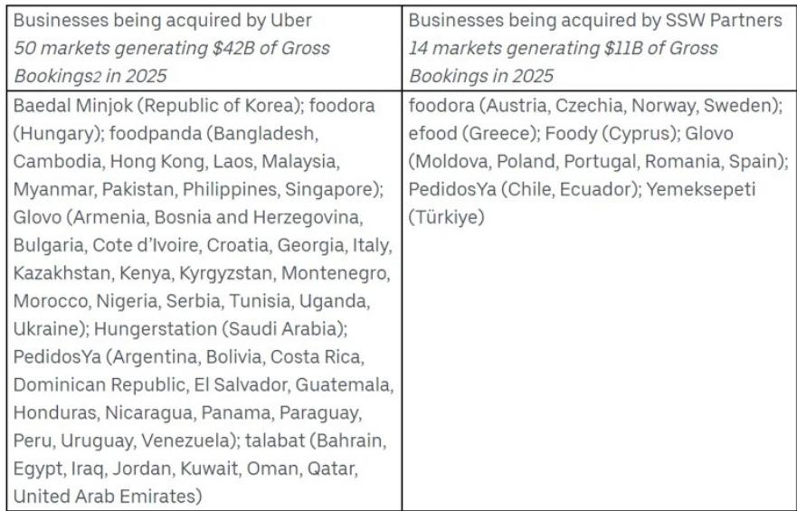

# Uber的跨平台战略：收购Delivery Hero是对超级应用生态的布局，而非仅追求成本协同

Uber以148亿美元收购Delivery Hero覆盖50个市场的要约，其核心并非成本削减。该公司预计可实现12亿美元的年度协同效应，其中裁员是最大驱动因素。然而，跨平台使用带来的收入协同仅占该数字的一小部分。真正的价值在于别处。Uber押注的是，收购完成后，其全球约60%的市场将同时提供领先的出行和领先的餐饮配送服务，而目前这一比例约为40%。这是公司商业模式的结构性转变，而非效率优化。

其逻辑根植于用户行为分析。Uber的跨平台用户——即同时使用出行和配送服务的用户——平均支出是单平台用户的三倍。在Uber表现最佳的市场，跨平台渗透率达到28%。全球平均水平为20%。一项将Uber可培育此类行为的市场数量从34个扩展到58个的交易，是直接尝试将整个用户群体转向更高生命周期价值。成本协同是基础，跨平台提升才是上限。

时机至关重要。Uber此举正值全球餐饮配送竞争加剧之际，从美团旗下的Keeta在中东，到Coupang Eats在韩国。DoorDash通过收购Wolt以及在阿联酋收购Deliveroo，也在进行整合。Uber无法在竞争对手构建多垂直生态的市场中继续作为单一产品玩家。Delivery Hero交易是在竞争格局进一步变化前，锁定本地领先地位的先发制人之举。

本文从五个维度剖析该交易的战略逻辑：跨平台乘数效应、决定成败的关键市场、技术迁移中的执行风险、资本配置权衡，以及对DoorDash的竞争启示。每个部分都将交易机制转化为评估结果的决策框架。

## 跨平台乘数效应是核心论点，而非成本协同

预计12亿美元的年度协同效应是一个具体但可能产生误导的锚点。Delivery Hero预计2027年备考EBITDA中约65%将来自成本节约，裁员是主要手段。Delivery Hero采用本地化结构，在其64个市场中运行独立的团队和技术栈。Uber计划从2027年底开始，分阶段将七个收购品牌迁移至自有平台，持续至2028年。这一迁移将随时间推移带来人员和基础设施成本的节约。

但收入协同假设被刻意保守处理。跨平台用户增长仅占12亿美元协同效应中极小部分。这并非疏忽，而是表明Uber将跨平台机会视为上行空间，而非基础假设。公司有意为交易的财务模型设定较低门槛，让运营效益自身说话。

跨平台行为的数据颇具说服力。Uber内部数据显示，跨平台用户支出是单平台用户的三倍。在公司最佳市场，28%的用户同时使用出行和配送服务。全球范围内，这一比例为20%。如果Uber能将收购市场的跨平台渗透率提升至其最佳水平的一半，收入提升将远超模型中的成本协同。交易的结构旨在为此创造条件：在58个市场中，Uber可以通过单一账户、忠诚度计划和支付系统，为同一用户提供出行和餐饮服务。

这并非新能力。Uber已在现有34个双产品市场中有效执行了跨平台策略。收购Delivery Hero将该策略扩展至24个新增市场，其中许多市场目前跨平台渗透率较低。战略问题不在于跨平台模式是否有效，而在于Uber能否在拥有根深蒂固的本地竞争对手和独特监管环境的市场中复制其成功。

## 交易成败取决于三个地区：中东、韩国和阿根廷

在Uber收购的50个市场中，有三个市场尤为重要。中东的Talabat和韩国的Baemin合计贡献约9亿美元的EBITDA，几乎占Delivery Hero 2025年合并调整后EBITDA的100%，以及被收购市场EBITDA的约80%。阿根廷虽然相对值较小，但代表着重大的跨平台机会，因为Delivery Hero在当地业务规模远超Uber现有的出行业务。

在中东，Talabat在阿联酋纯餐饮配送玩家中拥有约75%的市场份额。Uber历史上在该地区没有重要的配送业务。跨平台机会直接明了：Uber可以为阿联酋现有出行用户提供领先的配送选项，而Talabat的配送用户则可接入Uber的出行网络。风险在于，美团旗下的Keeta于2024年进入阿联酋，正积极投资以获取份额。DoorDash通过收购Deliveroo也在改善其在该地区的运营。整合窗口期——即Uber专注于将Talabat迁移至其平台的时期——创造了脆弱性。如果竞争对手利用该窗口期抢占市场份额，交易的经济效益将受损。

韩国则呈现不同挑战。Baemin在纯餐饮配送玩家中拥有约50%的市场份额，是市场领导者。但Uber在韩国没有重要的出行业务。因此，跨平台机会小于中东。更重要的是，当地出行市场由一家具有强大竞争地位的私营公司主导。Uber需要从较低基础建立出行市场份额，这在拥有成熟本地领导者的市场中已被证明是困难的。Baemin在交易中的价值主要作为独立的配送资产，而非跨平台催化剂。观察者应关注韩国，这可能是相对于交易基础假设表现最不及预期的来源。

阿根廷是潜在机会。Delivery Hero的拉丁美洲业务（阿根廷是其最大市场）贡献了该公司2025年GMV的约8%。Uber在阿根廷的出行预订量占总出行预订量的比例仅为个位数。该国约有4700万人口，在一个市场中结合领先的出行业务和领先的配送业务，创造了教科书式的跨平台场景。阿根廷也是一个通胀和经济波动使平台经济对规模特别敏感的市场。一个占主导地位的多产品运营商可以在小型竞争对手因成本结构而挣扎时，获取不成比例的份额。

## 逐个品牌的技术迁移存在执行风险，不应被低估

Uber计划逐个将七个Delivery Hero品牌迁移至自有平台，这比全面重新平台化的风险更低，但并非没有风险。公司已明确表示，迁移将是每个品牌固定成本效率提升的门槛因素。在品牌迁移完成前，与该市场相关的人员和技术栈节约无法实现。

风险在于运营层面。迁移过程中的数据丢失可能扰乱商家关系和用户体验。即使短暂的系统停机也可能将用户推向竞争对手。在本地竞争对手已积极投资的市场——阿联酋和韩国是最显著的例子——迁移相关的干扰可能代价高昂。Uber执行大规模平台迁移的记录并不足以完全排除这些风险。

迁移时间线也创造了一个多年期，在此期间交易的财务收益集中在后期。随着品牌被迁移至Uber平台，人员节约逐步实现。跨平台使用的收入协同取决于迁移完成，因为跨平台产品需要统一的技术栈。该交易在2027年和2028年的EBITDA贡献将严重偏向该时期的后半段。观察者应模拟协同效应的逐步提升，而非交易完成时的阶跃变化。

第二个执行风险是整合期间的本地竞争。在阿联酋，Talabat 75%的市场份额占主导地位，但美团旗下的Keeta和DoorDash旗下的Deliveroo都在投资以获取份额。在韩国，Baemin 50%的份额受到Coupang Eats的挑战，后者拥有财力雄厚的母公司及核心电商业务支持。整合期正是竞争对手测试Uber专注度的时刻。如果Uber在任一市场失去2-3个百分点的市场份额，EBITDA影响可能抵消模型协同效应的相当一部分。

## 资本配置权衡可控，但近期暂停回购显示纪律性

Uber表示其中长期资本配置理念保持不变。然而在短期内，公司优先考虑Delivery Hero交易，而非第二季度的股票回购。预计需要一到两个季度才能恢复约15亿美元的季度回购节奏。

这一权衡是合理的。该交易预计在完成时立即对非GAAP每股收益产生增值，并在三年内实现高个位数百分比的增值。对2030年非GAAP每股收益的隐含贡献约为0.75美元，约占当前估计值的8%。牺牲一到两个季度的回购来确保具有这种增值水平的交易，是纪律性的资本配置决策。

融资结构支持这一观点。Uber使用现有现金和新债务融资来支付148亿美元的收购价格。交易规模意味着约为Uber 2027年备考调整后EBITDA估计值的8倍，包含12亿美元的年度协同效应并根据美国GAAP报告标准调整。对于具有明确运营重叠的战略收购而言，该倍数合理。杠杆水平可控，增值时间线较短。

观察者应关注回购暂停是否超过两个季度的任何信号。如果Uber延迟恢复回购节奏，可能表明整合消耗的管理注意力或现金超出预期。目前，资本配置故事与价值创造一致。

## 对DoorDash的启示：脆弱性窗口与新竞争格局

该交易对DoorDash产生两个明确影响。首先，Uber和DoorDash在阿联酋重叠，DoorDash拥有Deliveroo，Uber将拥有Talabat。Talabat是排名第一的玩家，但整合窗口期为DoorDash创造了获取份额的机会。如果DoorDash能在Uber专注于迁移期间改善Deliveroo的运营，它可能在一个目前落后的市场获得立足点。

其次，Uber未收购的14个Delivery Hero市场——包括奥地利、挪威、瑞典、波兰、葡萄牙、罗马尼亚、西班牙和土耳其——将被出售给一家财务读者。Uber指出这些市场整体处于亏损状态。财务读者收购规模不足、不盈利的资产，为DoorDash创造了战略机会。DoorDash可以从分心的所有者手中获取份额，或者寻求收购其中部分资产以在欧洲获得规模。特别是北欧市场，与DoorDash现有的Wolt业务相邻。

更广泛的竞争启示是，Uber正在58个市场中成为更强大的多产品竞争对手。DoorDash主要专注于美国及精选国际市场，将在每个重叠市场中面对更强的Uber。Delivery Hero交易不会改变DoorDash的核心美国餐饮配送业务，但提高了DoorDash国际扩张战略的竞争门槛。DoorDash的回应——无论是通过进一步并购、有机投资还是合作——将是未来三到五年全球餐饮配送格局的关键决定因素。

该交易并非没有风险。技术迁移的执行、中东和韩国的竞争压力，以及资本配置权衡，都值得密切关注。但战略逻辑是合理的。Uber正在构建全球超级应用，而收购Delivery Hero是实现这一愿景的最大单一步骤。观察者应以跨平台乘数效应而非成本协同来评估该交易。前者才是价值创造所在。

*仅供参考。部分内容可能基于源材料通过AI辅助生成、翻译、总结或编辑，可能存在遗漏或错误。请独立核实。这不构成专业建议。*

仅供参考。部分内容可能基于源材料通过AI辅助生成、翻译、总结或编辑，可能存在遗漏或错误。请独立核实。这不构成专业建议。

