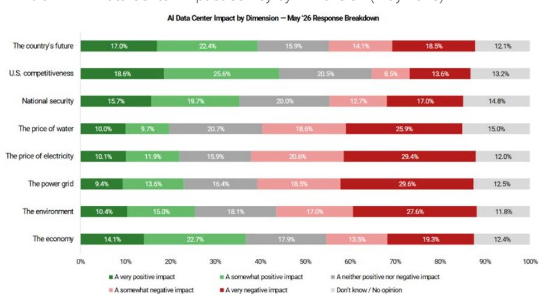
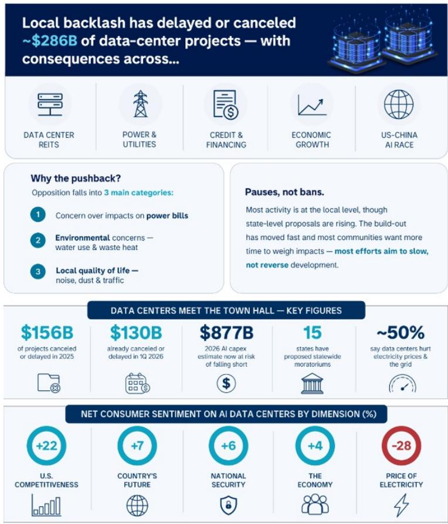
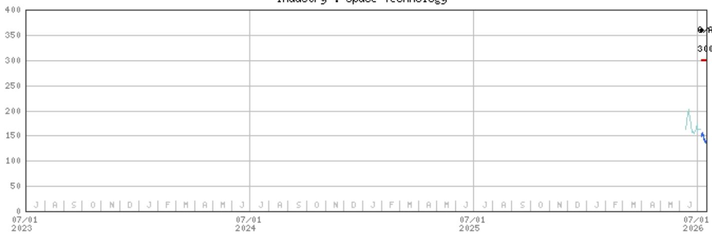

# Space Exploration Technologies Corp. | North America

# 太空作为应对地面数据中心限制的另一种思路

人工智能相关的基础设施在地面部署时，正面临来自社区层面的阻力。除了基本的运营优势（如能源、土地、冷却资源），太空这一“后院”或许能帮助缓解相关的不确定性。

详细研究请见：SpaceX：人工智能的最终前沿；初始评级为增持，目标价300美元（2026年7月7日）

## 近期美国部分地区对人工智能数据中心限制的案例：

- 目前美国尚无州级层面完全禁止人工智能数据中心。

- 2026年6月：纽约州立法机构通过一项为期一年的全州范围大型数据中心（20MW以上）暂停令。

- 人工智能数据中心暂停令已在14个州提出——包括佐治亚、缅因、马里兰、密歇根、明尼苏达、新罕布什尔、纽约、俄克拉荷马、宾夕法尼亚、南卡罗来纳、南达科他、佛蒙特、弗吉尼亚和威斯康星。目前仅纽约州立法机构通过了该法案。

- 大多数暂停行动发生在地方/市级层面。在2026年追踪到的155项暂停令中，城市占60项，县占55项，其余为乡镇和城镇。

- 其他值得关注的案例包括：明尼阿波利斯（自5月22日起对大型设施实施6个月暂停）、丹佛（5月18日通过1年暂停令）、巴尔的摩（6月16日签署1年暂停令）、里诺（暂停新建数据中心）。

- 犹他州的Stratos数据中心项目（Kevin O'Leary项目）。最初规划占地4万英亩（相当于曼哈顿面积的2倍），需要9吉瓦电力（超过该州总用电量）。项目在当地遭遇了关于水资源使用、空气质量和火灾风险的反对声音。

- 鉴于对人工智能的反对声音日益增长（尤其在年轻选民中），该问题已上升至联邦层面：多个州的候选人正以此议题参选，反对声浪加大（在某些情况下甚至导致项目取消）。国会中两党议员也相应提出了相关立法。

- 我们的主题与美国公共政策团队（由Michelle Weaver和Ariana Salvatore领导）近期发布了一份关于人工智能相关限制的全面概述，包含公共政策观点，以及数据中心项目和暂停令的追踪表。

<table><tr><td colspan="2">MS & CO. LLC</td></tr><tr><td colspan="2">Adam Jonas, CFA</td></tr><tr><td colspan="2">股票研究分析师</td></tr><tr><td>Adam.Jonas@morganstanley.com</td><td>+1 212 761-1726</td></tr><tr><td colspan="2">Ariana Salvatore</td></tr><tr><td colspan="2">股票策略师</td></tr><tr><td colspan="2">Ariana.Salvatore@morganstanley.com</td></tr><tr><td colspan="2">William Tackett, CFA</td></tr><tr><td colspan="2">研究助理</td></tr><tr><td>William.Tackett@morganstanley.com</td><td>+1 212 761-6028</td></tr></table>

Space Exploration Technologies Corp. (SPCX.O, SPCX US)

太空技术 | 美国

<table><tr><td>股票评级</td><td>增持</td></tr><tr><td>行业观点</td><td>具有吸引力</td></tr><tr><td>目标价</td><td>$300.00</td></tr><tr><td>收盘价（2026年7月14日）</td><td>$136.08</td></tr><tr><td>52周区间</td><td>$225.64-135.52</td></tr></table>

<table><tr><td>财年截止</td><td>12/25</td><td>12/26e</td><td>12/27e</td><td>12/28e</td></tr><tr><td>每股收益（$）**</td><td>(1.69)</td><td>0.28</td><td>2.18</td><td>6.29</td></tr><tr><td>先前每股收益（$）**</td><td>-</td><td>-</td><td>-</td><td>-</td></tr><tr><td>市盈率</td><td>NM</td><td>480.6</td><td>62.4</td><td>21.6</td></tr><tr><td>每股收益（$）§</td><td>-</td><td>(0.49)</td><td>0.64</td><td>3.23</td></tr><tr><td>股息率（%）</td><td>-</td><td>0.0</td><td>0.0</td><td>0.0</td></tr></table>

除非另有说明，所有指标均基于MS ModelWare框架

e = MS预测值

## 季度每股收益（$）

<table><tr><td>季度</td><td>2025</td><td>2026e 先前</td><td>2026e 当前</td><td>2027e 先前</td><td>2027e 当前</td></tr><tr><td>Q1</td><td>(0.18)</td><td>-</td><td>(0.84)a</td><td>-</td><td>0.54</td></tr><tr><td>Q2</td><td>(0.34)</td><td>-</td><td>(0.35)</td><td>-</td><td>0.55</td></tr><tr><td>Q3</td><td>(0.36)</td><td>-</td><td>0.27</td><td>-</td><td>0.54</td></tr><tr><td>Q4</td><td>(0.80)</td><td>-</td><td>0.45</td><td>-</td><td>0.56</td></tr></table>

e = MS预测值，a = 公司实际报告数据

MS与所覆盖的公司有业务往来。因此，读者应注意，该公司可能存在影响MS客观性的利益冲突。读者应将MS视为决策的单一因素之一。

分析师认证及其他重要披露信息，请参阅本报告末尾的披露部分。

图1：人工智能数据中心影响调查（按维度，2026年5月）

来源：Morning Consult, AlphaWise Web Intelligence

图2：数据中心限制情况总结

来源：MS, AlphaWise

## 欧洲对人工智能数据中心的限制比美国更为微妙：

- 阿姆斯特丹/荷兰：新数据中心暂停令预计至少持续至2030年，国家层面有规则限制超大规模项目。

- 爱尔兰：事实上的暂停令已实施多年，但在2025年底有所放宽，附加了严格条件，如现场发电要求。

- 丹麦：电网运营商（Energinet）自2026年3月起对新接入实施为期3个月的临时暂停，以进行电网研究。

## 近期大型科技公司涉足太空领域的案例：

- 谷歌（Project Suncatcher）：2025年11月与Planet Labs共同宣布，计划于2027年部署搭载TPU的原型卫星。

- NVIDIA：2026年3月推出Vera Rubin太空模块芯片——用于轨道人工智能数据中心的“太空级”芯片。近期招聘信息：轨道数据中心系统软件首席架构师 | NVIDIA Corporation

- 亚马逊：扩展Amazon LEO（原Kuiper）星座，聚焦人工智能/数据中心连接能力。

- 蓝色起源：2026年1月宣布TeraWave星座计划，约5,400颗卫星，用于高速数据中心连接。部署计划于2027年底开始，目前仍处于规划阶段。

- Meta：2026年4月宣布与初创公司Overview Energy达成协议，购买高达1吉瓦的电力，通过卫星将太阳能从太空传输至地面，用于支持Meta数据中心的运行。

## 中国在太空人工智能基础设施方面的努力：

- 中国航天科技集团（CASC）：2026年1月，中国主要航天承包商宣布计划在5年内建设吉瓦级太空人工智能数据中心。

- 十五五规划（2026-2030年）：2026年3月全国人大批准的国家蓝图，将太空人工智能计算纳入航天基础设施议程，提出到2030年建设吉瓦级轨道“数字与智能”基础设施。这正式确立了CASC于2026年1月首次提出的目标，并巩固了上述企业层面的努力。

- 三体计算星座：ADA Space（国星宇航）与之江实验室于2025年5月发射了计划中2,800颗卫星的前12颗（5 POPS，30 TB存储）。2025年11月，他们在该集群上运行了阿里巴巴的Qwen3模型。

- 轨道晨光（北京轨道晨光科技有限公司）：一家北京初创公司于2026年4月获得84亿美元信贷额度，用于建设吉瓦级轨道数据中心。

## 对SpaceX的相关性：

- 如果人工智能相关的限制趋势持续增长，我们预计将看到更多人工智能公司发布与太空相关的公告或投入。

- 此前可能未考虑太空领域的竞争者可能会进入这一领域。

- 在我们看来，这有助于验证SpaceX在太空人工智能基础设施方面的投入和领先地位。

- 预计联邦层面将继续支持太空人工智能系统的发展。

图3：为什么是太空？——将太空视为一个巨大、寒冷、阳光充足的“后院”……

巨大 = 仅近地轨道就有约1.3万亿立方公里

寒冷 = 深空温度为2.7开尔文（-270.5摄氏度）

阳光充足 = 无大气衰减、无昼夜循环、无天气影响

后院 = 地球的后院，而非“你的”后院

来源：MS

图4：值得关注的前SpaceX美国轨道计算参与者

Project Suncatcher 计划于2027年初与Planet Labs共同部署搭载TPU的卫星

Space-1 Vera Rubin 专为太空推理设计的集成CPU-GPU模块

Project Sunrise 向FCC提交了51,600颗卫星轨道计算星座的申请

Starcloud-1 将搭载H100的纳米卫星发射至太空，成为首个在轨道上训练大语言模型的项目

据报道被前谷歌CEO Eric Schmidt收购，用于轨道数据中心*

注：* Relativity Space于2025年3月被Eric Schmidt收购。2025年4月，Eric Schmidt在X平台上回应一条关于收购原因是否为轨道数据中心的帖子时，回复了一个词：“是的。”

来源：公司数据、公司公告、MS

## 估值方法与风险

## Space Exploration Technologies Corp. (SPCX.O)

分部加总法：太空、连接、人工智能（分为X & Grok与企业人工智能）

■ 300美元目标价 = 太空（8美元）+ 连接（128美元）+ X & Grok（12美元）+ 企业人工智能（152美元）

预测期至2040年

估值日期：2027年6月30日

11.1%加权平均资本成本；11.9%股权成本

企业人工智能估值因执行风险给予50%折价

终端增长率：太空4.0%，连接4.5%，X & Grok 3.0%，企业人工智能5.0%

## 相当于0.41倍 EV/EBIT/增长

## 上行风险

- Starship重复使用进展更快
- Starlink容量增长更快
- 直接面向消费者/企业采用更强
- 更多新云服务商合作
- Cursor ARR加速
- 人工智能基础设施通电时间和成本降低

## 下行风险

- Starship重复使用节奏放缓
- Starlink用户增长放缓
- 企业人工智能变现能力减弱
- 资本支出/每瓦计算成本上升
- 通电时间延长
- 资金需求增加/稀释
- 监管延迟

## 披露部分

本报告中的信息和观点由MS & Co. LLC、MS C.T.V.M. S.A.、MS Mexico, Casa de Bolsa, S.A. de C.V.及MS Canada Limited编制。在本披露部分中，“MS”包括MS & Co. LLC、MS C.T.V.M. S.A.、MS Mexico, Casa de Bolsa, S.A. de C.V.、MS Canada Limited及其必要时的关联公司。

有关本报告涉及公司的重要披露、股价图表及股票评级历史，请访问MS披露网站 www.morganstanley.com/eqr/disclosures/webapp/generalresearch，或联系您的投资代表或MS，地址：1585 Broadway, (Attention: Research Management), New York, NY, 10036 USA。

有关本研究报告中所提及的任何推荐、评级或目标价的估值方法及风险，请联系客户支持团队：美国/加拿大 +1 800 303-2495；香港 +852 2848-5999；拉丁美洲 +1 718 754-5444（美国）；伦敦 +44 (0)20-7425-8169；新加坡 +65 6834-6860；悉尼 +61 (0)2-9770-1505；东京 +81 (0)3-6836-9000。或者，您也可以联系您的投资代表或MS，地址：1585 Broadway, (Attention: Research Management), New York, NY 10036 USA。

## 分析师认证

以下分析师特此证明，他们对本报告所涉及公司及其证券的观点准确表达，且未因表达具体推荐或观点而直接或间接获得或将要获得补偿：Adam Jonas, CFA；Ariana Salvatore。

## 全球研究冲突管理政策

MS已按照冲突管理政策发布，该政策可在 www.morganstanley.com/institutional/research/conflictpolicies 查阅。葡萄牙语版本可在 www.morganstanley.com.br 查阅。

## 关于标的公司的重要监管披露

截至2026年6月30日，MS实益持有以下本报告所覆盖公司普通股类别1%或以上：Firefly Aerospace Inc, Iridium Communications Inc, MDA Space Ltd, Rocket Lab USA Inc, Viasat Inc, Virgin Galactic Holdings Inc, Voyager Technologies Inc。

在过去12个月内，MS担任了以下公司证券公开发行（或144A发行）的主承销商或联合主承销商：Firefly Aerospace Inc, HawkEye 360 Inc, Space Exploration Technologies Corp., Voyager Technologies Inc。

在过去12个月内，MS已从以下公司获得投资银行服务报酬：Firefly Aerospace Inc, HawkEye 360 Inc, Space Exploration Technologies Corp., Voyager Technologies Inc。

在未来3个月内，MS预计将从或有意寻求从以下公司获得投资银行服务报酬：Firefly Aerospace Inc, Gogo Inc, HawkEye 360 Inc, Iridium Communications Inc, MDA Space Ltd, Planet Labs PBC, Rocket Lab USA Inc, Space Exploration Technologies Corp., Viasat Inc, Voyager Technologies Inc。

在过去12个月内，MS已从以下公司获得投资银行服务以外的产品和服务报酬：Gogo Inc, HawkEye 360 Inc, Iridium Communications Inc, Rocket Lab USA Inc, Space Exploration Technologies Corp., Viasat Inc, Voyager Technologies Inc。

在过去12个月内，MS已向或正在向以下公司提供投资银行服务，或与以下公司存在投资银行客户关系：Firefly Aerospace Inc, Gogo Inc, HawkEye 360 Inc, Iridium Communications Inc, MDA Space Ltd, Planet Labs PBC, Rocket Lab USA Inc, Space Exploration Technologies Corp., Viasat Inc, Voyager Technologies Inc。

在过去12个月内，MS已向或正在向以下公司提供非投资银行、证券相关服务，和/或过去已签订服务协议或与以下公司存在客户关系：Gogo Inc, HawkEye 360 Inc, Iridium Communications Inc, Rocket Lab USA Inc, Space Exploration Technologies Corp., Viasat Inc, Virgin Galactic Holdings Inc, Voyager Technologies Inc。

MS & Co. LLC是Iridium Communications Inc、Viasat Inc证券的做市商。

主要负责编制MS的股票研究分析师或策略师的薪酬基于多种因素，包括研究质量、读者客户反馈、选股能力、竞争因素、公司收入及整体投资银行收入。股票研究分析师或策略师的薪酬不与MS进行的投资银行或资本市场交易挂钩，也不与特定交易台的盈利能力或收入挂钩。

MS及其关联公司与MS所覆盖的公司/工具有业务往来，包括做市、提供流动性、基金管理、商业银行、信贷扩展、投资服务及投资银行。MS以自营方式向客户买卖MS所覆盖公司的证券/工具。MS可能持有本报告所讨论的公司债务或工具的头寸。MS可能以自营方式交易作为债务研究报告标的的债务证券（或相关衍生品）。

上述某些披露也适用于非美国司法管辖区的合规要求。

## 股票评级

MS使用相对评级体系，包括增持、等权重、未评级或减持（定义见下文）。MS不对所覆盖股票分配买入、持有或报告评级。增持、等权重、未评级和减持不等同于买入、持有和卖出。读者应仔细阅读MS中所有评级的定义。此外，由于MS包含分析师观点的更完整信息，读者应完整阅读MS，而非仅从评级推断内容。在任何情况下，评级（或研究）不应被用作或依赖为研究交流。读者买卖股票的决定应取决于个人情况（如读者现有持仓）及其他考虑因素。

## 全球股票评级分布

## （截至2026年6月30日）

以下描述的股票评级适用于MS的基础股票研究，不适用于公司生产的债务研究。

仅为披露目的（根据FINRA要求），我们在增持、等权重、未评级和减持评级旁边包含买入、持有和卖出的类别标题。MS不对所覆盖股票分配买入、持有或报告评级。增持、等权重、未评级和减持不等同于买入、持有和卖出，而是代表建议的相对权重（见定义）。为满足监管要求，我们将增持（我们最积极的股票评级）对应买入推荐；将等权重和未评级对应持有，减持对应卖出推荐。

<table><tr><td></td><td colspan="2">覆盖范围</td><td colspan="3">投资银行客户（IBC）</td><td colspan="2">其他重要投资服务客户（MISC）</td></tr><tr><td>股票评级类别</td><td>数量</td><td>占比</td><td>数量</td><td>占IBC总数比例</td><td>占评级类别比例</td><td>数量</td><td>占其他MISC总数比例</td></tr><tr><td>增持/买入</td><td>1544</td><td>42%</td><td>453</td><td>49%</td><td>29%</td><td>757</td><td>44%</td></tr><tr><td>等权重/持有</td><td>1577</td><td>43%</td><td>390</td><td>42%</td><td>25%</td><td>769</td><td>44%</td></tr><tr><td>未评级/持有</td><td>3</td><td>0%</td><td>1</td><td>0%</td><td>33%</td><td>1</td><td>0%</td></tr><tr><td>减持/卖出</td><td>544</td><td>15%</td><td>89</td><td>10%</td><td>16%</td><td>204</td><td>12%</td></tr><tr><td>总计</td><td>3,668</td><td></td><td>933</td><td></td><td></td><td>1731</td><td></td></tr></table>

数据包括当前已分配评级的普通股和ADR。投资银行客户是指过去12个月内MS从中获得投资银行报酬的公司。由于四舍五入，“占比”列中的百分比可能不完全等于100%。

## 分析师股票评级

增持（O）：预计该股票的总回报在风险调整基础上，在未来12-18个月内将超过分析师行业（或行业团队）覆盖范围的平均总回报。

等权重（E）：预计该股票的总回报在风险调整基础上，在未来12-18个月内将与分析师行业（或行业团队）覆盖范围的平均总回报保持一致。

未评级（NR）：目前分析师对该股票相对于分析师行业（或行业团队）覆盖范围平均总回报的风险调整后总回报没有足够信心。

减持（U）：预计该股票的总回报在风险调整基础上，在未来12-18个月内将低于分析师行业（或行业团队）覆盖范围的平均总回报。

除非另有说明，MS中包含的目标价时间范围为12至18个月。

## 分析师行业观点

具有吸引力（A）：分析师预计其行业覆盖范围在未来12-18个月内的表现相对于相关广泛市场基准具有吸引力，基准如下所示。

中性（I）：分析师预计其行业覆盖范围在未来12-18个月内的表现相对于相关广泛市场基准保持一致，基准如下所示。

谨慎（C）：分析师对其行业覆盖范围在未来12-18个月内的表现相对于相关广泛市场基准持谨慎态度，基准如下所示。

各地区基准：北美 - S&P 500；拉丁美洲 - 相关MSCI国家指数或MSCI拉丁美洲指数；欧洲 - MSCI欧洲；日本 - TOPIX；亚洲 - 相关MSCI国家指数或MSCI次区域指数或MSCI AC亚洲太平洋除日本指数。

股价、目标价及评级历史（见评级定义）
Space Exploration Technologies Corp. (SPCX.O) - 截至2026年7月15日 GMT 美元计价

股票评级历史：2026年7月7日 : O/A
目标价历史：2026年7月7日 : 300
来源：MS 日期格式：MM/DD/YY 目标价 未分配目标价（NA）
股价（非当前分析师覆盖）—— 股价（当前分析师覆盖）
股票和行业评级（缩写如下）显示为 ♦ 股票评级/行业观点
股票评级：增持（O）等权重（E）减持（U）未评级（NR）无可用评级（NA）
行业观点：具有吸引力（A）中性（I）谨慎（C）无评级（NR）
自2014年1月13日起，MS亚太地区覆盖的股票将相对于分析师行业（或行业团队）覆盖范围进行评级。
自2014年1月13日起，MS亚太地区的行业观点基准为：相关MSCI国家指数或MSCI次区域指数或MSCI AC亚洲太平洋除日本指数。

## MS Smith Barney LLC客户的重要披露

关于可能合理预期影响MS Smith Barney LLC选择第三方研究提供商或第三方研究报告标的公司的任何重大利益冲突的重要披露，可在MS财富管理披露网站 www.morganstanley.com/online/researchdisclosures 查阅。有关MS的具体披露，请参阅 https://www.morganstanley.com/eqr/disclosures/webapp/generalresearch。

每份MS报告均经代表MS Smith Barney LLC的人员审阅和批准。该审阅和批准由代表MS审阅研究报告的同一人员进行。这可能产生利益冲突。

## 其他重要披露

MS政策是根据研究分析师和研究管理层认为适当的情况，基于发行人、行业或市场可能对研究观点或陈述产生重大影响的发展，更新研究报告。此外，某些研究出版物旨在按定期周期（每周/每月/每季度/每年）更新，并将通常按该频率更新，除非研究分析师和研究管理层根据当前情况确定不同的发布计划更为合适。

MS不担任市政顾问，本文所含观点或意见不构成也不应被视为《多德-弗兰克华尔街改革和消费者保护法》第975条意义上的建议。

MS生产一种称为“战术性观点”的股票研究产品。关于特定股票的“战术性观点”中所含观点可能与同一股票的研究中的推荐或观点相反。这可能是由于不同的时间范围、方法论、市场事件或其他因素造成的。有关特定股票的所有研究，请联系您的销售代表或访问Matrix：http://www.morganstanley.com/matrix。

MS通过我们专有的研究门户Matrix向客户提供，并由MS以电子方式分发给客户。某些（但非全部）MS产品也通过第三方供应商提供给客户，或通过替代电子方式作为便利重新分发给客户。如需访问所有可用的MS，请联系您的销售代表或访问Matrix：http://www.morganstanley.com/matrix。

任何对MS的访问和/或使用均受MS使用条款（http://www.morganstanley.com/terms.html）约束。通过访问和/或使用MS，您表示已阅读并同意受我们的使用条款约束。此外，您同意MS根据我们的隐私政策和全球Cookie政策（http://www.morganstanley.com/privacy_pledge.html）处理您的个人数据并使用Cookie，包括用于设置您的偏好和收集读者数据，以便我们为您提供更好、更个性化的服务和产品。有关MS如何处理个人数据、我们如何使用Cookie以及如何拒绝Cookie的更多信息，请参阅我们的隐私政策和全球Cookie政策（http://www.morganstanley.com/privacy_pledge.html）。请使用提供的链接查看MS印度私人有限公司的条款和条件及最重要条款和条件（https://www.morganstanley.com/assets/pdfs/about-us-global-offices/india/Terms_and_conditions.pdf），并使用以下链接查看审计报告（https://ny.matrix.ms.com/eqr/research/webapp/researchdocs/MSICPL_Morgan_Stanley_Research_Audit_Report.pdf）。

如果您不同意我们的使用条款和/或不愿同意MS处理您的个人数据或使用Cookie，请勿访问我们的研究。MS不提供个性化研究交流。MS的编制未考虑接收者的个人情况和目标。MS建议读者独立评估特定投资和策略，并鼓励读者寻求财务顾问的建议。投资或策略的适当性取决于读者的个人情况和目标。MS中讨论的证券、工具或策略可能不适合所有读者，某些读者可能没有资格购买或参与部分或全部内容。MS不构成购买或出售任何证券/工具或参与任何特定交易策略的要约或要约邀请。您的研究价值和收入可能因利率、汇率、违约率、提前还款率、证券/工具价格、市场指数、公司的运营或财务状况或其他因素的变化而变化。期权或其他证券/工具交易权利的行使可能存在时间限制。过往表现不一定是未来表现的指引。未来表现的估计基于可能无法实现的假设。如果提供且除非另有说明，封面上的收盘价是标的公司证券/工具主要交易所的价格。

主要负责编制MS的固定收益研究分析师、策略师或经济学家的薪酬基于多种因素，包括研究质量、准确性和价值、公司盈利能力或收入（包括固定收益交易和资本市场盈利能力或收入）、客户反馈和竞争因素。固定收益研究分析师、策略师或经济学家的薪酬不与MS进行的投资银行或资本市场交易挂钩，也不与特定交易台的盈利能力或收入挂钩。

MS中的“关于标的公司的重要监管披露”部分列出了MS持有1%或以上公司普通股权益的所有提及公司。对于MS中提及的所有其他公司，MS可能持有少于1%的证券/工具或衍生品，并可能以与MS中讨论的方式不同的方式进行交易。未参与MS编制的MS员工可能持有提及公司的证券/工具或衍生品，并可能以与MS中讨论的方式不同的方式进行交易。衍生品可能由MS或关联人士发行。

除有关MS的信息外，MS基于公开信息。MS尽一切努力使用可靠、全面的信息，但我们不保证其准确或完整。我们没有义务在MS中的意见或信息发生变化时通知您，除非我们打算停止对标的公司的股票研究覆盖。MS中提出的事实和观点未经MS其他业务领域（包括投资银行人员）的专业人员审阅，可能不反映他们所知的信息。

MS人员可能参与公司活动（如实地考察），通常被禁止接受公司支付相关费用，除非经研究管理授权成员预先批准。

MS可能做出与本报告中的推荐或观点不一致的投资决策。

致基于台湾或交易台湾证券/工具的读者：有关在台湾交易的证券/工具的信息由MS台湾有限公司（MSTL）分发。此类信息仅供您参考。读者应独立评估投资风险，并对其投资决策全权负责。未经MS明确书面同意，MS不得向公共媒体分发、引用或由公共媒体使用。访问和/或接收MS的《台湾证券交易所推荐条例》第7-1条范围内的非客户读者不得向任何第三方（包括但不限于关联方、关联公司及任何其他第三方）提供MS，或从事任何可能产生或看似产生利益冲突的与MS相关的活动。有关不在台湾交易的证券/工具的信息仅供信息参考，不应被解释为对此类证券/工具的交易推荐或要约邀请。MSTL不得为客户执行这些证券/工具的交易。

MS未根据中国法律注册，本报告相关研究在中国境外进行。MS不构成在中国出售任何证券的要约或要约邀请。中国读者应具有投资此类证券的相关资格，并应自行负责从相关政府机构获得所有相关批准、许可、验证和/或注册。本报告或其任何部分均不旨在也不构成中国法律定义的证券投资咨询或顾问服务。此类信息仅供您参考。

MS在巴西由MS C.T.V.M. S.A.分发，地址：Av. Brigadeiro Faria Lima, 3600, 6th floor, São Paulo - SP, Brazil；受Comissão de Valores Mobiliários监管；在墨西哥由MS México, Casa de Bolsa, S.A. de C.V分发，受Comision Nacional Bancaria y de Valores监管，地址：Paseo de los Tamarindos 90, Torre 1, Col. Bosques de las Lomas Floor 29, 05120 Mexico City；在日本由MS MUFG Securities Co., Ltd.分发，对于商品相关研究报告，由MS Capital Group Japan Co., Ltd分发；在香港由MS Asia Limited（对其内容负责）和MS Bank Asia Limited分发；在新加坡由MS Asia (Singapore) Pte.（注册号199206298Z）和/或MS Asia (Singapore) Securities Pte Ltd（注册号200008434H）分发，受新加坡金融管理局监管（对其内容承担法律责任，如有任何问题应联系），以及MS Bank Asia Limited新加坡分行（注册号T14FC0118）；在澳大利亚向《澳大利亚公司法》定义的“批发客户”由MS Australia Limited A.B.N. 67 003 734 576分发，持有澳大利亚金融服务牌照No. 233742，对其内容负责；在澳大利亚向“批发客户”和“零售客户”由MS Wealth Management Australia Pty Ltd（A.B.N. 19 009 145 555，持有澳大利亚金融服务牌照No. 240813）分发，对其内容负责；在韩国由MS & Co International plc首尔分行分发；在印度由MS India Company Private Limited分发，公司识别号（CIN）U22990MH1998PTC115305，受印度证券交易委员会（SEBI）监管，持有研究分析师（SEBI注册号INH000001105）、股票经纪人（SEBI股票经纪人注册号INZ000244438）、商人银行家（SEBI注册号INM000011203）及国家证券存管有限公司存管参与者（SEBI注册号IN-DP-NSDL-567-2021）牌照，注册办公室：Altimus, Level 39 & 40, Pandurang Budhkar Marg, Worli, Mumbai 400018, India；电话：+91-22-61181000；合规官详情：Mr. Tejarshi Hardas，电话：+91-22-61181000或电邮：tejarshi.hardas@morganstanley.com；投诉官详情：Mr. Tejarshi Hardas，电话：+91-22-61181000或电邮：msic-compliance@morganstanley.com。MS India Company Private Limited (MSICPL) 可能在提供研究服务时使用人工智能工具。本文所含所有推荐均由合格研究分析师做出；在加拿大由MS Canada Limited分发；在德国及欧洲经济区（如需要）由MS Europe S.E.分发，受德国联邦金融监管局（BaFin）授权和监管，参考号149169；在美国由MS & Co. LLC分发，对其内容负责。MS & Co. International plc由审慎监管局授权，受金融行为监管局和审慎监管局监管，在英国分发其自身编制的研究以及其任何关联公司编制的研究，仅面向（i）属于《2000年金融服务与市场法（金融促进）令2005》（修订版，“该令”）第19(5)条的投资专业人士；（ii）属于该令第49(2)(a)至(d)条的高净值实体；或（iii）可以合法地以其他方式传达或促使其参与投资活动（根据修订后的《2000年金融服务与市场法》第21条含义）的人士。RMB MS Proprietary Limited是JSE Limited和A2X (Pty) Ltd的成员。RMB MS Proprietary Limited是由MS International Holdings Inc.和RMB Investment Advisory (Proprietary) Limited（由FirstRand Limited全资拥有）各占50%股权的合资企业。MS中的信息由MS Saudi Arabia分发，受沙特阿拉伯王国资本市场管理局监管，仅面向成熟读者。

MS中的信息由MS & Co. International plc（DIFC分行）传达，受迪拜金融服务管理局（DFSA）监管，或由MS & Co. International plc（ADGM分行）传达，受阿布扎比金融服务监管局（FSRA）监管，仅面向DFSA或FSRA定义的“专业客户”。本研究所涉及的金融产品或金融服务仅向符合专业客户监管标准的客户提供。按行业划分的MS研究评级或推荐分布（百分比）可向您的销售代表索取。

MS中的信息由MS & Co. International plc（QFC分行）传达，受卡塔尔金融中心监管局（QFCRA）监管，仅面向商业客户和市场对手方，不面向QFCRA定义的零售客户。

根据土耳其资本市场委员会要求，此处提供的投资信息、评论和建议不属于投资咨询服务的范围。投资咨询服务仅由授权公司根据个人的风险和收益偏好提供。此处评论和建议具有一般性质。这些意见可能不适合您的财务状况、风险和收益偏好。因此，仅依赖此处信息做出投资决策可能无法产生符合您预期的结果。

MS中包含的商标和服务标志为其各自所有者的财产。第三方数据提供商不对其提供数据的准确性、完整性或及时性做出任何保证或陈述，并且不对与此类数据相关的任何损害承担责任。全球行业分类标准（GICS）由MSCI和S&P开发，是其专有财产。

MS或其任何部分未经MS书面同意不得转载、出售或再分发。

MS中引用的指标和追踪器不得用作或被视为欧盟2016/1011法规下的基准。

某些固定收益研究报告中推荐或讨论的发行人和/或固定收益产品可能不会持续跟踪。因此，读者应将此类固定收益研究报告视为提供独立分析，不应期望对相关发行人和/或个别固定收益产品进行持续分析或额外报告。MS可能不时持有研究报告标的公司的重大财务和商业利益。

SEBI授予的注册和印度证券市场监管机构（NISM）的认证不以任何方式保证中介机构的业绩或向读者提供回报保证。证券市场投资存在市场风险。投资前请仔细阅读所有相关文件。

以下作者为固定收益研究分析师/策略师，不对股票证券发表意见或表达推荐：Ariana Salvatore。

## 行业覆盖：太空技术

<table><tr><td>公司（代码）</td><td>评级（截至）</td><td>价格*（2026年7月15日）</td></tr><tr><td>Adam Jonas, CFA</td><td></td><td></td></tr><tr><td>Space Exploration Technologies Corp. (SPCX.O)</td><td>O (2026年7月
