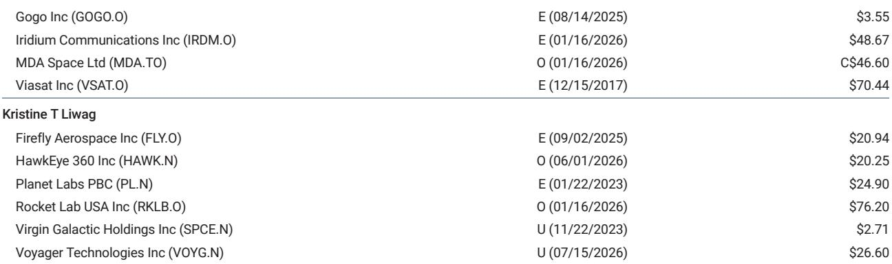

# 地面算力瓶颈正将计算推向太空，这改变了空间研究的逻辑

纽约州立法机构于2026年6月通过了一项为期一年的暂停令，禁止新建超过20兆瓦的大型数据中心。这是美国首个全州范围的此类禁令，但绝非孤例。全美已有14个州提出了暂停立法。仅在地方层面，今年就已追踪到155项暂停措施，其中城市60项，县55项。明尼阿波利斯市于5月实施了为期六个月的暂停。丹佛市在同月通过了为期一年的暂停令。巴尔的摩于6月签署了相关法律。里诺市也实施了暂停。犹他州的Stratos数据中心项目，原规划占地4万英亩，需9吉瓦电力，但因用水、空气质量和火灾风险等问题面临当地反对。

矛盾显而易见：对AI算力的巨大需求正与地面基础设施的物理和政治现实发生碰撞。自由能源、自由土地和自由冷却一直是太空数据中心的基本论点。但现在，一个更直接、更紧迫的催化剂出现了。这个“太空后院”不再仅仅是一个长期效率的考量。它正成为一种对冲，以应对AI基础设施在地球上无法快速建成的风险。太空AI算力的研究逻辑已从投机性的选择转变为战略上的必要。

反对的规模正在加速。多个州的候选人正以反数据中心的纲领参选。这一问题已上升到联邦层面，国会两党均已提出相关立法。这并非边缘关切。AI领域的“邻避效应”已成为一股主流政治力量，尤其在年轻选民中。这对观察者而言意味着：如果地面许可和建设周期继续拉长，AI基础设施支出的边际增量将越来越多地投向太空。

## AI邻避效应已跨越大西洋，正成为供给端的结构性制约

欧洲的做法更为微妙，但限制同样不少。荷兰对新建数据中心实施了暂停令，预计至少持续到2030年，并出台了限制超大规模项目的国家规定。爱尔兰实际上已实施多年的暂停令，直到2025年底才有所放松，但附加了要求现场发电的严格条件。丹麦电网运营商Energinet自2026年3月起，在研究电网容量的同时，对新接入实施了为期三个月的临时暂停。

两大洲的模式一致。制约因素并非需求，而是许可。瓶颈不在于芯片或资金的可用性，而在于获取土地、电力、水源和社区批准的能力。仅在美国，虽然尚无州明确禁止AI数据中心，但立法趋势已十分明显。14个州提出了暂停法案，一个已获通过。如果政治势头持续，更多州将会跟进。

这并非暂时的监管波折。它反映了AI基础设施的物理足迹与民主进程之间的结构性矛盾。一个超大规模数据中心消耗的电力相当于一个中等城市。犹他州的Stratos项目所需电力甚至超过该州当前的总用电量。这种集中度必然招致反对。行业的应对是寻找人口更少、空间更大、监管摩擦更小的地点。这一探索的逻辑终点，是寻找一个完全没有人的地方。

## 大型科技公司已开始为轨道计算投入资金，验证了这一方向

大型AI和云服务商的反应是决定性的。谷歌通过“捕日者”项目，于2025年11月宣布计划与Planet Labs合作部署搭载TPU的卫星，原型机预计2027年问世。英伟达于2026年3月推出了Vera Rubin太空模块芯片，专为轨道AI数据中心设计为“太空级”芯片。亚马逊正在扩展其原名为Kuiper的LEO星座，重点聚焦AI和数据中心连接。蓝色起源于2026年1月宣布了TeraWave星座计划，拟建设约5400颗卫星的网络，用于高速数据中心连接，部署工作将于2027年底开始。Meta于2026年4月宣布与初创公司Overview Energy达成协议，购买高达1吉瓦的电力，后者计划通过卫星将太阳能传输至地球，以帮助运行Meta的地面数据中心。

这些并非探索性研究项目，而是有明确时间表、预算和工程团队的资本承诺。各公司的路径选择值得关注。谷歌专注于轨道计算节点，英伟达在构建太空级芯片，亚马逊和蓝色起源在建设轨道连接基础设施，Meta则在探索太空电力传输。每家公司从不同角度切入，但方向一致：云正在进入轨道。

中国的反应更为明确。2026年1月，中国航天科技集团公司宣布计划在五年内建设吉瓦级的太空AI数据中心。该目标已写入2026年3月全国人大批准的“十五五”规划，明确将太空AI计算作为国家空间基础设施议程的一部分。ADA Space与之江实验室于2025年5月发射了计划中2800颗卫星星座的首批12颗卫星，并于2025年11月成功在该集群上运行了阿里巴巴的Qwen3模型。北京一家初创公司“轨道暮光科技”于2026年4月获得了84亿美元的信贷额度，用于建设其自身的吉瓦级轨道数据中心。

中国的做法不仅因其规模而引人注目，更因其与国家产业政策的整合。五年规划提供了一个正式框架，将公司层面的努力与国家指导的基础设施目标对齐。这种协调性赋予了中国轨道计算项目在速度和资本获取上的结构性优势，也提高了仅依赖私营部门努力的美国竞争者的竞争门槛。

## 太空拥有地面数据中心无法比拟的三项结构性优势，且差距正在扩大

太空计算的基础物理原理并未改变，但随着地面约束的收紧，这些物理特性的相对价值提升了。仅近地轨道就包含约1.3万亿立方公里的空间。这是一个“后院”，是地球的后院，而非任何人的专属。这里没有分区委员会、环境影响评估报告、社区会议或暂停投票。

深空提供2.7开尔文（零下270.5摄氏度）的自然冷却。这消除了地面数据中心用于冷却的巨大水资源消耗和能源成本。Stratos项目因在干旱地区用水而面临反对。太空则没有此类限制。冷却免费、被动且无限。

太空中的太阳能没有大气衰减、昼夜循环和天气影响。近地轨道上的太阳能电池板接收的平均太阳辐照度约为地球表面的八倍，且无云层遮挡、无季节变化、无夜晚。能量是持续且可预测的。挑战在于将其传输回地球或就地使用，但发电的物理条件要有利得多。

这些优势早已为人所知。变化的是获取它们的相对成本。可重复使用运载火箭已将每公斤进入轨道的成本降低了一个数量级。支持星链的技术同样支持轨道计算。向卫星星座添加计算节点的边际成本正在迅速下降。相比之下，随着土地、电力和合规成本上升，建设地面数据中心的成本正在增加。

## 研究者应通过一个权衡四项变量的决策框架来评估轨道计算

太空AI基础设施的研究逻辑可归结为四项变量，它们共同决定一个项目相对于地面替代方案的可行性。

第一项变量是地面暂停风险溢价。这是地面项目延迟或取消的概率加权成本。在纽约，未来一年这一概率为100%。在荷兰，直到2030年都是100%。在每一个提出暂停立法的司法管辖区，该概率都非零且正在上升。评估轨道计算的正确方式，不是将其与今天建设地面数据中心的成本比较，而是与考虑了项目可能根本无法建设的风险后的预期成本比较。

第二项变量是发射成本轨迹。进入近地轨道的每公斤成本已从21世纪初的大约1万美元，降至如今使用可重复使用系统后的1000美元以下。如果这一趋势持续，将计算硬件送入轨道的成本将在五到七年内与建设和运营地面设施的成本相当。这个交叉点正以比多数研究者预期更快的速度到来。

第三项变量是每颗卫星的计算密度。英伟达Vera Rubin太空模块是一款为轨道推理工作负载设计的专用芯片，而非改造的地面芯片。它被设计在辐射加固、热环境挑战大、电力有限的条件下运行。这些芯片的每瓦和每公斤性能，将决定每次发射能部署多少有用的算力。早期原型机专注于推理而非训练，因为推理功耗更低、对延迟容忍度更高。这是正确的切入点。随着电力传输和轨道储能技术的改进，训练将随之而来。

第四项变量是连接架构。如果轨道计算节点无法与地面用户及彼此通信，则毫无用处。卫星间的激光链路，结合地面站网络，可创建一个网状网络，以许多推理工作负载可接受的延迟路由数据。关键门槛是端到端延迟是否保持在50毫秒以下，以满足实时应用需求。对于批量推理和模型服务，延迟约束更宽松。连接挑战可通过现有技术解决，亚马逊和蓝色起源在专用轨道连接星座上的投资也证实了行业认为这个问题值得解决。

## 轨道计算领域的先发优势可能属于已掌控发射和星座基础设施的公司

最有可能从轨道AI计算中获取价值的公司，未必是超大规模云服务商或芯片设计商，而是那些掌控运载火箭和卫星星座的公司。发射能力是硬约束。一家每周能发射100吨的公司，比必须在公开市场上购买发射服务的公司拥有结构性优势。一家已运营数千颗卫星星座的公司，拥有现成的计算节点部署平台，以及现有的地面基础设施、监管许可和运营经验。

这就是为何中国政府将轨道计算明确纳入五年规划具有战略意义。它将发射能力、卫星制造和计算部署统一在一个协调框架下。美国的生态系统更为分散，但逻辑相同。控制发射节奏和轨道基础设施的公司将获取大部分经济价值，因为它们控制了瓶颈。

对研究者而言，这意味着轨道计算的机会并非一个独立领域，而是现有空间基础设施研究方向的延伸。已在发射和连接领域处于领先地位的公司，将从AI计算向轨道的迁移中获益最多。超大规模云服务商和芯片公司是重要的合作伙伴和客户，但它们并非基础设施的所有者。基础设施的所有者才是获得回报的一方。

仅供参考。部分内容可能基于原始资料通过AI辅助生成、翻译、总结或编辑，可能存在遗漏或错误。请独立核实。本文不构成任何专业建议。

