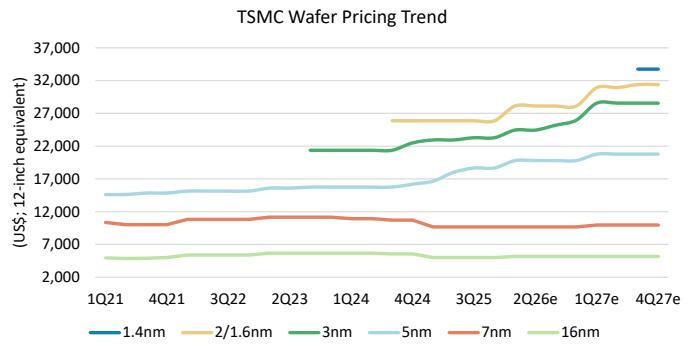
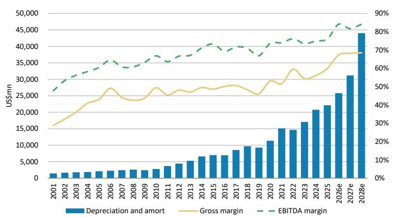
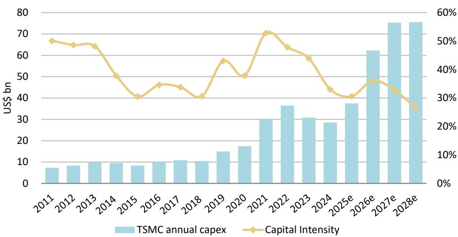
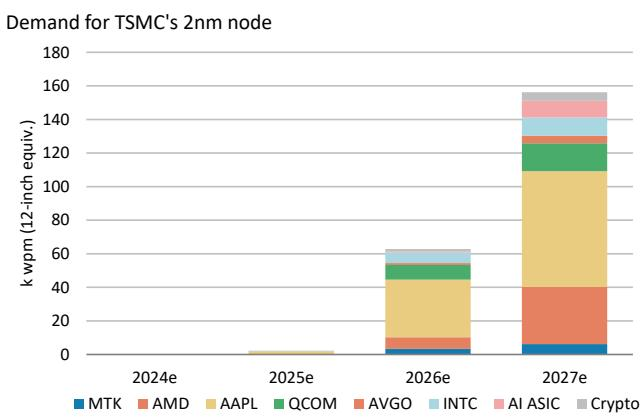
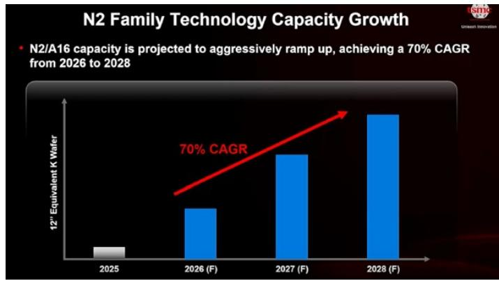
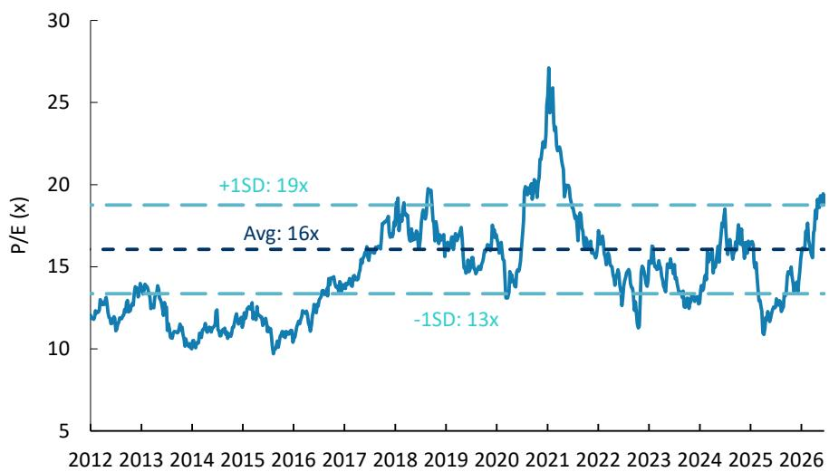
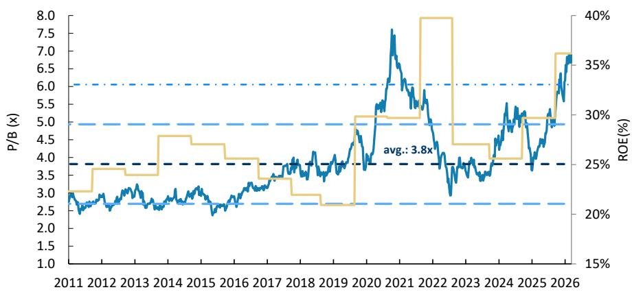

# 资本支出上调以应对强劲AI需求；维持积极看法

## 大中华科技半导体 | 台湾

<table><tr><td colspan="3">变化情况</td></tr><tr><td>台积电 (2330.TW)</td><td>原值</td><td>现值</td></tr><tr><td>目标价</td><td>新台币2,888.00元</td><td>新台币2,988.00元</td></tr></table>

更高的资本支出指向更大规模且更紧迫的AI基础设施需求。台积电在未来五年内，仍将是主要客户在2纳米/1.4纳米制程代工方面的首要选择。

2026年全年营收指引显著超出预期：台积电今日召开了2026年第二季度业绩说明会。公司将2026年营收增长指引上调至同比增长超过40%（此前为同比增长超过30%）。在我们6月28日的预览报告中，我们预计指引将上调至同比增长40%，而市场共识预期为35%-40%。管理层将上调归因于强劲的AI需求，尽管消费端需求面临挑战。云服务提供商正快速增加云资本支出。台积电未更新其AI半导体营收复合年增长率预测，但表示当前趋势高于此前55%-60%的预测。我们认为，台积电AI半导体业务实现70%-80%的复合年增长率是合理的。

资本支出上调意味着AI需求紧迫：台积电将2026年资本支出目标上调至600-640亿美元（此前为520-560亿美元），这暗示部分设备成本上涨。我们将增加的约80亿美元归因于：(1) 30亿美元的成本上涨（反映设备价格约5%的涨幅），以及(2) 50亿美元的设备预付款，鉴于台积电今年并未增加新的洁净室产能。这些设备预付款表明AI需求紧迫，尤其是与代理型AI相关的CPU和GPU。管理层表示，A14制程将是一个比2纳米更大的节点，并宣布为其美国工厂额外增加1000亿美元的资本支出，我们认为这将支撑2028年后的营收高于我们此前的预期。

我们是否需要担心毛利率“不及预期”和代工竞争？针对我们关于三星代工和英特尔代工竞争的问题，管理层表示，主要客户会与台积电分享其五年生产路线图，这意味着台积电仍将是客户高质量产品的首要来源。我们预计，鉴于台积电在领先代工服务中提供的价值，其可能在2027年将领先晶圆价格再提高5%-10%。关于毛利率指引，2026年第三季度中点为66%，而市场预期为67.5%，这反映了2纳米制程带来的稀释效应。虽然这低于一些不切实际的70%的市场预测，但我们重申观点，可在市场因毛利率预测不及预期而出现波动时关注。台积电一直提醒读者注意2纳米和海外工厂带来的稀释效应。我们不认为毛利率“不及预期”反映了代工竞争。

将目标价上调至新台币2,988元；维持积极看法：我们上调了2026-2028年的营收假设，以反映更强的AI半导体营收增长。在市场环境波动的情况下，台积电高质量的盈利表现应能持续吸引资金流入。即将到来的云服务提供商2026年第二季度资本支出更新可能是关键催化剂。

<table><tr><td colspan="2">MS台湾有限公司+</td></tr><tr><td colspan="2">Charlie Chan</td></tr><tr><td colspan="2">股票分析师</td></tr><tr><td>Charlie.Chan@morganstanley.com</td><td>+886 2 2730-1725</td></tr><tr><td colspan="2">Daniel Yen, CFA</td></tr><tr><td colspan="2">股票分析师</td></tr><tr><td>Daniel.Yen@morganstanley.com</td><td>+886 2 2730-2863</td></tr><tr><td colspan="2">MS亚洲有限公司+</td></tr><tr><td colspan="2">Daisy Dai, CFA</td></tr><tr><td colspan="2">股票分析师</td></tr><tr><td>Daisy.Dai@morganstanley.com</td><td>+852 2848-7310</td></tr><tr><td colspan="2">MS台湾有限公司+</td></tr><tr><td colspan="2">Tiffany Yeh</td></tr><tr><td colspan="2">股票分析师</td></tr><tr><td>Tiffany.Yeh@morganstanley.com</td><td>+886 2 7712-3032</td></tr><tr><td colspan="2">Lucas Wang</td></tr><tr><td colspan="2">研究助理</td></tr><tr><td>Lucas.Wang@morganstanley.com</td><td>+886 2 2730-2875</td></tr></table>

## 台积电 (2330.TW, 2330 TT)

<table><tr><td>股票评级</td><td>增持</td></tr><tr><td>行业观点</td><td>具吸引力</td></tr><tr><td>目标价</td><td>新台币2,988.00元</td></tr><tr><td>目标价上行/下行空间 (%)</td><td>21</td></tr><tr><td>收盘价 (2026年7月16日)</td><td>新台币2,470.00元</td></tr><tr><td>当前市值 (百万)</td><td>新台币64,042,111</td></tr><tr><td>日均交易额 (百万)</td><td>新台币65,119</td></tr></table>

<table><tr><td>财年截止日</td><td>12/25</td><td>12/26e</td><td>12/27e</td><td>12/28e</td></tr><tr><td>每股收益 (新台币)**</td><td>66.25</td><td>111.08</td><td>144.93</td><td>183.55</td></tr><tr><td>此前每股收益 (新台币)**</td><td>-</td><td>107.56</td><td>143.01</td><td>177.30</td></tr><tr><td>每股收益 (新台币)§</td><td>64.56</td><td>100.37</td><td>130.74</td><td>166.68</td></tr><tr><td>ModelWare净收入 (新台币十亿)</td><td>1,718</td><td>2,874</td><td>3,758</td><td>4,759</td></tr><tr><td>市盈率</td><td>23.4</td><td>22.3</td><td>17.0</td><td>13.5</td></tr><tr><td>股息率 (%)</td><td>1.4</td><td>1.1</td><td>1.4</td><td>1.7</td></tr></table>

除非另有说明，所有指标均基于MS ModelWare框架
\*\* = 基于共识方法论
§ = 共识数据由Refinitiv Estimates提供
e = MS预测

MS与所覆盖的公司有业务往来并寻求开展业务。因此，读者应注意，该公司可能存在影响MS客观性的利益冲突。读者应将MS视为其决策的单一因素。

有关分析师认证和其他重要披露，请参阅本报告末尾的披露部分。

+= 非美国关联公司雇用的分析师未在FINRA注册，可能不是该会员的关联人士，并且可能不受FINRA关于与主题公司沟通、公开露面以及交易研究分析师账户持有的证券的限制。

## 2026年第二季度业绩及2026年第三季度指引回顾

台积电于7月16日召开了2026年第二季度业绩说明会。公司2026年第二季度业绩及2026年第三季度指引符合我们催化剂预览报告中的情景1和情景2，我们假设未来几个交易日股价将上涨1%-5%。关于季度业绩和指引的回顾，请参见图表1和图表2。

2026年第二季度毛利率为67.7%，大致符合我们预测的67.4%，并高于公司最初65.5%-67.5%的指引区间。台积电2026年第三季度营收增长指引中点为环比增长12%，也符合我们看好的环比增长10-15%的预测。2026年第三季度毛利率数据基本持平，符合我们的预览，但低于一些看好的买方预期的70%。因此，我们建议，若股价因毛利率不及预期而出现调整，可予以关注。

我们现在假设2026-2028年三年资本支出为2130亿美元，此前为2060亿美元。

图表1：台积电2026年第二季度业绩回顾

<table><tr><td rowspan="2">(新台币百万元)</td><td colspan="5">2026年第二季度</td></tr><tr><td>实际值</td><td>环比</td><td>同比</td><td>MS预测</td><td>市场共识</td></tr><tr><td colspan="6">财务数据</td></tr><tr><td>营收</td><td>1,270,380</td><td>12.0%</td><td>36.0%</td><td>1,266,623</td><td>1,267,975</td></tr><tr><td>营业费用</td><td>(93,708)</td><td>1.5%</td><td>11.6%</td><td>(96,667)</td><td>(109,471)</td></tr><tr><td>每股收益 (新台币)</td><td>27.25</td><td>23.4%</td><td>77.4%</td><td>25.08</td><td>24.33</td></tr><tr><td colspan="6">比率</td></tr><tr><td>毛利率 (%)</td><td>67.7%</td><td>147bps</td><td>910bps</td><td>67.4%</td><td>67.3%</td></tr><tr><td>营业费用率 (%)</td><td>7.4%</td><td>-76bps</td><td>-161bps</td><td>7.6%</td><td>8.6%</td></tr><tr><td>营业利润率 (%)</td><td>60.3%</td><td>224bps</td><td>1,072bps</td><td>59.8%</td><td>58.7%</td></tr></table>

来源：公司数据，Visible Alpha，MS预测

图表2：台积电2026年第三季度指引回顾

<table><tr><td rowspan="2">(新台币百万元)</td><td colspan="5">2026年第三季度</td></tr><tr><td>指引</td><td>MS预测</td><td>环比</td><td>同比</td><td>市场共识</td></tr><tr><td colspan="6">财务数据</td></tr><tr><td>营收</td><td>446亿至458亿美元，中点环比增长12%</td><td>1,435,872</td><td>13.0%</td><td>45.0%</td><td>1,385,740</td></tr><tr><td>营业费用</td><td></td><td>(104,250)</td><td>11.2%</td><td>18.7%</td><td>(116,721)</td></tr><tr><td>每股收益 (新台币)</td><td></td><td>29.21</td><td>7.2%</td><td>67.5%</td><td>27.21</td></tr><tr><td colspan="6">比率</td></tr><tr><td>毛利率 (%)</td><td>65.0% - 67.0%</td><td>67.5%</td><td>-20bps</td><td>807bps</td><td>66.4%</td></tr><tr><td>营业费用率 (%)</td><td></td><td>7.3%</td><td>-12bps</td><td>-161bps</td><td>8.4%</td></tr><tr><td>营业利润率 (%)</td><td>56.0% - 58.0%</td><td>60.3%</td><td>-8bps</td><td>969bps</td><td>58.0%</td></tr></table>

来源：公司数据，Visible Alpha，MS预测

## AI半导体需求依然强劲，需要额外资本支出

## 台积电2026-2028年代工厂布局与我们自下而上的需求分析基本一致

我们的行业调研显示，ASML主要根据历史需求和长期合作关系分配产能，这表明台积电仍是EUV出货量的最大客户。如果是这样，台积电应能保持较强的定价能力，并可能在2027年将领先晶圆价格提高5%-10%，这既反映了其为客户提供的价值，也体现了利润率扩张的潜力。

图表3：台积电 – 晶圆定价趋势  
  
来源：公司数据，MS (e) 预测

图表4：台积电的毛利率和折旧趋势 – 60%应为底部  
  
来源：公司数据，MS (e) 预测

图表5：  
由于营收强劲增长，台积电的资本支出强度应显著下降  
  
来源：公司数据，MS预测

## 台积电显示2纳米和3纳米产能强劲增长，5纳米产能将下降

与我们需求预测一致，台积电表示从2026年开始，2纳米和3纳米的产能需求非常强劲，这意味着从2026年到2028年，N2的产能复合年增长率为70%。台积电还表示，5纳米产能将从2027年开始下降，这与我们的预测一致，即随着Blackwell向基于3纳米的Rubin过渡，5纳米需求将下降。

此外，先进封装产能扩张应仍是台积电2027年的关键重点。这包括但不限于CoWoS和SolC，我们现在预计到2027年，其产能将分别达到20万片/月和7万片/月。

图表6：台积电 – 我们对2纳米客户需求结构的估计  
  
来源：MS预测

图表7：台积电表示N2产能从2026年至2028年可实现超过70%的复合年增长率  
  
来源：台积电

由于3纳米以下的节点也应继续看到强劲需求，我们的调研显示，台积电的2纳米/1.6纳米产能到2026年底可能接近10万片/月，2027年增至15-17万片/月，2028年超过20万片/月。我们预计1.4纳米将在2027年开始引入设备，大部分产能将在2028年提升。展望更远的未来，我们预计台积电将于2029年在台南引入首批1.0纳米产能。

图表8：台积电晶圆厂路线图

<table><tr><td rowspan="2">节点</td><td rowspan="2">地点</td><td rowspan="2">晶圆厂</td><td colspan="5">产能</td></tr><tr><td>2025</td><td>2026</td><td>2027</td><td>2028</td><td>2029</td></tr><tr><td rowspan="3">N3</td><td>台南</td><td>F18 - P4/P5/P6/P8/P9</td><td>110k</td><td>160-170k</td><td></td><td></td><td></td></tr><tr><td>亚利桑那</td><td>F21 - P2</td><td></td><td>20k</td><td></td><td></td><td></td></tr><tr><td>日本</td><td>F23 - P2</td><td></td><td></td><td></td><td>15k</td><td></td></tr><tr><td>合计</td><td></td><td></td><td>110k</td><td>180-190k</td><td>190k</td><td>200-205k</td><td></td></tr><tr><td rowspan="4">N2/A16</td><td>新竹</td><td>F20 - P1/P2</td><td>20k</td><td>30k</td><td></td><td></td><td></td></tr><tr><td>台南</td><td>F22 - P7/P8/P9</td><td></td><td></td><td>40-50k</td><td>60k</td><td></td></tr><tr><td>高雄</td><td>F22 - P1/P2/P3/P4/P5/P6</td><td>25k</td><td>60k</td><td>80-90k</td><td>100k</td><td></td></tr><tr><td>亚利桑那</td><td>F21 - P3/P4/P5/P6</td><td></td><td></td><td></td><td>20k</td><td></td></tr><tr><td>合计</td><td></td><td></td><td>45k</td><td>90-100k</td><td>150-170k</td><td>210k</td><td></td></tr><tr><td>A14</td><td>新竹</td><td>F20 - P3/P4</td><td></td><td></td><td>10-20k</td><td>30-40k</td><td>40k</td></tr><tr><td>A14/A13/A12</td><td>台中</td><td>F25 - P1/P2/P3/P4</td><td></td><td></td><td>10-20k</td><td>30-40k</td><td>80k</td></tr><tr><td>合计</td><td></td><td></td><td></td><td></td><td>20-40k</td><td>60-80k</td><td>120k</td></tr><tr><td>A10</td><td>台南</td><td>F26 - P1/P2/P3/P4</td><td></td><td></td><td></td><td></td><td>5k</td></tr><tr><td>N40/28/22/12</td><td>日本</td><td>F23 - P1</td><td>25k</td><td></td><td></td><td></td><td></td></tr><tr><td>N28/16</td><td>德国</td><td>F24</td><td></td><td></td><td>5k</td><td>40k</td><td></td></tr></table>

来源：MS预测

图表9：台积电晶圆厂详情

<table><tr><td>前道工厂</td><td>地点</td><td>重点技术</td></tr><tr><td>F18 - P4/P5/P6/P8/P9</td><td>台南</td><td>N3</td></tr><tr><td>F20 - P1/P2/P3/P4</td><td>新竹</td><td>N2/A14</td></tr><tr><td>F21 - P2</td><td>亚利桑那</td><td>N3</td></tr><tr><td>F22 - P1/P2/P3/P5/P6</td><td>高雄</td><td>N2</td></tr><tr><td>F22 - P7/P8/P9</td><td>台南</td><td>N2</td></tr><tr><td>F22 - P4</td><td>高雄</td><td>A16</td></tr><tr><td>F23 - P2</td><td>熊本</td><td>N3</td></tr><tr><td>F25 - P1/P2/P3/P4</td><td>台中</td><td>A14</td></tr><tr><td>F26 - P1/P2/P3/P4</td><td>台南</td><td>A10</td></tr></table>

来源：MS预测

## 非AI需求 – 中国智能手机芯片库存调整开始，但对台积电影响有限

2026年第一季度，我们看到半导体行业库存天数在强劲的AI和周边需求推动下有所增加。一些消费类和非AI客户也因供应链产能紧张以及2026年下半年和2027年代工价格上涨的前景而未削减订单。然而，我们认为，现在是这些非AI客户，尤其是智能手机和PC领域的客户，通过减少订单或转嫁更高成本来应对不断上升的物料清单成本的时候了。即便如此，我们预计对台积电的影响仍然有限，因为其消费类客户群集中在高端市场，转嫁更高成本通常更容易。此外，高端PC和智能手机主要消耗台积电的领先产能，一旦有晶圆产能可用，AI需求可以迅速吸收。

苹果公司提供了一个成功向终端客户提价的例子（参见Apple, Inc.: As Expected, Apple Is Raising Product Pricing (2026年6月25日) by Erik Woodring），同时根据我们的调研，其在台积电的晶圆需求保持不变。

相比之下，中国智能手机出货量同比下降20%，而我们之前的假设是同比下降15%（参见我们的联发科报告）。即便如此，我们预计AI需求将迅速填补任何领先晶圆产能，尤其是5纳米及以下的产能。

## 盈利预测修正

我们将2026年盈利预测上调3%，2027年上调1%，2028年上调4%：我们上调了2026年营收预测，并适度提高了利润率假设，以反映2026年第二季度强于预期的表现，这得益于强劲的AI需求，包括持续的Blackwell出货。我们还上调了2027-2028年营收假设1%-3%，反映了2026年资本支出指引中点从540亿美元上调至620亿美元。

图表11：台积电：盈利修正

<table><tr><td>(新台币百万元)</td><td>新2026e</td><td>旧2026e</td><td>差异%</td><td>新2027e</td><td>旧2027e</td><td>差异%</td><td>新2028e</td><td>旧2028e</td><td>差异%</td></tr><tr><td>净销售额</td><td>5,438,831</td><td>5,360,940</td><td>1%</td><td>7,187,423</td><td>7,132,285</td><td>1%</td><td>9,037,662</td><td>8,787,896</td><td>3%</td></tr><tr><td>毛利润</td><td>3,663,403</td><td>3,598,737</td><td>2%</td><td>4,912,038</td><td>4,851,218</td><td>1%</td><td>6,219,699</td><td>6,023,802</td><td>3%</td></tr><tr><td>营业利润</td><td>3,249,517</td><td>3,196,368</td><td>2%</td><td>4,342,910</td><td>4,283,717</td><td>1%</td><td>5,548,069</td><td>5,356,165</td><td>4%</td></tr><tr><td>税前利润</td><td>3,425,902</td><td>3,302,788</td><td>4%</td><td>4,446,359</td><td>4,387,166</td><td>1%</td><td>5,647,518</td><td>5,455,614</td><td>4%</td></tr><tr><td>净利润</td><td>2,880,237</td><td>2,789,152</td><td>3%</td><td>3,758,166</td><td>3,708,187</td><td>1%</td><td>4,759,400</td><td>4,597,307</td><td>4%</td></tr><tr><td>稀释每股收益</td><td>111.08</td><td>107.56</td><td>3%</td><td>144.93</td><td>143.01</td><td>1%</td><td>183.55</td><td>177.30</td><td>4%</td></tr><tr><td colspan="10">利润率</td></tr><tr><td>毛利率</td><td>67.4%</td><td>67.1%</td><td></td><td>68.3%</td><td>68.0%</td><td></td><td>68.8%</td><td>68.5%</td><td></td></tr><tr><td>营业利润率</td><td>59.7%</td><td>59.6%</td><td></td><td>60.4%</td><td>60.1%</td><td></td><td>61.4%</td><td>60.9%</td><td></td></tr><tr><td>税前利润率</td><td>63.0%</td><td>61.6%</td><td></td><td>61.9%</td><td>61.5%</td><td></td><td>62.5%</td><td>62.1%</td><td></td></tr><tr><td>净利润率</td><td>53.0%</td><td>52.0%</td><td></td><td>52.3%</td><td>52.0%</td><td></td><td>52.7%</td><td>52.3%</td><td></td></tr></table>

来源：MS预测

## 目标价上调至新台币2,988元

我们修订后的目标价新台币2,988元主要受盈利预测修正驱动。这相当于我们对2027年每股收益预测的20倍市盈率。台积电目前交易在17倍我们2027年每股收益预测的水平，接近自2018年以来16.5倍的平均12个月远期市盈率。我们认为该股在当前水平具有吸引力。

我们继续使用剩余收益估值模型推导我们的12个月目标价（基准情景）。我们的关键假设保持不变，包括股权成本9.2%（贝塔系数1.2，股权风险溢价6.0%，无风险利率2.0%），中期增长率10.5%，以及终端增长率4%。

我们还将看涨和看跌情景估值分别上调至新台币3,600元（此前为新台币3,480元）和新台币1,645元（此前为新台币1,590元）。

图表12：台积电：剩余收益模型

<table><tr><td></td><td>2026e</td><td>2027e</td><td>2028e</td><td>2029e</td><td>2030e</td><td>2031e</td><td>2032e</td><td>2033e</td><td>2034e</td><td>2035e</td><td>2036e</td><td>2037e</td></tr><tr><td>总权益</td><td>7,799,296</td><td>10,805,424</td><td>14,605,326</td><td>17,971,174</td><td>21,690,436</td><td>25,800,221</td><td>30,341,533</td><td>35,359,683</td><td>40,904,738</td><td>47,032,024</td><td>53,802,675</td><td>61,284,245</td></tr><tr><td>净利润</td><td>2,880,237</td><td>3,758,166</td><td>4,759,400</td><td>5,259,137</td><td>5,811,347</td><td>6,421,538</td><td>7,095,800</td><td>7,840,859</td><td>8,664,149</td><td>9,573,885</td><td>10,579,143</td><td>11,689,953</td></tr><tr><td>ROAE</td><td>43.4%</td><td>40.4%</td><td>37.5%</td><td>32.3%</td><td>29.3%</td><td>27.0%</td><td>25.3%</td><td>23.9%</td><td>22.7%</td><td>21.8%</td><td>21.0%</td><td>20.3%</td></tr><tr><td>剩余收益</td><td>1,869,896</td><td>2,433,391</td><td>3,053,585</td><td>3,372,066</td><td>3,613,041</td><td>3,870,306</td><td>4,148,200</td><td>4,450,566</td><td>4,781,103</td><td>5,143,557</td><td>5,541,849</td><td>5,980,166</td></tr><tr><td>利差</td><td>34.2%</td><td>31.2%</td><td>28.3%</td><td>23.1%</td><td>20.1%</td><td>17.8%</td><td>16.1%</td><td>14.7%</td><td>13.5%</td><td>12.6%</td><td>11.8%</td><td>11.1%</td></tr><tr><td>期末权益资本</td><td>7,799,296</td><td></td><td></td><td></td><td></td><td></td><td></td><td></td><td></td><td></td><td></td><td></td></tr><tr><td>预测期现值</td><td>24,254,430</td><td></td><td></td><td></td><td></td><td></td><td></td><td></td><td></td><td></td><td></td><td></td></tr><tr><td>持续价值现值</td><td>45,424,925</td><td></td><td></td><td></td><td></td><td></td><td></td><td></td><td></td><td></td><td></td><td></td></tr><tr><td>权益价值</td><td>77,478,651</td><td></td><td></td><td></td><td></td><td></td><td></td><td></td><td></td><td></td><td></td><td></td></tr><tr><td>股份数量</td><td>25,930</td><td></td><td></td><td></td><td></td><td></td><td></td><td></td><td></td><td></td><td></td><td></td></tr><tr><td>预测价格 (新台币)</td><td>2,988</td><td></td><td></td><td></td><td></td><td></td><td></td><td></td><td></td><td></td><td></td><td></td></tr></table>

来源：公司数据，MS (e) 预测

图表13：台积电一年远期市盈率：作为关键的AI半导体推动者，估值似乎并未过高  
  
来源：公司数据，FactSet，MS

图表14：台积电 - 市净率 vs. 净资产回报表现  
  
来源：公司数据，Refinitiv，MS

图表15：台积电：季度财务数据

<table><tr><td>(新台币百万元)</td><td>1Q25</td><td>2Q25</td><td>3Q25</td><td>4Q25</td><td>1Q26</td><td>2Q26e</td><td>3Q26e</td><td>4Q26e</td><td>2023</td><td>2024</td><td>2025</td><td>2026e</td><td>2027e</td><td>2028e</td></tr><tr><td>总营收</td><td>839,254</td><td>933,792</td><td>989,918</td><td>1,046,090</td><td>1,134,103</td><td>1,270,380</td><td>1,470,880</td><td>1,563,467</td><td>2,161,736</td><td>2,894,308</td><td>3,809,054</td><td>5,438,831</td><td>7,187,423</td><td>9,037,662</td></tr><tr><td>环比变化</td><td>-3.4%</td><td>11.3%</td><td>6.0%</td><td>5.7%</td><td>8.4%</td><td>12.0%</td><td>15.8%</td><td>6.3%</td><td></td><td></td><td></td><td></td><td></td><td></td></tr><tr><td>同比变化</td><td>41.6%</td><td>38.6%</td><td>30.3%</td><td>20.5%</td><td>35.1%</td><td>36.0%</td><td>48.6%</td><td>49.5%</td><td>-
