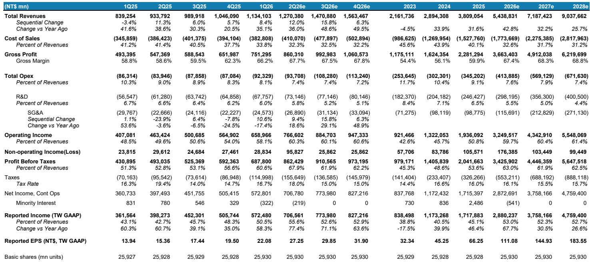
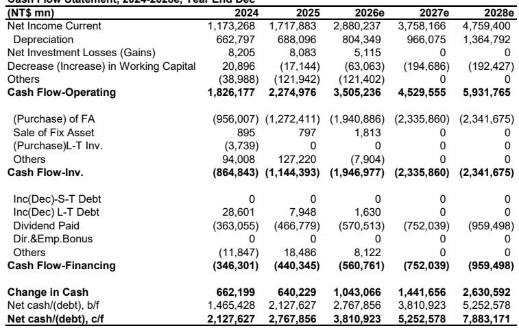
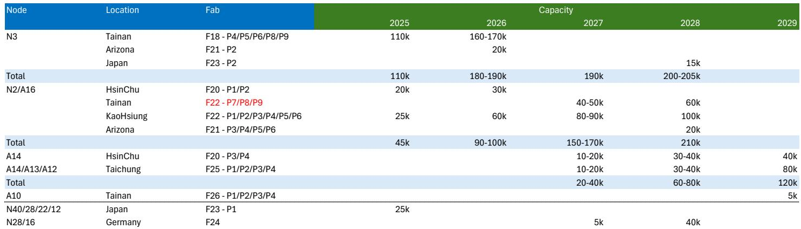

# TSMC资本支出上调信号：AI基础设施需求比市场定价更为紧迫和庞大

当台积电将其2026年营收增长指引从此前的30%上调至超过40%时，数字本身只讲述了部分故事。更具揭示性的信号来自资本支出修正：新的目标为600-640亿美元，高于此前的520-560亿美元。这并非例行产能调整。这80亿美元的增长构成可分解为两个具有启示性的部分。约30亿美元反映了设备成本通胀，即工具价格上涨5%，台积电必须吸收以确保供应。剩余的50亿美元为设备预付款，且今年并未新增任何洁净室产能。为尚无法安装的工具预付资金，意味着台积电正在锁定未来的生产时段，而非扩大当前产出。这是其客户正发出如此紧迫需求信号的公司行为，以至于等待可能意味着完全错失窗口期。

这种紧迫性在台积电的客户群中并非均匀分布。它集中在AI领域，特别是新兴的代理型AI工作负载类别，这类负载需要大规模使用CPU和GPU。云服务提供商正在迅速增加其资本支出，台积电管理层将指引上调归因于强劲的AI需求，即便消费需求仍面临挑战。公司未更新其AI半导体营收复合年增长率预测，但表明实际表现正高于此前55-60%的预测。一个合理的估计现在将其复合年增长率定为70-80%。对于观察者而言，其含义是直接的：AI建设正进入一个阶段，在此阶段，产能限制而非需求将定义赢家。

一些市场参与者可能担忧的毛利率“未达预期”是一个干扰因素。台积电2026年第三季度毛利率指引中值为66%，低于一些看涨的市场预期70%。但这一差距并非来自三星代工或英特尔代工的竞争压力。这是2nm节点稀释和海外工厂成本的可预见结果，台积电一直对此有所提示。关键客户与台积电分享其五年生产路线图，确认该公司仍是其最重要产品的主要来源。利润率压缩是结构性的，而非竞争性的，并且是暂时的。台积电可能在2027年有空间将领先节点晶圆价格再提高5-10%，这反映了其在没有可行替代方案的环境中所提供的价值。

## 设备预付款结构揭示：代理型AI，而非仅训练，正驱动下一波浪潮

50亿美元的设备预付款是整个财报更新中最具颗粒度的信号。台积电今年并未增加洁净室产能，却花费数十亿美元来确保工具。这只能意味着一件事：公司正在为未来工具交付和安装后将出现的需求激增做准备。报告特别将此归因于与代理型AI相关的CPU和GPU，这一类别超越了主导2023-2025周期的LLM训练。代理型AI指的是能够自主执行多步骤任务、做出决策并与环境交互的系统。这些工作负载需要大规模推理、低延迟以及比用于训练的同质化GPU集群更多样化的专用芯片。

这一转变对台积电的节点战略有直接影响。公司表示A14将是一个比2nm更大的节点，并宣布为其美国工厂额外增加1000亿美元的资本支出。这项美国投资支持2028年后的营收高于此前预期。今天的预付款本质上是通往那个未来的桥梁。观察者不仅应关注总资本支出数字，还应关注其构成：预付款占总资本支出的比例正在上升，该比率是需求可见性的领先指标。当代工厂为工具预付款时，它是在押注其客户将在工具到达时立即需要它们。这一押注有直接客户路线图的支持，而非宏观经济预测。

## 中国智能手机非AI需求疲软是真实的，但不会影响台积电的产能利用率

中国智能手机出货量同比下降20%，差于此前假设的15%降幅。非AI客户中的库存调整正在进行，特别是在智能手机和PC领域，物料清单成本上升正迫使订单减少或向终端消费者转嫁价格。然而，对台积电的影响在结构上是有限的，原因有二。

首先，台积电的消费客户群集中在高端市场。苹果提供了一个清晰的例子：该公司在维持台积电相同晶圆需求的同时，成功提高了产品定价。高端智能手机和PC客户能够吸收更高的代工成本，因为其终端客户对价格不那么敏感。其次，更重要的是，非AI客户可能腾出的产能主要是领先节点，即5nm及以下。AI需求如此强劲，以至于这些节点上任何可用的晶圆产能都能被立即吸收。这种回填动态意味着，即使特定终端市场疲软，台积电的产能利用率仍能保持高位。风险不在于台积电的营收，而在于其非AI客户的营收，如果他们无法转嫁成本，可能面临利润率压力或市场份额损失。

这在台积电的客户群中创造了一个双层市场。AI客户，主要是云服务提供商及其芯片设计合作伙伴，拥有定价权和长达数年的需求可见性。非AI客户，特别是中国智能手机领域的客户，正处于调整阶段。台积电的优势在于，它几乎可以无缝地在这些层级之间重新分配产能，因为两个层级都使用相同的领先节点。公司的产能规划实际上是AI优先，非AI需求填补空缺。在一个AI需求加速而非AI需求具有周期性的周期中，这是一个有利的位置。

## 观察者的决策框架：区分暂时性利润率噪音与结构性优势的三个信号

诱惑在于关注季度毛利率波动或指引与市场预期之间的差距。但在台积电的案例中，这些指标并非正确的视角。一个更有用的框架将观察者应监测的三个信号层分开。

第一层是产能预先承诺。设备预付款、多年客户路线图以及美国工厂的前期资本支出是需求持久性最可靠的指标。当客户分享五年生产路线图时，正如台积电的关键客户所做的那样，这是一个合同级别的信号，覆盖任何季度需求变化。本季度资本支出增长中的预付款结构是过去三年中较强的此类信号。

第二层是定价权。尽管2nm节点导致毛利率稀释，台积电在2027年将领先节点晶圆价格提高5-10%的能力表明，其客户更看重对其产能的获取，而非抵制价格上涨。这种定价权根植于缺乏可信的替代方案。三星代工和英特尔代工尚未达到竞争最苛刻AI芯片所需的良率、性能或客户信任。只要这一点保持不变，台积电就能转嫁成本通胀，并在多年期内维持或扩大其利润率。

第三层是回填机制。某一地区或产品类别的非AI需求疲软并非对台积电整体利用率的威胁，因为AI需求可以吸收任何释放的产能。这一机制在领先节点上效果最佳，而这正是台积电营收集中的地方。观察者应将非AI需求视为对生态系统中非AI供应商和客户的风险，而非对台积电的风险。对于台积电，相关指标是总领先节点利用率，而非终端市场组合。

应用这一框架，当前数据点无疑是积极的。产能预先承诺处于创纪录水平。定价权完好无损且可能增强。回填机制正在运作，AI需求加速与中国智能手机疲软之间的对比就是证明。在此框架内，毛利率“未达预期”是噪音，而非信号。

## 2nm和1.4nm路线图确认台积电的竞争护城河正在拓宽，而非收窄

最详细的证据来自台积电为其下一代节点披露的产能计划。公司表示，从2026年开始，2nm和3nm的产能需求非常强劲，意味着2026年至2028年N2的产能复合年增长率为70%。到2028年，台积电的2nm和1.6nm产能可能超过每月20万片晶圆，高于2025年底的约4.5万片。1.4nm节点将于2027年开始引入工具，2028年批量产能爬坡，而台南预计在2029年出现初步的1.0nm产能。

这一路线图具有明确的战略含义。台积电不仅是在扩大领先优势；它正在让任何竞争对手更难赶上。每个新节点都需要多年的工艺开发、巨额资本投资以及与ASML等设备供应商的深度合作。报告指出，ASML主要根据历史需求和长期合作伙伴关系分配其EUV产能，而台积电仍是EUV出货量的最大客户。这种对EUV工具的优先获取创造了一个自我强化的循环：台积电首先获得最佳工具，从而更快实现更高良率，吸引更多客户，进而证明更多工具采购的合理性。

与三星代工和英特尔代工的竞争动态对挑战者而言并未改善。台积电管理层表示，关键客户与台积电分享其五年生产路线图，这意味着这些客户将台积电视为其高质量产品的主要来源。一些分析师提出的代工竞争问题，实际上已通过这一路线图可见性得到了回答。客户不会与可能替换的供应商分享其最敏感的生产计划。他们与所依赖的供应商分享。

## 盈利修正与估值支持跨周期持有台积电的理由

本次报告的盈利修正在百分比上幅度不大，但方向明确。分析师将2026年每股收益上调3%，2027年上调1%，2028年上调4%，主要驱动因素是资本支出增加带来的更高营收假设以及强于预期的2027年第二季度盈利预估。以当前新台币2470元的价格计算，台积电的市盈率为2027年盈利的17倍，接近其自2018年以来16.5倍的平均远期市盈率。

估值论点并非关于便宜。而是关于盈利质量和增长可见性。台积电的毛利率预计将从2026年的67.4%扩大到2028年的68.8%，同期营业利润率从59.7%扩大到61.4%。这种利润率扩张发生在2nm和海外工厂成本稀释的情况下，这意味着基础营收增长足以补偿这些不利因素。资本支出强度，以资本支出占营收的百分比衡量，应随着营收增长快于资本支出而显著下降。这种强度下降是公司已度过当前节点周期峰值投资阶段并进入现金流生成期的标志。

对于机构观察者而言，催化剂路径是清晰的。即将到来的2026年第二季度主要云服务提供商的云资本支出更新，很可能确认台积电资本支出增长所预期的需求加速。如果这些更新显示投资持续或加速，市场将上调台积电的盈利预期。如果显示暂停，预付款结构表明台积电的可见性超越了任何单个季度的云资本支出数据。在任一情景下，公司作为AI芯片主要代工厂的结构性地位，且没有可信的竞争对手在望，都支持其享有溢价估值。

持有台积电的理由基于一个市场常常过度复杂化的简单前提：该公司是这十年最重要技术建设中的瓶颈。每一美元流入AI基础设施的云资本支出最终都会经过台积电的工厂。资本支出增长、设备预付款以及多年客户路线图都证实了这一流动正在加速。毛利率噪音和非AI需求疲软是次要影响，不会改变主要轨迹。对于能够看透季度波动的观察者而言，信号是清晰的。

*仅供参考。部分内容可能基于源材料通过AI辅助生成、翻译、总结或编辑，可能存在遗漏或错误。请独立核实。这不构成专业建议。*

仅供参考。部分内容可能基于源材料通过AI辅助生成、翻译、总结或编辑，可能存在遗漏或错误。请独立核实。这不构成专业建议。

