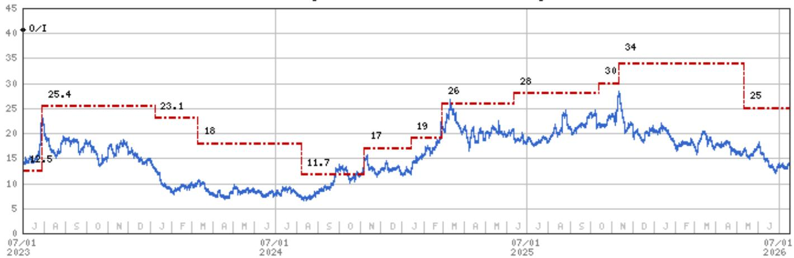
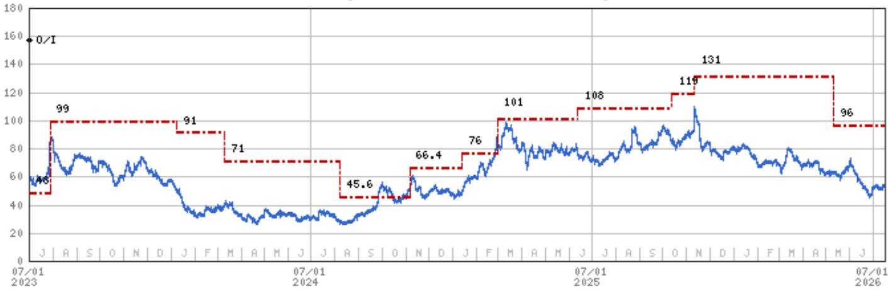
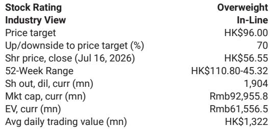

# MS：小鹏MONAL03全球首发——欧洲定价策略观察

小鹏汽车MONA L03正式上市，其定价策略和全球同步发布节奏，可能是这份报告最值得关注的判断。MS分析师团队在7月16日的报告中指出，L03在中国市场的定价低于预售价，同时叠加了最高4.3万元人民币的早鸟权益，但真正关键的不是国内价格竞争，而是这款车同时在欧洲上市，且欧洲售价是中国市场的两倍以上。这意味着，海外市场的高定价正在为国内市场的定价策略提供财务支撑。

报告认为，如果供应链爬坡顺利，L03月销量有望超过1.5万辆。但销量数字本身不是相对少见看点，更值得观察的是，小鹏如何通过一次全球同步发布，同时完成“守份额”和“提利润”两个目标。

## 1. 国内定价守份额，欧洲定价提利润，两者同时发生

L03在中国市场的纯电版本定价为12.38万至15.68万元人民币，插电混动版本定价12.38万至14.68万元人民币，均低于预售价的14.38万至16.58万元。与此同时，L03在欧洲的纯电和增程版本定价分别为3.56万欧元和3.386万欧元，折合人民币约27.6万至29.9万元。

这是小鹏首次实现中欧同步上市，覆盖65个国家，而非像多数同行那样用18个月逐步扩张。报告强调，只看中国市场的平均售价和毛利率会错过关键信息——随着越来越多L03以高于国内两倍的价格在欧洲销售，即使国内定价下降，整体利润率仍将被海外销量拉高。

> **KC评论：** 这张图里最容易被忽略的是“同时”二字。多数中国车企是先在国内放量，再慢慢出海，海外利润要等一年后才体现。小鹏这次是第一天就把欧洲利润算进模型里，对现金流和毛利率的影响节奏完全不同。

## 2. 欧洲本地化布局已从代工延伸到供应链和渠道

报告披露，小鹏目前通过麦格纳在格拉茨代工生产G6和G9，并计划扩展至轿车和紧凑型/中型SUV。慕尼黑研发中心已投入运营，博世和巴斯夫已进入其供应链，欧洲签约经销商达150家。

在本地保护主义抬头的背景下，这种轻资产模式正变得越来越有说服力。报告没有展开的是，这种模式能否在后续车型上持续复制，以及欧洲本地化程度是否足以应对潜在的关税或准入壁垒。

## 3. 三条产品线共享同一套物理AI基础，人形机器人2027年进入欧洲门店

报告提到，VLA 2.0自动驾驶系统将于明年进入欧洲市场。Robotaxi方面，广州试点项目已启动，小鹏正在接触欧洲潜在合作伙伴。更值得留意的是，人形机器人将率先在小鹏自家门店担任导购和收银员，2027年进入欧洲门店和商场。

这三条产品线——汽车、Robotaxi、人形机器人——共享同一套物理AI底层架构。报告认为，非汽车业务将在三季度推动公司估值重估。这意味着，市场对小鹏的定价逻辑可能从“卖多少辆车”转向“AI平台能覆盖多少场景”。

> **KC评论：** 人形机器人进门店这个时间表（2027年欧洲）比很多人预期的要具体。报告没有说它一定能成功，但至少说明小鹏在把AI能力从车端延伸到物理世界，而不仅仅是做自动驾驶演示。这个叙事对估值的影响可能比L03单月销量更大。

## 4. 可复用的观察框架：同时关注“销量”和“销售地”

对于跟踪中国智能电动车公司的读者，这份报告提供了一个简洁的分析框架：不要只看一家公司的月销量，还要看这些车卖到了哪里、以什么价格卖。同一款车，国内和海外定价相差一倍，对利润表的贡献完全不同。

报告没有展开的是，这种“国内冲量、海外提利”的模式能否持续，取决于海外渠道的消化能力、本地化生产的节奏，以及竞争对手在欧洲市场的反应。这些变量目前仍存在不确定性，但至少L03的定价和发布节奏已经给出了一个可验证的假设。

For informational purposes only. Portions may be generated,translated,summarized,or edited with AI assistance based on source materials and may contain omissions or errors. Please verify independently. This is not investment,legal,tax,accounting,or other professional advice.

For informational purposes only. Portions may be generated,translated,summarized,or edited with AI assistance based on source materials and may contain omissions or errors. Please verify independently. This is not investment,legal,tax,accounting,or other professional advice.

