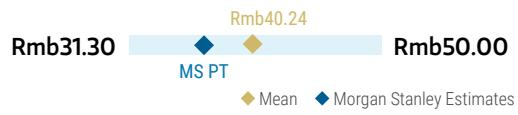
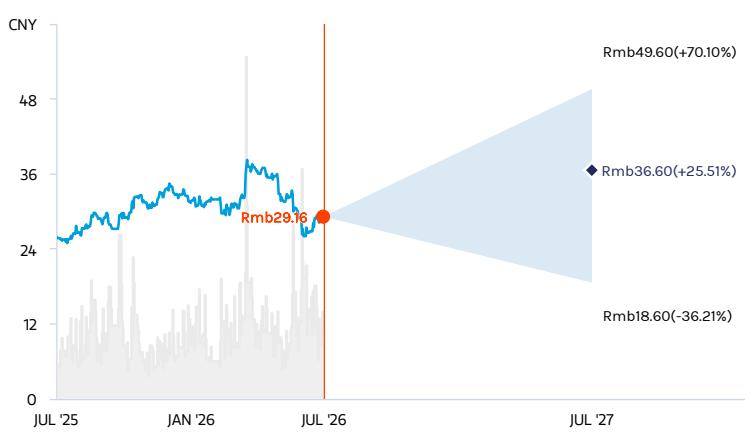
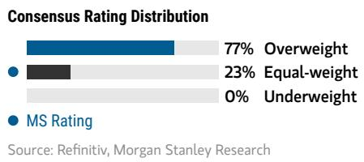
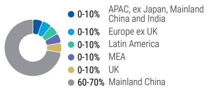
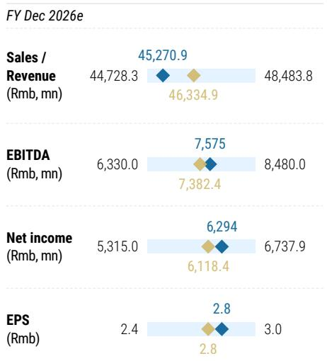
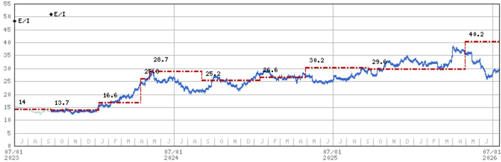

# 郑州宇通客车股份有限公司 | 亚太区域

## 风险回报更新

## 调整内容

<table><tr><td>郑州宇通客车股份有限公司 (600066.SS)</td><td>调整前</td><td>调整后</td></tr><tr><td>目标报价</td><td>Rmb40.20</td><td>Rmb36.60</td></tr><tr><td>乐观情景</td><td>Rmb54.50</td><td>Rmb49.60</td></tr><tr><td>基准情景</td><td>Rmb40.20</td><td>Rmb36.60</td></tr><tr><td>保守情景</td><td>Rmb20.40</td><td>Rmb18.60</td></tr><tr><td colspan="3">更新项目</td></tr><tr><td>每股盈利</td><td></td><td></td></tr><tr><td>乐观/基准/保守情景</td><td></td><td></td></tr><tr><td>目标报价/评级风险</td><td></td><td></td></tr></table>

郑州宇通客车股份有限公司 (600066.SS) 的风险回报已更新

## 调整原因

我们认为，此前关于中欧贸易相关讨论可能进一步推动IAA的最终实施，尽管该问题最早于2026年3月被提出。因此，我们修订了预测以反映潜在影响：

- 收入：我们下调2027/2028年预测1%/5%，以反映对出口的影响——2027年影响温和，2028年影响更为充分。最终幅度仍取决于实施细节，包括本地化要求；
- 毛利率：我们下调2027/2028年假设0.2/0.5个百分点，反映对宇通利润率较高的欧盟销售的潜在影响；
- 净利润：我们因此下调2027/2028年预测3%/6%；
- 每股股息：我们将2027年（下调至Rmb2.5）和2028年（下调至Rmb3.0）的预测均下调Rmb0.5，以反映与海外本地化相关的潜在长期资本支出需求；
- 我们的DCF推导目标报价下调9%至Rmb36.6，对应12.9倍2026年预期市盈率。

MS ASIA LIMITED+

Joey Xu, CFA

股票研究分析师

Joey.Xu@morganstanley.com

+852 3963-0337

Asia Summer School 2026

## 郑州宇通客车股份有限公司 (600066.SS, 600066 CG)

中国汽车与共享出行 | 中国

<table><tr><td>股票评级</td><td>中性</td></tr><tr><td>行业观点</td><td>同步</td></tr><tr><td>目标报价</td><td>Rmb36.60</td></tr><tr><td>收盘价 (2026年7月15日)</td><td>Rmb29.16</td></tr><tr><td>52周区间</td><td>Rmb38.50-24.92</td></tr></table>

<table><tr><td>财年截止日</td><td>12/25</td><td>12/26e</td><td>12/27e</td><td>12/28e</td></tr><tr><td>每股盈利 (Rmb)**</td><td>2.5</td><td>2.8</td><td>3.1</td><td>3.4</td></tr><tr><td>此前每股盈利 (Rmb)**</td><td>-</td><td>-</td><td>3.2</td><td>3.6</td></tr></table>

除非另有说明，所有指标均基于MS ModelWare框架
\*\* = 基于一致预期方法
e = MS估计

MS与报告中涉及的公司有业务往来并寻求开展业务。因此，读者应注意，公司可能存在利益冲突，可能影响MS的客观性。读者应将MS视为其决策的单一因素之一。

分析师认证及其他重要披露，请参阅本报告末尾的披露部分。

+= 受雇于非美国关联公司的分析师未在FINRA注册，可能不是该会员的关联人士，且可能不受FINRA关于与标的公司沟通、公开露面以及交易研究分析师账户持有证券的限制。

## 风险回报 – 郑州宇通客车股份有限公司 (600066.SS)

稳健的全球扩张逻辑与可观的股息率

## 目标报价 Rmb36.60

基准情景，现金流折现模型。关键假设包括：加权平均资本成本12.5%（贝塔1.3，无风险利率3.3%）及终值增长率2%。

一致预期目标报价分布

来源：Refinitiv, MS

## 风险回报图

  
关键：— 历史表现 ● 当前报价 ◆ 目标报价  
来源：Refinitiv, MS

## 中性评级逻辑

- 我们认为宇通是一家高质量公司，凭借其国内外增长潜力及稳健的资产负债表，能够较好应对行业环境变化。
- 我们预计2026-2028年出口将持续增长，但国内需求结构亦在发生变化。
- 当前估值在我们看来较为合理，反映了公司的增长潜力及股息率。

<table><tr><td colspan="2">风险回报主题</td></tr><tr><td>电动车辆：</td><td>正面</td></tr><tr><td>定价能力：</td><td>正面</td></tr><tr><td colspan="2">点击此处查看风险回报主题说明</td></tr></table>

## 乐观情景

## 17.4倍 2026年预期市盈率

Rmb49.60

我们假设国内需求更具韧性，定价压力较小且销售相对稳定，得益于持续的政策刺激及地方政府支出。这应有助于缓解对本地市场价格竞争的担忧。此外，我们预计海外销售将强于基准情景，受益于宇通在新兴市场的进展及扩大的海外产品线。我们预计新能源客车在发达市场的销售仍将强劲，受政策支持。

## 基准情景

## Rmb36.60

## 12.9倍 2026年预期市盈率

我们假设国内需求偏向客车而非旅游车，竞争依然激烈，存在定价压力。此外，我们预计海外销售保持韧性，因宇通通过电动化及高端化战略拓展全球布局，但预计IAA实施后，中长期内欧盟业务将产生增量成本。

## 保守情景

Rmb18.60

## 6.5倍 2026年预期市盈率

宇通可能更深度参与国内竞争，导致盈利能力减弱及应收账款问题。此外，公司可能在海外面临更多竞争，既来自全球客车制造商在电动客车产品上的追赶，也来自国内竞争对手的出口。

## 风险回报 – 郑州宇通客车股份有限公司 (600066.SS)

## 关键盈利输入

<table><tr><td>驱动因素</td><td>2025年12月</td><td>2026年12月e</td><td>2027年12月e</td><td>2028年12月e</td></tr><tr><td>纯电动客车</td><td>17,917.0</td><td>19,708.7</td><td>21,679.6</td><td>23,197.1</td></tr><tr><td>传统客车销量</td><td>31,162.0</td><td>30,538.8</td><td>31,149.5</td><td>32,707.0</td></tr><tr><td>报告毛利率 (%)</td><td>25.2</td><td>26.1</td><td>26.7</td><td>27.0</td></tr><tr><td>国内销售</td><td>32,369.0</td><td>30,750.5</td><td>29,828.0</td><td>28,933.2</td></tr><tr><td>出口</td><td>17,149.0</td><td>19,935.9</td><td>23,440.1</td><td>27,410.0</td></tr></table>

## 投资驱动因素

• 纯电动客车销售

• 传统客车销售

\- 海外销售

## 全球收入分布

  
来源：MS估计 点击此处查看区域层级说明

## MS ALPHA模型

<table><tr><td>2/5 最高</td><td>3个月展望</td></tr></table>

来源：Refinitiv, FactSet, MS；1为最受青睐的五分位，5为最不受青睐的五分位

## 目标报价/评级风险

## 上行风险

\- 出口利润率优于预期，得益于公司高端化策略

• 全球新能源客车转型强于预期 - 新兴市场出口超预期

## 下行风险

\- 不利的销售组合变化，例如国内向客车销售倾斜

\- 国内外市场竞争加剧

\- 保护主义导致海外增长及利润贡献放缓

## 持仓情况

<table><tr><td>机构持有者，主动占比</td><td>94.9%</td></tr></table>

来源：Refinitiv, MS

MS估计 vs. 一致预期  
  
平均MS估计 来源：Refinitiv, MS

## 风险回报参考链接

1. 查看期权概率方法论说明 -

Options\_Probabilities\_Exhibit\_Link.pdf

2. 查看风险回报主题说明 - RR\_Themes\_Exhibit\_Link.pdf

3. 查看区域层级说明 - GEG\_Exhibit\_Link.pdf

4. 查看主题/风险暴露方法论说明 -

ESG\_Sustainable\_Solutions\_External\_Link.pdf

5. 查看HERS方法论说明 - ESG\_HERS\_External\_Link.pdf

## 披露部分

本报告中的信息及观点由MS Asia Limited（对其内容负责）及/或MS Asia (Singapore) Pte.（注册号199206298Z）及/或MS Asia (Singapore) Securities Pte Ltd（注册号200008434H，受新加坡金融管理局监管，对其内容承担法律责任，如有任何相关问题应联系该机构）及/或MS Taiwan Limited及/或MS & Co International plc, Seoul Branch及/或MS Australia Limited（ABN 67 003 734 576，持有澳大利亚金融服务牌照号233742，对其内容负责）及/或MS Wealth Management Australia Pty Ltd（ABN 19 009 145 555，持有澳大利亚金融服务牌照号240813，对其内容负责）及/或MS India Company Private Limited（公司识别号U22990MH1998PTC115305，受印度证券交易委员会监管，持有研究分析师（SEBI注册号INH000001105）、股票经纪商（SEBI注册号INZ000244438）、商人银行家（SEBI注册号INM000011203）及国家证券存管有限公司存管参与者（SEBI注册号IN-DP-NSDL-567-2021）牌照，注册地址为Altimus, Level 39 & 40, Pandurang Budhkar Marg, Worli, Mumbai 400018, India；电话+91-22-61181000；合规官：Mr. Tejarshi Hardas，电话+91-22-61181000或电邮tejarshi.hardas@morganstanley.com；投诉官：Mr. Tejarshi Hardas，电话+91-22-61181000或电邮msic-compliance@morganstanley.com）及其关联公司（合称"MS"）编制或分发。MS India Company Private Limited (MSICPL) 可能在提供研究服务时使用AI工具。本报告中的所有建议均由合格的研究分析师作出。

有关重要披露、股价图表及涉及公司的股票评级历史，请参阅MS披露网站www.morganstanley.com/eqr/disclosures/webapp/generalresearch，或联系您的投资代表或MS，地址：1585 Broadway, (Attention: Research Management), New York, NY, 10036 USA。

有关本研究报告引用的任何建议、评级或目标报价的估值方法及风险，请联系客户支持团队：美国/加拿大+1 800 303-2495；香港+852 2848-5999；拉丁美洲+1 718 754-5444（美国）；伦敦+44 (0)20-7425-8169；新加坡+65 6834-6860；悉尼+61 (0)2-9770-1505；东京+81 (0)3-6836-9000。或联系您的投资代表或MS，地址：1585 Broadway, (Attention: Research Management), New York, NY 10036 USA。

## 分析师认证

以下分析师特此证明，其对报告中所讨论的公司及其证券的观点准确表达，且其未曾且不会因表达具体建议或观点而直接或间接获得补偿：Joey Xu, CFA。

## 全球研究冲突管理政策

MS已根据冲突管理政策发布，该政策可在www.morganstanley.com/institutional/research/conflictpolicies查阅。葡萄牙语版本可在www.morganstanley.com.br查阅。

## 关于标的公司的重要监管披露

截至2026年6月30日，MS实益持有MS所覆盖的以下公司普通股类别1%或以上：华晨中国汽车、比亚迪股份有限公司、常州星宇车灯股份有限公司、亿航智能控股有限公司、长城汽车股份有限公司、禾赛集团、理想汽车、蔚来、苏州瑞可达连接系统股份有限公司、岚图汽车科技有限公司、文远知行、小鹏汽车、浙江三花智能控制股份有限公司、郑州宇通客车股份有限公司。

过去12个月内，MS管理或联合管理了地平线机器人、蔚来、文远知行、中升集团控股的公开（或144A）发行。过去12个月内，MS从惠州市德赛西威汽车电子股份有限公司、蔚来、文远知行获得投资银行服务补偿。

未来3个月内，MS预计将从或拟寻求从比亚迪股份有限公司、常州星宇车灯股份有限公司、重庆长安汽车股份有限公司、亿航智能控股有限公司、福耀玻璃工业集团股份有限公司、吉利汽车控股有限公司、长城汽车股份有限公司、禾赛集团、惠州市德赛西威汽车电子股份有限公司、理想汽车、敏实集团有限公司、宁波均胜电子股份有限公司、宁波拓普集团股份有限公司、蔚来、上海汽车集团股份有限公司、文远知行、中升集团控股获得投资银行服务补偿。过去12个月内，MS从比亚迪股份有限公司、亿航智能控股有限公司、吉利汽车控股有限公司、禾赛集团、地平线机器人、敏实集团有限公司、中升集团控股获得投资银行服务以外的产品和服务补偿。

过去12个月内，MS已向或正向以下公司提供投资银行服务，或与其存在投资银行客户关系：比亚迪股份有限公司、常州星宇车灯股份有限公司、重庆长安汽车股份有限公司、亿航智能控股有限公司、福耀玻璃工业集团股份有限公司、吉利汽车控股有限公司、长城汽车股份有限公司、禾赛集团、地平线机器人、惠州市德赛西威汽车电子股份有限公司、理想汽车、敏实集团有限公司、宁波均胜电子股份有限公司、宁波拓普集团股份有限公司、蔚来、上海汽车集团股份有限公司、文远知行、中升集团控股。

过去12个月内，MS已向或正向以下公司提供非投资银行、证券相关服务，及/或此前已签订服务协议或与其存在客户关系：比亚迪股份有限公司、中国美东汽车控股有限公司、亿航智能控股有限公司、吉利汽车控股有限公司、禾赛集团、地平线机器人、敏实集团有限公司、蔚来、中升集团控股。

主要负责编制MS的股票研究分析师或策略师的薪酬基于多种因素，包括研究质量、读者客户反馈、选股表现、竞争因素、公司收入及整体投资银行收入。股票研究分析师或策略师的薪酬不与MS进行的投资银行或资本市场交易或特定交易台的盈利能力或收入挂钩。

MS及其关联公司与MS所涉及的公司/工具开展业务，包括做市、提供流动性、基金管理、商业银行、信贷扩展、投资服务及投资银行。MS以主承销商身份向客户买卖MS所涉及公司的证券/工具。MS可能持有本报告讨论的公司债务或工具的头寸。MS作为主承销商交易或可能交易作为债务研究报告标的的债务证券（或相关衍生品）。

上述某些披露亦为遵守非美国司法管辖区的适用法规。

## 股票评级

MS使用相对评级体系，采用超配、中性、未评级或低配等术语（见下方定义）。MS不对其覆盖的股票分配买入、持有或报告评级。超配、中性、未评级和低配不等同于买入、持有和卖出。读者应仔细阅读MS中使用的所有评级定义。此外，由于MS包含分析师观点的更完整信息，读者应完整阅读MS，而非仅从评级推断内容。在任何情况下，评级（或研究）不应被视为或用作研究交流。读者买卖股票的决定应取决于个人情况（如读者现有持仓）及其他考虑因素。

## 全球股票评级分布

（截至2026年6月30日）

以下描述的股票评级适用于MS的基础股票研究，不适用于公司生产的债务研究。

为披露目的（根据FINRA要求），我们在超配、中性、未评级和低配评级旁附上买入、持有和卖出的类别标题。MS不对其覆盖的股票分配买入、持有或报告评级。超配、中性、未评级和低配不等同于买入、持有和卖出，而是代表建议的相对权重（见下方定义）。为满足监管要求，我们将最正面的股票评级超配对应买入建议；将中性和未评级对应持有建议，低配对应卖出建议。

<table><tr><td></td><td colspan="2">覆盖范围</td><td colspan="3">投资银行客户</td><td colspan="2">其他重要投资服务客户</td></tr><tr><td>股票评级类别</td><td>数量</td><td>占比</td><td>数量</td><td>占投资银行客户比</td><td>占评级类别比</td><td>数量</td><td>占其他重要投资服务客户比</td></tr><tr><td>超配/买入</td><td>1544</td><td>42%</td><td>453</td><td>49%</td><td>29%</td><td>757</td><td>44%</td></tr><tr><td>中性/持有</td><td>1577</td><td>43%</td><td>390</td><td>42%</td><td>25%</td><td>769</td><td>44%</td></tr><tr><td>未评级/持有</td><td>3</td><td>0%</td><td>1</td><td>0%</td><td>33%</td><td>1</td><td>0%</td></tr><tr><td>低配/卖出</td><td>544</td><td>15%</td><td>89</td><td>10%</td><td>16%</td><td>204</td><td>12%</td></tr><tr><td>总计</td><td>3,668</td><td></td><td>933</td><td></td><td></td><td>1731</td><td></td></tr></table>

数据包括当前分配评级的普通股和ADR。投资银行客户为过去12个月内MS从中获得投资银行补偿的公司。由于四舍五入，"占比"列中的百分比之和可能不等于100%。

## 分析师股票评级

超配 (O)：预计该股票未来12-18个月经风险调整后的总回报将超过分析师行业（或行业团队）覆盖范围的平均总回报。

中性 (E)：预计该股票未来12-18个月经风险调整后的总回报将与分析师行业（或行业团队）覆盖范围的平均总回报一致。

未评级 (NR)：目前分析师对该股票未来12-18个月经风险调整后的总回报相对于分析师行业（或行业团队）覆盖范围的平均总回报没有足够信心。

低配 (U)：预计该股票未来12-18个月经风险调整后的总回报将低于分析师行业（或行业团队）覆盖范围的平均总回报。

除非另有说明，MS中包含的目标报价时间范围为12至18个月。

## 分析师行业观点

正面 (A)：分析师预计其行业覆盖范围未来12-18个月的表现相对于相关广泛市场基准（如下所示）具有吸引力。

同步 (I)：分析师预计其行业覆盖范围未来12-18个月的表现将与相关广泛市场基准（如下所示）一致。

谨慎 (C)：分析师对其行业覆盖范围未来12-18个月的表现相对于相关广泛市场基准（如下所示）持谨慎态度。

各地区基准如下：北美 - 标普500；拉丁美洲 - 相关MSCI国家指数或MSCI拉丁美洲指数；欧洲 - MSCI欧洲；日本 - TOPIX；亚洲 - 相关MSCI国家指数或MSCI次区域指数或MSCI AC亚太（除日本）指数。

## 股价、目标报价及评级历史（见评级定义）

郑州宇通客车股份有限公司 (600066.SS) - 截至2026年7月16日 GMT 人民币  
行业：中国汽车与共享出行  
  
股票评级历史：2021/7/1 : E/C; 2021/9/1 : E/A; 2022/8/25 : E/I; 2023/9/22 : E/I

目标报价历史：2021/4/8 : 14; 2023/9/22 : 13.7; 2024/1/10 : 16.6; 2024/4/15 : 25.8; 2024/5/6 : 28.7; 2024/9/2 : 25.2; 2025/1/13 : 26.6; 2025/4/28 : 30.2; 2025/9/19 : 29.6; 2026/4/29 : 40.2

来源：MS 日期格式：月/日/年 目标报价 = 未分配目标报价 (NA)

股价（非当前分析师覆盖）— 股价（当前分析师覆盖）

股票及行业评级（缩写如下）显示为 ♦ 股票评级/行业观点

股票评级：超配 (O) 中性 (E) 低配 (U) 未评级 (NR) 无可用评级 (NA)

行业观点：正面 (A) 同步 (I) 谨慎 (C) 无评级 (NR)

自2014年1月13日起，MS亚太地区覆盖的股票将相对于分析师行业（或行业团队）覆盖范围进行评级。

自2014年1月13日起，MS亚太地区的行业观点基准如下：相关MSCI国家指数或MSCI次区域指数或MSCI AC亚太（除日本）指数。

## 关于MS Smith Barney LLC客户的重要披露

关于任何可能合理预期影响MS Smith Barney LLC选择第三方研究提供商或第三方研究报告标的公司的重大利益冲突的重要披露，可在MS财富管理披露网站www.morganstanley.com/online/researchdisclosures查阅。有关MS具体披露，请参阅https://www.morganstanley.com/eqr/disclosures/webapp/generalresearch。

每份MS报告由代表MS Smith Barney LLC的人员审阅和批准。该审阅和批准由审阅MS研究报告的同一人员进行。这可能产生利益冲突。

## 其他重要披露

MS政策是根据研究分析师和研究管理层认为适当的时机，基于发行方、行业或市场可能对研究观点或意见产生重大影响的发展，更新研究报告。此外，某些研究出版物旨在定期更新（每周/每月/每季度/每年），并将按该频率更新，除非研究分析师和研究管理层根据当前情况确定不同的发布计划更为适当。

MS不担任市政顾问，本文所含观点或意见不构成且不应被视为《多德-弗兰克华尔街改革与消费者保护法》第975条意义上的建议。

MS生产一种称为"战术观点"的股票研究产品。特定股票的"战术观点"中所含观点可能与同一股票研究中的建议或观点相悖。这可能是由于不同的时间范围、方法论、市场事件或其他因素所致。如需获取特定股票的所有研究，请联系您的销售代表或访问Matrix：http://www.morganstanley.com/matrix。

MS通过我们的专有研究门户Matrix向客户提供，并由MS以电子方式分发给客户。某些（但非全部）MS产品也通过第三方供应商提供给客户，或通过替代电子方式重新分发给客户以方便使用。如需获取所有可用MS，请联系您的销售代表或访问Matrix：http://www.morganstanley.com/matrix。

任何对MS的访问和/或使用均受MS使用条款（http://www.morganstanley.com/terms.html）约束。通过访问和/或使用MS，您表示已阅读并同意受我们的使用条款（http://www.morganstanley.com/terms.html）约束。此外，您同意MS根据我们的隐私政策和全球Cookie政策（http://www.morganstanley.com/privacy\_pledge.html）处理您的个人数据并使用Cookie，包括用于设置偏好和收集读者数据，以便我们为您提供更好、更个性化的服务和产品。有关MS如何处理个人数据、我们如何使用Cookie以及如何拒绝Cookie的更多信息，请参阅我们的隐私政策和全球Cookie政策（http://www.morganstanley.com/privacy\_pledge.html）。请使用提供的链接查看MS India Company Private Limited的条款和条件及最重要条款和条件（https://www.morganstanley.com/assets/pdfs/about-us-global-offices/india/Terms\_and\_conditions.pdf），以及以下链接查看审计报告（https://ny.matrix.ms.com/eqr/research/webapp/researchdocs/MSICPL\_Morgan\_Stanley\_Research\_Audit\_Report.pdf）。

如果您不同意我们的使用条款和/或不愿同意MS处理您的个人数据或使用Cookie，请勿访问我们的研究。MS不提供个性化研究交流。MS的编制未考虑接收者的个人情况和目标。MS建议读者独立评估特定投资和策略，并鼓励读者寻求财务顾问的建议。

投资或策略的适当性取决于读者的个人情况和目标。MS中讨论的证券、工具或策略可能不适合所有读者，某些读者可能无资格购买或参与部分或全部内容。MS不构成买入或卖出要约，或招揽买入或卖出任何证券/工具或参与任何特定交易策略的邀请。您的研究价值和收入可能因利率、汇率、违约率、提前还款率、证券/工具价格、市场指数、公司经营或财务状况或其他因素的变化而波动。期权或其他证券/工具交易权利可能存在时间限制。过往表现不一定是未来表现的指引。未来表现估计基于可能无法实现的假设。如提供且除非另有说明，封面上的收盘价为标的公司证券/工具主要交易所的价格。

主要负责编制MS的固定收益研究分析师、策略师或经济学家的薪酬基于多种因素，包括研究质量、准确性和价值、公司盈利能力或收入（包括固定收益交易和资本市场盈利能力或收入）、客户反馈及竞争因素。固定收益研究分析师、策略师或经济学家的薪酬不与MS进行的投资银行或资本市场交易或特定交易台的盈利能力或收入挂钩。

MS中的"关于标的公司的重要监管披露"部分列出了MS持有1%或以上普通股权益的所有提及公司。对于MS中提及的所有其他公司，MS可能持有少于1%的证券/工具或衍生品，并可能以与MS中讨论不同的方式交易。未参与MS编制的MS员工可能持有提及公司的证券/工具或衍生品，并可能以与MS中讨论不同的方式交易。衍生品可能由MS或关联人士发行。

除MS相关信息外，MS基于公开信息。MS尽一切努力使用可靠、全面的信息，但我们不保证其准确或完整。我们没有义务在MS中的意见或信息发生变化时通知您，除非我们打算停止对标的公司的股票研究覆盖。MS中提出的事实和观点未经MS其他业务领域（包括投资银行人员）的专业人员审阅，可能不反映其已知信息。

MS人员可能参与公司活动（如实地考察），且通常被禁止接受公司支付相关费用，除非经研究管理层授权成员预先批准。

MS可能做出与本报告中的建议或观点不一致的投资决策。

致台湾读者或在台湾交易证券/工具的读者：有关在台湾交易的证券/工具的信息由MS Taiwan Limited ("MSTL")分发。此类信息仅供您参考。读者应独立评估投资风险，并对其投资决策全权负责。未经MS明确书面同意，MS不得向公共媒体分发、引用或由公共媒体使用。在台湾证券交易所推荐规范第7-1条范围内的非客户读者访问和/或接收MS时，不得将MS提供给任何第三方（包括但不限于关联方、关联公司及任何其他第三方）或从事任何可能产生或看似产生利益冲突的MS相关活动。有关不在台湾交易的证券/工具的信息仅供信息参考，不得解释为建议或招揽交易此类证券/工具。MSTL不得为客户执行这些证券/工具的交易。

MS中的某些信息由MS Asia Limited上海代表处员工为MS Asia Limited使用而获取。MS未根据中国法律注册，本报告相关研究在中国境外进行。MS不构成在中国境内出售或招揽购买任何证券的要约。中国读者应具有投资此类证券的相关资格，并应自行负责从相关政府机构获得所有必要的批准、许可、验证和/或注册。本报告或其任何部分均不旨在也不构成中国法律定义的证券投资咨询或顾问服务。此类信息仅供您参考。

MS在巴西由MS C.T.V.M. S.A.分发，地址：Av. Brigadeiro Faria Lima, 3600, 6th floor, São Paulo - SP, Brazil；受Comissão de Valores Mobiliários监管；在墨西哥由MS México, Casa de Bolsa, S.A. de C.V分发，受Comision Nacional Bancaria y de Valores监管，地址：Paseo de los Tamarindos 90, Torre 1, Col. Bosques de las Lomas Floor 29, 05120 Mexico City；在日本由MS MUFG Securities Co., Ltd.分发，对于商品相关研究报告，由MS Capital Group Japan Co., Ltd分发；在香港由MS Asia Limited（对其内容负责）及MS Bank Asia Limited分发；在新加坡由MS Asia (Singapore) Pte.（注册号199206298Z）及/或MS Asia (Singapore) Securities Pte Ltd（注册号200008434H，受新加坡金融管理局监管，对其内容承担法律责任，如有任何相关问题应联系该机构）及MS Bank Asia Limited, Singapore Branch（注册号T14FC0118）分发；在澳大利亚向《澳大利亚公司法》定义的"批发客户"由MS Australia Limited ABN 67 003 734 576（持有澳大利亚金融服务牌照号233742，对其内容负责）分发；在澳大利亚向"批发客户"和"零售客户"由MS Wealth Management Australia Pty Ltd ABN 19 009 145 555（持有澳大利亚金融服务牌照号240813，对其内容负责）分发；在韩国由MS & Co International plc, Seoul Branch分发；在印度由MS India Company Private Limited（公司识别号U22990MH1998PTC115305，受印度证券交易委员会监管，持有研究分析师（SEBI注册号INH000001105）、股票经纪商（SEBI注册号INZ000244438）、商人银行家（SEBI注册号INM000011203）及国家证券存管有限公司存管参与者（SEBI注册号IN-DP-NSDL-567-2021）牌照，注册地址为Altimus, Level 39 & 40, Pandurang Budhkar Marg, Worli, Mumbai 400018, India；电话+91-22-61181000；合规官：Mr. Tejarshi Hardas，电话+91-22-61181000或电邮tejarshi.hardas@morganstanley.com；投诉官：Mr. Tejarshi Hardas，电话+91-22-61181000或电邮msic-compliance@morganstanley.com。MS India Company Private Limited (MSICPL) 可能在提供研究服务时使用AI工具。本报告中的所有建议由合格的研究分析师作出；在加拿大由MS Canada Limited分发；在德国及欧洲经济区（如要求）由MS Europe S.E.分发，受德国联邦金融监管局监管，参考号149169；在美国由MS & Co. LLC分发，对其内容负责。MS & Co. International plc由审慎监管局授权，受金融行为监管局和审慎监管局监管，在英国分发其编制的研究报告及其任何关联公司编制的研究报告，仅面向 (i) 属于《2000年金融服务与市场法（金融促进）令2005》（修订版）第19(5)条规定的投资专业人士；(ii) 属于该令第49(2)(a)至(d)条规定的高净值实体；或 (iii) 可合法传达或促使其传达投资活动邀请或诱导（定义见修订后的《2000年金融服务与市场法》第21条）的人士。RMB MS Proprietary Limited是JSE Limited和A2X (Pty) Ltd的成员。RMB MS Proprietary Limited是由MS International Holdings Inc.和RMB Investment Advisory (Proprietary) Limited（由FirstRand Limited全资拥有）各占50%股权的合资企业。MS中的信息由MS Saudi Arabia分发，受沙特阿拉伯王国资本市场管理局监管，仅面向专业读者。

MS Hong Kong Securities Limited是比亚迪股份有限公司、吉利汽车控股有限公司、长城汽车股份有限公司、禾赛集团、地平线机器人、理想汽车、蔚来、小鹏汽车、浙江三花智能控制股份有限公司、中升集团控股在香港联合交易所有限公司上市证券的流动性提供者/做市商。最新列表可在香港交易所网站查阅：http://www.hkex.com.hk。

MS中的信息由MS & Co. International plc (DIFC Branch)（受迪拜金融服务管理局监管）或MS & Co. International plc (ADGM Branch)（受阿布扎比金融服务监管局监管）传达，仅面向DFSA或FSRA定义的合格专业客户。本研究所涉及的金融产品或金融服务仅向符合监管标准的合格专业客户提供。不同MS研究评级或建议在各行业覆盖范围内的百分比分布可向您的销售代表索取。

MS中的信息由MS & Co. International plc (QFC Branch)（受卡塔尔金融中心监管局监管）传达，仅面向商业客户和市场对手方，不面向QFCRA定义的零售客户。

根据土耳其资本市场委员会要求，此处提供的投资信息、评论和建议不属于投资咨询活动范围。投资咨询服务仅由授权公司根据客户的风险和收益偏好提供。此处评论和建议具有一般性。这些意见可能不适合您的财务状况、风险和收益偏好。因此，仅依赖此处信息做出投资决策可能无法带来符合您预期的结果。

MS中包含的商标和服务标志为其各自所有者的财产。第三方数据提供商不对其提供数据的准确性、完整性或及时性作出任何保证或陈述，且不对与此类数据相关的任何损害承担责任。全球行业分类标准由MSCI和S&P开发并为其专有财产。

MS或其任何部分未经MS书面同意不得转载、出售或重新分发。

MS中引用的指标和追踪器不得用作或被视为欧盟2016/1011法规或任何类似框架下的基准。

某些固定收益研究报告中推荐或讨论的发行人和/或固定收益产品可能不会持续跟踪。因此，读者应将此类固定收益研究报告视为独立分析，不应期望对此类发行人和/或个别固定收益产品进行持续分析或额外报告。MS可能不时对研究报告标的公司持有重大财务和商业利益。

SEBI注册及国家证券市场研究所认证绝不保证中介机构的业绩或向读者提供任何回报保证。证券市场投资存在市场风险。投资前请仔细阅读所有相关文件。

## 行业覆盖：中国汽车与共享出行

<table><tr><td>公司（代码）</td><td>评级（自）</td><td>价格*（2026年7月16日）</td></tr><tr><td colspan="3">Joey Xu, CFA</td></tr><tr><td>安徽江淮汽车 (600418.SS)</td><td>E (2023/8/19)</td><td>Rmb22.97</td></tr><tr><td>北京汽车 (1958.HK)</td><td>E (2025/10/2)</td><td>HK$0.84</td></tr><tr><td>华晨中国汽车 (1114.HK)</td><td>E (2025/3
