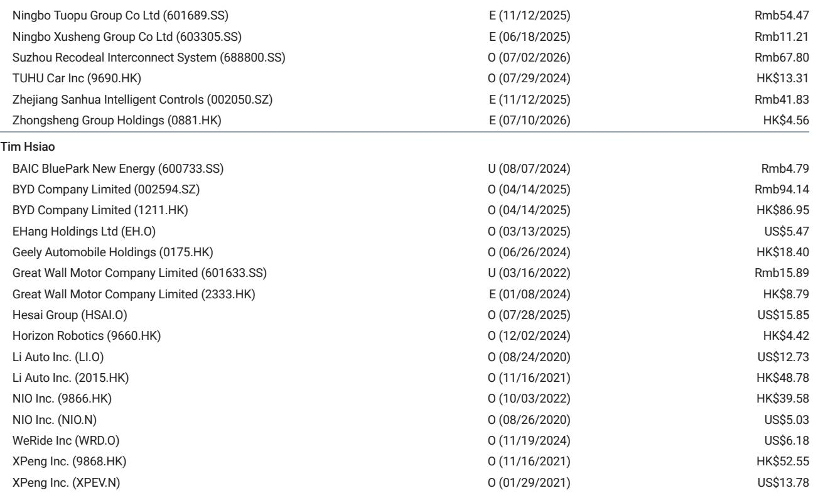
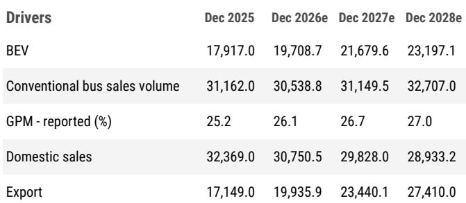

# 宇通客车的欧盟市场前景：本地化成本曲线重塑全球客车领导者

宇通客车在中国工业领域完成了一次令人瞩目的转型。过去十年间，它从一家依赖国内补贴驱动的新能源汽车热潮的本土客车制造商，转变为真正的全球商用车企业，到2025年出口量占比接近35%，并在新兴市场和发达经济体建立了品牌影响力。其资产负债表稳健，分红回报可观，电动化战略赋予其先发优势，全球竞争对手仍在追赶。然而，当前最核心的问题并非宇通能否继续增长，而是这种增长的成本是否将结构性上升，以及上升幅度有多大。

根据一份最新修订的主要机构研究报告，答案是成本正在上升，而市场尚未完全消化二阶效应，2028年每股收益分别下调了3%和6%。触发因素并非需求冲击、国内价格战或技术故障，而是欧盟调查性反滥用（IAA）机制的时间表加速推进。这一监管框架此前被视为2026年的远期议题，但现在预计将更早落地且力度更大。这不是一次性的关税冲击，而是宇通在其最盈利的出口市场竞争方式结构性转变的开端。

## 欧盟监管时钟提前，宇通的利润率结构将首当其冲

该报告的修订源于一个因果链：2026年3月首次提出的IAA辩论，现在预计将比此前假设更快地推动“最终实施”。这不是理论风险。报告明确将2027年和2028年的收入预测分别下调1%和5%，同期毛利率假设分别下调0.2和0.5个百分点。2027年与2028年调整幅度的不对称揭示了底层逻辑：2027年将因监管框架逐步实施而受到温和影响，但2028年才是全面冲击显现之时。机制很简单：宇通在欧盟的销售利润率高于国内或新兴市场销售，因为欧洲客户为电动客车支付溢价，而宇通在中国的制造成本基础赋予其显著的价格优势。IAA机制——取决于其具体实施细节，尤其是本地化要求——将通过迫使宇通支付关税、投资本地产能或两者兼施，侵蚀这一优势。

2028年毛利率压缩0.5个百分点听起来温和，但这直接冲击了宇通业务中利润率最高的部分。报告还将2027年和2028年的每股分红预测分别下调了0.5元人民币，明确提及“与海外本地化相关的潜在长期资本支出需求”。这是关键信号：宇通不仅面临利润率挤压，还面临资本配置困境。股东预期的现金分红可能需要重新部署到建设或收购欧盟本地制造产能上。分红下调并非困境信号，而是战略再分配，表明公司管理层认为欧盟市场值得捍卫，即使牺牲短期回报。

## 出口增长仍是引擎，但增长结构正在读者脚下悄然转变

报告中的销量假设表明，宇通的出口故事并未中断。出口销量预计将从2025年的17,149辆增长到2028年的27,410辆，年复合增长率接近17%。相比之下，国内销量预计同期从32,369辆下降至28,933辆。战略方向明确：宇通正成为一家出口优先的公司，海外销量将超过国内销量。但读者不能简单地将宇通出口业务过去的利润率轨迹外推到未来，因为最有利可图的出口目的地的监管环境正在收紧。

风险不在于宇通失去欧盟市场，而在于欧盟市场变得结构性利润更低，宇通整体利润率水平将向全球组合的低端收敛。报告的基本假设是“IAA实施后，欧盟业务在中长期内产生增量成本”。这委婉地表明，高利润的欧盟顺风正在转为逆风。乐观情景假设海外销售更强、国内定价压力更小，目标价仅为49.60元人民币——较当前29.16元人民币有36%的上行空间。但悲观情景目标价为18.60元人民币，意味着36%的下行空间，驱动因素包括“海外竞争加剧，既来自全球客车制造商在电动客车产品上的追赶，也来自国内竞争对手的出口”。风险回报的不对称性显而易见：上行空间受监管和竞争压力限制，而下行空间则被放大。

## 国内市场是缓慢渗漏，而非危机，但移除了一项关键支撑

报告中的国内销量预测显示，从2025年的32,369辆稳步下降至2028年的28,933辆，三年内下降约11%。这不是突然崩溃，而是反映了中国需求向客车而非长途客车的结构性转变，加上持续的定价压力和地方政府预算约束。报告明确表示，其基本假设是“国内需求偏向客车而非长途客车，竞争依然激烈，存在定价压力”。这很重要，因为宇通的国内业务历来是稳定的现金来源，其强劲的资产负债表使其能够在不稀释股东权益的情况下为海外扩张提供资金。如果国内利润率受压且销量下降，公司在不削减分红或举债的情况下吸收欧盟相关成本增加的能力将减弱。

国内动态对乐观情景也很重要。报告的乐观情景假设“国内需求更具韧性，导致定价压力减轻和销售相对稳定，得益于持续的政策刺激和地方政府支出”。这是可能的，但并非基本假设，且取决于宇通无法控制的因素——即中国地方政府在财政紧张环境下继续补贴客车购买的意愿。因此，看好宇通的读者必须相信，不仅欧盟逆风可控，而且国内市场不会进一步恶化。这是一个两部分论点，每部分都带有自身风险。

## 决策框架：宇通读者的三种情景

报告的风险回报结构为读者提供了有用的决策框架。关键问题不是宇通是否是一家好公司——显然是的——而是未来12至18个月内市场最可能趋向于哪种情景。

在基本情景下，报告估值为36.60元人民币，宇通继续增长出口销量并维持合理的利润率结构，但欧盟IAA实施增加了持续的成本拖累，阻止利润率进一步扩张。国内需求保持疲软但非灾难性。分红适度下调以资助本地化资本支出。该股交易于2026年预期收益的12.9倍，不算昂贵，但也不足以证明更高估值合理。这是报告的核心假设，意味着当前29.16元人民币的价格约有25%的上行空间。这是合理的回报，但并非那种能推动组合超额收益的非对称机会。

在乐观情景下，估值为49.60元人民币，欧盟IAA影响被证明比担心的更可控——或许是因为宇通比预期更快地加速本地化战略，或者最终监管语言不那么严厉。国内需求因持续政策支持而稳定，宇通在新兴市场的高端化策略获得动力。在此情景下，该股交易于2026年收益的17.4倍，分红回报仍具吸引力。乐观情景需要多个因素同时向好，但并非不可信，尤其是考虑到宇通强劲的执行记录。

在悲观情景下，估值为18.60元人民币，欧盟逆风与国内竞争加剧以及全球客车制造商在电动客车技术上比预期更快的追赶相结合。宇通的出口利润率压缩幅度超过模型预测，国内市场因地方政府削减支出而恶化。随着资本支出需求上升，分红进一步下调。该股交易于2026年收益的6.5倍，反映出对公司增长轨迹的信心丧失。这一情景应引起长期持有者的关注，因为它由宇通无法控制的力量驱动：欧盟的监管政策以及国内外市场的竞争动态。

这一框架的关键洞察是，乐观和悲观情景的概率并不对称。报告的修订明确向下调整了预测，而非向上。触发因素是加速负面趋势的监管发展，而非积极惊喜。这表明，如果IAA实施比当前假设更为激进，基本情景本身可能面临滑向悲观情景的风险。因此，读者应关注的不是基本情景的相对上行空间，而是可能导致基本情景进一步恶化的因素。

## 市场将宇通定价为稳健表现者，但盈利修订信号结构性转变

在29.16元人民币的价格下，宇通交易于2026年预期收益的约10.4倍，低于基本情景目标倍数12.9倍。这一折价表明市场已在定价部分欧盟相关风险，但未必是全部二阶效应。报告的分红下调预测尤其具有启示性。2027年和2028年每股分红减少0.5元人民币，较此前2028年3.0元人民币的预测下降约17%。对于收益导向的读者而言，这是实质性变化。它表明管理层优先考虑在欧盟的长期竞争定位，而非短期股东回报。这是正确的战略决策，但它将宇通的研究逻辑从高分红增长故事转变为时机不确定的再投资故事。

报告的估值方法强化了这一观点。加权平均资本成本为1.3，终端增长率为2%。这些并非激进假设。加权平均资本成本反映了具有全球敞口的中国工业公司的股权风险溢价，终端增长率与长期增长预期一致。如果欧盟逆风比模型假设更大，终端增长假设将需要重新评估，而最不确定的输入现在是宇通欧盟利润率的轨迹。

## 二阶影响超出宇通本身

宇通的处境并非孤立案例。它是更广泛趋势的领先指标，将影响任何在发达市场监管框架下有显著敞口的中国工业公司。欧盟的IAA机制是贸易防御措施浪潮的一部分，这些措施针对从电动汽车到太阳能电池板再到电池等战略行业的中国出口。宇通恰好是首批面临具体时间表的公司之一，但不会是最后一个。那些基于中国制造成本优势将保持不变的假设构建全球战略的公司，现在被迫面对新现实：进入发达市场将日益需要本地生产、本地内容和本地合规。

对于读者而言，这意味着此前赋予具有强劲全球增长故事的中国出口商的溢价可能需要重新评估。市场准入成本正在上升，这一成本将以更低利润率、更高资本支出和更低分红的形式由股东承担。这不是四舍五入的误差；它是市场开始调整对整个出口驱动增长模式预期的信号。

宇通仍是一家高质量公司，拥有强劲竞争地位、全球足迹和可信的电动化战略。但读者曾经享有的安全边际——高欧盟利润率、低国内竞争和强劲分红的组合——正在收窄。报告的修订是一个警示，而非结论。它告诉读者，宇通全球扩张的轻松阶段已经结束。接下来需要更多资本、更多耐心以及对监管风险更细致的理解。

*仅供参考。部分内容可能基于源材料通过AI辅助生成、翻译、总结或编辑，可能包含遗漏或错误。请独立核实。这不构成专业建议。*

仅供参考。部分内容可能基于源材料通过AI辅助生成、翻译、总结或编辑，可能包含遗漏或错误。请独立核实。这不构成专业建议。

